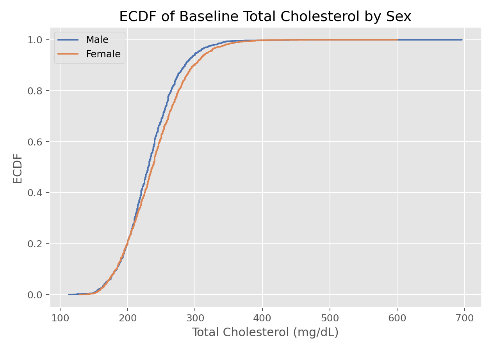

# 经验分布函数（Empirical Cumulative Distribution Function, ECDF）

## 1. 方法概览

### 1.1 定义

经验分布函数是对总体分布函数 $F(x)=P(X\le x)$ 的非参数估计。它直接用样本中“不大于某个阈值的比例”来近似总体累计概率。

### 1.2 它主要解决什么问题

- 研究问题：样本在不同阈值以下累计了多少概率质量。
- 适用任务：描述分布、比较两组分布、查看尾部行为、为非参数方法提供基础。
- 常见医学场景：比较两组患者的生物标志物分布、查看住院天数或实验室指标的整体分布差异。

### 1.3 直觉理解

ECDF 可以理解成“从左往右数人头”。给定一个阈值 $x$，看看样本里有多少比例已经落在 $x$ 左边，这个比例就是对真实累计概率的直接估计。

## 2. 数学形式

### 2.1 核心公式

$$
\hat F(x) = \frac{1}{n}\sum_{i=1}^n I(X_i \le x)
$$

### 2.2 参数或统计量含义

- $I(X_i \le x)$：指示函数，若第 $i$ 个观测不超过 $x$ 则取 1。
- $n$：样本量。
- $\hat F(x)$：样本中不超过 $x$ 的经验比例。

### 2.3 关键假设

- 样本可视为来自同一目标总体。
- 观测值相互独立是最常见设定。
- 不需要预设正态、对数正态等具体分布形式。

## 3. 数据形式与输入输出

### 3.1 适合的数据形式

- 自变量类型：通常是一维数值变量，也可按分组分别作图。
- 因变量类型：不涉及监督学习中的因变量。
- 数据结构：独立样本的一维观测最常见。
- 是否适合高维数据：不适合直接处理高维，但可对每个变量分别作 ECDF。
- 是否适合缺失较多数据：可用，但应先明确缺失处理策略。
- 是否适合删失数据：不适合；有删失时更适合 Kaplan-Meier。
- 是否适合重复测量数据：单次探索可以做，但推断需考虑相关性。

### 3.2 示例表格

以 `Framingham_data.csv` 的基线连续变量为例，ECDF 很适合描述单个连续指标在总体中的累计分布：

| RANDID | PERIOD | SEX | BMI | TOTCHOL |
| --- | --- | --- | --- | --- |
| 2448 | 1 | 0 | 26.97 | 195 |
| 6238 | 1 | 1 | 28.73 | 250 |
| 9428 | 1 | 0 | 25.34 | 245 |
| 10552 | 1 | 1 | 28.58 | 225 |
| 11252 | 1 | 1 | 23.10 | 285 |

### 3.3 输入与产出

#### 输入

- 输入数据：一组数值型观测。
- 关键变量：待描述的数值变量，可附加一个分组变量。
- 需要预处理的内容：缺失值处理、必要时按组拆分。

#### 产出

- 模型对象/统计结果：一个阶梯函数。
- 参数估计：每个阈值对应的累计概率估计。
- 预测结果：无预测意义，主要用于描述。
- 不确定性指标：通常不单独给；若需要可通过 DKW 不等式或 Bootstrap 构建带状区间。

## 4. 适用场景

- 适合：描述分布、比较组间整体分布、观察中位数和尾部差异。
- 不适合：需要平滑密度曲线时；有明显删失时；需要调整协变量时。
- 使用前需要特别检查的点：是否存在大量重复值、是否需要分层展示、是否有删失或极端异常值。

## 5. 实现

### 5.1 Python

常用包：

- `statsmodels`
- `seaborn`

```python
import numpy as np
import matplotlib.pyplot as plt
import seaborn as sns
from statsmodels.distributions.empirical_distribution import ECDF

x = np.array([2.1, 2.4, 2.9, 3.5, 4.0, 4.8])
ecdf = ECDF(x)
grid = np.linspace(x.min(), x.max(), 200)

plt.step(grid, ecdf(grid), where="post")
sns.rugplot(x=x)
plt.xlabel("Biomarker")
plt.ylabel("ECDF")
plt.show()
```

### 5.2 R

常用包：

- `stats`

```r
x <- c(2.1, 2.4, 2.9, 3.5, 4.0, 4.8)
Fhat <- ecdf(x)
plot(Fhat, main = "ECDF", xlab = "Biomarker", ylab = "F(x)")
```

## 6. 结果如何解释

- 核心结果看什么：在任意阈值 $x$ 处，有多少比例的样本不超过该值。
- 每个主要参数如何解释：ECDF 没有回归系数，重点在阶梯的位置和增长速度。
- 临床或医学意义如何表达：例如“约 80% 的患者 CRP 低于某个阈值”。
- 常见误读：不要把 ECDF 当作密度；阶梯陡峭意味着该区间观测多，不代表风险函数。

## 7. 推荐可视化

- 阶梯型 ECDF 曲线。
- 分组叠加 ECDF 曲线。
- ECDF 配合 rug plot 或箱线图。

### 7.1 图像示例

下图给出总胆固醇按性别分层后的 ECDF，适合放在“数据探索”“组间分布比较”或“非参数方法引入”场景中。



## 8. 优势、局限与常见坑

### 优势

- 不依赖分布假设。
- 对尾部和分位数信息表达直观。
- 是许多非参数方法和 Bootstrap 的基础对象。

### 局限

- 不平滑。
- 对高维数据不直接适用。
- 不处理删失。

### 常见坑

- 把 ECDF 当作概率密度函数解释。
- 忽视分组样本量差异导致图形误判。
- 有删失数据时仍直接拿 ECDF 代替生存曲线。

## 9. 与相近方法的区别

- 和核密度估计的区别：ECDF 估计累计分布，KDE 估计密度。
- 和直方图的区别：ECDF 不依赖分箱。
- 应该如何选择：想看累计比例用 ECDF，想看平滑分布形状用 KDE。

## 10. 医学研究中的典型应用

- 比较治疗前后某实验室指标的整体分布。
- 比较病例组与对照组生物标志物分布。
- 为 K-S 检验和 Bootstrap 提供基础分布对象。

## 11. 相关方法

- [[核密度估计（Kernel Density Estimation, KDE）]]
- [[Bootstrap重抽样（Bootstrap Resampling）]]
- [[Kolmogorov-Smirnov检验（Kolmogorov-Smirnov Test）]]

## 12. 参考资料

- Wasserman L. *All of Statistics: A Concise Course in Statistical Inference*. Springer; 2004.
- statsmodels Developers. `statsmodels.distributions.empirical_distribution.ECDF`. statsmodels API Reference. [https://www.statsmodels.org/stable/generated/statsmodels.distributions.empirical_distribution.ECDF.html](https://www.statsmodels.org/stable/generated/statsmodels.distributions.empirical_distribution.ECDF.html) （访问日期：2026-07-02）
- seaborn Developers. `seaborn.ecdfplot`. seaborn documentation. [https://seaborn.pydata.org/generated/seaborn.ecdfplot.html](https://seaborn.pydata.org/generated/seaborn.ecdfplot.html) （访问日期：2026-07-02）
