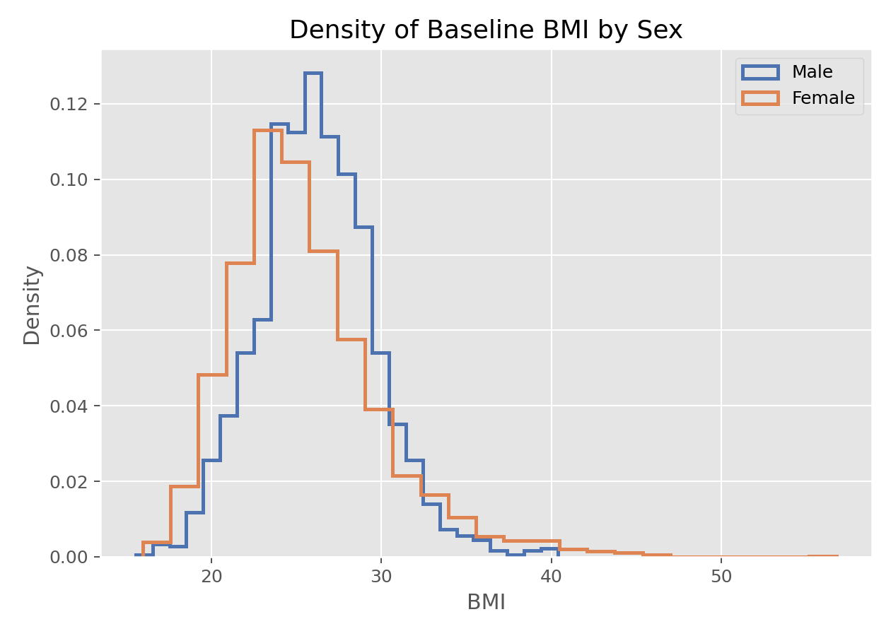

# 核密度估计（Kernel Density Estimation, KDE）

## 1. 方法概览

### 1.1 定义

核密度估计是一种用局部加权平均来估计连续型变量概率密度函数的非参数方法。它常用来替代粗糙的直方图，给出更平滑的分布形状。

### 1.2 它主要解决什么问题

- 研究问题：总体分布大致长什么样，是否单峰、偏态、厚尾或多峰。
- 适用任务：分布探索、组间分布比较、异常值与尾部观察。
- 常见医学场景：观察炎症指标、年龄、住院天数、风险评分等连续变量的分布形态。

### 1.3 直觉理解

可以把每个观测值想成在自己位置上“放一小团平滑墨水”，最后把所有小团叠加起来，得到整体平滑曲线。带宽越大，墨水铺得越宽，曲线越平滑。

## 2. 数学形式

### 2.1 核心公式

$$
\hat f(x) = \frac{1}{nh}\sum_{i=1}^n K\left(\frac{X_i - x}{h}\right)
$$

### 2.2 参数或统计量含义

- $K(\cdot)$：核函数，决定邻近点如何加权。
- $h$：带宽，决定平滑程度。
- $n$：样本量。
- $\hat f(x)$：在点 $x$ 处的密度估计。

### 2.3 关键假设

- 目标变量通常是连续型。
- 样本来自同一总体且常假设独立。
- 关键不在核函数本身，而在带宽选择。

## 3. 数据形式与输入输出

### 3.1 适合的数据形式

- 自变量类型：一维连续变量最典型。
- 因变量类型：不涉及监督学习因变量。
- 数据结构：独立样本的一维观测。
- 是否适合高维数据：高维 KDE 会遇到维数灾难，不适合当作默认工具。
- 是否适合缺失较多数据：先处理缺失后可用。
- 是否适合删失数据：不适合直接处理删失。
- 是否适合重复测量数据：可探索，但推断需谨慎。

### 3.2 示例表格

KDE 最适合这种“单列连续变量 + 可选分组变量”的表格结构：

| RANDID | PERIOD | SEX | BMI |
| --- | --- | --- | --- |
| 2448 | 1 | 0 | 26.97 |
| 6238 | 1 | 1 | 28.73 |
| 9428 | 1 | 0 | 25.34 |
| 10552 | 1 | 1 | 28.58 |
| 11252 | 1 | 1 | 23.10 |

### 3.3 输入与产出

#### 输入

- 输入数据：一组连续型观测值。
- 关键变量：数值型变量，可加分组标签。
- 需要预处理的内容：缺失值处理、必要时对偏态数据考虑对数变换。

#### 产出

- 模型对象/统计结果：一条平滑密度曲线。
- 参数估计：没有回归系数，主要是密度函数估计。
- 预测结果：无监督描述，不用于预测。
- 不确定性指标：通常不直接报告，若需要可用 Bootstrap 构建带状区间。

## 4. 适用场景

- 适合：查看连续变量分布形状、比较多组分布、辅助判断正态性或多峰性。
- 不适合：离散数据、样本极小且需要正式推断、边界效应强的数据。
- 使用前需要特别检查的点：带宽设置、是否存在边界限制、是否因过度平滑掩盖多峰结构。

## 5. 实现

### 5.1 Python

常用包：

- `statsmodels`
- `seaborn`

```python
import numpy as np
import matplotlib.pyplot as plt
import statsmodels.api as sm

x = np.random.normal(loc=0, scale=1, size=200)
kde = sm.nonparametric.KDEUnivariate(x)
kde.fit(bw="scott")

plt.plot(kde.support, kde.density)
plt.xlabel("X")
plt.ylabel("Density")
plt.show()
```

### 5.2 R

常用包：

- `stats`

```r
x <- rnorm(200)
d <- density(x)
plot(d, main = "Kernel Density Estimate")
```

## 6. 结果如何解释

- 核心结果看什么：峰的位置、峰数、尾部厚度、偏态和组间曲线差异。
- 每个主要参数如何解释：主要超参数是带宽，不是回归系数。
- 临床或医学意义如何表达：例如“病例组分布整体右移，且高值尾部更厚”。
- 常见误读：密度高不代表概率大，面积才对应概率；峰数也可能受带宽影响。

## 7. 推荐可视化

- 单组 KDE 曲线。
- 分组叠加 KDE 曲线。
- 直方图加 KDE 曲线。

### 7.1 图像示例

下图展示基线 BMI 按性别分层后的密度曲线，能够直观体现连续变量的分布形状和组间差异。



## 8. 优势、局限与常见坑

### 优势

- 比直方图更平滑。
- 不需要指定参数分布。
- 对探索多峰、偏态分布很有帮助。

### 局限

- 对带宽敏感。
- 高维场景效果差。
- 边界处可能偏倚明显。

### 常见坑

- 带宽过大导致真实结构被抹平。
- 带宽过小导致噪声被误判成多峰。
- 用 KDE 展示离散计数数据，造成误导。

## 9. 与相近方法的区别

- 和直方图的区别：KDE 更平滑，直方图更受分箱影响。
- 和 ECDF 的区别：KDE 估计密度，ECDF 估计累计概率。
- 应该如何选择：想看局部分布形状用 KDE，想看累计比例用 ECDF。

## 10. 医学研究中的典型应用

- 查看风险评分是否偏态。
- 观察两组生物标志物是否出现整体右移。
- 作为建模前的探索性分布检查。

## 11. 相关方法

- [[经验分布函数（Empirical Cumulative Distribution Function, ECDF）]]
- [[单样本t检验（One-Sample t-Test）]]
- [[Bootstrap重抽样（Bootstrap Resampling）]]

## 12. 参考资料

- Silverman BW. *Density Estimation for Statistics and Data Analysis*. Chapman and Hall/CRC; 1986.
- statsmodels Developers. `statsmodels.nonparametric.kde.KDEUnivariate`. statsmodels API Reference. [https://www.statsmodels.org/stable/generated/statsmodels.nonparametric.kde.KDEUnivariate.html](https://www.statsmodels.org/stable/generated/statsmodels.nonparametric.kde.KDEUnivariate.html) （访问日期：2026-07-02）
- seaborn Developers. `seaborn.kdeplot`. seaborn documentation. [https://seaborn.pydata.org/generated/seaborn.kdeplot.html](https://seaborn.pydata.org/generated/seaborn.kdeplot.html) （访问日期：2026-07-02）
