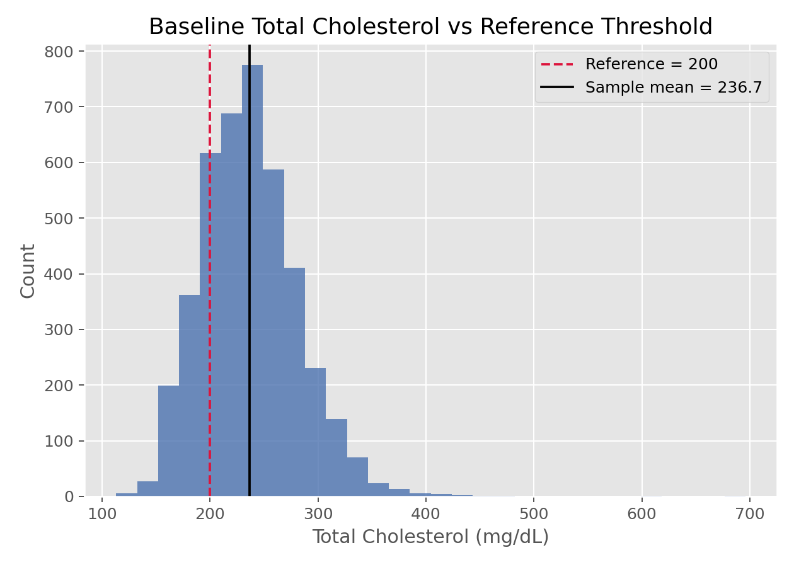

# 单样本t检验（One-Sample t-Test）

## 1. 方法概览

### 1.1 定义

单样本 t 检验用于判断一个样本均值是否与某个给定的参考值不同，是最经典的均值推断方法之一。

### 1.2 它主要解决什么问题

- 研究问题：某组受试者的平均水平是否达到或偏离一个既定标准。
- 适用任务：检验单组连续结局均值是否等于某个假设值。
- 常见医学场景：检验某药物治疗后平均收缩压是否低于临床目标值。

### 1.3 直觉理解

它比较的是“观测到的样本均值”和“假设均值”之间的距离，这个距离再除以标准误之后，得到一个标准化差异。如果这个差异足够大，就说明样本均值不太像是从零假设下来的。

## 2. 数学形式

### 2.1 核心公式

$$
T = \frac{\bar X - \mu_0}{S / \sqrt{n}}
$$

### 2.2 参数或统计量含义

- $\bar X$：样本均值。
- $\mu_0$：零假设下的参考均值。
- $S$：样本标准差。
- $n$：样本量。

### 2.3 关键假设

- 观测值独立。
- 小样本时总体近似正态。
- 大样本时可依赖中心极限定理放宽正态要求。

## 3. 数据形式与输入输出

### 3.1 适合的数据形式

- 自变量类型：可无自变量，也可是一组单样本观测。
- 因变量类型：连续型。
- 数据结构：单组独立样本。
- 是否适合高维数据：不适合高维多变量同时检验。
- 是否适合缺失较多数据：可用，但需先明确缺失处理。
- 是否适合删失数据：不适合。
- 是否适合重复测量数据：若是前后差值，可转化为差值后一组样本再检验。

### 3.2 示例表格

例如，在 `Framingham_data.csv` 基线样本中，可以把 `TOTCHOL` 看作单样本连续变量，检验其均值是否偏离某个医学参考值（如 200 mg/dL）：

| RANDID | PERIOD | TOTCHOL |
| --- | --- | --- |
| 2448 | 1 | 195 |
| 6238 | 1 | 250 |
| 9428 | 1 | 245 |
| 10552 | 1 | 225 |
| 11252 | 1 | 285 |

### 3.3 输入与产出

#### 输入

- 输入数据：一组连续观测。
- 关键变量：数值型结局、参考值 $\mu_0$。
- 需要预处理的内容：缺失值和异常值检查。

#### 产出

- 模型对象/统计结果：t 统计量、自由度、p 值。
- 参数估计：样本均值及其置信区间。
- 预测结果：无。
- 不确定性指标：均值的标准误和置信区间。

## 4. 适用场景

- 适合：检验单组均值是否等于某标准值。
- 不适合：分布极偏且样本很小；有明显异常值时。
- 使用前需要特别检查的点：异常值、正态性、小样本稳健性。

## 5. 实现

### 5.1 Python

常用包：

- `scipy`

```python
import numpy as np
from scipy import stats

x = np.array([122, 118, 121, 125, 119, 117, 123, 120])
res = stats.ttest_1samp(x, popmean=125, alternative="less")
print(res.statistic, res.pvalue)
print(res.confidence_interval(confidence_level=0.95))
```

### 5.2 R

常用包：

- `stats`

```r
x <- c(122, 118, 121, 125, 119, 117, 123, 120)
t.test(x, mu = 125, alternative = "less")
```

## 6. 结果如何解释

- 核心结果看什么：样本均值是否显著偏离参考值。
- 每个主要参数如何解释：t 值越远离 0，说明标准化差异越大。
- 临床或医学意义如何表达：统计显著不等于临床显著，需同时看均值差和置信区间。
- 常见误读：p 值小不代表效果大；p 值大也不等于均值完全相同。

## 7. 推荐可视化

- 直方图或密度图。
- QQ 图检查正态性。
- 带均值和置信区间的点图。

### 7.1 图像示例

下图展示总胆固醇的单变量分布，并加上 `200 mg/dL` 参考线。这类图很适合放在单样本 t 检验前的探索部分。



## 8. 优势、局限与常见坑

### 优势

- 简单直接。
- 可同时给出均值差的区间估计。
- 大样本下较稳健。

### 局限

- 对异常值敏感。
- 小样本时依赖正态假设。
- 只适合单组均值问题。

### 常见坑

- 把“未显著”解读成“等效”。
- 忽视单侧和双侧假设的预先设定。
- 先看数据再改假设方向。

## 9. 与相近方法的区别

- 和两独立样本 t 检验的区别：这里只比较单组均值与参考值。
- 和 Wilcoxon 符号秩检验的区别：t 检验更关注均值，Wilcoxon 更偏向位置中位数且更稳健。
- 应该如何选择：样本较小且偏态明显时，可考虑 Wilcoxon。

## 10. 医学研究中的典型应用

- 判断某连续生化指标是否达到预设标准。
- 判断某治疗后平均改善值是否高于 0。
- 比较前后差值的均值是否为 0。

## 11. 相关方法

- [[两独立样本t检验（Two-Sample t-Test）]]
- [[Wilcoxon符号秩检验（Wilcoxon Signed-Rank Test）]]
- [[Bootstrap重抽样（Bootstrap Resampling）]]

## 12. 参考资料

- Casella G, Berger RL. *Statistical Inference*. 2nd ed. Duxbury; 2002.
- SciPy Developers. `scipy.stats.ttest_1samp`. SciPy API Reference. [https://docs.scipy.org/doc/scipy/reference/generated/scipy.stats.ttest_1samp.html](https://docs.scipy.org/doc/scipy/reference/generated/scipy.stats.ttest_1samp.html) （访问日期：2026-07-02）
- R Core Team. `t.test`. R Manual. [https://stat.ethz.ch/R-manual/R-devel/library/stats/html/t.test.html](https://stat.ethz.ch/R-manual/R-devel/library/stats/html/t.test.html) （访问日期：2026-07-02）
