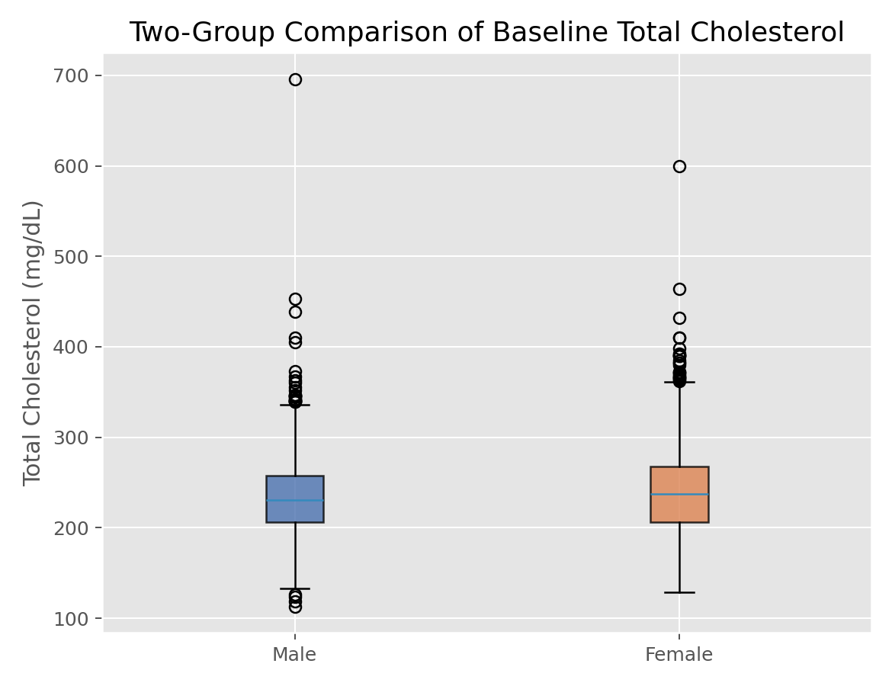

# 两独立样本t检验（Two-Sample t-Test）

## 1. 方法概览

### 1.1 定义

两独立样本 t 检验用于比较两个独立组的连续型结局均值是否存在差异。医学研究里最常见的是标准 t 检验和更稳健的 Welch t 检验。

### 1.2 它主要解决什么问题

- 研究问题：两组受试者的平均水平是否不同。
- 适用任务：治疗组与对照组、暴露组与非暴露组的均值比较。
- 常见医学场景：比较两种治疗方案的平均住院天数、平均血糖、平均炎症指标。

### 1.3 直觉理解

本质上是在看“两组均值之差”相对于“这类差异本来会有多大随机波动”是否足够大。如果两组差异远大于随机误差，就支持两组均值不同。

## 2. 数学形式

### 2.1 核心公式

$$
\begin{aligned}
T_{\text{pooled}} &= \frac{\bar X_1 - \bar X_2}{S_p\sqrt{1/n_1 + 1/n_2}} \\
S_p &= \sqrt{\frac{(n_1-1)S_1^2 + (n_2-1)S_2^2}{n_1 + n_2 - 2}} \\
T_{\text{Welch}} &= \frac{\bar X_1 - \bar X_2}{\sqrt{S_1^2/n_1 + S_2^2/n_2}}
\end{aligned}
$$

### 2.2 参数或统计量含义

- $\bar X_1,\bar X_2$：两组样本均值。
- $S_1^2,S_2^2$：两组样本方差。
- $S_p$：合并标准差。
- $n_1,n_2$：两组样本量。

### 2.3 关键假设

- 两组相互独立。
- 结局变量为连续型。
- 小样本时每组近似正态。
- 标准 t 检验额外要求方差齐性；Welch 不要求。

## 3. 数据形式与输入输出

### 3.1 适合的数据形式

- 自变量类型：二分类分组变量。
- 因变量类型：连续型。
- 数据结构：两个独立组。
- 是否适合高维数据：不适合批量高维变量直接反复检验而不做多重校正。
- 是否适合缺失较多数据：可用，但应先处理缺失与组间缺失不平衡。
- 是否适合删失数据：不适合。
- 是否适合重复测量数据：不适合；配对数据应改用配对 t 检验或 Wilcoxon 配对检验。

### 3.2 示例表格

两独立样本 t 检验最适合这种“一个二分类分组变量 + 一个连续结局变量”的宽表：

| RANDID | SEX | TOTCHOL |
| --- | --- | --- |
| 2448 | 0 | 195 |
| 6238 | 1 | 250 |
| 9428 | 0 | 245 |
| 10552 | 1 | 225 |
| 11252 | 1 | 285 |

其中可以把 `SEX` 视为两组，把 `TOTCHOL` 作为待比较的连续结局。

### 3.3 输入与产出

#### 输入

- 输入数据：连续型结局和二分类分组变量。
- 关键变量：组别、结局、检验方向。
- 需要预处理的内容：缺失值、离群值、必要时变换。

#### 产出

- 模型对象/统计结果：t 值、自由度、p 值。
- 参数估计：两组均值差及其置信区间。
- 预测结果：无。
- 不确定性指标：标准误、置信区间。

## 4. 适用场景

- 适合：两组连续变量均值比较。
- 不适合：强偏态且样本很小、异常值明显、重复测量或配对设计。
- 使用前需要特别检查的点：组间独立性、异常值、方差齐性、样本量差异。

## 5. 实现

### 5.1 Python

常用包：

- `scipy`

```python
import numpy as np
from scipy import stats

group1 = np.array([5.2, 4.9, 5.4, 5.1, 5.0])
group2 = np.array([6.1, 5.8, 6.0, 6.2, 5.7])

# 推荐先默认考虑 Welch t 检验
res = stats.ttest_ind(group1, group2, equal_var=False, alternative="two-sided")
print(res.statistic, res.pvalue)
print(res.confidence_interval(confidence_level=0.95))
```

### 5.2 R

常用包：

- `stats`

```r
group1 <- c(5.2, 4.9, 5.4, 5.1, 5.0)
group2 <- c(6.1, 5.8, 6.0, 6.2, 5.7)

# var.equal = FALSE 时为 Welch t 检验
t.test(group1, group2, var.equal = FALSE)
```

## 6. 结果如何解释

- 核心结果看什么：两组均值差是否显著偏离 0。
- 每个主要参数如何解释：均值差给效应方向和大小，p 值给统计证据强弱。
- 临床或医学意义如何表达：应同时报告均值差和区间估计，而不是只给 p 值。
- 常见误读：显著不等于重要；不显著也不等于两组完全一样。

## 7. 推荐可视化

- 箱线图或小提琴图。
- 原始散点 + 均值和置信区间。
- QQ 图或残差图检查假设。

### 7.1 图像示例

下图给出总胆固醇按性别分组的箱线图，是两独立组比较中最常见的配套图之一。



## 8. 优势、局限与常见坑

### 优势

- 解释直观。
- 医学论文中使用非常广泛。
- Welch 版本对方差不齐更稳健。

### 局限

- 对异常值敏感。
- 严格来说只检验均值差。
- 不能控制混杂。

### 常见坑

- 机械先做方差齐性检验再决定是否用 Welch。
- 忽视分组并非独立这一设计问题。
- 多个指标重复做 t 检验而不做多重比较校正。

## 9. 与相近方法的区别

- 和 Wilcoxon 秩和检验的区别：t 检验关注均值，Wilcoxon 更稳健且依赖秩。
- 和单因素 ANOVA 的区别：当只有两组时，两者本质上等价。
- 应该如何选择：分布偏态或异常值明显时可考虑 Wilcoxon；需要协变量调整时用线性回归。

## 10. 医学研究中的典型应用

- 随机对照试验中比较治疗组与对照组均值。
- 暴露组与非暴露组连续型结局比较。
- 基线平衡性描述中的连续变量比较。

## 11. 相关方法

- [[单样本t检验（One-Sample t-Test）]]
- [[Wilcoxon秩和检验（Wilcoxon Rank-Sum Test）]]
- [[单因素方差分析（One-Way ANOVA）]]

## 12. 参考资料

- Casella G, Berger RL. *Statistical Inference*. 2nd ed. Duxbury; 2002.
- SciPy Developers. `scipy.stats.ttest_ind`. SciPy API Reference. [https://docs.scipy.org/doc/scipy/reference/generated/scipy.stats.ttest_ind.html](https://docs.scipy.org/doc/scipy/reference/generated/scipy.stats.ttest_ind.html) （访问日期：2026-07-02）
- R Core Team. `t.test`. R Manual. [https://stat.ethz.ch/R-manual/R-devel/library/stats/html/t.test.html](https://stat.ethz.ch/R-manual/R-devel/library/stats/html/t.test.html) （访问日期：2026-07-02）
