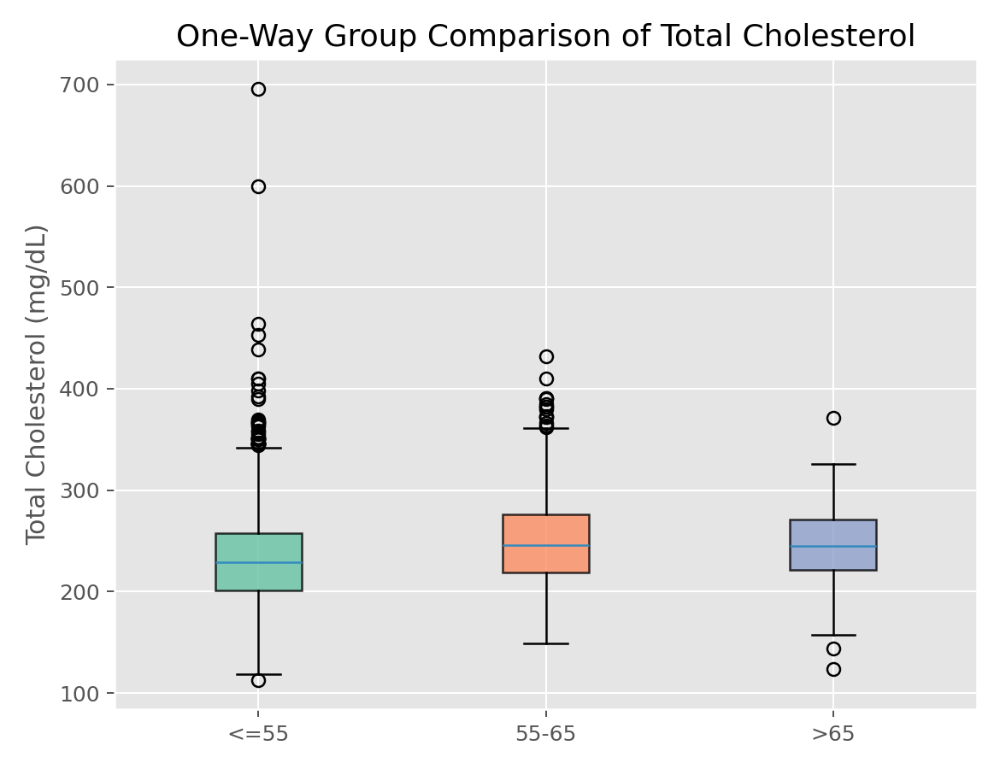

# 单因素方差分析（One-Way ANOVA）

## 1. 方法概览

### 1.1 定义

单因素方差分析用于比较三组及以上独立样本的均值是否相同，是多组均值比较的标准参数方法。

### 1.2 它主要解决什么问题

- 研究问题：多个组的连续型结局均值是否一致。
- 适用任务：多组治疗、多分期、多亚组的均值比较。
- 常见医学场景：比较不同治疗方案的平均指标、不同分期患者的均值差异。

### 1.3 直觉理解

如果组间均值差异真实存在，那么“组间变异”应该显著大于“组内随机波动”。ANOVA 就是在比较这两部分变异的相对大小。

## 2. 数学形式

### 2.1 核心公式

$$
\begin{aligned}
Y_{ij} &= \mu + \alpha_i + \epsilon_{ij} \\
F &= \frac{SSB / (k - 1)}{SSE / (n - k)}
\end{aligned}
$$

### 2.2 参数或统计量含义

- $SSB$：组间平方和。
- $SSE$：组内误差平方和。
- $k$：组数。
- $F$：F 统计量。

### 2.3 关键假设

- 各组独立。
- 各组误差近似正态。
- 组内方差大致相等。

## 3. 数据形式与输入输出

### 3.1 适合的数据形式

- 自变量类型：单个多分类因素。
- 因变量类型：连续型。
- 数据结构：多组独立样本。
- 是否适合高维数据：不适合多结局反复检验而不校正。
- 是否适合缺失较多数据：可用，但需明确缺失机制。
- 是否适合删失数据：不适合。
- 是否适合重复测量数据：不适合。

### 3.2 示例表格

ANOVA 很适合下面这种“一个多分类因素 + 一个连续结局”的结构：

| RANDID | AGE_group | TOTCHOL |
| --- | --- | --- |
| 2448 | 1 | 195 |
| 6238 | 1 | 250 |
| 10552 | 2 | 225 |
| 14729 | 3 | 250 |
| 19539 | 2 | 235 |

在这种结构下，可以比较不同年龄组的总胆固醇均值是否存在整体差异。

### 3.3 输入与产出

#### 输入

- 输入数据：一个连续结局和一个分类因素。
- 关键变量：组别、结局。
- 需要预处理的内容：分类编码、缺失值处理。

#### 产出

- 模型对象/统计结果：ANOVA 表、F 值、p 值。
- 参数估计：各组均值、组间平方和等。
- 预测结果：无。
- 不确定性指标：误差均方、必要时各组均值区间。

## 4. 适用场景

- 适合：三组及以上均值比较。
- 不适合：分布偏态严重、方差差异极大、等级数据。
- 使用前需要特别检查的点：方差齐性、异常值、正态性和样本量平衡。

## 5. 实现

### 5.1 Python

常用包：

- `statsmodels`

```python
import pandas as pd
import statsmodels.api as sm
import statsmodels.formula.api as smf

df = pd.DataFrame({
    "value": [5.1, 5.3, 4.9, 6.0, 6.2, 5.8, 7.1, 6.9, 7.0],
    "group": ["A", "A", "A", "B", "B", "B", "C", "C", "C"]
})

fit = smf.ols("value ~ C(group)", data=df).fit()
print(sm.stats.anova_lm(fit, typ=2))
```

### 5.2 R

常用包：

- `stats`

```r
df <- data.frame(
  value = c(5.1, 5.3, 4.9, 6.0, 6.2, 5.8, 7.1, 6.9, 7.0),
  group = factor(c("A","A","A","B","B","B","C","C","C"))
)

fit <- aov(value ~ group, data = df)
summary(fit)
```

## 6. 结果如何解释

- 核心结果看什么：是否至少有一组均值不同。
- 每个主要参数如何解释：F 值越大，说明组间差异相对组内波动越大。
- 临床或医学意义如何表达：应同时报告各组均值、标准差和事后比较结果。
- 常见误读：ANOVA 显著不代表每两组都显著不同。

## 7. 推荐可视化

- 箱线图。
- 各组均值和置信区间点图。
- 残差 QQ 图。

### 7.1 图像示例

下图给出总胆固醇按年龄组分层后的箱线图，适合作为单因素 ANOVA 的配套探索图。



## 8. 优势、局限与常见坑

### 优势

- 是多组均值比较的标准方法。
- 与线性模型体系一致。
- 可自然衔接事后比较。

### 局限

- 依赖参数假设。
- 不直接指出哪两组不同。
- 对异常值和方差不齐较敏感。

### 常见坑

- 显著后不做事后比较。
- 不检查方差齐性。
- 用于明显偏态或等级型结局而不考虑 Kruskal-Wallis。

## 9. 与相近方法的区别

- 和两独立样本 t 检验的区别：ANOVA 处理三组及以上；两组时本质上可等价。
- 和 Kruskal-Wallis 的区别：后者是非参数多组比较。
- 应该如何选择：均值比较且假设大体成立时优先 ANOVA。

## 10. 医学研究中的典型应用

- 比较三种治疗方案的平均疗效指标。
- 比较不同疾病分期的平均实验室指标。
- 比较多中心或多亚组的连续结局差异。

## 11. 相关方法

- [[两独立样本t检验（Two-Sample t-Test）]]
- [[Kruskal-Wallis检验（Kruskal-Wallis Test）]]
- [[TukeyHSD多重比较（Tukey Honest Significant Difference）]]

## 12. 参考资料

- Kutner MH, Nachtsheim CJ, Neter J, Li W. *Applied Linear Statistical Models*. 5th ed. McGraw-Hill Irwin; 2005.
- statsmodels Developers. `statsmodels.stats.anova.anova_lm`. statsmodels API Reference. [https://www.statsmodels.org/stable/generated/statsmodels.stats.anova.anova_lm.html](https://www.statsmodels.org/stable/generated/statsmodels.stats.anova.anova_lm.html) （访问日期：2026-07-02）
- R Core Team. `aov`. R Manual. [https://stat.ethz.ch/R-manual/R-devel/library/stats/html/aov.html](https://stat.ethz.ch/R-manual/R-devel/library/stats/html/aov.html) （访问日期：2026-07-02）
