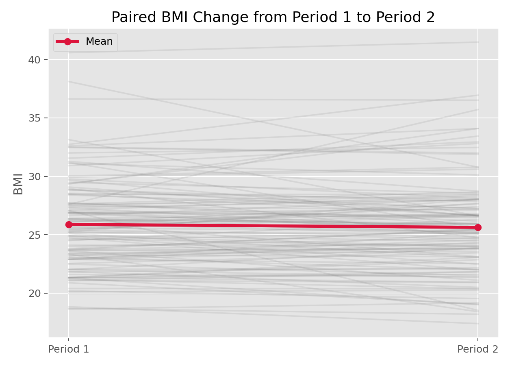

# Wilcoxon符号秩检验（Wilcoxon Signed-Rank Test）

## 1. 方法概览

### 1.1 定义

Wilcoxon 符号秩检验是单样本或配对样本的非参数检验，用于判断数据的中心位置是否等于某参考值，或配对差值的中心位置是否为 0。

### 1.2 它主要解决什么问题

- 研究问题：在不强依赖正态假设时，单组或配对差值是否偏离 0。
- 适用任务：单样本位置检验、配对前后比较。
- 常见医学场景：治疗前后同一患者指标变化是否显著。

### 1.3 直觉理解

它不是直接比较原始数值，而是比较“差值的方向”和“差值的大小排序”。如果大多数较大的秩都集中在正号或负号一边，就说明位置发生了系统性偏移。

## 2. 数学形式

### 2.1 核心公式

$$
\begin{aligned}
Z_i &= X_i - \mu_0 \quad \text{或} \quad Z_i = Y_i - X_i \\
R_i &= \operatorname{rank}(|Z_i|) \\
T &= \sum_i \operatorname{sgn}(Z_i) R_i
\end{aligned}
$$

### 2.2 参数或统计量含义

- $Z_i$：单样本相对参考值的偏差，或配对差值。
- $R_i$：绝对差值的秩。
- $T$：带符号秩和统计量。

### 2.3 关键假设

- 观测独立，或差值独立。
- 零假设下分布关于参考值对称。
- 数据至少可排序。

## 3. 数据形式与输入输出

### 3.1 适合的数据形式

- 自变量类型：无，或配对标识。
- 因变量类型：连续型或等级型。
- 数据结构：单样本或配对样本。
- 是否适合高维数据：不适合批量高维未经校正的反复检验。
- 是否适合缺失较多数据：配对设计中缺失会直接减少可用配对数。
- 是否适合删失数据：不适合。
- 是否适合重复测量数据：仅适用于两次测量的简单配对。

### 3.2 示例表格

Wilcoxon 符号秩检验非常适合“同一对象两次测量”的配对结构，例如 `Framingham_data.csv` 中部分受试者在第 1 期和第 2 期的 BMI：

| RANDID | BMI_P1 | BMI_P2 | PREVHYP_P1 | PREVHYP_P2 |
| --- | --- | --- | --- | --- |
| 6238 | 28.73 | 29.43 | 0 | 0 |
| 9428 | 25.34 | 25.34 | 0 | 0 |
| 10552 | 28.58 | 30.18 | 1 | 1 |
| 11252 | 23.10 | 23.48 | 0 | 0 |
| 11263 | 30.30 | 31.36 | 1 | 1 |

### 3.3 输入与产出

#### 输入

- 输入数据：单组观测或两列配对观测。
- 关键变量：差值方向与大小。
- 需要预处理的内容：形成配对差值、处理完全相同或缺失观测。

#### 产出

- 模型对象/统计结果：检验统计量、p 值。
- 参数估计：通常不直接给均值差，重点在位置差异。
- 预测结果：无。
- 不确定性指标：可结合 Hodges-Lehmann 估计和区间，但默认输出多为检验结果。

## 4. 适用场景

- 适合：配对前后比较、单组偏态连续变量位置检验。
- 不适合：组间独立样本比较、差值分布极不对称且样本很小。
- 使用前需要特别检查的点：是否真的是配对数据、差值分布是否大体对称。

## 5. 实现

### 5.1 Python

常用包：

- `scipy`

```python
import numpy as np
from scipy import stats

before = np.array([7.1, 6.8, 7.5, 8.0, 7.2])
after = np.array([6.5, 6.6, 7.1, 7.4, 6.8])

res = stats.wilcoxon(before, after, alternative="greater")
print(res.statistic, res.pvalue)
```

### 5.2 R

常用包：

- `stats`

```r
before <- c(7.1, 6.8, 7.5, 8.0, 7.2)
after  <- c(6.5, 6.6, 7.1, 7.4, 6.8)
wilcox.test(before, after, paired = TRUE, alternative = "greater")
```

## 6. 结果如何解释

- 核心结果看什么：差值是否系统性偏离 0。
- 每个主要参数如何解释：p 值反映配对差值偏向一侧的证据。
- 临床或医学意义如何表达：最好同时报告中位数变化或配对差值分布。
- 常见误读：它不是“中位数检验”的万能替代，仍有对称性前提。

## 7. 推荐可视化

- 配对散点图。
- 差值箱线图或小提琴图。
- before-after 连线图。

### 7.1 图像示例

下图给出有第 1 期和第 2 期观测的受试者 BMI 配对连线图，适合说明配对设计的核心结构。



## 8. 优势、局限与常见坑

### 优势

- 对异常值比 t 检验更稳健。
- 适合偏态或等级数据。
- 非常适合简单前后对照设计。

### 局限

- 需要配对或单样本结构。
- 对差值分布对称性有要求。
- 不直接提供均值层面的解释。

### 常见坑

- 把独立样本误做成配对检验。
- 忽视大量 ties 对近似分布的影响。
- 报告 p 值但不报告变化方向和大小。

## 9. 与相近方法的区别

- 和单样本/配对 t 检验的区别：更稳健，但若正态假设成立，t 检验通常更有效率。
- 和 Wilcoxon 秩和检验的区别：后者用于两独立组。
- 应该如何选择：前后配对且偏态明显时优先考虑本方法。

## 10. 医学研究中的典型应用

- 比较治疗前后疼痛评分。
- 比较同一受试者干预前后实验室指标。
- 评价小样本前后配对设计的疗效趋势。

## 11. 相关方法

- [[单样本t检验（One-Sample t-Test）]]
- [[Wilcoxon秩和检验（Wilcoxon Rank-Sum Test）]]
- [[Kruskal-Wallis检验（Kruskal-Wallis Test）]]

## 12. 参考资料

- Conover WJ. *Practical Nonparametric Statistics*. 3rd ed. Wiley; 1999.
- SciPy Developers. `scipy.stats.wilcoxon`. SciPy API Reference. [https://docs.scipy.org/doc/scipy/reference/generated/scipy.stats.wilcoxon.html](https://docs.scipy.org/doc/scipy/reference/generated/scipy.stats.wilcoxon.html) （访问日期：2026-07-02）
- R Core Team. `wilcox.test`. R Manual. [https://stat.ethz.ch/R-manual/R-devel/library/stats/html/wilcox.test.html](https://stat.ethz.ch/R-manual/R-devel/library/stats/html/wilcox.test.html) （访问日期：2026-07-02）
