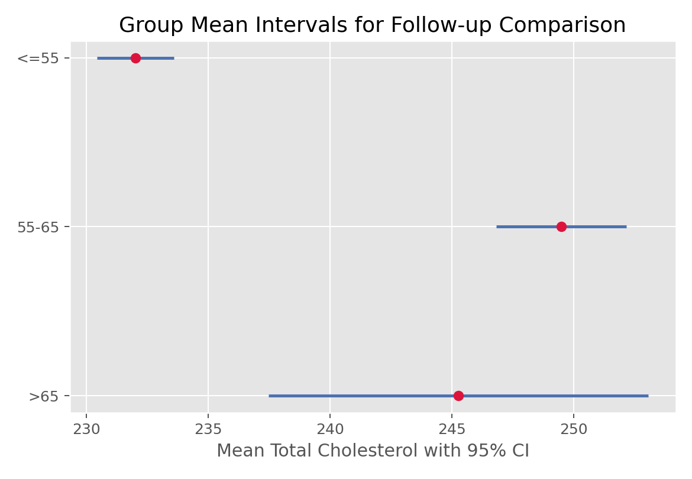

# TukeyHSD多重比较（Tukey Honest Significant Difference）

## 1. 方法概览

### 1.1 一句话本质

Tukey HSD 在 ANOVA 显著之后，对所有组两两比较均值，并用一个「统一加高」的临界值，保证**整族比较**的假阳性率仍控制在 5%——回答「到底是哪两组不同」。

### 1.2 定义

Tukey Honest Significant Difference 是 ANOVA 的事后（post hoc）多重比较方法，基于 studentized range 分布，为所有两两均值差同时构造置信区间并给校正后的 p 值。

### 1.3 它主要解决什么问题

- 研究问题：整体检验说「有组不同」，具体是哪几对组不同、差多少？
- 适用任务：ANOVA 后的全部两两比较，控制族错误率。
- 常见医学场景：多剂量组之间两两疗效比较、多个亚型两两差异定位。

### 1.4 直觉与类比

ANOVA 像烟雾报警器响了——「屋里有火」，但不告诉你在哪个房间。Tukey HSD 挨个房间去查。麻烦在于查得越多，越容易「误报」（把随机波动当火）。Tukey 的办法是把每次判定的门槛统一抬高一点，使得「查遍所有房间、总误报率」仍不超过 5%。

## 2. 核心思想与原理

### 2.1 它到底在解决什么根本困难

$k$ 组有 $\binom{k}{2}$ 对比较（3 组 3 对、5 组 10 对）。若每对都用 0.05 判定，只要比较够多，「至少一次假阳性」的概率会飙升。根本困难是：**如何在做很多次两两比较时，控制「整族至少犯一次错」的概率（族错误率 FWER）？**

### 2.2 关键洞察

关注「一组均值里**最大值与最小值之差**」的分布——studentized range 分布 $q$。因为最极端的一对差最容易假阳性，只要用 $q$ 校准这对，其余更小的差自然也被覆盖。于是所有两两比较共用一个由 $q$ 决定的、比普通 t 更高的临界值 HSD，从而把整族错误率钉在 $\alpha$。

### 2.3 与朴素/相邻做法的对比

- 相对**不校正的多次 t**：Tukey 控制 FWER，不校正会大量假阳性。
- 相对 **Bonferroni**：Bonferroni 通用但对「全部两两比较」偏保守；Tukey 专为此设计、功效更高。
- 相对 **Dunnett**：只比「各组 vs 一个对照」时 Dunnett 更有效；全体两两比较用 Tukey。

## 3. 数学形式

### 3.1 核心公式

两组 $i,j$ 的差显著，当且仅当

$$
|\bar{x}_i-\bar{x}_j| \gt \text{HSD}=q_{\alpha,\,k,\,N-k}\,\sqrt{\frac{\text{MS}_{\text{组内}}}{n}}
$$

这个式子在说：把两组均值差和一个统一门槛 HSD 比；HSD = 「studentized range 临界值」乘以「组内标准误」。等价地给出每对差的同时置信区间。

### 3.2 推导脉络

- 在等样本、正态等方差下，标准化的极差 $\dfrac{\max_j\bar{x}_j-\min_j\bar{x}_j}{\sqrt{\text{MS}_{\text{组内}}/n}}$ 服从 studentized range 分布 $q_{k,N-k}$。
- 控制「最极端一对」的错误率在 $\alpha$，就同时控制了所有对——这是「同时推断」的关键。
- 由 $q$ 的临界值反推出 HSD 阈值；不等样本用 Tukey-Kramer 修正把 $\sqrt{1/n}$ 换成 $\sqrt{\tfrac12(1/n_i+1/n_j)}$。

### 3.3 参数与统计量含义

- $q_{\alpha,k,N-k}$：studentized range 临界值，随组数 $k$ 增大而增大（比较越多、门槛越高）。
- $\text{MS}_{\text{组内}}$：来自 ANOVA 的组内均方（共用的方差估计）。
- $n$：每组样本量；HSD：判定两组差异所需的最小差。
- 校正后 p 值：整族层面的显著性。

### 3.4 关键假设（含违反后果）

| 假设 | 含义 | 违反后会怎样 | 如何粗查 |
| --- | --- | --- | --- |
| ANOVA 假设成立 | 正态、等方差、独立 | 阈值失真 | 残差诊断、Levene |
| 方差齐 | 各组共用一个方差 | 不齐时用 Games-Howell | Levene |
| 事先未挑比较 | 做全部两两比较 | 只挑显著的会失控 | 预先声明 |

## 4. 手把手算例

沿用 ANOVA 那张卡的数据：A = {5,6,7}，B = {7,8,9}，C = {9,10,11}，得 $\bar{x}_A=6,\bar{x}_B=8,\bar{x}_C=10$，$\text{MS}_{\text{组内}}=1$，每组 $n=3$，$k=3$，$df=6$。

**一步步计算：**

- 查 studentized range 临界值：$q_{0.05,\,3,\,6}\approx 4.34$。
- 组内标准误：$\sqrt{\text{MS}_{\text{组内}}/n}=\sqrt{1/3}=0.577$。
- 门槛：$\text{HSD}=4.34\times 0.577=2.51$。
- 三对差：$|\bar{x}_A-\bar{x}_B|=2$，$|\bar{x}_B-\bar{x}_C|=2$，$|\bar{x}_A-\bar{x}_C|=4$。
- 与 HSD=2.51 比较：只有 A 与 C（差 4）超过门槛 → **仅 A 与 C 显著不同**；A-B、B-C 不显著。

**结论：** ANOVA 告诉我们「三组里有差异」，Tukey 进一步定位到**差异来自 A 与 C**（相邻的 A-B、B-C 各差 2，未达 2.51 的门槛）。注意门槛 2.51 比普通两样本 t 的临界差更大——这多出来的部分，正是为「同时做三次比较」买的「防假阳性保险」。

## 5. 数据形式与输入输出

### 5.1 适合的数据形式

- 自变量类型：多分类分组变量。
- 因变量类型：连续型。
- 数据结构：多组独立观测（通常先做 ANOVA）。
- 是否适合高维数据：比较数随组数平方增长，组很多时慎用。
- 是否适合缺失较多数据：按可用样本。
- 是否适合删失数据：不适合。
- 是否适合重复测量数据：不适合。

### 5.2 示例表格

| 比较 | 均值差 | HSD 门槛 | 是否显著 |
| --- | --- | --- | --- |
| A vs B | 2 | 2.51 | 否 |
| B vs C | 2 | 2.51 | 否 |
| A vs C | 4 | 2.51 | 是 |

### 5.3 输入与产出

#### 输入

- 输入数据：分组变量 + 连续结局（或 ANOVA 结果）。
- 关键变量：组别、结局、组内均方。
- 需要预处理的内容：先拟合 ANOVA、检查假设。

#### 产出

- 模型对象/统计结果：各两两差的估计、同时置信区间、校正 p 值。
- 参数估计：两两均值差。
- 预测结果：无。
- 不确定性指标：同时置信区间（family-wise）。

## 6. 适用场景

- 适合：ANOVA 显著后，对全部组做两两比较并控制族错误率。
- 不适合：只比各组 vs 单一对照（用 Dunnett）、方差明显不齐（用 Games-Howell）、非正态（用 Dunn 检验）。
- 使用前需要特别检查的点：ANOVA 假设、是否等方差、是否为「全部两两」比较。

## 7. 实现

### 7.1 Python

常用包：

- `statsmodels`

```python
from statsmodels.stats.multicomp import pairwise_tukeyhsd
import numpy as np

score = np.array([5,6,7, 7,8,9, 9,10,11])
group = np.repeat(["A","B","C"], 3)
print(pairwise_tukeyhsd(score, group, alpha=0.05))
```

### 7.2 R

常用包：

- `stats`

```r
score <- c(5,6,7, 7,8,9, 9,10,11)
group <- factor(rep(c("A","B","C"), each = 3))
TukeyHSD(aov(score ~ group))       # 各对差、置信区间、校正 p
```

## 8. 结果如何解读

- 核心结果看什么：每对的均值差、同时置信区间是否含 0、校正 p。
- 每个主要参数如何解读：区间不含 0 ≈ 该对显著；区间同时成立（family-wise 95%）。
- 临床或医学意义如何表达：报告「哪几对差、差多少（带区间）」而非只说整体显著。
- 常见误读：把 Tukey 的区间当作单对的普通 CI（它更宽，是同时区间）。

## 9. 假设诊断与稳健性

- 继承 ANOVA 的诊断：残差正态、方差齐、独立。
- 方差不齐：改用 Games-Howell（不假设等方差）。
- 非正态：改用 Dunn 检验（Kruskal-Wallis 的事后比较）。
- 不等样本：软件用 Tukey-Kramer 自动修正。

## 10. 推荐可视化

- 各两两差的同时置信区间图（含 0 参照线）。
- 带显著性字母标记的分组箱线图（同字母表示无显著差异）。
- 均值 ± CI 的点区间图。

### 10.1 图像示例

下图为各年龄段总胆固醇两两比较的 Tukey 同时置信区间。



## 11. 优势、局限与常见坑

### 优势

- 专为「全部两两比较」设计，控制族错误率且功效优于 Bonferroni。
- 直接给同时置信区间，解释直观。
- 软件支持完善。

### 局限

- 依赖正态、等方差假设。
- 组很多时比较数暴增、功效下降。
- 只适合全体两两比较的场景。

### 常见坑

- 不做整体 ANOVA 或不控制族错误率就到处两两比。
- 方差不齐仍用经典 Tukey。
- 把同时置信区间误当单对普通区间。

## 12. 与相近方法的区别

- 和 **Bonferroni**：Tukey 针对全体两两、功效更高；Bonferroni 通用但保守。
- 和 **Dunnett**：只比对照用 Dunnett（更省）；全体两两用 Tukey。
- 和 **Games-Howell**：方差不齐时用 Games-Howell。
- 和**单因素 ANOVA**：ANOVA 管整体，Tukey 管两两定位，二者配套。

## 13. 医学研究中的典型应用

- 多剂量组疗效的两两比较。
- 多个疾病亚型/中心之间的两两差异定位。
- 多时点（作为分组）指标的两两比较（严格重复测量需混合模型）。

## 14. 关键术语

- **族错误率（FWER）**：一族比较中「至少犯一次假阳性」的概率。
- **事后比较（Post hoc）**：整体检验后进行的具体两两比较。
- **studentized range 分布（$q$）**：一组均值极差标准化后的分布，Tukey 临界值来源。
- **同时置信区间**：一族区间以整体置信水平同时成立。
- **Tukey-Kramer 修正**：不等样本量下的 Tukey 版本。

## 15. 相关方法

- [[单因素方差分析（One-Way ANOVA）]]
- [[Bonferroni校正（Bonferroni Correction）]]
- [[多重检验与错误率控制（Multiple Testing and Error Rate Control）]]

## 16. 参考资料

- Tukey JW. Comparing individual means in the analysis of variance. *Biometrics*. 1949;5(2):99-114.
- Hochberg Y, Tamhane AC. *Multiple Comparison Procedures*. Wiley; 1987.
- Montgomery DC. *Design and Analysis of Experiments*. 8th ed. Wiley; 2012.
