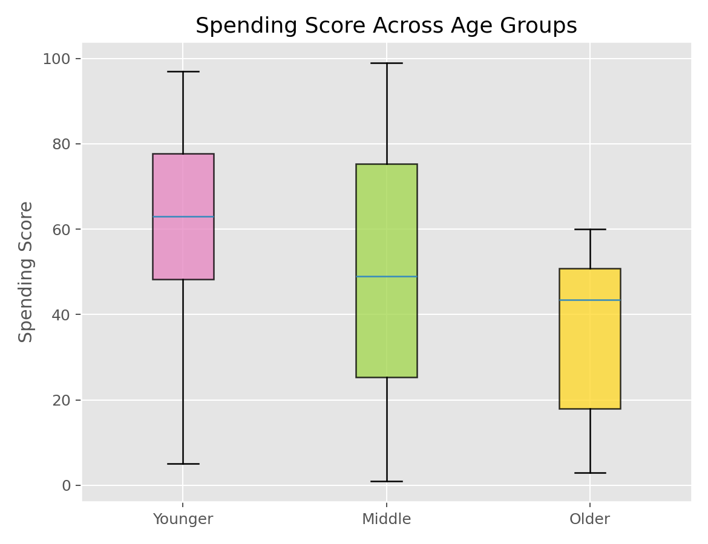

# Kruskal-Wallis检验（Kruskal-Wallis Test）

## 1. 方法概览

### 1.1 定义

Kruskal-Wallis 检验是比较三组及以上独立样本位置差异的非参数方法，可视为 Wilcoxon 秩和检验向多组情形的推广。

### 1.2 它主要解决什么问题

- 研究问题：多组样本是否来自相同分布位置。
- 适用任务：偏态数据或等级数据的多组比较。
- 常见医学场景：比较不同治疗方案、不同分期、不同亚组的连续指标。

### 1.3 直觉理解

如果某些组整体偏大，它们在合并排序后会拿到更高的平均秩。Kruskal-Wallis 就是检验这些平均秩差异是否大到不能用随机波动解释。

## 2. 数学形式

### 2.1 核心公式

$$
H = \frac{12}{N(N+1)}\sum_{g=1}^k n_g\left(\bar R_g - \frac{N+1}{2}\right)^2
$$

### 2.2 参数或统计量含义

- $k$：组数。
- $H$：基于各组秩和构造的检验统计量。

### 2.3 关键假设

- 各组相互独立。
- 数据至少可排序。
- 若解释为位置差异，常默认各组分布形状相近。

## 3. 数据形式与输入输出

### 3.1 适合的数据形式

- 自变量类型：多分类分组变量。
- 因变量类型：连续型或等级型。
- 数据结构：三组及以上独立组。
- 是否适合高维数据：不适合多变量反复检验而不校正。
- 是否适合缺失较多数据：可用，但组间缺失不平衡会影响比较。
- 是否适合删失数据：不适合。
- 是否适合重复测量数据：不适合。

### 3.2 示例表格

例如 `Mall_Customers.csv` 可以构造“年龄组 - 消费评分”的多组位置比较：

| CustomerID | Age | AgeGroup | Annual Income (k$) | Spending Score (1-100) |
| --- | --- | --- | --- | --- |
| 1 | 19 | Younger | 15 | 39 |
| 2 | 21 | Younger | 15 | 81 |
| 3 | 20 | Younger | 16 | 6 |
| 4 | 23 | Younger | 16 | 77 |
| 5 | 31 | Younger | 17 | 40 |

### 3.3 输入与产出

#### 输入

- 输入数据：多组独立观测。
- 关键变量：组别、数值或等级型结局。
- 需要预处理的内容：缺失值、ties 处理。

#### 产出

- 模型对象/统计结果：H 统计量、自由度、p 值。
- 参数估计：不直接给某两组差值。
- 预测结果：无。
- 不确定性指标：主要是总体检验；若显著需做事后比较。

## 4. 适用场景

- 适合：三组及以上独立样本的偏态连续变量比较。
- 不适合：需要协变量调整、需要明确均值差解释、配对或纵向设计。
- 使用前需要特别检查的点：独立性、组大小不平衡、事后比较方案。

## 5. 实现

### 5.1 Python

常用包：

- `scipy`

```python
from scipy import stats

group_a = [5, 7, 8, 9]
group_b = [10, 11, 9, 12]
group_c = [13, 12, 15, 14]

res = stats.kruskal(group_a, group_b, group_c)
print(res.statistic, res.pvalue)
```

### 5.2 R

常用包：

- `stats`

```r
x <- c(5, 7, 8, 9, 10, 11, 9, 12, 13, 12, 15, 14)
group <- factor(rep(c("A", "B", "C"), each = 4))
kruskal.test(x ~ group)
```

## 6. 结果如何解释

- 核心结果看什么：至少有一组与其他组在分布位置上不同。
- 每个主要参数如何解释：p 值只告诉“是否存在差异”，不告诉“哪两组不同”。
- 临床或医学意义如何表达：应补充各组中位数、IQR 和事后比较。
- 常见误读：显著结果不能直接说所有组两两都不同。

## 7. 推荐可视化

- 分组箱线图或小提琴图。
- 分组 ECDF 图。
- 各组中位数和 IQR 点图。

### 7.1 图像示例

下图给出按年龄三分组后的消费评分箱线图，适合与 Kruskal-Wallis 检验配套展示。



## 8. 优势、局限与常见坑

### 优势

- 对偏态和异常值更稳健。
- 适合等级数据。
- 是多组非参数比较的经典起点。

### 局限

- 不直接给具体组间差异。
- 解释依赖分布形状相近。
- 无法控制混杂。

### 常见坑

- 做出总体显著后不做事后比较。
- 把它直接解释成均值差异。
- 忽视多重比较控制。

## 9. 与相近方法的区别

- 和 Wilcoxon 秩和检验的区别：后者仅适用于两组。
- 和单因素 ANOVA 的区别：ANOVA 更关注均值且依赖更强假设。
- 应该如何选择：偏态明显时优先考虑本方法；若需要模型化和协变量调整，可转向回归。

## 10. 医学研究中的典型应用

- 比较三个治疗方案的评分分布。
- 比较不同疾病分期的某连续指标。
- 比较多亚组的住院时长或费用。

## 11. 相关方法

- [[Wilcoxon秩和检验（Wilcoxon Rank-Sum Test）]]
- [[单因素方差分析（One-Way ANOVA）]]
- [[TukeyHSD多重比较（Tukey Honest Significant Difference）]]

## 12. 参考资料

- Conover WJ. *Practical Nonparametric Statistics*. 3rd ed. Wiley; 1999.
- SciPy Developers. `scipy.stats.kruskal`. SciPy API Reference. [https://docs.scipy.org/doc/scipy/reference/generated/scipy.stats.kruskal.html](https://docs.scipy.org/doc/scipy/reference/generated/scipy.stats.kruskal.html) （访问日期：2026-07-02）
- R Core Team. `kruskal.test`. R Manual. [https://stat.ethz.ch/R-manual/R-devel/library/stats/html/kruskal.test.html](https://stat.ethz.ch/R-manual/R-devel/library/stats/html/kruskal.test.html) （访问日期：2026-07-02）
