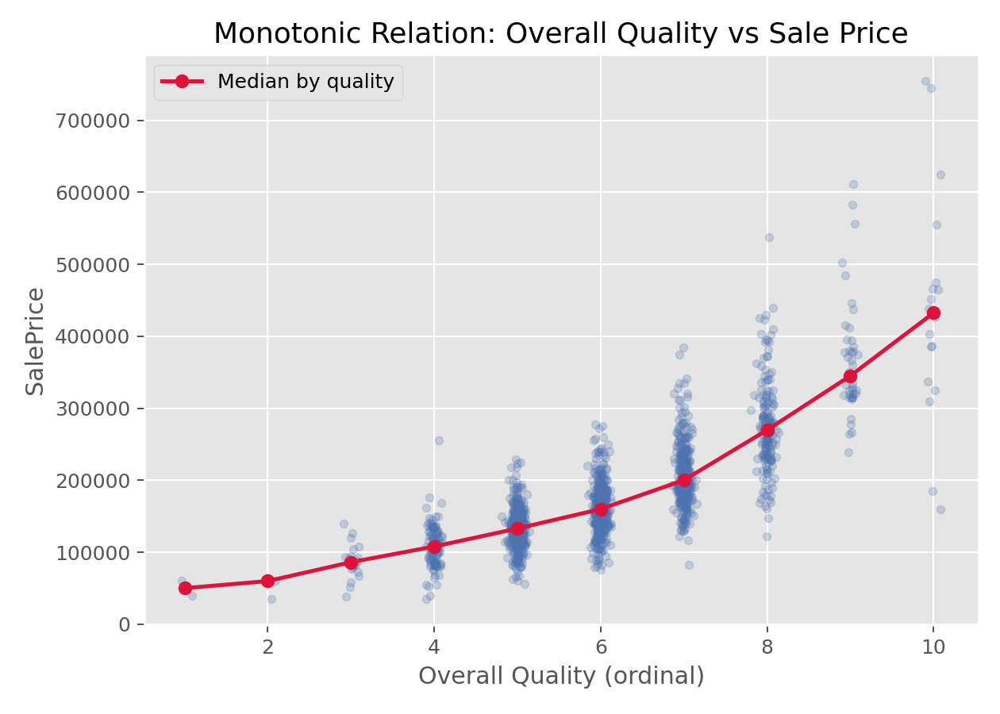

# Spearman秩相关（Spearman Rank Correlation）

## 1. 方法概览

### 1.1 定义

Spearman 秩相关用两个变量各自的秩来衡量单调关联强度，适合非正态、含异常值或等级型数据。

### 1.2 它主要解决什么问题

- 研究问题：两个变量是否呈单调上升或下降关系。
- 适用任务：连续变量或等级变量的相关性分析。
- 常见医学场景：评分量表与连续指标之间的关联、生物标志物与疾病严重程度的单调关系。

### 1.3 直觉理解

先把两个变量都换成“名次”，再看两个名次是不是一起升高或一起降低。只要关系大体单调，即使不是直线，Spearman 也能识别。

## 2. 数学形式

### 2.1 核心公式

$$
\begin{aligned}
r_s &= \operatorname{Corr}(\operatorname{rank}(X), \operatorname{rank}(Y)) \\
&= 1 - \frac{6\sum_{i=1}^n D_i^2}{n(n^2 - 1)} \quad \text{(无 ties 时)}
\end{aligned}
$$

### 2.2 参数或统计量含义

- $R_i,S_i$：$X_i,Y_i$ 的秩。
- $D_i=S_i-R_i$：秩差。
- $r_s$：Spearman 秩相关系数，范围在 $[-1, 1]$。

### 2.3 关键假设

- 观测独立。
- 数据至少可排序。
- 关注的是单调关系，不要求线性关系。

## 3. 数据形式与输入输出

### 3.1 适合的数据形式

- 自变量类型：连续型或等级型。
- 因变量类型：连续型或等级型。
- 数据结构：成对观测。
- 是否适合高维数据：可逐对计算，但高维矩阵需注意多重检验。
- 是否适合缺失较多数据：可用完整案例或明确缺失策略。
- 是否适合删失数据：通常不直接适用。
- 是否适合重复测量数据：普通 Spearman 不处理相关结构。

### 3.2 示例表格

Spearman 相关特别适合“有序等级变量 + 连续变量”或者“两个不满足线性关系但大致单调的变量”。例如房价数据里：

| Id | OverallQual | GrLivArea | SalePrice |
| --- | --- | --- | --- |
| 1 | 7 | 1710 | 208500 |
| 2 | 6 | 1262 | 181500 |
| 3 | 7 | 1786 | 223500 |
| 4 | 7 | 1717 | 140000 |
| 5 | 8 | 2198 | 250000 |

### 3.3 输入与产出

#### 输入

- 输入数据：两个成对变量。
- 关键变量：$X$、$Y$。
- 需要预处理的内容：对齐成对观测、缺失处理。

#### 产出

- 模型对象/统计结果：相关系数、p 值。
- 参数估计：$r_s$。
- 预测结果：无。
- 不确定性指标：可用 Bootstrap 给区间估计。

## 4. 适用场景

- 适合：偏态、离群值较多、等级数据、非线性但单调关系。
- 不适合：想要估计线性斜率或控制混杂时。
- 使用前需要特别检查的点：关系是否大致单调、是否存在大量 ties。

## 5. 实现

### 5.1 Python

常用包：

- `scipy`

```python
import numpy as np
from scipy import stats

x = np.array([1, 2, 3, 4, 5, 6])
y = np.array([2, 3, 4, 4, 6, 8])

res = stats.spearmanr(x, y, alternative="two-sided")
print(res.statistic, res.pvalue)
```

### 5.2 R

常用包：

- `stats`

```r
x <- c(1, 2, 3, 4, 5, 6)
y <- c(2, 3, 4, 4, 6, 8)
cor.test(x, y, method = "spearman")
```

## 6. 结果如何解释

- 核心结果看什么：相关系数的方向和绝对值大小。
- 每个主要参数如何解释：$r_s>0$ 表示总体上同升，$r_s<0$ 表示总体上反向变化。
- 临床或医学意义如何表达：要同时结合散点图判断关系形态。
- 常见误读：相关不代表因果；相关系数高也不一定是线性关系。

## 7. 推荐可视化

- 散点图加平滑曲线。
- 秩转换后的散点图。
- 分组着色散点图。

### 7.1 图像示例

下图展示房屋整体质量与售价之间的单调关系，是 Spearman 秩相关非常典型的应用场景。



## 8. 优势、局限与常见坑

### 优势

- 对异常值更稳健。
- 适合等级数据。
- 能捕捉单调但非线性的关系。

### 局限

- 不能处理混杂。
- 不能刻画复杂非单调关系。
- ties 较多时效率和解释会受影响。

### 常见坑

- 把单调相关解读成线性关系。
- 忽视潜在分层或混杂。
- 只报系数不看散点图。

## 9. 与相近方法的区别

- 和 Pearson 相关的区别：Pearson 强调线性，Spearman 强调单调。
- 和 Kendall tau 的区别：Kendall 更偏向一致性解释，Spearman 更像秩上的 Pearson。
- 应该如何选择：等级数据或偏态明显时优先考虑 Spearman。

## 10. 医学研究中的典型应用

- 量表评分与实验室指标的关联。
- 药敏结果与病理等级的关联。
- 生物标志物与病情严重程度排序关系。

## 11. 相关方法

- [[Bootstrap重抽样（Bootstrap Resampling）]]
- [[单样本t检验（One-Sample t-Test）]]
- [[线性回归（Linear Regression）]]
- [[Pearson相关（Pearson Correlation）]]
- [[Kendall秩相关（Kendall Rank Correlation）]]

## 12. 参考资料

- Conover WJ. *Practical Nonparametric Statistics*. 3rd ed. Wiley; 1999.
- SciPy Developers. `scipy.stats.spearmanr`. SciPy API Reference. [https://docs.scipy.org/doc/scipy/reference/generated/scipy.stats.spearmanr.html](https://docs.scipy.org/doc/scipy/reference/generated/scipy.stats.spearmanr.html) （访问日期：2026-07-02）
- R Core Team. `cor.test`. R Manual. [https://stat.ethz.ch/R-manual/R-devel/library/stats/html/cor.test.html](https://stat.ethz.ch/R-manual/R-devel/library/stats/html/cor.test.html) （访问日期：2026-07-02）
