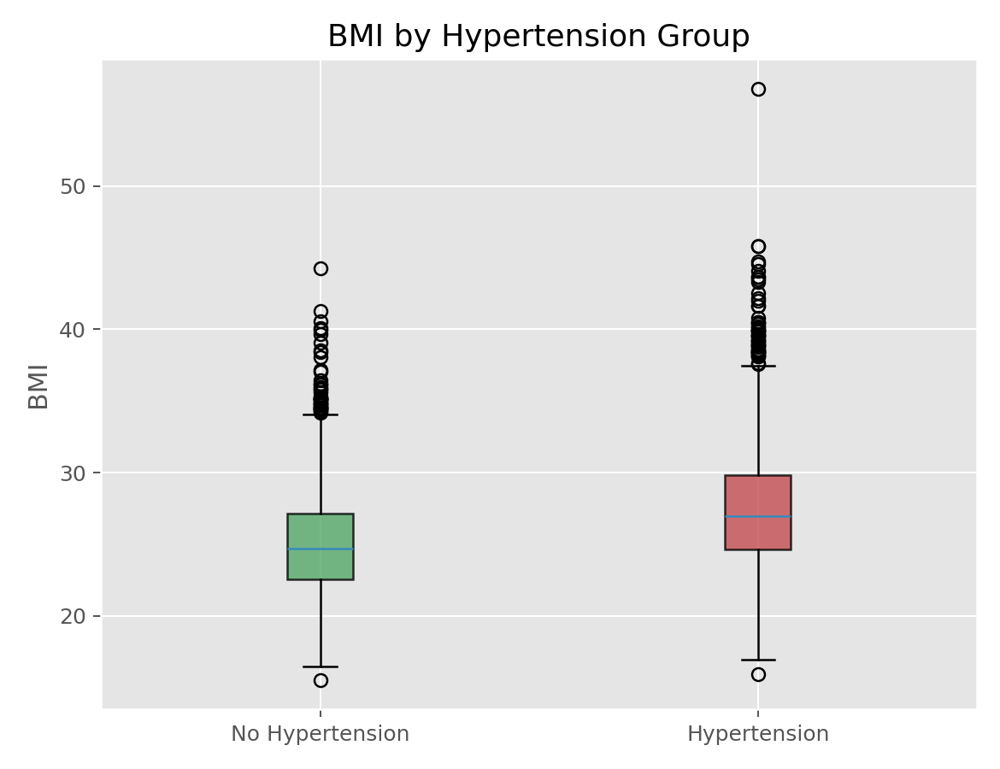

# Wilcoxon秩和检验（Wilcoxon Rank-Sum Test）

## 1. 方法概览

### 1.1 一句话本质

它是两独立样本 t 检验的非参数版：把两组数据混在一起从小到大排名，看某一组的「名次总分」是否系统性地偏高或偏低——等价于问「随机各取一个，A 大于 B 的概率是不是 0.5」。

### 1.2 定义

Wilcoxon 秩和检验（等价于 Mann-Whitney U 检验）比较两个独立组的分布位置，基于混合排秩，不要求数据正态，适用于连续或有序结局。

### 1.3 它主要解决什么问题

- 研究问题：两个独立组的水平是否不同（在不敢假设正态时）？
- 适用任务：两组非参数位置比较、有序结局比较。
- 常见医学场景：两组小样本偏态指标比较、量表评分等有序结局的两组比较、有异常值的实验室数据。

### 1.4 直觉与类比

两组身高混在一起排队。如果两组来自同一分布，高个矮个应该均匀交错，两组的「名次总分」应差不多。如果 A 组普遍更高，A 组的人就会更多地排在队伍后段、名次更大、名次总分更高。秩和检验就是量出这种「名次总分的失衡」。

## 2. 核心思想与原理

### 2.1 它到底在解决什么根本困难

两样本 t 检验依赖正态与（经典版）方差齐。小样本偏态、有序或含异常值时不可靠。根本困难是：**如何不假设分布形状，就能比较两个独立组的位置？**

### 2.2 关键洞察

把两组 $N=n_1+n_2$ 个观测混合排秩。若两组同分布，秩在两组间随机分配，某组秩和的期望是已知的；实际秩和偏离期望越远，越说明两组不同。更深的等价视角：统计量 $U$ 直接估计 $P(X\gt Y)$（从两组各随机取一个，A 大于 B 的概率）——原假设是它等于 0.5。用秩使检验对异常值稳健、且原假设下分布与数据分布无关。

### 2.3 与朴素/相邻做法的对比

- 相对**两样本 t**：不要求正态、抗异常值；正态时功效仅略低（约 95%）。
- 相对 **Wilcoxon 符号秩**：秩和用于**两独立组**，符号秩用于**配对**。
- 相对 **Kruskal-Wallis**：Kruskal-Wallis 是它在「三组及以上」的推广。

## 3. 数学形式

### 3.1 核心公式

$$
U_1=R_1-\frac{n_1(n_1+1)}{2}
$$

其中 $R_1$ 是第 1 组在混合排秩中的秩和。这个式子在说：$U_1$ 把第 1 组的秩和减去「它自己内部排序就会占用的最小秩和」，剩下的正是「第 1 组观测大于第 2 组观测的对数」。

### 3.2 推导脉络

- 混合 $N$ 个观测排秩，得两组秩和 $R_1,R_2$（$R_1+R_2=N(N+1)/2$）。
- $U_1$ 恰等于「所有跨组对 $(x_i,y_j)$ 中 $x_i\gt y_j$ 的个数」，故 $U_1/(n_1 n_2)$ 估计 $P(X\gt Y)$。
- 原假设下 $E[U]=\dfrac{n_1 n_2}{2}$，方差 $\dfrac{n_1 n_2 (N+1)}{12}$。
- 小样本查精确表；大样本用正态近似（含结点校正）。取 $U=\min(U_1,U_2)$，越小越偏离。

### 3.3 参数与统计量含义

- $R_1$：第 1 组秩和；$U_1$：Mann-Whitney U 统计量。
- $U/(n_1 n_2)$：估计的「优势概率」$P(X\gt Y)$。
- 期望 $n_1 n_2/2$：原假设下 U 的中心。
- p 值：原假设下出现如此极端秩和的概率。

### 3.4 关键假设（含违反后果）

| 假设 | 含义 | 违反后会怎样 | 如何粗查 |
| --- | --- | --- | --- |
| 独立 | 两组、组内独立 | p 值失真 | 看设计 |
| 可排序 | 结局可比大小 | 大量结点降低效力 | 看重复值 |
| 形状相近 | 两组分布形状类似 | 只能说「位置」需谨慎 | 两组分布图 |

## 4. 手把手算例

比较两组各 3 例的指标：A = {12, 15, 18}，B = {10, 11, 14}。

**一步步计算：**

- 混合排序：$10(B),11(B),12(A),14(B),15(A),18(A)$，对应秩 $1,2,3,4,5,6$。
- 秩和：$R_A=3+5+6=14$，$R_B=1+2+4=7$。
- $U_A=R_A-\dfrac{n_A(n_A+1)}{2}=14-\dfrac{3\times4}{2}=14-6=8$；$U_B=7-6=1$。
- 检验统计量 $U=\min(8,1)=1$。优势概率估计 $U_A/(n_A n_B)=8/9\approx0.89$（A 更大）。
- $n_1=n_2=3$ 时 $\alpha=0.05$（双侧）临界值为 0（规则「$U\le$ 临界值才拒绝」）；因 $U=1\gt 0$，**不拒绝**。

**结论：** A 组看起来系统性更高（9 对跨组比较里 8 对 A 更大，优势概率约 0.89），但每组只有 3 例，样本太小、达不到显著。这清楚说明：**秩和检验能捕捉到方向，但小样本的功效极其有限**——效应看着大，证据仍不足。

## 5. 数据形式与输入输出

### 5.1 适合的数据形式

- 自变量类型：一个二分类分组变量。
- 因变量类型：连续或有序等级。
- 数据结构：两组独立观测。
- 是否适合高维数据：否。
- 是否适合缺失较多数据：按可用样本。
- 是否适合删失数据：不适合。
- 是否适合重复测量数据：不适合。

### 5.2 示例表格

| 组 | 值 | 混合秩 |
| --- | --- | --- |
| A | 12, 15, 18 | 3, 5, 6 |
| B | 10, 11, 14 | 1, 2, 4 |

### 5.3 输入与产出

#### 输入

- 输入数据：分组变量 + 结局。
- 关键变量：组别、结局值。
- 需要预处理的内容：处理结点、确认独立。

#### 产出

- 模型对象/统计结果：$U$、p 值。
- 参数估计：优势概率 $P(X\gt Y)$、Hodges-Lehmann 位置差。
- 预测结果：无。
- 不确定性指标：位置差的置信区间（可选）。

## 6. 适用场景

- 适合：两独立组、非正态或小样本、有序结局。
- 不适合：配对（用符号秩）、三组以上（用 Kruskal-Wallis）。
- 使用前需要特别检查的点：独立性、两组分布形状是否相近（影响解释为「位置差」）。

## 7. 实现

### 7.1 Python

常用包：

- `scipy`

```python
from scipy import stats

A = [12, 15, 18]; B = [10, 11, 14]
U, p = stats.mannwhitneyu(A, B, alternative="two-sided")
print(f"U={U}, p={p:.3f}")
```

### 7.2 R

常用包：

- `stats`

```r
A <- c(12, 15, 18); B <- c(10, 11, 14)
wilcox.test(A, B)          # 即 Mann-Whitney
```

## 8. 结果如何解读

- 核心结果看什么：$U$/p，以及优势概率 $P(X\gt Y)$ 或位置差。
- 每个主要参数如何解读：优势概率偏离 0.5 越远，两组差异越明显。
- 临床或医学意义如何表达：报告中位数差或优势概率，而非均值差。
- 常见误读：把它简单说成「比中位数」（形状不同时未必）；只报 p 值不报效应量。

## 9. 假设诊断与稳健性

- 分布形状：两组形状相近时可解释为「中位数/位置差」，否则只说「分布不同」。
- 结点：大量相等值降低功效，软件用近似校正。
- 稳健性：对异常值远比 t 检验稳健。
- 效能：正态时约为 t 检验的 95%，非正态常更优。

## 10. 推荐可视化

- 两组箱线图/小提琴图 + 抖动点。
- 两组 ECDF 叠加。
- 优势概率/位置差的点区间图。

### 10.1 图像示例

下图比较有无高血压两组的 BMI 分布。



## 11. 优势、局限与常见坑

### 优势

- 不依赖正态、抗异常值。
- 适用有序结局。
- 有直观的「优势概率」解释。

### 局限

- 丢弃数值信息，正态时功效略低。
- 形状差异大时「位置差」解释受限。
- 大量结点降低效力。

### 常见坑

- 与符号秩（配对）混用。
- 把「分布不同」直接当「中位数不同」。
- 忽略两组方差/形状差异。

## 12. 与相近方法的区别

- 和**两样本 t**：t 比均值、要正态；秩和比位置、更稳健。
- 和 **Wilcoxon 符号秩**：秩和两独立组、符号秩配对。
- 和 **Kruskal-Wallis**：后者是它在多组的推广。
- 如何选择：两独立组且非正态 → 秩和；正态 → 两样本 t。

## 13. 医学研究中的典型应用

- 两组偏态实验室指标比较。
- 有序量表评分的两组比较。
- 小样本或含异常值的两组结局比较。

## 14. 关键术语

- **秩和（Rank Sum）**：某组在混合排序中的名次总和。
- **Mann-Whitney U**：与秩和等价的统计量，计数跨组优势对。
- **优势概率（$P(X\gt Y)$）**：随机各取一个，某组更大的概率。
- **结点（Ties）**：相等观测，影响秩与近似。
- **Hodges-Lehmann 估计**：两组位置差的稳健点估计。

## 15. 相关方法

- [[两独立样本t检验（Two-Sample t-Test）]]
- [[Wilcoxon符号秩检验（Wilcoxon Signed-Rank Test）]]
- [[Kruskal-Wallis检验（Kruskal-Wallis Test）]]

## 16. 参考资料

- Mann HB, Whitney DR. On a test of whether one of two random variables is stochastically larger than the other. *Ann Math Stat*. 1947;18(1):50-60.
- Wilcoxon F. Individual comparisons by ranking methods. *Biometrics Bull*. 1945;1(6):80-83.
- Hollander M, Wolfe DA, Chicken E. *Nonparametric Statistical Methods*. 3rd ed. Wiley; 2013.
