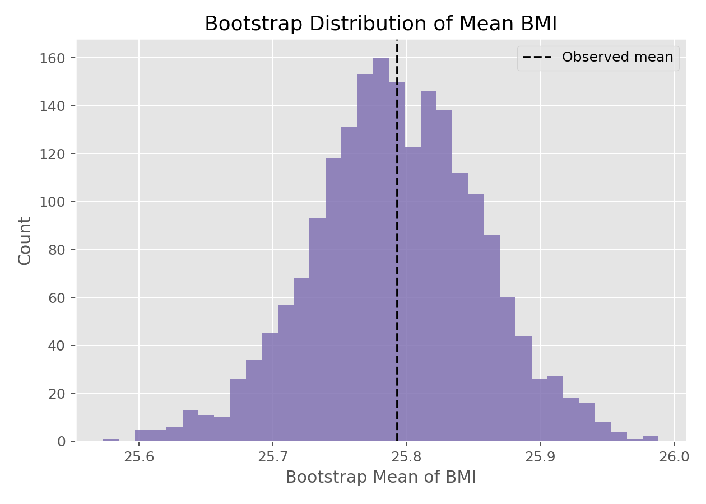

# Bootstrap重抽样（Bootstrap Resampling）

## 1. 方法概览

### 1.1 定义

Bootstrap 是一种从原始样本中“有放回重抽样”的方法，用来近似统计量的抽样分布，从而估计标准误、方差和置信区间。

### 1.2 它主要解决什么问题

- 研究问题：当统计量的理论分布难推导时，如何评估不确定性。
- 适用任务：构造置信区间、估计标准误、比较复杂统计量的稳定性。
- 常见医学场景：小样本研究、偏态数据、中位数或 AUC 等复杂指标的区间估计。

### 1.3 直觉理解

因为我们通常只有一份数据，所以 Bootstrap 把“经验分布函数”当作总体的近似，再反复从这份经验分布里采样，模拟如果我们重复做很多次研究，统计量会怎么波动。

## 2. 数学形式

### 2.1 核心公式

$$
\begin{aligned}
(X_1^*, \ldots, X_n^*) &\sim \hat F_n \\
\hat\theta_r^* &= t(X_1^*, \ldots, X_n^*), \quad r = 1, \ldots, R
\end{aligned}
$$

### 2.2 参数或统计量含义

- $\hat\theta$：原始样本上的统计量。
- $\hat\theta_r^*$：第 $r$ 次 Bootstrap 样本上的统计量。
- $R$：重抽样次数。
- 百分位区间：直接取 $\hat\theta^*$ 分布的相应分位数。

### 2.3 关键假设

- 原始样本能代表目标总体。
- 最常见设定是假设观测独立同分布。
- 重抽样不能弥补系统偏倚或错误设计。

## 3. 数据形式与输入输出

### 3.1 适合的数据形式

- 自变量类型：不限。
- 因变量类型：不限，只要能定义统计量。
- 数据结构：最基础的是独立样本；复杂结构需用 block/bootstrap 等变体。
- 是否适合高维数据：可用，但计算量大。
- 是否适合缺失较多数据：需先明确缺失处理，再进行 Bootstrap。
- 是否适合删失数据：可用专门的生存 Bootstrap 变体。
- 是否适合重复测量数据：普通 Bootstrap 不够，应尊重聚类或个体层级。

### 3.2 示例表格

Bootstrap 很适合先从一个简单连续变量开始，例如 `Framingham_data.csv` 基线的 BMI：

| RANDID | PERIOD | BMI |
| --- | --- | --- |
| 2448 | 1 | 26.97 |
| 6238 | 1 | 28.73 |
| 9428 | 1 | 25.34 |
| 10552 | 1 | 28.58 |
| 11252 | 1 | 23.10 |

后续可以把统计量从“均值”扩展到中位数、相关系数、AUC 或回归系数。

### 3.3 输入与产出

#### 输入

- 输入数据：任意可计算目标统计量的数据集。
- 关键变量：定义统计量所需的全部变量。
- 需要预处理的内容：确定重抽样单位、缺失处理、随机种子。

#### 产出

- 模型对象/统计结果：Bootstrap 统计量分布。
- 参数估计：统计量点估计。
- 预测结果：可用于模型性能的内部验证。
- 不确定性指标：标准误、方差、百分位置信区间等。

## 4. 适用场景

- 适合：中位数、分位数、AUC、相关系数、复杂模型性能指标的区间估计。
- 不适合：样本过小到无法代表总体、强依赖结构未建模、极端稀有事件。
- 使用前需要特别检查的点：抽样单位是什么、是否存在聚类、重抽样次数是否足够。

## 5. 实现

### 5.1 Python

常用包：

- `scipy`
- `numpy`

```python
import numpy as np
from scipy import stats

x = np.array([12.3, 10.8, 11.4, 13.1, 9.9, 12.0, 11.1])

res = stats.bootstrap(
    (x,),
    np.mean,
    confidence_level=0.95,
    n_resamples=5000,
    method="percentile",
    random_state=0
)

print(res.confidence_interval)
print(res.standard_error)
```

### 5.2 R

常用包：

- `boot`

```r
library(boot)

x <- c(12.3, 10.8, 11.4, 13.1, 9.9, 12.0, 11.1)

mean_boot <- function(data, indices) {
  mean(data[indices])
}

fit <- boot(data = x, statistic = mean_boot, R = 5000)
boot.ci(fit, type = "perc")
```

## 6. 结果如何解释

- 核心结果看什么：统计量在重抽样中的波动范围。
- 每个主要参数如何解释：标准误表示不确定性大小，区间表示可能的参数范围。
- 临床或医学意义如何表达：例如“中位数改善值的 95% Bootstrap CI 为 1.2 到 3.8”。
- 常见误读：Bootstrap 区间不是让估计“更准”，只是更好地量化不确定性。

## 7. 推荐可视化

- Bootstrap 统计量直方图。
- Bootstrap 分布密度图。
- 点估计加 Bootstrap 置信区间图。

### 7.1 图像示例

下图展示基线 BMI 均值经过 2000 次 Bootstrap 后的抽样分布近似形状。



## 8. 优势、局限与常见坑

### 优势

- 通用性强。
- 不依赖复杂解析推导。
- 对复杂统计量尤其有价值。

### 局限

- 计算成本较高。
- 依赖样本代表性。
- 对强相关数据不应直接套普通 Bootstrap。

### 常见坑

- 忽略抽样单位，错误地在观测层面重抽样。
- 样本极小却过度信赖 Bootstrap 区间。
- 只报告区间，不说明使用的是哪种 Bootstrap 方法。

## 9. 与相近方法的区别

- 和经典 t 区间的区别：t 区间依赖理论分布，Bootstrap 依赖重抽样近似。
- 和置换检验的区别：Bootstrap 主要估计抽样分布，置换检验主要构造零分布。
- 应该如何选择：若理论分布清晰、样本足够大，经典方法更简单；复杂统计量可优先考虑 Bootstrap。

## 10. 医学研究中的典型应用

- 小样本下中位数或分位数的区间估计。
- ROC/AUC、校准指标等模型性能的内部验证。
- Spearman 相关、回归系数稳健性评估。

## 11. 相关方法

- [[经验分布函数（Empirical Cumulative Distribution Function, ECDF）]]
- [[Spearman秩相关（Spearman Rank Correlation）]]
- [[线性回归（Linear Regression）]]

## 12. 参考资料

- Efron B, Tibshirani RJ. *An Introduction to the Bootstrap*. Chapman and Hall/CRC; 1993.
- SciPy Developers. `scipy.stats.bootstrap`. SciPy API Reference. [https://docs.scipy.org/doc/scipy/reference/generated/scipy.stats.bootstrap.html](https://docs.scipy.org/doc/scipy/reference/generated/scipy.stats.bootstrap.html) （访问日期：2026-07-02）
- Canty A, Ripley B. `boot`: Bootstrap R (S-Plus) Functions. CRAN Reference Manual. [https://cran.r-project.org/package=boot](https://cran.r-project.org/package=boot) （访问日期：2026-07-02）
