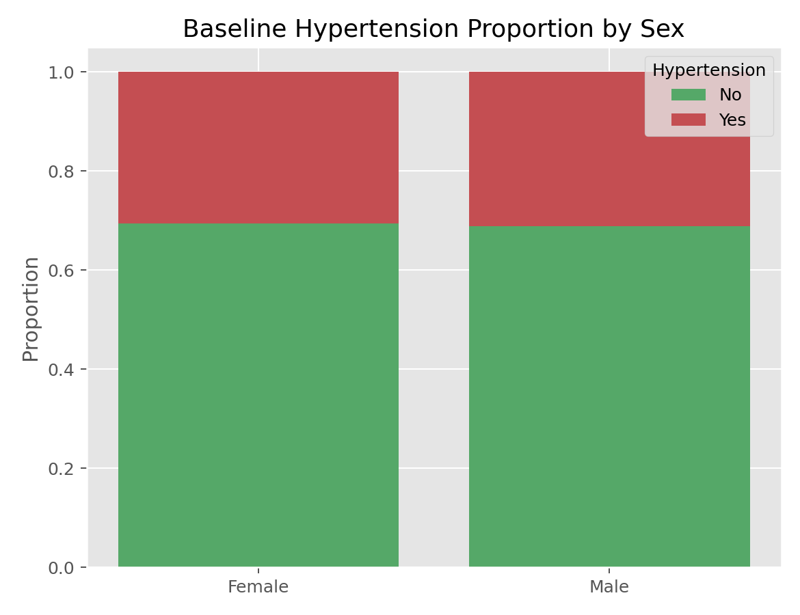

# Pearson卡方独立性检验（Pearson Chi-Squared Test of Independence）

## 1. 方法概览

### 1.1 定义

Pearson 卡方独立性检验用于判断两个分类变量在列联表中是否独立，是分类数据分析的基础方法。

### 1.2 它主要解决什么问题

- 研究问题：分类暴露与分类结局之间是否存在关联。
- 适用任务：列联表独立性检验。
- 常见医学场景：治疗组与结局、吸烟与疾病、性别与并发症之间的关联分析。

### 1.3 直觉理解

如果两个分类变量独立，那么各单元格实际人数应该和“按边际比例乘出来的期望人数”差不多。差得越离谱，越不支持独立。

## 2. 数学形式

### 2.1 核心公式

$$
\begin{aligned}
\hat\mu_{ij} &= \frac{n_{i\cdot}n_{\cdot j}}{n} \\
X^2 &= \sum_{i=1}^{I}\sum_{j=1}^{J}\frac{(n_{ij} - \hat\mu_{ij})^2}{\hat\mu_{ij}} \\
\mathrm{df} &= (I - 1)(J - 1)
\end{aligned}
$$

### 2.2 参数或统计量含义

- $n_{ij}$：观察到的单元格频数。
- $\hat\mu_{ij}$：零假设下的期望频数。
- $X^2$：卡方统计量。

### 2.3 关键假设

- 观测相互独立。
- 数据是频数而不是比例。
- 期望频数不能太小；常见经验是平均单元格频数至少约 5。

## 3. 数据形式与输入输出

### 3.1 适合的数据形式

- 自变量类型：分类变量。
- 因变量类型：分类变量。
- 数据结构：二维列联表最典型。
- 是否适合高维数据：稀疏表不合适。
- 是否适合缺失较多数据：需先决定缺失是否作为单独类别。
- 是否适合删失数据：不适合。
- 是否适合重复测量数据：不适合，配对分类数据应考虑 McNemar。

### 3.2 示例表格

卡方独立性检验最适合直接作用在列联表上。下面给出一个按性别和高血压状态整理的 2×2 表：

| SEX | PREVHYP = No | PREVHYP = Yes |
| --- | --- | --- |
| Female | 1671 | 734 |
| Male | 1246 | 564 |

### 3.3 输入与产出

#### 输入

- 输入数据：列联表或原始分类数据。
- 关键变量：两个分类变量。
- 需要预处理的内容：构造列联表，核对频数。

#### 产出

- 模型对象/统计结果：卡方值、自由度、p 值。
- 参数估计：不直接给效应量，通常应补充 OR、RR 或 Cramer's V。
- 预测结果：无。
- 不确定性指标：主要是检验结果。

## 4. 适用场景

- 适合：大样本列联表独立性检验。
- 不适合：2x2 小样本稀疏表、配对分类数据。
- 使用前需要特别检查的点：期望频数、研究设计是否独立抽样。

## 5. 实现

### 5.1 Python

常用包：

- `pandas`
- `scipy`

```python
import pandas as pd
from scipy import stats

df = pd.DataFrame({
    "treatment": ["A", "A", "A", "B", "B", "B", "B"],
    "response":  ["yes", "no", "yes", "yes", "no", "no", "yes"]
})

table = pd.crosstab(df["treatment"], df["response"])
chi2, p, dof, expected = stats.chi2_contingency(table)
print(chi2, p, dof)
print(expected)
```

### 5.2 R

常用包：

- `stats`

```r
tab <- matrix(c(30, 20, 18, 32), nrow = 2, byrow = TRUE)
chisq.test(tab)
```

## 6. 结果如何解释

- 核心结果看什么：是否有证据拒绝独立性。
- 每个主要参数如何解释：卡方值越大，观察频数与期望频数偏离越大。
- 临床或医学意义如何表达：显著后应进一步给出方向和大小，如 OR 或 RR。
- 常见误读：卡方显著不告诉你差异在哪个单元格，也不告诉你效应大小。

## 7. 推荐可视化

- 列联表热图。
- 堆叠条形图。
- 马赛克图。

### 7.1 图像示例

下图用堆叠比例条形图展示性别与高血压状态的关联结构，适合作为卡方独立性检验的配套展示。



## 8. 优势、局限与常见坑

### 优势

- 简单标准。
- 适用广泛。
- 是分类数据分析的基础入口。

### 局限

- 对稀疏数据不稳健。
- 不给效应量方向与大小。
- 不控制混杂。

### 常见坑

- 期望频数很小时仍机械使用。
- 把比例数据当频数重复输入。
- 忽视配对设计或分层结构。

## 9. 与相近方法的区别

- 和 Fisher 精确检验的区别：Fisher 更适合 2x2 小样本。
- 和 McNemar 的区别：McNemar 用于配对分类数据。
- 应该如何选择：大样本独立列联表优先卡方，小样本 2x2 表优先 Fisher。

## 10. 医学研究中的典型应用

- 比较治疗组与对照组不良事件发生率。
- 分析暴露状态与疾病有无的关联。
- 描述基线分类变量平衡性。

## 11. 相关方法

- [[Fisher精确检验（Fisher Exact Test）]]
- [[McNemar检验（McNemar Test）]]
- [[Mantel-Haenszel检验（Mantel-Haenszel Test）]]

## 12. 参考资料

- Agresti A. *An Introduction to Categorical Data Analysis*. 3rd ed. Wiley; 2018.
- SciPy Developers. `scipy.stats.chi2_contingency`. SciPy API Reference. [https://docs.scipy.org/doc/scipy/reference/generated/scipy.stats.chi2_contingency.html](https://docs.scipy.org/doc/scipy/reference/generated/scipy.stats.chi2_contingency.html) （访问日期：2026-07-02）
- R Core Team. `chisq.test`. R Manual. [https://stat.ethz.ch/R-manual/R-devel/library/stats/html/chisq.test.html](https://stat.ethz.ch/R-manual/R-devel/library/stats/html/chisq.test.html) （访问日期：2026-07-02）
