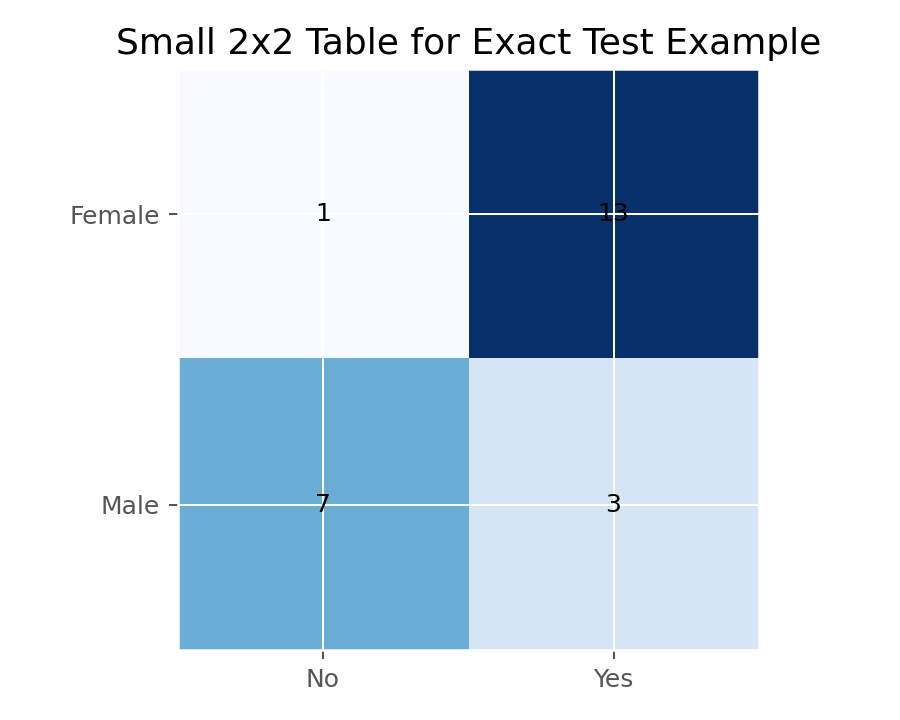

# Fisher精确检验（Fisher Exact Test）

## 1. 方法概览

### 1.1 定义

Fisher 精确检验是针对 2x2 列联表的小样本精确检验，利用超几何分布在固定边际下直接计算 p 值。

### 1.2 它主要解决什么问题

- 研究问题：两个二分类变量是否独立。
- 适用任务：2x2 小样本或稀疏列联表分析。
- 常见医学场景：罕见不良事件、病例数很少的试点研究。

### 1.3 直觉理解

在样本很小的时候，卡方近似可能不准。Fisher 检验不靠近似，而是在“所有可能的 2x2 表”中精确计算有多大概率会出现像当前这样极端或更极端的结果。

## 2. 数学形式

### 2.1 核心公式

$$
P(N_{11}=n_{11}\mid \text{margins})
=
\frac{\binom{n_{1\cdot}}{n_{11}}\binom{n_{2\cdot}}{n_{\cdot 1}-n_{11}}}{\binom{n}{n_{\cdot 1}}}
$$

### 2.2 参数或统计量含义

- $n_{11}$：左上角单元格频数。
- 固定边际：行总计和列总计视为已知。
- 常常围绕 $OR=1$ 的零假设进行检验。

### 2.3 关键假设

- 2x2 列联表。
- 边际固定的抽样框架或精确条件化思路。
- 观测独立。

## 3. 数据形式与输入输出

### 3.1 适合的数据形式

- 自变量类型：二分类。
- 因变量类型：二分类。
- 数据结构：2x2 独立样本列联表。
- 是否适合高维数据：不适合。
- 是否适合缺失较多数据：需先明确缺失编码方式。
- 是否适合删失数据：不适合。
- 是否适合重复测量数据：不适合。

### 3.2 示例表格

Fisher 精确检验最适合小样本 2x2 表。下面给出一个从 `Framingham_data.csv` 高龄小样本切片得到的稀疏 2x2 表：

| SEX | PREVHYP = No | PREVHYP = Yes |
| --- | --- | --- |
| Female | 1 | 13 |
| Male | 7 | 3 |

该表中有多个单元格计数小于 5，因此更适合用 Fisher 精确检验，而不是 Pearson 卡方近似。

### 3.3 输入与产出

#### 输入

- 输入数据：2x2 频数表。
- 关键变量：暴露/分组与结局。
- 需要预处理的内容：确认行列含义与假设方向。

#### 产出

- 模型对象/统计结果：精确 p 值。
- 参数估计：常伴随 OR 估计。
- 预测结果：无。
- 不确定性指标：可报告 OR 的区间估计。

## 4. 适用场景

- 适合：2x2 小样本、稀疏表、某格频数很小。
- 不适合：大样本高维表、配对数据。
- 使用前需要特别检查的点：是否真的是 2x2，是否需要单侧假设。

## 5. 实现

### 5.1 Python

常用包：

- `scipy`

```python
import numpy as np
from scipy import stats

table = np.array([[3, 1],
                  [1, 3]])

res = stats.fisher_exact(table, alternative="two-sided")
print(res.statistic, res.pvalue)
```

### 5.2 R

常用包：

- `stats`

```r
tab <- matrix(c(3, 1, 1, 3), nrow = 2, byrow = TRUE)
fisher.test(tab)
```

## 6. 结果如何解释

- 核心结果看什么：在零假设成立时，观察到当前或更极端表格的概率。
- 每个主要参数如何解释：若同时输出 OR，需结合区间估计解释效应大小。
- 临床或医学意义如何表达：小样本下尤其要看效应方向和区间宽度。
- 常见误读：p 值不显著往往也可能只是样本太小。

## 7. 推荐可视化

- 2x2 列联表。
- 分组条形图。
- OR 点估计加区间图。

### 7.1 图像示例

下图把这个稀疏 2×2 表画成热图，适合作为 Fisher 精确检验的示意图。



## 8. 优势、局限与常见坑

### 优势

- 小样本下有效。
- 不依赖大样本近似。
- 是 2x2 稀疏表的标准方法。

### 局限

- 只适用于小型列联表。
- 可能偏保守。
- 不能处理复杂分层或混杂。

### 常见坑

- 大样本场景也机械使用，导致效率低。
- 不区分单侧和双侧备择。
- 只报 p 值，不报 OR 和区间。

## 9. 与相近方法的区别

- 和 Pearson 卡方的区别：Fisher 是精确方法，卡方是近似方法。
- 和 McNemar 的区别：McNemar 针对配对 2x2 表。
- 应该如何选择：2x2 小样本优先 Fisher；大样本独立表可用卡方。

## 10. 医学研究中的典型应用

- 罕见事件发生率比较。
- 小样本病例对照研究。
- 试点研究中治疗与应答的初步分析。

## 11. 相关方法

- [[Pearson卡方独立性检验（Pearson Chi-Squared Test of Independence）]]
- [[McNemar检验（McNemar Test）]]
- [[Mantel-Haenszel检验（Mantel-Haenszel Test）]]

## 12. 参考资料

- Agresti A. *An Introduction to Categorical Data Analysis*. 3rd ed. Wiley; 2018.
- SciPy Developers. `scipy.stats.fisher_exact`. SciPy API Reference. [https://docs.scipy.org/doc/scipy/reference/generated/scipy.stats.fisher_exact.html](https://docs.scipy.org/doc/scipy/reference/generated/scipy.stats.fisher_exact.html) （访问日期：2026-07-02）
- R Core Team. `fisher.test`. R Manual. [https://stat.ethz.ch/R-manual/R-devel/library/stats/html/fisher.test.html](https://stat.ethz.ch/R-manual/R-devel/library/stats/html/fisher.test.html) （访问日期：2026-07-02）
