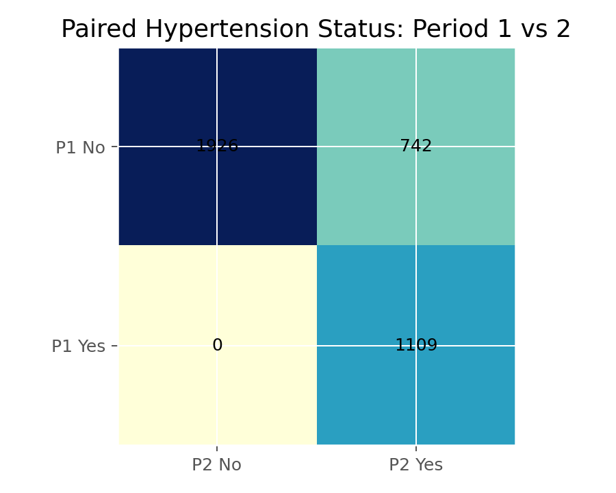

# McNemar检验（McNemar Test）

## 1. 方法概览

### 1.1 定义

McNemar 检验用于分析配对或匹配设计中的二分类结局，检验两个相关测量的阳性比例是否相同。

### 1.2 它主要解决什么问题

- 研究问题：同一对象两次分类结果是否发生系统性变化。
- 适用任务：前后测、左右眼/双胞胎、病例-配对对照等二分类比较。
- 常见医学场景：治疗前后是否转阴、两种诊断方法是否一致。

### 1.3 直觉理解

如果两次测量没有系统差异，那么“从阳变阴”和“从阴变阳”的人数应该差不多。McNemar 就专门比较这两类不一致对。

## 2. 数学形式

### 2.1 核心公式

$$
Q_M = \frac{(n_{12} - n_{21})^2}{n_{12} + n_{21}}
$$

### 2.2 参数或统计量含义

- $n_{12}, n_{21}$：配对表中不一致的两类人数。
- 对角线一致单元格不提供变化方向信息，重点在非对角线。

### 2.3 关键假设

- 数据是配对的。
- 结局是二分类。
- 每对之间相互独立。

## 3. 数据形式与输入输出

### 3.1 适合的数据形式

- 自变量类型：时间点、方法、配对成员。
- 因变量类型：二分类。
- 数据结构：2x2 配对列联表。
- 是否适合高维数据：不适合。
- 是否适合缺失较多数据：任何一对缺失都会丢掉配对信息。
- 是否适合删失数据：不适合。
- 是否适合重复测量数据：仅适合两次测量。

### 3.2 示例表格

McNemar 检验关注的是同一对象两次二分类结果的转移。下面是 `Framingham_data.csv` 中 `PREVHYP` 从第 1 期到第 2 期的配对 2x2 表：

| PREVHYP_P1 \\ PREVHYP_P2 | P2 No | P2 Yes |
| --- | --- | --- |
| P1 No | 1926 | 742 |
| P1 Yes | 0 | 1109 |

### 3.3 输入与产出

#### 输入

- 输入数据：配对二分类表。
- 关键变量：两次分类结果或两成员结果。
- 需要预处理的内容：构造正确的配对 2x2 表。

#### 产出

- 模型对象/统计结果：McNemar 统计量、p 值。
- 参数估计：通常关注变化方向，可补充不一致对比例。
- 预测结果：无。
- 不确定性指标：可使用精确二项分布版本。

## 4. 适用场景

- 适合：前后比较、同一对象两种检测方法比较。
- 不适合：独立样本 2x2 表、多时间点重复测量。
- 使用前需要特别检查的点：是否真的是配对设计；若样本很小，可考虑精确版本。

## 5. 实现

### 5.1 Python

常用包：

- `statsmodels`

```python
import numpy as np
from statsmodels.stats.contingency_tables import mcnemar

table = np.array([[175, 16],
                  [54, 188]])

res = mcnemar(table, exact=False, correction=True)
print(res.statistic, res.pvalue)
```

### 5.2 R

常用包：

- `stats`

```r
tab <- matrix(c(175, 16, 54, 188), nrow = 2, byrow = TRUE)
mcnemar.test(tab)
```

## 6. 结果如何解释

- 核心结果看什么：不一致对是否明显偏向某个方向。
- 每个主要参数如何解释：如果 $n_{12}$ 与 $n_{21}$ 差异大，说明存在系统变化。
- 临床或医学意义如何表达：建议同时报告转归方向和比例。
- 常见误读：不能把它当成独立样本卡方检验。

## 7. 推荐可视化

- 2x2 配对表。
- before-after 转移图。
- 不一致对方向条形图。

### 7.1 图像示例

下面的图像展示 `Framingham_data.csv` 中基线与第 2 期高血压状态的转移表，非对角线单元格就是 McNemar 检验最关心的信息。



## 8. 优势、局限与常见坑

### 优势

- 明确针对配对二分类设计。
- 方法简单直观。
- 可做精确版本。

### 局限

- 只能处理二分类、两次测量。
- 不能控制其他协变量。
- 只利用不一致对信息。

### 常见坑

- 错把独立样本数据做 McNemar。
- 忽略样本量过小时应使用精确版本。
- 只报 p 值，不报变化方向和实际人数。

## 9. 与相近方法的区别

- 和 Pearson 卡方的区别：卡方用于独立样本，McNemar 用于配对样本。
- 和 Fisher 的区别：Fisher 也通常用于独立 2x2 表。
- 应该如何选择：配对二分类就选 McNemar，而不是普通卡方。

## 10. 医学研究中的典型应用

- 比较治疗前后阳性率。
- 比较两种诊断试验在同一受试者上的差异。
- 比较病例-对照匹配对中的分类结果变化。

## 11. 相关方法

- [[Pearson卡方独立性检验（Pearson Chi-Squared Test of Independence）]]
- [[Fisher精确检验（Fisher Exact Test）]]
- [[Mantel-Haenszel检验（Mantel-Haenszel Test）]]

## 12. 参考资料

- Agresti A. *An Introduction to Categorical Data Analysis*. 3rd ed. Wiley; 2018.
- statsmodels Developers. `statsmodels.stats.contingency_tables.mcnemar`. statsmodels API Reference. [https://www.statsmodels.org/stable/generated/statsmodels.stats.contingency_tables.mcnemar.html](https://www.statsmodels.org/stable/generated/statsmodels.stats.contingency_tables.mcnemar.html) （访问日期：2026-07-02）
- R Core Team. `mcnemar.test`. R Manual. [https://stat.ethz.ch/R-manual/R-devel/library/stats/html/mcnemar.test.html](https://stat.ethz.ch/R-manual/R-devel/library/stats/html/mcnemar.test.html) （访问日期：2026-07-02）
