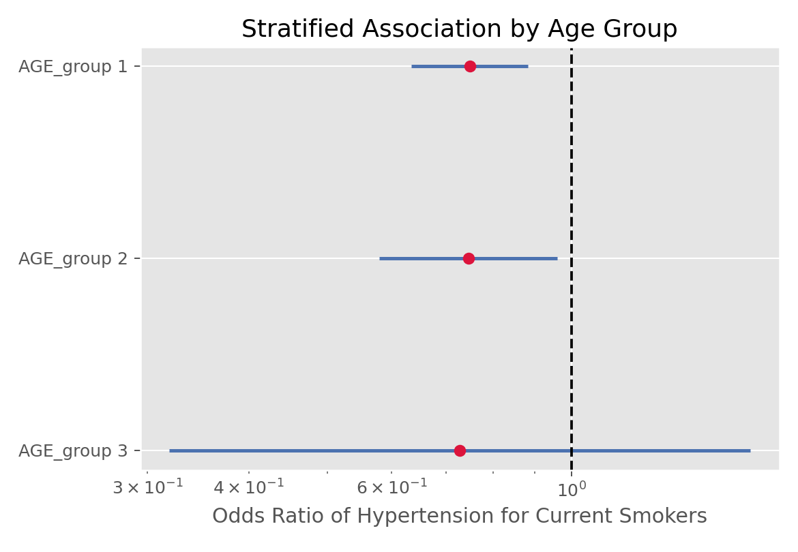

# Mantel-Haenszel检验（Mantel-Haenszel Test）

## 1. 方法概览

### 1.1 定义

Mantel-Haenszel 检验用于在多个分层 2x2 列联表中检验暴露与结局是否存在一致的条件关联，常用于控制一个分类混杂因素。

### 1.2 它主要解决什么问题

- 研究问题：在控制一个分层因素后，暴露与结局是否仍相关。
- 适用任务：分层列联表分析、初步控制混杂。
- 常见医学场景：按年龄层、性别层、中心分层后评估暴露与结局关联。

### 1.3 直觉理解

它相当于“在每一层里先做 2x2 比较，再把这些层内证据按权重汇总起来”，从而避免被 Simpson 悖论那样的混杂误导。

## 2. 数学形式

### 2.1 核心公式

$$
Q_{MH} = \frac{\left[\sum_{k=1}^{K}(n_{k11} - m_{k11})\right]^2}{\sum_{k=1}^{K} v_{k11}}
$$

### 2.2 参数或统计量含义

- $n_{k11}$：第 $k$ 层 2x2 表左上角频数。
- $m_{k11}$、$v_{k11}$：零假设下的期望和方差。
- $Q_{MH}$：近似服从 $\chi^2_1$ 的统计量。

### 2.3 关键假设

- 数据由多个独立分层 2x2 表组成。
- 各层内观测独立，各层之间独立。
- 层间 OR 方向大体一致，否则汇总意义有限。

## 3. 数据形式与输入输出

### 3.1 适合的数据形式

- 自变量类型：二分类暴露。
- 因变量类型：二分类结局。
- 数据结构：$K$ 个 2x2 分层表。
- 是否适合高维数据：不适合高维多混杂因素。
- 是否适合缺失较多数据：分层后缺失会进一步稀疏。
- 是否适合删失数据：不适合。
- 是否适合重复测量数据：不适合。

### 3.2 示例表格

Mantel-Haenszel 检验最适合“多个分层的 2x2 表”。例如在 `Framingham_data.csv` 基线中，按 `AGE_group` 分层考察 `CURSMOKE × PREVHYP`：

| AGE_group | Smoke + HTN | Smoke + NoHTN | NoSmoke + HTN | NoSmoke + NoHTN |
| --- | --- | --- | --- | --- |
| 1 | 362 | 1313 | 372 | 1010 |
| 2 | 161 | 218 | 334 | 337 |
| 3 | 20 | 14 | 49 | 25 |

### 3.3 输入与产出

#### 输入

- 输入数据：若干个 2x2 分层表。
- 关键变量：暴露、结局、分层变量。
- 需要预处理的内容：确保每层表方向一致。

#### 产出

- 模型对象/统计结果：MH 统计量、p 值。
- 参数估计：合并 OR 或 RR。
- 预测结果：无。
- 不确定性指标：合并 OR 的置信区间。

## 4. 适用场景

- 适合：只有一个主要分层混杂因素时的快速分层分析。
- 不适合：多个连续混杂变量、强交互、层间效应异质性很大。
- 使用前需要特别检查的点：层间 OR 是否相近，是否存在 Simpson 悖论风险。

## 5. 实现

### 5.1 Python

常用包：

- `statsmodels`

```python
import numpy as np
from statsmodels.stats.contingency_tables import StratifiedTable

tables = np.array([
    [[12, 18], [5, 25]],
    [[20, 10], [9, 21]],
    [[15, 14], [6, 19]],
]).transpose(1, 2, 0)

st = StratifiedTable(tables)
print(st.test_null_odds())
print(st.oddsratio_pooled)
print(st.oddsratio_pooled_confint())
```

### 5.2 R

常用包：

- `stats`

```r
tab <- array(
  c(12, 18, 5, 25,
    20, 10, 9, 21,
    15, 14, 6, 19),
  dim = c(2, 2, 3)
)
mantelhaen.test(tab)
```

## 6. 结果如何解释

- 核心结果看什么：控制分层因素后，暴露与结局是否仍有关联。
- 每个主要参数如何解释：合并 OR 大于 1 或小于 1 代表关联方向。
- 临床或医学意义如何表达：要同时给出分层背景与合并 OR 区间。
- 常见误读：若层间效应异质性很强，单一合并 OR 可能没有意义。

## 7. 推荐可视化

- 各层 OR 的森林图。
- 分层列联表。
- 合并 OR 与各层 OR 对照图。

### 7.1 图像示例

下面的图像把 `Framingham_data.csv` 中 `CURSMOKE × PREVHYP` 在不同年龄层下的 OR 画成分层森林图，适合配合 Mantel-Haenszel 检验一起解释。



## 8. 优势、局限与常见坑

### 优势

- 能初步控制一个分类混杂因素。
- 对解释 Simpson 悖论很有帮助。
- 结果直观。

### 局限

- 只能处理较简单的分层结构。
- 不适合多个复杂混杂因素。
- 层间异质性大时解释困难。

### 常见坑

- 不检查层间同质性就直接汇总。
- 把它当作回归模型的完全替代。
- 分层方向不一致导致 OR 含义混乱。

## 9. 与相近方法的区别

- 和普通卡方的区别：MH 是分层后的条件分析。
- 和 Fisher 的区别：Fisher 处理单个 2x2 小样本表。
- 应该如何选择：只有一个主要分类混杂因素时可用 MH；更复杂情形通常转向回归模型。

## 10. 医学研究中的典型应用

- 按年龄组分层比较暴露与疾病。
- 多中心研究中按中心分层比较治疗效果。
- 教学中解释 Simpson 悖论和混杂控制。

## 11. 相关方法

- [[Pearson卡方独立性检验（Pearson Chi-Squared Test of Independence）]]
- [[Fisher精确检验（Fisher Exact Test）]]
- [[线性回归（Linear Regression）]]

## 12. 参考资料

- Agresti A. *An Introduction to Categorical Data Analysis*. 3rd ed. Wiley; 2018.
- statsmodels Developers. `statsmodels.stats.contingency_tables.StratifiedTable`. statsmodels API Reference. [https://www.statsmodels.org/stable/generated/statsmodels.stats.contingency_tables.StratifiedTable.html](https://www.statsmodels.org/stable/generated/statsmodels.stats.contingency_tables.StratifiedTable.html) （访问日期：2026-07-02）
- R Core Team. `mantelhaen.test`. R Manual. [https://stat.ethz.ch/R-manual/R-devel/library/stats/html/mantelhaen.test.html](https://stat.ethz.ch/R-manual/R-devel/library/stats/html/mantelhaen.test.html) （访问日期：2026-07-02）
