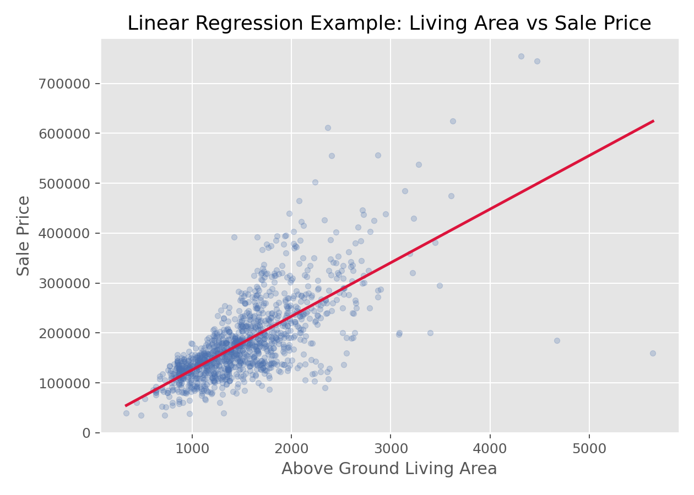

# 线性回归（Linear Regression）

## 1. 方法概览

### 1.1 定义

线性回归通过把连续型结局表示为若干自变量的线性组合，来估计变量与结局之间的方向、大小和不确定性，是医学统计最基础的建模方法之一。

### 1.2 它主要解决什么问题

- 研究问题：一个或多个变量与连续型结局之间存在怎样的平均关联。
- 适用任务：效应估计、协变量调整、预测连续型结局。
- 常见医学场景：分析年龄、治疗、BMI 与血压或实验室指标之间的关系。

### 1.3 直觉理解

线性回归本质上是在找一条“最贴近数据总体趋势”的线或平面，让预测值和真实值之间的平方误差总和最小。系数告诉我们，在其他变量不变时，某变量增加 1 个单位，结局平均变化多少。

## 2. 数学形式

### 2.1 核心公式

$$
\begin{aligned}
Y_i &= \beta_0 + \beta_1X_{i1} + \cdots + \beta_pX_{ip} + \epsilon_i \\
E(\epsilon_i) &= 0 \\
\operatorname{Var}(\epsilon_i) &= \sigma^2 \\
\hat{\boldsymbol{\beta}} &= (\mathbf{X}^\top \mathbf{X})^{-1}\mathbf{X}^\top \mathbf{Y}
\end{aligned}
$$

### 2.2 参数或统计量含义

- $\beta_0$：截距。
- $\beta_j$：在其他变量固定时，第 $j$ 个自变量对结局均值的平均改变。
- $\epsilon_i$：误差项。
- $R^2$：模型解释的总变异比例。

### 2.3 关键假设

- 线性可加结构。
- 观测独立。
- 误差均值为 0。
- 同方差性。
- 小样本推断常额外依赖误差近似正态。

## 3. 数据形式与输入输出

### 3.1 适合的数据形式

- 自变量类型：连续、二分类、多分类哑变量都可。
- 因变量类型：连续型。
- 数据结构：独立个体的表格数据最典型。
- 是否适合高维数据：可用，但变量很多时应考虑正则化。
- 是否适合缺失较多数据：可以，但需先明确缺失处理策略。
- 是否适合删失数据：不适合；删失应转向生存模型。
- 是否适合重复测量数据：普通线性回归不适合，应考虑混合效应模型或 GEE。

### 3.2 示例表格

线性回归最典型的数据形式是“每行一个样本、至少一个连续自变量、一个连续结局变量”的宽表。下面用房价数据举例：

| Id | GrLivArea | OverallQual | Neighborhood | YearBuilt | SalePrice |
| --- | --- | --- | --- | --- | --- |
| 1 | 1710 | 7 | CollgCr | 2003 | 208500 |
| 2 | 1262 | 6 | Veenker | 1976 | 181500 |
| 3 | 1786 | 7 | CollgCr | 2001 | 223500 |
| 4 | 1717 | 7 | Crawfor | 1915 | 140000 |
| 5 | 2198 | 8 | NoRidge | 2000 | 250000 |

### 3.3 输入与产出

#### 输入

- 输入数据：结局变量和若干预测变量。
- 关键变量：结局、自变量、交互项、变换项。
- 需要预处理的内容：缺失处理、分类变量编码、必要时变量变换。

#### 产出

- 模型对象/统计结果：系数估计、标准误、t 值、p 值、$R^2$。
- 参数估计：每个协变量的回归系数。
- 预测结果：个体预测值、残差。
- 不确定性指标：系数置信区间、残差标准误。

## 4. 适用场景

- 适合：连续结局建模、协变量调整、解释型分析。
- 不适合：结局严重偏态且无法合理变换、强非线性未建模、相关数据。
- 使用前需要特别检查的点：残差图、异常值、杠杆点、线性关系、同方差性。

## 5. 实现

### 5.1 Python

常用包：

- `statsmodels`

```python
import pandas as pd
import statsmodels.formula.api as smf

df = pd.DataFrame({
    "sbp": [132, 128, 140, 135, 125, 138],
    "age": [50, 45, 63, 58, 40, 61],
    "bmi": [24.1, 22.5, 28.0, 26.2, 21.8, 27.1]
})

fit = smf.ols("sbp ~ age + bmi", data=df).fit()
print(fit.summary())
print(fit.conf_int())
```

### 5.2 R

常用包：

- `stats`

```r
df <- data.frame(
  sbp = c(132, 128, 140, 135, 125, 138),
  age = c(50, 45, 63, 58, 40, 61),
  bmi = c(24.1, 22.5, 28.0, 26.2, 21.8, 27.1)
)

fit <- lm(sbp ~ age + bmi, data = df)
summary(fit)
confint(fit)
```

## 6. 结果如何解释

- 核心结果看什么：系数方向、大小、区间和模型拟合。
- 每个主要参数如何解释：例如 $\beta_1=0.8$ 可解释为年龄每增加 1 岁，平均收缩压增加 0.8 mmHg，其他变量固定。
- 临床或医学意义如何表达：要结合单位、参考范围和临床阈值解释。
- 常见误读：回归系数是条件平均效应，不自动代表因果效应。

## 7. 推荐可视化

- 散点图加回归线。
- 残差 vs 拟合值图。
- 残差 QQ 图。

### 7.1 图像示例

下图展示居住面积与房价之间的散点关系及拟合直线，是连续结局线性建模的典型可视化方式。



## 8. 优势、局限与常见坑

### 优势

- 系数解释直观。
- 可同时控制多个协变量。
- 是更复杂模型的重要基础。

### 局限

- 对模型设定敏感。
- 对异常值和高杠杆点敏感。
- 只能描述加性线性平均关系。

### 常见坑

- 把相关当因果。
- 不检查残差和异常点。
- 直接把非线性关系硬塞进线性模型而不做变换或样条。

## 9. 与相近方法的区别

- 和 Spearman 相关的区别：Spearman 只度量关联，不做协变量调整。
- 和 ANOVA 的区别：ANOVA 可视为线性回归在分类自变量场景下的特例。
- 应该如何选择：需要控制混杂或估计连续结局效应时用线性回归。

## 10. 医学研究中的典型应用

- 调整年龄、性别、BMI 后评估治疗与连续结局的关系。
- 建立实验室指标预测模型。
- 分析基线因素与随访连续结局之间的关联。

## 11. 相关方法

- [[单因素方差分析（One-Way ANOVA）]]
- [[Spearman秩相关（Spearman Rank Correlation）]]
- [[Logistic回归（Logistic Regression）]]

## 12. 参考资料

- Kutner MH, Nachtsheim CJ, Neter J, Li W. *Applied Linear Statistical Models*. 5th ed. McGraw-Hill Irwin; 2005.
- statsmodels Developers. `statsmodels.regression.linear_model.OLS`. statsmodels API Reference. [https://www.statsmodels.org/stable/generated/statsmodels.regression.linear_model.OLS.html](https://www.statsmodels.org/stable/generated/statsmodels.regression.linear_model.OLS.html) （访问日期：2026-07-02）
- R Core Team. `lm`. R Manual. [https://stat.ethz.ch/R-manual/R-devel/library/stats/html/lm.html](https://stat.ethz.ch/R-manual/R-devel/library/stats/html/lm.html) （访问日期：2026-07-02）
