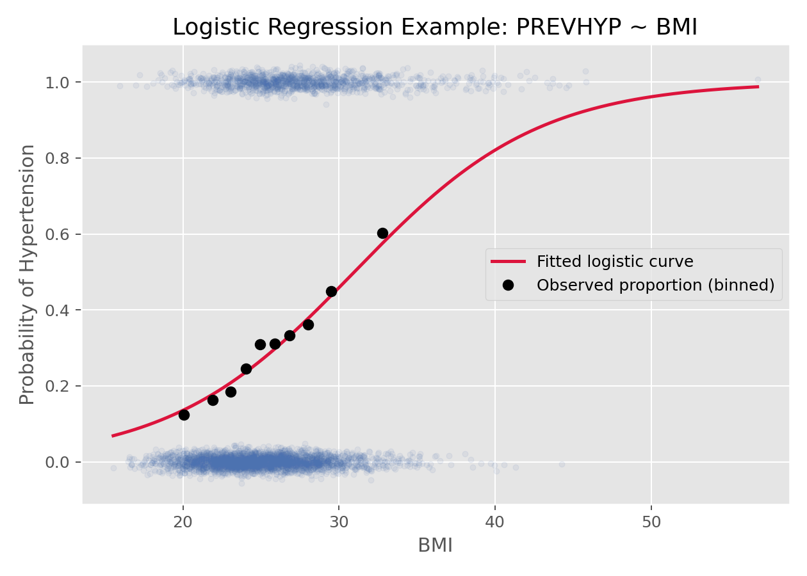

# Logistic回归（Logistic Regression）

## 1. 方法概览

### 1.1 一句话本质

Logistic 回归先把「事件发生的概率」翻译成一个可以取任意实数的量——**对数优势（log-odds）**，再对这个量做普通的线性回归；预测时反向翻译回 0 到 1 的概率。

### 1.2 定义

Logistic 回归是最经典的二分类结局回归模型，属于广义线性模型（GLM）家族，用 logit 连接函数把事件概率与协变量的线性组合联系起来。它既能做**解释**（估计每个因素的比值比 OR），也能做**预测**（输出个体患病概率）。

### 1.3 它主要解决什么问题

- 研究问题：某些因素如何影响一个「是/否」结局发生的概率？
- 适用任务：风险因素分析、二分类预测、OR 估计、临床风险评分。
- 常见医学场景：是否患高血压、术后 30 天是否再入院、是否发生某不良事件。

### 1.4 直觉与类比

把它想成一台「翻译机」。概率被关在 0 到 1 的小盒子里，没法直接用直线去拟合（直线迟早会冲出盒子，给出负概率或大于 1 的概率）。Logistic 回归先把概率翻译成「赔率的对数」——这个量可以从负无穷到正无穷，于是就能像普通回归那样用一条直线去拟合；要报告结果时，再翻译回人能理解的概率。

## 2. 核心思想与原理

### 2.1 它到底在解决什么根本困难

如果直接用线性回归拟合「是否患病」（即令 $p=\beta_0+\beta_1 x$，称线性概率模型），会遇到三个硬伤：预测概率会跑到 $[0,1]$ 之外；残差方差随 $p$ 变化（异方差），最小二乘不再有效；二元结局与自变量本就不是线性关系。根本困难是：**结局是有界的概率，而线性模型的输出是无界的实数，两者尺度对不上。**

### 2.2 关键洞察

用两步搭桥把「有界概率」变成「无界实数」：

1. **概率 → 优势（odds）**：$p/(1-p)$ 把 $[0,1]$ 拉到 $[0,\infty)$。
2. **优势 → 对数优势（log-odds / logit）**：取对数把 $[0,\infty)$ 拉到整个实数轴 $(-\infty,\infty)$。

在对数优势这个「自由」的尺度上做线性回归，再用其反函数（sigmoid）把结果压回概率。这就是整个方法的点子。

### 2.3 与朴素/相邻做法的对比

- 相对**线性概率模型**：Logistic 保证预测概率恒在 $(0,1)$，且方差结构正确。
- 相对 **probit 回归**：两者都做同样的「压缩」，只是连接函数不同（logit 用 logistic 分布，probit 用正态分布）；logit 的系数能直接解释为 log-OR，更常用于医学。
- 相对 **LDA**：LDA 假设各组协变量服从正态；Logistic 不对协变量分布作假设，更稳健。

## 3. 数学形式

### 3.1 核心公式

$$
\begin{aligned}
Y_i &\sim \mathrm{Bernoulli}(\pi_i) \\
\operatorname{logit}(\pi_i) &= \log\frac{\pi_i}{1-\pi_i} = \mathbf{X}_i^\top \boldsymbol{\beta} \\
\pi_i &= \frac{1}{1+\exp(-\mathbf{X}_i^\top \boldsymbol{\beta})}
\end{aligned}
$$

这三行在说：每个人的结局是一次「加权硬币」（伯努利）；这枚硬币正面概率的**对数优势**是协变量的线性组合；把它反解出来，概率就是一条 S 形曲线（sigmoid）。

### 3.2 推导脉络

- 从 $\operatorname{logit}(\pi)=\eta$ 出发，$\eta=\mathbf{X}^\top\boldsymbol{\beta}$ 是「线性预测子」。
- 解出 $\pi=\dfrac{e^{\eta}}{1+e^{\eta}}$，即 sigmoid，天然落在 $(0,1)$。
- 参数不用最小二乘估计（残差非正态、异方差），而用**最大似然**：写出所有观测的伯努利似然 $\prod_i \pi_i^{y_i}(1-\pi_i)^{1-y_i}$，取对数得对数似然，对 $\boldsymbol{\beta}$ 求极大。该目标是凸的，用 Newton-Raphson / IRLS 迭代求解，保证收敛到唯一解（除非发生完全分离）。

### 3.3 参数与统计量含义

- $\pi_i$：第 $i$ 个个体发生事件的概率。
- $\beta_j$：协变量 $x_j$ 每增加 1 单位，**对数优势**的增量。
- $\exp(\beta_j)$：**比值比（odds ratio, OR）**——其他变量固定时，$x_j$ 增加 1 单位使事件优势变为原来的几倍。
- 对数似然、Wald 检验、似然比检验（LRT）用于系数显著性与模型比较。

### 3.4 关键假设（含违反后果）

| 假设 | 含义 | 违反后会怎样 | 如何粗查 |
| --- | --- | --- | --- |
| 观测独立 | 个体之间无关联 | 标准误低估、假阳性 | 研究设计；重复测量改用 GLMM/GEE |
| logit 线性 | 连续变量与 log-odds 呈线性 | 效应估计有偏 | 分箱看趋势、Box-Tidwell、加样条 |
| 无完全分离 | 不存在能完美分类的变量 | 系数发散、不收敛 | 看是否出现极大系数/标准误 |
| 无强共线性 | 协变量不高度相关 | 系数不稳、标准误膨胀 | VIF |

## 4. 手把手算例

用一个 2×2 表，亲手看到「Logistic 系数 = log(OR)」。设暴露 $X$（吸烟=1）与结局 $Y$（患病=1）：

| | 患病 Y=1 | 未患 Y=0 | 合计 |
| --- | --- | --- | --- |
| 吸烟 X=1 | 40 | 60 | 100 |
| 不吸 X=0 | 20 | 80 | 100 |

**一步步计算：**

- 患病优势（吸烟组）：$\mathrm{odds}_1=40/60=0.667$；（不吸组）：$\mathrm{odds}_0=20/80=0.25$。
- 比值比：$\mathrm{OR}=0.667/0.25=2.67$；对数优势比 $\log(2.67)=0.98$。
- 拟合单变量模型 $\operatorname{logit}(\pi)=\beta_0+\beta_1 X$ 会得到：
  - $\beta_0=\log(\mathrm{odds}_0)=\log(0.25)=-1.386$（不吸烟者的基线对数优势）。
  - $\beta_1=\log(\mathrm{OR})=0.98$，于是 $\exp(\beta_1)=2.67$，正是 OR。
- 反解吸烟者概率：$\eta=\beta_0+\beta_1=-1.386+0.98=-0.405$，$\pi=1/(1+e^{0.405})=0.40$。

**结论：** 模型精确还原了观测比例（吸烟组 40/100=0.40），并且**斜率的指数就是比值比**。这说明 Logistic 回归不是黑箱——在最简单情形下它就是把列联表的优势结构写成了回归形式，多变量时再推广为「调整其他因素后的 OR」。

## 5. 数据形式与输入输出

### 5.1 适合的数据形式

- 自变量类型：连续、二分类、多分类都可。
- 因变量类型：二分类。
- 数据结构：个体级二元数据，或分组的 binomial 计数数据。
- 是否适合高维数据：可以，高维时结合 L1/L2 正则化。
- 是否适合缺失较多数据：可以，但需先明确缺失机制与处理策略。
- 是否适合删失数据：不适合；删失应转向生存模型。
- 是否适合重复测量数据：普通 Logistic 不适合，应用 GLMM 或 GEE。

### 5.2 示例表格

以 `Framingham_data.csv` 基线样本为例，`PREVHYP` 为二分类结局，`BMI`、`SEX`、`AGE_group` 为协变量：

| RANDID | SEX | AGE_group | BMI | PREVHYP | TOTCHOL |
| --- | --- | --- | --- | --- | --- |
| 2448 | 0 | 1 | 26.97 | 0 | 195.0 |
| 6238 | 1 | 1 | 28.73 | 0 | 250.0 |
| 10552 | 1 | 2 | 28.58 | 1 | 225.0 |
| 11252 | 1 | 1 | 23.10 | 0 | 285.0 |

### 5.3 输入与产出

#### 输入

- 输入数据：二分类结局与协变量矩阵。
- 关键变量：结局编码、协变量、交互项、分组变量。
- 需要预处理的内容：缺失处理、分类变量编码、必要时标准化。

#### 产出

- 模型对象/统计结果：系数、标准误、Wald / 似然比检验。
- 参数估计：log-odds 系数与 OR。
- 预测结果：个体事件概率。
- 不确定性指标：标准误、OR 区间、预测概率区间。

## 6. 适用场景

- 适合：二元疾病结局、不良事件发生、风险预测与因素分析。
- 不适合：计数结局（用 Poisson）、时间到事件（用 Cox）、重复测量（用 GLMM/GEE）。
- 使用前需要特别检查的点：类别不平衡、logit 线性、共线性、完全分离。

## 7. 实现

### 7.1 Python

常用包：

- `statsmodels`（做推断、看 OR 与 p 值）
- `scikit-learn`（做预测、上正则化）

```python
import pandas as pd
import statsmodels.formula.api as smf
import numpy as np

df = pd.read_csv("Framingham_data.csv")
df = df[df["PERIOD"] == 1][["BMI", "SEX", "PREVHYP"]].dropna()

fit = smf.logit("PREVHYP ~ BMI + C(SEX)", data=df).fit()
print(fit.summary())
print(np.exp(fit.params))          # 比值比 OR
print(np.exp(fit.conf_int()))      # OR 的 95% 置信区间
```

### 7.2 R

常用包：

- `stats`（自带 `glm`）

```r
df <- na.omit(subset(df, PERIOD == 1, select = c(BMI, SEX, PREVHYP)))
fit <- glm(PREVHYP ~ BMI + factor(SEX),
           family = binomial(link = "logit"), data = df)
summary(fit)
exp(cbind(OR = coef(fit), confint(fit)))   # OR 及其 95% CI
```

## 8. 结果如何解读

- 核心结果看什么：系数方向、OR 与其置信区间是否跨过 1、预测概率。
- 每个主要参数如何解读：若 $\exp(\beta_{\mathrm{BMI}})=1.10$，即 BMI 每增加 1 单位，患病**优势**上升约 10%（在其他变量固定时）。
- 临床或医学意义如何表达：OR 要与基线风险、绝对概率一起讲；OR=2 在低风险人群与高风险人群意味着的绝对风险差别很大。
- 常见误读：把 OR 当成风险比（RR）。仅当结局罕见（患病率 <10%）时 OR≈RR，否则 OR 会夸大效应。

## 9. 假设诊断与稳健性

- 检验 logit 线性：把连续变量分箱后看对数优势是否近似直线，或用 Box-Tidwell 检验，或直接对该变量加限制性立方样条。
- 检验拟合优度与校准：Hosmer-Lemeshow 检验、校准曲线；区分度看 ROC/AUC。
- 完全（准）分离的信号：某系数或标准误异常巨大、模型不收敛——可用 Firth 惩罚似然或贝叶斯先验缓解。
- 影响点：看标准化残差与 Cook 距离，警惕单个观测主导结果。
- 相关数据（同一患者多次测量、多中心）标准误会被低估，改用 GLMM 或 GEE。

## 10. 推荐可视化

- 预测概率随某连续变量变化的 S 形曲线（叠加分箱后的观测比例，直观看拟合好坏）。
- OR 森林图（各协变量的 OR 与置信区间）。
- 校准曲线与 ROC 曲线（评估预测模型）。

### 10.1 图像示例

下图展示高血压状态随 BMI 变化的拟合 Logistic 曲线，以及分箱后的观测比例。



## 11. 优势、局限与常见坑

### 优势

- 概率建模自然，输出可直接作为风险。
- 系数可解释为 OR，临床沟通友好。
- 是医学观察性研究与预测模型的核心工具，软件与诊断完备。

### 局限

- 系数在 log-odds 尺度，不如均值差直观。
- 完全分离、小样本时估计不稳。
- 只建模均值结构，不处理相关数据。

### 常见坑

- 把 OR 当风险比，在常见结局下夸大效应。
- 忽略类别不平衡与阈值选择，只看准确率。
- 不检查连续变量的 logit 线性，硬塞进线性项。

## 12. 与相近方法的区别

- 和**线性概率模型**：Logistic 保证概率在 $(0,1)$、方差结构正确；线性概率模型解释简单但会出界。
- 和 **Poisson 回归**：结局是二元用 Logistic，结局是计数/率用 Poisson。
- 和 **Cox 模型**：有随访时间与删失、关心「何时发生」用 Cox；只关心「是否发生」用 Logistic。
- 如何选择：结局二元且无时间维度 → Logistic；结局罕见且想直接要 RR → log-binomial 或 Poisson 带稳健方差。

## 13. 医学研究中的典型应用

- 病例对照研究中估计暴露与疾病的 OR。
- 构建术后并发症、再入院等风险预测模型。
- 校正混杂后评估某治疗与二元结局的关联。

## 14. 关键术语

- **优势（Odds）**：事件发生与不发生的比 $p/(1-p)$；如 0.25 表示「1 次发生对 4 次不发生」。
- **比值比（Odds Ratio, OR）**：两组优势之比，Logistic 系数的指数；OR=1 表示无关联。
- **对数优势 / logit（Log-odds）**：优势取对数，取值可为任意实数，是回归实际建模的量。
- **sigmoid 函数**：$1/(1+e^{-\eta})$，把实数压回 $(0,1)$ 概率的 S 形曲线。
- **最大似然估计（MLE）**：选择使观测数据出现概率最大的参数。
- **完全分离（Separation）**：某变量能完美区分结局，导致系数发散的病态情形。

## 15. 相关方法

- [[广义线性模型（Generalized Linear Model, GLM）]]
- [[多项Logistic回归（Multinomial Logistic Regression）]]
- [[有序Logistic回归（Ordinal Logistic Regression）]]
- [[Poisson回归（Poisson Regression）]]
- [[ROC曲线与AUC（Receiver Operating Characteristic and AUC）]]

## 16. 参考资料

- Hosmer DW, Lemeshow S, Sturdivant RX. *Applied Logistic Regression*. 3rd ed. Wiley; 2013.
- Harrell FE. *Regression Modeling Strategies*. 2nd ed. Springer; 2015.
- Agresti A. *Categorical Data Analysis*. 3rd ed. Wiley; 2013.
