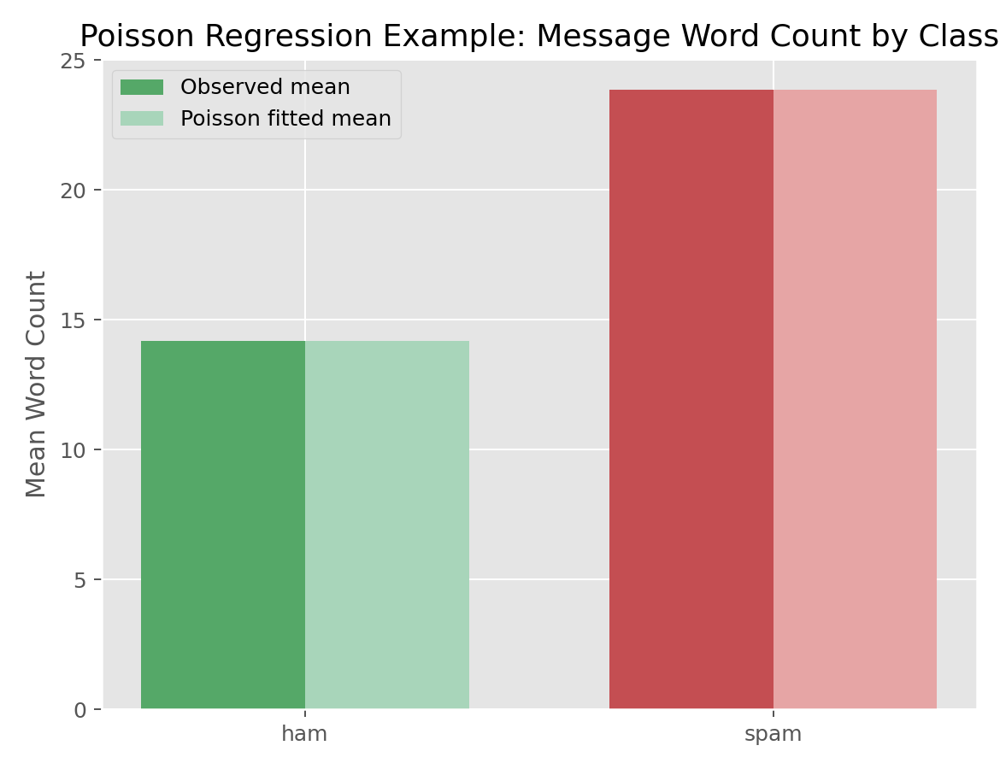

# Poisson回归（Poisson Regression）

## 1. 方法概览

### 1.1 定义

Poisson 回归用于建模非负整数计数结局，核心思想是在 log 尺度上把期望计数表示成协变量的线性组合。

### 1.2 它主要解决什么问题

- 研究问题：哪些因素会影响某类事件“发生多少次”。
- 适用任务：计数结局建模、率建模、带 offset 的发生率建模。
- 常见医学场景：住院次数、随访期间事件次数、某类短信词数、病房感染事件率。

### 1.3 直觉理解

Poisson 回归不是在原始计数上加减，而是在 log 尺度上建模，因此协变量通常对应“计数乘上多少倍”的解释，而不是“多几个”。

## 2. 数学形式

### 2.1 核心公式

$$
\begin{aligned}
Y_i &\sim \mathrm{Poisson}(\mu_i) \\
\log(\mu_i) &= \mathbf{X}_i^\top \boldsymbol{\beta}
\end{aligned}
$$

若建模率（rate），则常写成：

$$
\log(\mu_i) = \log(t_i) + \mathbf{X}_i^\top \boldsymbol{\beta}
$$

其中 $\log(t_i)$ 是 offset。

### 2.2 参数或统计量含义

- $\mu_i$：第 $i$ 个观测的期望计数。
- $\beta_j$：协变量在 log-mean 尺度上的效应。
- $\exp(\beta_j)$：协变量每增加 1 单位，对期望计数的乘法因子。
- offset：暴露时间、人口规模、观察窗口等已知基准量。

### 2.3 关键假设

- 观测独立。
- 结局是计数型非负整数。
- 在标准 Poisson 假设下，$\mathrm{Var}(Y_i)=E(Y_i)=\mu_i$。
- log 尺度上的均值模型正确。

## 3. 数据形式与输入输出

### 3.1 适合的数据形式

- 自变量类型：连续、二分类、多分类都可。
- 因变量类型：计数型。
- 数据结构：独立样本宽表，或聚合后的计数表。
- 是否适合高维数据：可以，但常需正则化或特征筛选。
- 是否适合缺失较多数据：需先明确缺失处理策略。
- 是否适合删失数据：不适合；删失事件数据应转向生存分析。
- 是否适合重复测量数据：普通 Poisson 回归不适合，应考虑 GEE 或 GLMM。

### 3.2 示例表格

为了给计数结局一个简单而直观的示例，下面用短信文本中的 `word_count`（词数）作为计数型响应，`label` 作为分组变量：

| label | word_count | message_length |
| --- | --- | --- |
| ham | 20 | 111 |
| ham | 6 | 29 |
| spam | 28 | 155 |
| ham | 11 | 49 |
| ham | 13 | 61 |

### 3.3 输入与产出

#### 输入

- 输入数据：计数型结局和协变量。
- 关键变量：计数结局、分组变量、连续预测变量、exposure/offset。
- 需要预处理的内容：缺失处理、必要时构造 rate 的 offset。

#### 产出

- 模型对象/统计结果：系数估计、标准误、deviance、Pearson 统计量。
- 参数估计：log-rate 系数或 rate ratio。
- 预测结果：期望计数或期望率。
- 不确定性指标：标准误、区间估计、稳健方差。

## 4. 适用场景

- 适合：计数结局、事件率、暴露时间不同的率比较。
- 不适合：连续结局、极端过度离散而又不做修正的计数数据。
- 使用前需要特别检查的点：是否存在大量 0、是否有过度离散、是否需要 offset。

## 5. 实现

### 5.1 Python

常用包：

- `scikit-learn`
- `statsmodels`

```python
import pandas as pd
from sklearn.linear_model import PoissonRegressor

df = pd.read_csv("spam.csv", encoding="ISO-8859-1")[["v1", "v2"]]
df["word_count"] = df["v2"].astype(str).str.split().str.len()
df["is_spam"] = (df["v1"] == "spam").astype(int)

X = df[["is_spam"]]
y = df["word_count"]

fit = PoissonRegressor(alpha=0, max_iter=1000)
fit.fit(X, y)
print(fit.intercept_, fit.coef_)
print(fit.predict([[0], [1]]))
```

### 5.2 R

常用包：

- `stats`

```r
df$word_count <- lengths(strsplit(df$message, " "))
fit <- glm(word_count ~ label, family = poisson(link = "log"), data = df)
summary(fit)
exp(coef(fit))  # rate ratios
```

## 6. 结果如何解释

- 核心结果看什么：系数符号、rate ratio、deviance 与过度离散迹象。
- 每个主要参数如何解释：若 $\exp(\beta)=1.20$，可解释为协变量增加 1 单位时，期望计数增加 20%。
- 临床或医学意义如何表达：更适合解释“发生次数”或“发生率倍数变化”。
- 常见误读：Poisson 系数不是均值差；rate ratio 也不是 odds ratio。

## 7. 推荐可视化

- 组间均值计数比较图。
- 观测均值 vs 拟合均值图。
- rate 或 count 的分组箱线图 / 散点图。

### 7.1 图像示例

下图比较不同短信类别下词数的观测均值与 Poisson 模型拟合均值。



## 8. 优势、局限与常见坑

### 优势

- 对计数结局解释自然。
- 可方便扩展到率建模和 offset。
- 与 GLM 框架完全兼容。

### 局限

- 标准 Poisson 假设要求均值和方差相等。
- 过度离散时标准误会偏小。
- 对零膨胀数据不一定合适。

### 常见坑

- 把连续变量硬当计数变量。
- 忽略过度离散。
- 忘记在率模型中加入 exposure offset。

## 9. 与相近方法的区别

- 和 Logistic 回归的区别：Poisson 建模计数或率，Logistic 建模事件概率。
- 和负二项回归的区别：负二项回归额外允许方差大于均值。
- 和 Quasi-Likelihood 的区别：Quasi-Likelihood 保持同样的均值模型，但允许更灵活的方差结构。

## 10. 医学研究中的典型应用

- 建模随访期间住院次数。
- 建模不同暴露时间下的事件率。
- 描述文本、行为或服务事件的发生频率。

## 11. 相关方法

- [[广义线性模型（Generalized Linear Model, GLM）]]
- [[Logistic回归（Logistic Regression）]]
- [[Quasi-Likelihood与过度离散（Quasi-Likelihood and Overdispersion）]]

## 12. 参考资料

- Hilbe JM. *Modeling Count Data*. Cambridge University Press; 2014.
- scikit-learn Developers. `sklearn.linear_model.PoissonRegressor`. scikit-learn API Reference. [https://scikit-learn.org/stable/modules/generated/sklearn.linear_model.PoissonRegressor.html](https://scikit-learn.org/stable/modules/generated/sklearn.linear_model.PoissonRegressor.html) （访问日期：2026-07-02）
- R Core Team. `glm`. R Manual. [https://stat.ethz.ch/R-manual/R-devel/library/stats/html/glm.html](https://stat.ethz.ch/R-manual/R-devel/library/stats/html/glm.html) （访问日期：2026-07-02）
- Venables WN, Ripley BD. `glm.nb`. MASS Manual. [https://stat.ethz.ch/R-manual/R-devel/library/MASS/html/glm.nb.html](https://stat.ethz.ch/R-manual/R-devel/library/MASS/html/glm.nb.html) （访问日期：2026-07-02）
