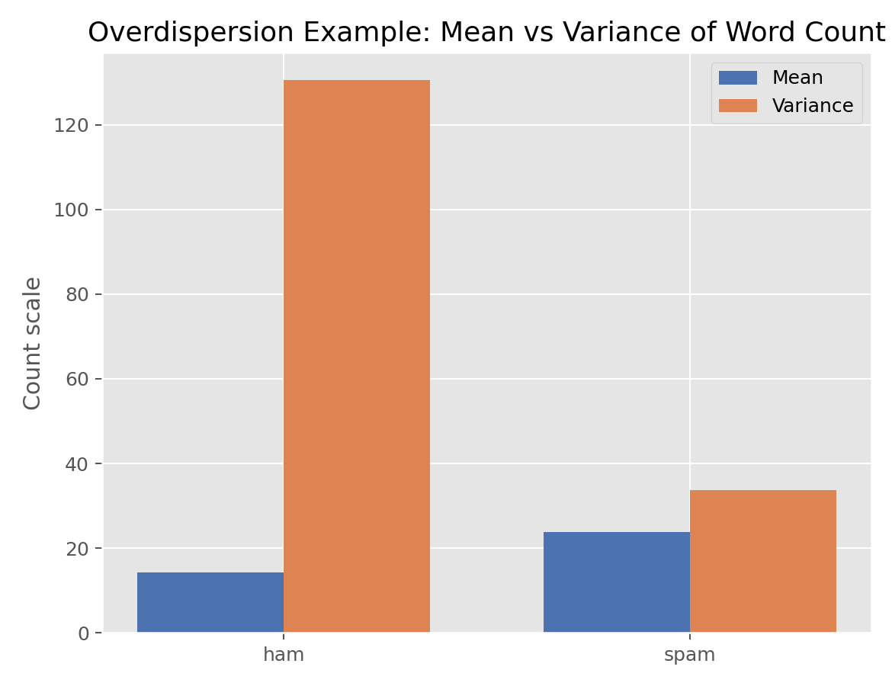

# Quasi-Likelihood与过度离散（Quasi-Likelihood and Overdispersion）

## 1. 方法概览

### 1.1 定义

Quasi-Likelihood 是 GLM 的半参数扩展，不要求完整指定响应分布，只需要指定均值模型和方差模型，因此常被用来处理过度离散和稳健方差估计问题。

### 1.2 它主要解决什么问题

- 研究问题：当均值模型大体正确，但方差结构不满足标准 Poisson / Binomial 假设时，如何仍然做有效推断。
- 适用任务：过度离散计数数据、分组二项数据、稳健标准误修正。
- 常见医学场景：Poisson 回归中方差明显大于均值，或 grouped binomial 数据中组内异质性较强。

### 1.3 直觉理解

Quasi-Likelihood 的关键思想是：如果我最关心的是均值关系，那就不强迫自己完全相信某个分布，只要把均值和方差的大体规律建好，就仍然能估计回归系数并修正标准误。

## 2. 数学形式

### 2.1 核心公式

$$
\begin{aligned}
E(Y_i) &= \mu_i(\boldsymbol{\beta}) = g^{-1}(\mathbf{X}_i^\top \boldsymbol{\beta}) \\
\mathrm{Var}(Y_i) &= \phi V(\mu_i) \\
U_j(\boldsymbol{\beta}) &= \sum_{i=1}^n \frac{Y_i-\mu_i}{\phi V(\mu_i)}\frac{\partial \mu_i}{\partial \beta_j} = 0
\end{aligned}
$$

### 2.2 参数或统计量含义

- $\mu_i$：均值模型。
- $V(\mu_i)$：方差函数。
- $\phi$：离散参数；$\phi>1$ 常提示过度离散。
- robust / sandwich variance：即使方差模型写错，也能在大样本下给出稳健标准误。

### 2.3 关键假设

- 均值模型正确是最关键前提。
- 不必完整指定响应分布。
- 稳健方差通常依赖较大样本近似。

## 3. 数据形式与输入输出

### 3.1 适合的数据形式

- 自变量类型：连续、二分类、多分类都可。
- 因变量类型：计数型或 grouped binary。
- 数据结构：独立样本宽表，或按组聚合的计数 / 比例表。
- 是否适合高维数据：可扩展，但不是高维首选。
- 是否适合缺失较多数据：可用，但需先处理缺失。
- 是否适合删失数据：不适合。
- 是否适合重复测量数据：其思想可推广到 GEE。

### 3.2 示例表格

下面用短信数据中的 `word_count` 演示“计数结局 + 方差可能大于均值”的数据形式：

| label | word_count | message_length |
| --- | --- | --- |
| ham | 20 | 111 |
| ham | 6 | 29 |
| spam | 28 | 155 |
| ham | 11 | 49 |
| ham | 13 | 61 |

按标签分组后，`word_count` 的均值和方差分别为：

| label | mean(word_count) | var(word_count) |
| --- | --- | --- |
| ham | 14.20 | 130.52 |
| spam | 23.85 | 33.78 |

可以看到两组里方差都大于均值，存在过度离散迹象。

### 3.3 输入与产出

#### 输入

- 输入数据：计数或 grouped binary 数据。
- 关键变量：均值模型中的协变量、方差函数选择、是否使用稳健方差。
- 需要预处理的内容：缺失处理、必要时构造 grouped data。

#### 产出

- 模型对象/统计结果：回归系数、稳健标准误、离散参数估计。
- 参数估计：均值模型中的 $\boldsymbol{\beta}$。
- 预测结果：均值或率。
- 不确定性指标：quasi-SE、sandwich variance、Pearson $\chi^2$。

## 4. 适用场景

- 适合：Poisson 或 grouped binomial 模型出现过度离散时。
- 不适合：完全不知道均值模型是否合理时；极小样本。
- 使用前需要特别检查的点：Pearson 统计量、deviance、残差、稳健 SE 与模型化 SE 的差异。

## 5. 实现

### 5.1 Python

常用包：

- `statsmodels`

```python
import statsmodels.api as sm

# practical option in Python:
# fit a Poisson GLM and request robust covariance
model = sm.GLM(y, X, family=sm.families.Poisson())
result = model.fit(cov_type="HC0")
print(result.summary())
print(result.pearson_chi2 / result.df_resid)  # rough overdispersion check
```

### 5.2 R

常用包：

- `stats`

```r
# count outcome with overdispersion
fit_qp <- glm(y ~ x, family = quasipoisson(link = "log"), data = df)
summary(fit_qp)

# grouped binary with overdispersion
fit_qb <- glm(cbind(success, failure) ~ x, family = quasibinomial(link = "logit"), data = df)
summary(fit_qb)
```

## 6. 结果如何解释

- 核心结果看什么：系数通常和对应的 Poisson / Binomial 模型一致，但标准误会改变。
- 每个主要参数如何解释：解释方式仍取决于所用 link；变化主要在方差和推断层面。
- 临床或医学意义如何表达：可强调“效应方向稳定，但不确定性比 naive GLM 更大”。
- 常见误读：Quasi-Likelihood 修正的是推断，不一定改变点估计。

## 7. 推荐可视化

- 均值与方差对比图。
- Pearson 残差图。
- 观测均值和拟合均值图。

### 7.1 图像示例

下图对比短信词数在不同类别下的均值和方差，用来直观说明“过度离散”这一现象。



## 8. 优势、局限与常见坑

### 优势

- 比完整分布建模更稳健。
- 适合修正过度离散带来的标准误低估。
- 是 GEE 的重要理论基础。

### 局限

- 不提供完整似然，因此 AIC 等似然指标不总能直接用。
- 样本太小时稳健方差可能不稳定。
- 不能替代对均值模型错误设定的修复。

### 常见坑

- 只看过度离散，不检查均值模型本身是否错。
- 把 quasi 模型和负二项回归混为一谈。
- 在二元个体级数据上谈“过度离散”而忽略 grouped / clustered 结构。

## 9. 与相近方法的区别

- 和负二项回归的区别：负二项回归完整指定了一个更灵活的计数分布；Quasi-Likelihood 只指定前两阶矩。
- 和 GEE 的区别：GEE 把 quasi-likelihood 思想扩展到相关数据。
- 应该如何选择：独立计数数据出现过度离散时，可优先考虑 quasi-Poisson 或负二项；相关数据则更常转向 GEE。

## 10. 医学研究中的典型应用

- 修正 Poisson 回归中过度离散导致的 SE 偏小。
- grouped binary 数据中的稳健推断。
- 作为 GEE 与 sandwich variance 的理论入门。

## 11. 相关方法

- [[Poisson回归（Poisson Regression）]]
- [[广义线性模型（Generalized Linear Model, GLM）]]
- [[广义估计方程（Generalized Estimating Equations, GEE）]]

## 12. 参考资料

- McCullagh P, Nelder JA. *Generalized Linear Models*. 2nd ed. Chapman & Hall; 1989.
- statsmodels Developers. `statsmodels.genmod.generalized_linear_model.GLM`. statsmodels API Reference. [https://www.statsmodels.org/stable/generated/statsmodels.genmod.generalized_linear_model.GLM.html](https://www.statsmodels.org/stable/generated/statsmodels.genmod.generalized_linear_model.GLM.html) （访问日期：2026-07-02）
- R Core Team. `glm`. R Manual. [https://stat.ethz.ch/R-manual/R-devel/library/stats/html/glm.html](https://stat.ethz.ch/R-manual/R-devel/library/stats/html/glm.html) （访问日期：2026-07-02）
