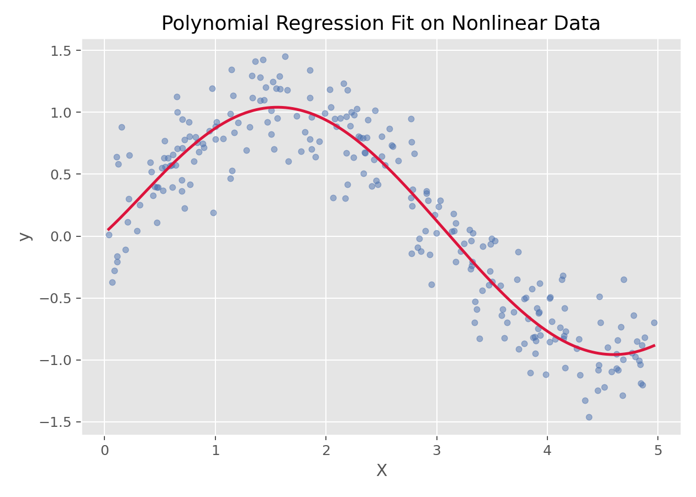

# 多项式回归（Polynomial Regression）

## 1. 方法概览

### 1.1 定义

多项式回归是在普通线性回归的基础上加入自变量的高次项，从而用一条更灵活的曲线来拟合非线性关系。

### 1.2 它主要解决什么问题

- 研究问题：当变量关系明显不是直线而是弯曲趋势时，如何在仍保持较好可解释性的前提下做回归建模。
- 适用任务：平滑非线性关系拟合、低维连续结局预测。
- 常见医学场景：剂量-反应曲线、年龄与风险评分的非线性变化、某些生物标志物的 U 型或弯曲关系。

### 1.3 直觉理解

多项式回归本质上还是线性回归，只不过把原始变量扩展成了 `x, x^2, x^3 ...`。它不是改了“求解方式”，而是改了“输入特征表示”。

## 2. 数学形式

### 2.1 核心公式

$$
y = \beta_0 + \beta_1 x + \beta_2 x^2 + \cdots + \beta_d x^d + \epsilon
$$

矩阵形式下仍可写作：

$$
\mathbf{y} = \mathbf{X}\boldsymbol{\beta} + \boldsymbol{\epsilon}
$$

其中设计矩阵 $\mathbf{X}$ 包含多项式扩展后的列。

### 2.2 参数或统计量含义

- $d$：多项式阶数。
- $\beta_j$：第 $j$ 次项的系数。
- 高次项：负责给模型引入弯曲能力。

### 2.3 关键假设

- 结局为连续型。
- 非线性关系可以被低到中等阶的多项式近似。
- 阶数不能过高，否则容易过拟合和数值不稳定。

## 3. 数据形式与输入输出

### 3.1 适合的数据形式

- 自变量类型：一个或少数几个连续变量最合适。
- 因变量类型：连续型。
- 数据结构：宽表数据，低维连续变量回归。
- 是否适合高维数据：不适合默认用于高维。
- 是否适合缺失较多数据：需先处理缺失值。
- 是否适合删失数据：不适合。
- 是否适合重复测量数据：不直接适合。

### 3.2 示例表格

一个典型的一维非线性拟合表格如下：

| X | y |
| --- | --- |
| 0.026 | 0.045 |
| 1.126 | 0.735 |
| 1.392 | 0.979 |
| 1.501 | 1.123 |
| 1.515 | 0.756 |
| 2.340 | 0.636 |

### 3.3 输入与产出

#### 输入

- 输入数据：连续型结局和一个或多个连续特征。
- 关键变量：多项式阶数 `degree`。
- 需要预处理的内容：特征扩展、必要时标准化、训练测试集划分。

#### 产出

- 模型对象/统计结果：多项式项系数、最佳阶数、预测曲线。
- 参数估计：各阶次项的系数。
- 预测结果：连续型预测值和拟合曲线。
- 不确定性指标：测试集误差、交叉验证误差、过拟合风险。

## 4. 适用场景

- 适合：低维、平滑的非线性关系。
- 不适合：高维复杂非线性、大样本高噪声且局部结构复杂的场景。
- 使用前需要特别检查的点：阶数选择、过拟合、数值稳定性。

## 5. 实现

### 5.1 Python

常用包：

- `scikit-learn`

```python
from sklearn.pipeline import make_pipeline
from sklearn.preprocessing import PolynomialFeatures
from sklearn.linear_model import LinearRegression

fit = make_pipeline(
    PolynomialFeatures(degree=3, include_bias=False),
    LinearRegression()
)
fit.fit(X_train, y_train)
y_pred = fit.predict(X_test)
```

### 5.2 R

常用包：

- `stats`

```r
fit <- lm(y ~ poly(x, degree = 3, raw = TRUE), data = df)
summary(fit)
```

## 6. 结果如何解释

- 核心结果看什么：曲线形状、预测性能、阶数是否过高。
- 每个主要参数如何解释：单个高次项系数通常不如整体曲线形状重要。
- 临床或医学意义如何表达：更适合解释“趋势形状”，而不是逐个高次项系数。
- 常见误读：高 $R^2$ 不一定是好事，可能只是高阶过拟合。

## 7. 推荐可视化

- 原始散点图 + 拟合曲线。
- 不同阶数模型对比图。
- 残差图。

### 7.1 图像示例

下图展示一组非线性数据上的多项式回归拟合结果，体现了它对弯曲趋势的刻画能力。



## 8. 优势、局限与常见坑

### 优势

- 简单、直观、易解释。
- 能处理平滑非线性关系。
- 与线性回归求解框架兼容。

### 局限

- 高阶时容易过拟合。
- 数值稳定性会变差。
- 对高维问题不友好。

### 常见坑

- 盲目提高阶数。
- 不做验证就只看训练集拟合效果。
- 把局部复杂非线性都试图交给多项式处理。

## 9. 与相近方法的区别

- 和线性回归的区别：多项式回归通过特征扩展引入非线性。
- 和样条回归的区别：多项式回归是全局曲线，样条更适合局部灵活变化。
- 和 SVR 的区别：SVR 更适合复杂非线性，但解释性更弱。

## 10. 医学研究中的典型应用

- 剂量-反应关系拟合。
- 年龄与某连续风险指标之间的弯曲关系建模。
- 低维连续变量的非线性预测。

## 11. 相关方法

- [[线性回归（Linear Regression）]]
- [[Ridge回归（Ridge Regression）]]
- [[支持向量回归（Support Vector Regression, SVR）]]

## 12. 参考资料

- Hastie T, Tibshirani R, Friedman J. *The Elements of Statistical Learning*. 2nd ed. Springer; 2009.
- scikit-learn Developers. `sklearn.preprocessing.PolynomialFeatures`. scikit-learn API Reference. [https://scikit-learn.org/stable/modules/generated/sklearn.preprocessing.PolynomialFeatures.html](https://scikit-learn.org/stable/modules/generated/sklearn.preprocessing.PolynomialFeatures.html) （访问日期：2026-07-02）
- R Core Team. `poly`. R Manual. [https://stat.ethz.ch/R-manual/R-devel/library/stats/html/poly.html](https://stat.ethz.ch/R-manual/R-devel/library/stats/html/poly.html) （访问日期：2026-07-02）
