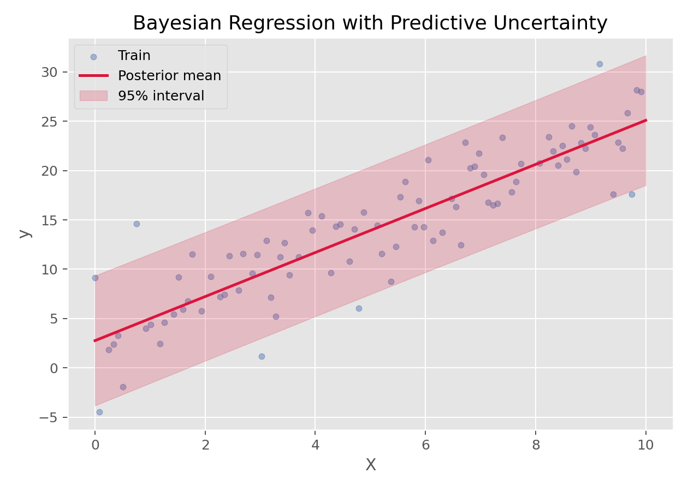

# 贝叶斯回归（Bayesian Regression）

## 1. 方法概览

### 1.1 定义

贝叶斯回归是一类把回归参数本身视为随机变量、通过先验分布和观测数据共同得到后验分布的回归方法。

### 1.2 它主要解决什么问题

- 研究问题：不仅想得到一个预测值，还想量化参数和预测的不确定性。
- 适用任务：小样本回归、带先验信息的建模、不确定性量化。
- 常见医学场景：样本量有限时的风险建模、临床先验知识较强的建模问题、需要置信带而非单点估计的分析。

### 1.3 直觉理解

普通回归通常告诉你“最好的一个答案”，而贝叶斯回归更像是在说“哪些答案更可能、这些答案的不确定性有多大”。

## 2. 数学形式

### 2.1 核心公式

在线性高斯设定下：

$$
y = X\beta + \epsilon,\qquad \epsilon \sim N(0,\sigma^2 I)
$$

给参数施加先验：

$$
p(\beta)=N(\mu_0,\Sigma_0)
$$

则后验分布为：

$$
p(\beta\mid X,y)=N(\mu_n,\Sigma_n)
$$

其中

$$
\Sigma_n = \left(\Sigma_0^{-1} + \frac{1}{\sigma^2}X^\top X\right)^{-1}
$$

$$
\mu_n = \Sigma_n\left(\Sigma_0^{-1}\mu_0 + \frac{1}{\sigma^2}X^\top y\right)
$$

### 2.2 参数或统计量含义

- prior：参数在观测数据前的信念。
- likelihood：给定参数时数据出现的概率。
- posterior：结合数据后对参数的新认知。
- predictive distribution：对新样本预测时得到的是分布，而不是单点值。

### 2.3 关键假设

- 模型结构合理。
- 先验分布有明确含义或合理默认设定。
- 结局通常是连续型，且误差可近似正态。

## 3. 数据形式与输入输出

### 3.1 适合的数据形式

- 自变量类型：连续和编码后的分类变量。
- 因变量类型：连续型。
- 数据结构：宽表数据。
- 是否适合高维数据：可扩展，但高维时先验选择更关键。
- 是否适合缺失较多数据：可建模，但通常需更完整的贝叶斯框架。
- 是否适合删失数据：一般需要专门扩展。
- 是否适合重复测量数据：可扩展到贝叶斯层级模型。

### 3.2 示例表格

一个典型的连续结局回归表格如下：

| OverallQual | GrLivArea | GarageCars | TotalBsmtSF | YearBuilt | SalePrice |
| --- | --- | --- | --- | --- | --- |
| 7 | 1710 | 2 | 856 | 2003 | 208500 |
| 6 | 1262 | 2 | 1262 | 1976 | 181500 |
| 7 | 1786 | 2 | 920 | 2001 | 223500 |
| 7 | 1717 | 3 | 756 | 1915 | 140000 |
| 8 | 2198 | 3 | 1145 | 2000 | 250000 |

### 3.3 输入与产出

#### 输入

- 输入数据：连续结局、特征矩阵、先验设定。
- 关键变量：先验参数、噪声水平、模型结构。
- 需要预处理的内容：标准化、缺失处理、训练测试集划分。

#### 产出

- 模型对象/统计结果：后验均值、后验方差、预测分布。
- 参数估计：回归系数的后验分布。
- 预测结果：预测均值与区间。
- 不确定性指标：参数区间、预测区间。

## 4. 适用场景

- 适合：小样本、先验信息充分、特别重视不确定性量化的场景。
- 不适合：只想快速得到一个点预测且对解释不敏感的场景。
- 使用前需要特别检查的点：先验是否合理、结果对先验是否敏感。

## 5. 实现

### 5.1 Python

常用包：

- `scikit-learn`

```python
from sklearn.linear_model import BayesianRidge

fit = BayesianRidge()
fit.fit(X_train, y_train)
y_mean, y_std = fit.predict(X_test, return_std=True)
```

### 5.2 R

常用包：

- `rstanarm`
- `brms`

```r
library(rstanarm)

fit <- stan_glm(SalePrice ~ ., data = df, family = gaussian())
posterior_interval(fit)
```

## 6. 结果如何解释

- 核心结果看什么：后验均值、后验区间、预测区间。
- 每个主要参数如何解释：参数不再是单点值，而是一整条后验分布。
- 临床或医学意义如何表达：特别适合表达“结果大致落在哪个区间，以及我们对这个区间有多大信心”。
- 常见误读：贝叶斯回归不是“更复杂的 Ridge”，它的核心是概率化的不确定性表达。

## 7. 推荐可视化

- 预测均值 + 不确定性带。
- 系数均值和区间图。
- 真实值 vs 预测值散点图。

### 7.1 图像示例

下图展示贝叶斯回归在一维连续数据上的预测均值与不确定性区间。



## 8. 优势、局限与常见坑

### 优势

- 自然表达不确定性。
- 可融入先验知识。
- 小样本时往往更稳健。

### 局限

- 先验选择会影响结果。
- 计算与解释门槛高于普通回归。
- 有时实现和调参更复杂。

### 常见坑

- 先验设定随意。
- 只看后验均值，不看区间和不确定性。
- 把贝叶斯结果当成“绝对真实值”而忽略先验影响。

## 9. 与相近方法的区别

- 和线性回归的区别：线性回归给点估计，贝叶斯回归给分布估计。
- 和 Ridge 的区别：贝叶斯高斯先验下某些形式与 Ridge 有联系，但解释框架不同。
- 和高斯过程回归的区别：贝叶斯回归通常在参数空间做概率建模，高斯过程则在函数空间建模。

## 10. 医学研究中的典型应用

- 样本量有限的连续结局预测。
- 需要融入专家先验的临床建模。
- 需要系统报告参数不确定性的场景。

## 11. 相关方法

- [[线性回归（Linear Regression）]]
- [[Ridge回归（Ridge Regression）]]
- [[高斯过程回归（Gaussian Process Regression）]]

## 12. 参考资料

- Bishop CM. *Pattern Recognition and Machine Learning*. Springer; 2006.
- scikit-learn Developers. `sklearn.linear_model.BayesianRidge`. scikit-learn API Reference. [https://scikit-learn.org/stable/modules/generated/sklearn.linear_model.BayesianRidge.html](https://scikit-learn.org/stable/modules/generated/sklearn.linear_model.BayesianRidge.html) （访问日期：2026-07-02）
- Goodrich B, Gabry J, Ali I, Brilleman S. rstanarm: Bayesian applied regression modeling via Stan. *R package version*. [https://mc-stan.org/rstanarm/](https://mc-stan.org/rstanarm/) （访问日期：2026-07-02）
