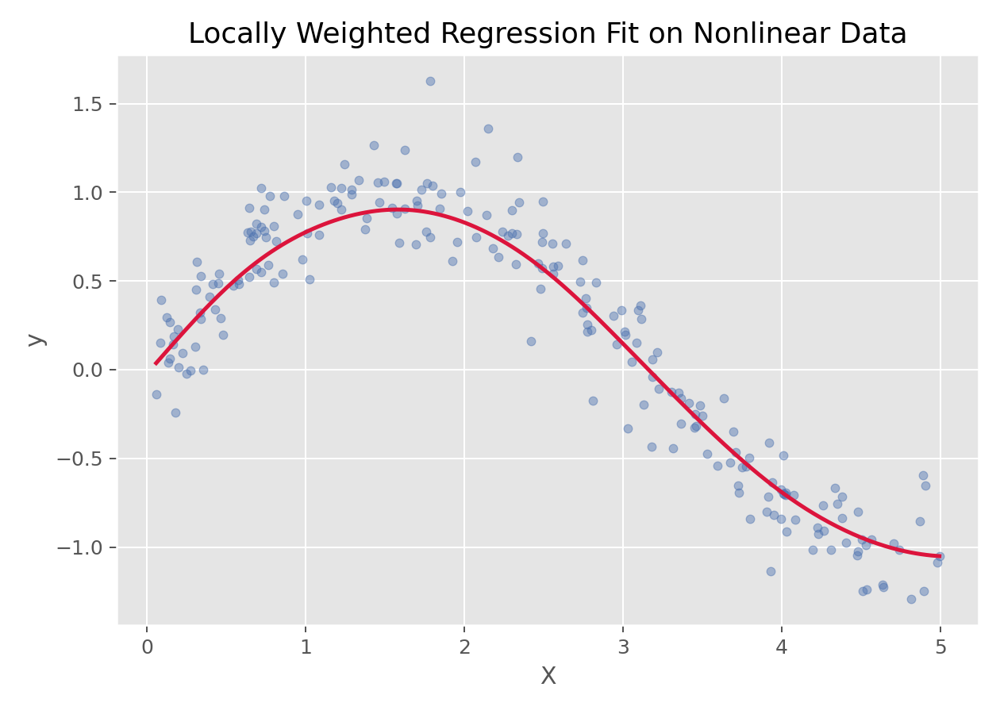

# 局部加权回归（Locally Weighted Regression）

## 1. 方法概览

### 1.1 一句话本质

局部加权回归不去拟合一条全局曲线，而是「走到哪拟合到哪」：在每个查询点附近，只用它的近邻、按远近加权做一个小小的线性回归，把这些局部拟合值串起来，就得到一条自动贴合数据形状的光滑曲线。

### 1.2 定义

局部加权回归（LOWESS/LOESS 类）是一种非参数回归：对每个目标点，用核函数给附近观测更大权重，做加权最小二乘拟合，取该点的拟合值；移动目标点得到整条平滑曲线。

### 1.3 它主要解决什么问题

- 研究问题：自变量与结局关系形状未知、可能复杂时，如何不预设函数形式地平滑趋势？
- 适用任务：探索性趋势平滑、非线性关系可视化、残差诊断。
- 常见医学场景：散点图上叠加平滑趋势线、检查连续变量与结局的非线性、生长/时间趋势探索。

### 1.4 直觉与类比

想画出一群散点的「趋势脊」。全局多项式要你先猜「它大概是几次曲线」，猜错就变形。局部加权回归换个思路：站在曲线上的每一点，只看「脚下附近」的数据，用它们拟合一小段直线，然后一步步挪动脚步、把每一小段的结果连起来。就像用一支短尺沿着散点慢慢描边——不需要事先知道整条曲线的公式。

## 2. 核心思想与原理

### 2.1 它到底在解决什么根本困难

全局参数模型（多项式）要预设函数形式与次数，选错就有偏，高次还在边界乱摆。真实关系的形状常常未知且复杂。根本困难是：**如何在完全不预设函数形式的情况下，跟随数据的局部形状？**

### 2.2 关键洞察

「一切拟合都是局部的」。在目标点 $x_0$ 处，给每个观测一个随距离衰减的权重 $w_i=K\!\big(\frac{x_i-x_0}{h}\big)$（近的权重大、远的几乎为 0），做**加权最小二乘**拟合一条局部直线（或局部二次），只取它在 $x_0$ 的值作为该点估计。移动 $x_0$ 扫过全程，就得到光滑曲线。**带宽 $h$** 是关键旋钮：大 → 更平滑（偏差大）、小 → 更贴合（方差大）——又是偏差-方差权衡。

### 2.3 与朴素/相邻做法的对比

- 相对**多项式回归**：LOWESS 局部、无需选次数、边界更可控；多项式全局、尾部易摆。
- 相对**限制性立方样条**：样条给可推断的参数模型；LOWESS 更偏探索、无简洁方程。
- 相对 **KNN 回归**：KNN 取近邻均值（局部常数）；LOWESS 拟合局部直线，更平滑、边界偏差更小。

## 3. 数学形式

### 3.1 核心公式

在目标点 $x_0$ 处最小化加权残差平方和：

$$
\min_{a,b}\ \sum_{i=1}^{n} w_i(x_0)\,\big(y_i-a-b\,x_i\big)^2,\qquad
w_i(x_0)=K\!\left(\frac{x_i-x_0}{h}\right)
$$

取拟合直线在 $x_0$ 的值 $\hat{y}(x_0)=a+b\,x_0$。这个式子在说：在每个 $x_0$ 做一次「近邻加权的小回归」，只留下它在该点的预测。

### 3.2 推导脉络

- 核函数 $K$（常用 tricube 或高斯）给近邻大权重、远处近 0。
- 加权最小二乘有闭式解 $\hat{\boldsymbol{\beta}}(x_0)=(X^\top W X)^{-1}X^\top W y$，$W=\mathrm{diag}(w_i)$。
- 对每个目标点重解一次，串起拟合值即平滑曲线。
- 带宽 $h$（或近邻比例 span）由交叉验证选；LOESS 常用局部二次并可迭代做稳健化（降低异常值影响）。

### 3.3 参数与统计量含义

- $h$ / span：带宽或近邻比例，控制平滑程度（最关键）。
- $K$：核函数，决定权重随距离衰减的形状。
- 局部多项式阶（0/1/2）：常用 1 或 2。
- $\hat{y}(x_0)$：目标点的平滑估计。

### 3.4 关键假设（含违反后果）

| 假设 | 含义 | 违反后会怎样 | 如何粗查 |
| --- | --- | --- | --- |
| 局部数据充足 | 每个点附近有足够观测 | 稀疏处方差大 | 看数据密度 |
| 关系局部光滑 | 曲线连续平滑 | 尖峰处失真 | 看散点 |
| 带宽合适 | $h$ 匹配数据 | 过平滑/欠平滑 | 交叉验证 |

## 4. 手把手算例

演示「近邻加权」如何决定局部拟合。数据 $x=\{1,3,5\}$，$y=\{2,4,3\}$，在目标点 $x_0=3$ 处用高斯核、带宽 $h=1$ 做局部加权。

**一步步计算（权重）：**

- 各点到 $x_0=3$ 的标准化距离 $u=(x_i-3)/1$：$x=1\to u=-2$，$x=3\to u=0$，$x=5\to u=2$。
- 高斯权重 $\propto e^{-u^2/2}$：$e^{-2}=0.135$，$e^{0}=1.0$，$e^{-2}=0.135$。
- 归一化权重：$0.135/1.27,\ 1.0/1.27,\ 0.135/1.27\approx0.106,\ 0.787,\ 0.106$。
- 局部加权均值（若拟合局部常数）：$0.106\times2+0.787\times4+0.106\times3\approx0.21+3.15+0.32=3.68$。

**结论：** 在 $x_0=3$ 处，最近的点（$x=3,y=4$）拿了近 79% 的权重，两侧的点各只有约 11%，于是局部拟合值 $\approx3.7$，被中心点强烈主导。把 $x_0$ 从 1 扫到 5、每处都这样加权拟合，就描出整条曲线。**权重随距离急剧衰减、以及带宽 $h$ 决定衰减快慢，正是 LOWESS 能贴合局部形状的机制**——$h$ 调大，两侧点权重上升、曲线更平；调小，几乎只看中心点、曲线更起伏。

## 5. 数据形式与输入输出

### 5.1 适合的数据形式

- 自变量类型：连续（通常一维，也有多维但受维度灾难限制）。
- 因变量类型：连续型。
- 数据结构：表格，需数据较密集。
- 是否适合高维数据：否，高维近邻稀疏。
- 是否适合缺失较多数据：需先处理。
- 是否适合删失数据：不适合。
- 是否适合重复测量数据：需谨慎处理相关性。

### 5.2 示例表格

| $x_i$ | 到 $x_0=3$ 距离 | 高斯权重 |
| --- | --- | --- |
| 1 | 2 | 0.106 |
| 3 | 0 | 0.787 |
| 5 | 2 | 0.106 |

### 5.3 输入与产出

#### 输入

- 输入数据：连续自变量 + 结局。
- 关键变量：待平滑变量、带宽/span、局部阶。
- 需要预处理的内容：确定带宽、处理异常值。

#### 产出

- 模型对象/统计结果：平滑曲线（逐点拟合值）。
- 参数估计：无全局参数（非参数）。
- 预测结果：数据范围内的平滑预测。
- 不确定性指标：可给逐点置信带。

## 6. 适用场景

- 适合：探索性趋势平滑、非线性可视化、残差诊断、数据较密。
- 不适合：高维、稀疏数据、需外推、需简洁参数方程。
- 使用前需要特别检查的点：带宽选择、数据密度、边界效应。

## 7. 实现

### 7.1 Python

常用包：

- `statsmodels`

```python
import numpy as np
import statsmodels.api as sm

x = np.array([1,2,3,4,5,6,7,8], float)
y = np.array([2,4,3,5,4,6,5,7], float)
sm_lowess = sm.nonparametric.lowess(y, x, frac=0.5)   # frac=span
print(sm_lowess)         # 逐点平滑坐标
```

### 7.2 R

常用包：

- `stats`

```r
x <- 1:8; y <- c(2,4,3,5,4,6,5,7)
fit <- loess(y ~ x, span = 0.5, degree = 2)
plot(x, y); lines(x, predict(fit))
```

## 8. 结果如何解读

- 核心结果看什么：平滑曲线的形状、拐点、局部趋势。
- 每个主要参数如何解读：带宽越大越平滑；曲线随数据密度调整精细度。
- 临床或医学意义如何表达：描述关系形状用于探索，不作因果或外推。
- 常见误读：把探索性平滑当预测模型；在稀疏/边界处过度解读。

## 9. 假设诊断与稳健性

- 带宽选择：交叉验证；同时试几个带宽看结论稳健性。
- 边界效应：端点近邻少、方差大，用局部二次可缓解。
- 异常值：用稳健 LOESS（迭代降权）减少影响。
- 稀疏区：数据稀疏处曲线不可靠，勿过度解读。

## 10. 推荐可视化

- 散点 + LOWESS 平滑线（含带宽对比）。
- 平滑线 + 逐点置信带。
- 残差图叠加 LOWESS 查系统偏离。

### 10.1 图像示例

下图展示局部加权回归的平滑曲线。



## 11. 优势、局限与常见坑

### 优势

- 无需预设函数形式，自动贴合局部形状。
- 边界比全局多项式可控。
- 直观、适合探索与可视化。

### 局限

- 无简洁参数方程、不便外推。
- 高维失效、需较大样本。
- 计算量随点数增大。

### 常见坑

- 带宽过小追噪声、过大抹平真趋势。
- 在稀疏/边界处过度解读。
- 当作可外推的预测模型。

## 12. 与相近方法的区别

- 和**多项式回归**：LOWESS 局部非参数；多项式全局参数。
- 和**限制性立方样条**：样条给可推断参数模型；LOWESS 偏探索。
- 和 **KNN 回归**：KNN 局部常数；LOWESS 局部直线，更平滑。
- 如何选择：探索/可视化 → LOWESS；要参数模型与推断 → 样条；简单弯曲 → 多项式。

## 13. 医学研究中的典型应用

- 散点图上叠加趋势线辅助解读。
- 检查连续暴露与结局的非线性形状。
- 时间趋势/生长曲线的探索性平滑。

## 14. 关键术语

- **带宽 / span**：局部窗口宽度，控制平滑程度。
- **核权重**：随距离衰减的观测权重。
- **加权最小二乘**：按权重拟合的局部回归。
- **LOESS/LOWESS**：局部加权回归的常见实现。
- **稳健 LOESS**：迭代降权异常值的版本。

## 15. 相关方法

- [[多项式回归（Polynomial Regression）]]
- [[限制性立方样条（Restricted Cubic Splines, RCS）]]
- [[K近邻回归（K-Nearest Neighbors Regression）]]

## 16. 参考资料

- Cleveland WS. Robust locally weighted regression and smoothing scatterplots. *J Am Stat Assoc*. 1979;74(368):829-836.
- Cleveland WS, Devlin SJ. Locally weighted regression. *J Am Stat Assoc*. 1988;83(403):596-610.
- Hastie T, Tibshirani R, Friedman J. *The Elements of Statistical Learning*. 2nd ed. Springer; 2009.
