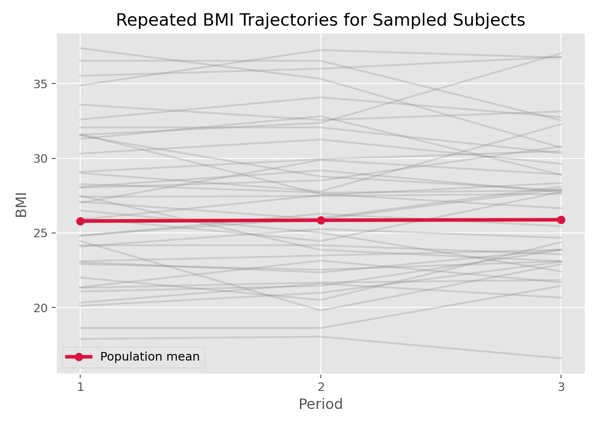

# 线性混合效应模型（Linear Mixed-Effects Model, LMM）

## 1. 方法概览

### 1.1 一句话本质

LMM 在普通回归的「一条总体平均线」之外，给每个受试者配一个**随机偏移**（随机截距/斜率），从而把「同一个人多次测量必然相似」这件事显式建进方差结构——既估出总体趋势，又不把相关的重复测量误当独立。

### 1.2 定义

线性混合效应模型（又称线性混合模型、多水平模型）用于分析重复测量或层级/嵌套数据中的连续结局。它在固定效应（population 层面的平均关系）之外加入服从正态分布的随机效应，刻画个体间异质性与个体内相关性，方差成分常用 REML 估计。

### 1.3 它主要解决什么问题

- 研究问题：同一个体被反复测量时，总体平均趋势是什么？不同个体如何围绕这条趋势各自偏离？
- 适用任务：纵向连续结局建模、随机截距/随机斜率建模、嵌套数据（患者嵌套于医院、学生嵌套于班级）分析。
- 常见医学场景：多次随访的 BMI、总胆固醇、血压、肺功能等连续指标的变化趋势；多中心试验中中心内的相关性。

### 1.4 直觉与类比

想象一个班级每个学生的身高每年测一次。全班有一条「平均生长曲线」，但每个孩子有自己的起点（有人天生高）和自己的生长速度。如果无视「同一个孩子的多次身高天然接近」，把所有测量当成互不相关的独立点，你会**高估自己掌握的信息量**——就像把同一个人问 5 遍当成问了 5 个人。LMM 给每个孩子一条「围绕平均线上下平移（随机截距）、甚至倾斜角度不同（随机斜率）」的个人线，把「同人相似」这份相关性正确地记进账。

## 2. 核心思想与原理

### 2.1 它到底在解决什么根本困难

普通最小二乘回归有个铁打的前提：**观测相互独立**。可纵向数据里，同一个人第 1 次和第 2 次的测量高度相关（他若基线就偏高，每次都偏高）。若无视这点直接做 OLS：

- 点估计（斜率）大致还对，但**标准误严重错**——把 $n$ 个人 × $m$ 次测量当成 $nm$ 个独立点，等于虚报了信息量，置信区间过窄、p 值过小、假阳性泛滥。
- 无法回答「个体之间差异有多大」这类问题。

根本困难是：**如何在承认「同人测量相关」的前提下，既估出总体趋势又给出诚实的不确定性？**

### 2.2 关键洞察

把每个个体的偏离拆成两层随机来源：一层是**个体级**的随机效应 $\mathbf b_i$（这个人整体偏高/偏低、变化偏快/偏慢），对同一人的所有测量**共享**；另一层是**测量级**的残差 $\epsilon_{ij}$，每次独立。同一人两次测量之所以相关，正是因为它们共享同一个 $\mathbf b_i$。把 $\mathbf b_i$ 设成服从 $N(0,\mathbf D)$ 的随机变量（而非给每人估一个固定参数），就用少数几个方差成分刻画了任意多个体的相关结构——**「随机截距」这一个方差参数 $\tau^2$，就编码了『同人相关』的全部强度**。

### 2.3 与朴素/相邻做法的对比

- 相对 [[线性回归（Linear Regression）]]：OLS 假设独立、方差恒定；LMM 显式建模个体内相关，SE 才诚实。
- 相对**重复测量 ANOVA**：rmANOVA 要求平衡设计、球形性假设；LMM 允许不平衡（每人测量次数不同）、缺失（在 MAR 下）、连续时间，灵活得多。
- 相对**给每个个体加一个固定截距（哑变量）**：固定效应法消耗大量自由度、不能外推到新个体、且无法估个体间方差；随机效应把截距当分布的抽样，省参数且可外推。
- 相对 [[广义估计方程（Generalized Estimating Equations, GEE）]]：LMM 是 **subject-specific（条件）** 模型，系数解释为「对同一个体」；GEE 是 **population-average（边际）** 模型。连续正态结局下两者系数一致，非线性时不同（见 [[广义线性混合效应模型（Generalized Linear Mixed-Effects Model, GLMM）]]）。

## 3. 数学形式

### 3.1 核心公式

$$
\begin{aligned}
Y_{ij} &= \mathbf{X}_{ij}^\top\boldsymbol{\beta} + \mathbf{Z}_{ij}^\top\mathbf{b}_i + \epsilon_{ij} \\
\mathbf{b}_i &\sim N(\mathbf{0}, \mathbf{D}), \qquad \epsilon_{ij} \sim N(0, \sigma^2)
\end{aligned}
$$

这个式子在说：第 $i$ 人第 $j$ 次的结局 = 总体平均部分 $\mathbf X_{ij}^\top\boldsymbol\beta$（大家共享的固定效应）+ 这个人专属的偏移 $\mathbf Z_{ij}^\top\mathbf b_i$（随机效应，同人共享）+ 每次独立的噪声 $\epsilon_{ij}$。$\mathbf b_i$ 和 $\epsilon_{ij}$ 都是均值 0 的正态随机量，它们的方差 $\mathbf D$、$\sigma^2$ 就是要估的「方差成分」。

### 3.2 推导脉络

1. 只含**随机截距**时，模型退化为 $Y_{ij}=\mathbf X_{ij}^\top\boldsymbol\beta+b_i+\epsilon_{ij}$，$b_i\sim N(0,\tau^2)$。
2. 由此推出同一人两次测量的相关系数 $\rho=\dfrac{\tau^2}{\tau^2+\sigma^2}$，即**组内相关系数 ICC**——随机截距方差占总方差的比例。
3. 边际来看 $\mathbf Y_i\sim N(\mathbf X_i\boldsymbol\beta,\ \mathbf V_i)$，其中 $\mathbf V_i=\mathbf Z_i\mathbf D\mathbf Z_i^\top+\sigma^2\mathbf I$ 是块结构协方差，把「同人相关」写进了非对角元。
4. 估计：固定效应 $\boldsymbol\beta$ 用广义最小二乘；方差成分用 **REML**（对固定效应做了自由度校正，比 ML 少偏）。个体随机效应用 **BLUP**（最佳线性无偏预测）「收缩」估计——测量少的个体被拉向总体均值。

### 3.3 参数与统计量含义

- 固定效应 $\boldsymbol\beta$：总体平均关系（如「每过一期 BMI 平均变化多少」）。
- 随机效应 $\mathbf b_i$：个体专属偏移；随机截距 = 个体基线水平差异，随机斜率 = 个体变化速度差异。
- $\mathbf D$：随机效应协方差矩阵；对角元 $\tau^2$ 是随机截距方差。
- $\sigma^2$：个体内残差方差（同一人测量的随机波动）。
- **ICC** $=\tau^2/(\tau^2+\sigma^2)$：同人相关强度，0=无相关（退回 OLS），接近 1=同人测量几乎一样。

### 3.4 关键假设（含违反后果）

| 假设 | 含义 | 违反后会怎样 | 如何粗查 |
| --- | --- | --- | --- |
| 随机效应正态 | $\mathbf b_i\sim N(0,\mathbf D)$ | 随机效应推断/BLUP 有偏 | 随机效应 QQ 图 |
| 残差正态等方差 | $\epsilon_{ij}\sim N(0,\sigma^2)$ | SE 失真 | 残差图、残差 vs 拟合 |
| 随机效应与残差独立 | 两层噪声不相关 | 方差成分偏 | 设计审查 |
| 缺失至多 MAR | 缺失不依赖未观测值 | 固定效应有偏 | 缺失模式分析、敏感性分析 |
| 随机效应结构正确 | 该放随机斜率却只放随机截距等 | SE 偏、可能过/欠拟合 | 似然比检验比较嵌套模型 |

## 4. 手把手算例

用一个**只含随机截距**的最小例子，把方差如何分解成「个体间」和「个体内」两块亲手算出来——这正是 ICC 的来历。

**数据：** 4 名受试者，每人测 2 次某连续指标（无系统时间趋势，纯看相关结构）：

| 受试者 | 第 1 次 | 第 2 次 | 个体均值 |
| --- | --- | --- | --- |
| S1 | 12 | 10 | 11 |
| S2 | 20 | 22 | 21 |
| S3 | 16 | 14 | 15 |
| S4 | 24 | 26 | 25 |

总均值 = (11+21+15+25)/4 = **18**。注意个体均值差异很大（11 到 25），但每人内部两次只差 ±1——直觉上「同人相关」应该很强。

**Step 1：个体间平方和（各人均值离总均值多远）。** 每人 2 次测量，故乘 2：

$$
SS_{间}=2\times[(11{-}18)^2+(21{-}18)^2+(15{-}18)^2+(25{-}18)^2]=2\times[49+9+9+49]=232
$$

自由度 3，均方 $MS_{间}=232/3=77.33$。

**Step 2：个体内平方和（每次测量离本人均值多远）。** 每人贡献 $1^2+1^2=2$，四人共 8：$SS_{内}=8$，自由度 4，$MS_{内}=8/4=2$。

**Step 3：解出方差成分。** 随机截距 ANOVA 下：

$$
\hat\sigma^2=MS_{内}=2,\qquad
\hat\tau^2=\frac{MS_{间}-MS_{内}}{2}=\frac{77.33-2}{2}=37.67
$$

**Step 4：算 ICC。**

$$
\text{ICC}=\frac{\hat\tau^2}{\hat\tau^2+\hat\sigma^2}=\frac{37.67}{37.67+2}=\mathbf{0.95}
$$

**结论：** 总变异的 95% 来自「人和人不同」，只有 5% 来自「同一人每次的随机波动」——同人测量高度相关。这直接说明为什么不能用 OLS：若把这 8 个点当独立，等于假装有 8 份独立信息，而实际有效信息量远少于此（4 个人各有一条几乎固定的水平）。LMM 用一个参数 $\tau^2=37.67$ 就把这份相关记进了账，让后续对固定效应的标准误诚实。（顺带：朴素把 8 点当独立算总方差为 $240/7=34.3$，既没分层也会误导 SE。）

## 5. 数据形式与输入输出

### 5.1 适合的数据形式

- 自变量类型：时间/期别、处理组、年龄、性别等，连续或分类皆可。
- 因变量类型：连续型。
- 数据结构：**long format**——同一主体多行，每行一次测量，需有个体 ID 列。
- 是否适合高维数据：非高维首选。
- 是否适合缺失较多数据：比 rmANOVA 灵活，MAR 下用全部可用数据；MNAR 需敏感性分析。
- 是否适合删失数据：不直接处理删失结局（那是生存分析）。
- 是否适合重复测量数据：这正是它的主场。

### 5.2 示例表格

`Framingham_data.csv` 的典型 long format，同一 `RANDID` 在多个 `PERIOD` 出现：

| RANDID | PERIOD | BMI | TOTCHOL | PREVHYP | SEX |
| --- | --- | --- | --- | --- | --- |
| 6238 | 1 | 28.73 | 250.0 | 0 | 1 |
| 6238 | 2 | 29.43 | 260.0 | 0 | 1 |
| 6238 | 3 | 28.50 | 237.0 | 0 | 1 |
| 11263 | 1 | 30.30 | 228.0 | 1 | 1 |
| 11263 | 2 | 31.36 | 230.0 | 1 | 1 |

### 5.3 输入与产出

#### 输入

- 输入数据：long format 重复测量数据。
- 关键变量：个体 ID、时间、结局、协变量。
- 需要预处理的内容：整理为长表、编码时间变量（连续 or 因子）、检查缺失模式、必要时中心化时间。

#### 产出

- 模型对象/统计结果：固定效应估计、随机效应方差成分（$\tau^2,\sigma^2$）、REML/ML 对数似然、AIC。
- 参数估计：总体趋势 $\boldsymbol\beta$ 与个体间变异。
- 预测结果：个体拟合轨迹、随机效应 BLUP、ICC。
- 不确定性指标：固定效应 SE 与区间、方差成分区间。

## 6. 适用场景

- 适合：纵向连续结局；个体基线水平和/或变化速度不同；嵌套/多水平数据；不平衡或含缺失的重复测量。
- 不适合：二元/计数结局（用 [[广义线性混合效应模型（Generalized Linear Mixed-Effects Model, GLMM）]]）；只关心总体平均而不在意个体差异（GEE 更省心）；结局删失（用生存分析）。
- 使用前需要特别检查的点：数据是否 long format、随机效应结构（只随机截距还是加随机斜率）、时间变量形式、缺失机制。

## 7. 实现

### 7.1 Python

常用包：

- `statsmodels`

```python
import statsmodels.api as sm

# re_formula="~PERIOD" 表示随机截距 + 随机斜率(个体变化速度不同)
model = sm.MixedLM.from_formula(
    "BMI ~ PERIOD + SEX",
    groups="RANDID",
    re_formula="~PERIOD",
    data=df,
)
result = model.fit(reml=True)          # REML 估方差成分
print(result.summary())
print(result.cov_re, result.scale)     # 随机效应协方差 D 与残差方差 sigma^2
# ICC(仅随机截距时): tau2 / (tau2 + sigma2)
```

### 7.2 R

常用包：

- `nlme`
- `lme4`

```r
library(lme4)

fit <- lmer(BMI ~ PERIOD + SEX + (PERIOD | RANDID), data = df, REML = TRUE)
summary(fit)
VarCorr(fit)                 # tau^2(截距/斜率) 与 sigma^2
# 仅随机截距版 + ICC:
fit0 <- lmer(BMI ~ PERIOD + SEX + (1 | RANDID), data = df)
performance::icc(fit0)       # 直接给 ICC
ranef(fit0)                  # 个体随机截距 BLUP
```

## 8. 结果如何解读

- 核心结果看什么：固定效应的方向/大小/区间、随机截距与随机斜率方差、ICC。
- 每个主要参数如何解读：`PERIOD` 固定效应 = 总体平均每期变化；随机斜率方差大 = 个体变化速度差异大；ICC=0.95 = 同人测量高度相关。
- 临床或医学意义如何表达：比「只比较各期均值」更能回答「随时间的变化在个体间是否一致/差异多大」。
- 常见误读：把随机效应当「无关噪声」丢掉——它本身就是「个体差异」这一重要结论；把 subject-specific 固定效应误当人群平均效应（连续正态下二者恰好相等，但换成 GLMM 就不等了，别养成错习惯）。

## 9. 假设诊断与稳健性

- 残差诊断：残差 vs 拟合值图查等方差与线性；残差 QQ 图查正态。
- 随机效应诊断：随机效应 QQ 图与 caterpillar 图（BLUP ± SE）查正态与离群个体。
- 随机结构选择：用似然比检验（注意方差成分检验在边界上，p 值需减半）比较「随机截距」vs「随机截距+斜率」。
- ML vs REML：比较**固定效应**不同的模型要用 ML（REML 似然不可比）；报告最终方差成分用 REML。
- 稳健性：小样本个体数时方差成分不稳；严重不平衡或 MNAR 缺失需敏感性分析。

## 10. 推荐可视化

- Spaghetti plot（每人一条轨迹）叠加总体平均线：一图看清个体异质性与总体趋势。
- 随机效应 caterpillar 图：展示哪些个体显著偏离平均。
- 观测 vs BLUP 拟合轨迹：展示「收缩」如何把数据少的个体拉向总体。

### 10.1 图像示例

下图用 spaghetti plot 展示样本受试者的 BMI 轨迹，并叠加总体平均趋势。



## 11. 优势、局限与常见坑

### 优势

- 自然处理个体内相关，标准误诚实。
- 同时建模总体趋势与个体差异（并给出个体 BLUP）。
- 对不平衡、缺失（MAR）的重复测量灵活。

### 局限

- 模型设定比 OLS 复杂（随机结构、方差结构需选择）。
- 方差结构选错会影响推断。
- 仅适合连续近似正态结局。

### 常见坑

- 把重复测量当独立样本直接做 OLS（SE 严重偏小）。
- 随机效应结构设得过复杂导致不收敛/奇异拟合（singular fit）。
- 比较固定效应不同的模型时误用 REML 似然。
- 忘记 long format，把宽表硬塞进模型。

## 12. 与相近方法的区别

- 和 [[线性回归（Linear Regression）]]：LMM = OLS + 随机效应，显式建模相关；数据独立时二者一致。
- 和 [[广义估计方程（Generalized Estimating Equations, GEE）]]：LMM 给 subject-specific 解释与个体预测；GEE 给 population-average 边际效应。连续正态下系数相同，非线性时不同。
- 和 [[广义线性混合效应模型（Generalized Linear Mixed-Effects Model, GLMM）]]：GLMM 是 LMM 向二元/计数等非高斯结局的推广。
- 如何选择：**连续结局 + 关心个体差异/预测 → LMM；非高斯结局 → GLMM；只要人群平均效应、图省事 → GEE**。

## 13. 医学研究中的典型应用

- BMI、总胆固醇、血压等连续指标的多次随访趋势分析。
- 治疗前后连续实验室指标的纵向变化（含个体反应差异）。
- 多中心/多医院研究中中心内相关性的处理；个体生长/衰退曲线建模。

## 14. 关键术语

- **固定效应（Fixed effect）**：对所有个体相同的总体平均关系，即回归系数 $\boldsymbol\beta$。
- **随机效应（Random effect）**：个体专属、服从正态分布的偏移 $\mathbf b_i$（随机截距/斜率）。
- **组内相关系数（Intraclass correlation, ICC）**：$\tau^2/(\tau^2+\sigma^2)$，同一组/个体内观测的相关强度。
- **方差成分（Variance components）**：随机效应方差 $\mathbf D$ 与残差方差 $\sigma^2$。
- **REML（限制性最大似然）**：估方差成分的默认方法，对固定效应做自由度校正、偏差更小。
- **BLUP（最佳线性无偏预测）**：个体随机效应的收缩估计，数据少的个体被拉向总体均值。
- **subject-specific（条件）解释**：系数意为「对同一个体而言」，与 population-average 相对。
- **long format（长表）**：一次测量一行、同人多行的纵向数据格式。

## 15. 相关方法

- [[线性回归（Linear Regression）]]
- [[广义线性混合效应模型（Generalized Linear Mixed-Effects Model, GLMM）]]
- [[广义估计方程（Generalized Estimating Equations, GEE）]]
- [[组内相关系数（Intraclass Correlation Coefficient, ICC）]]

## 16. 参考资料

- Laird NM, Ware JH. Random-effects models for longitudinal data. *Biometrics*. 1982;38(4):963-974.
- Pinheiro JC, Bates DM. *Mixed-Effects Models in S and S-PLUS*. Springer; 2000.
- Fitzmaurice GM, Laird NM, Ware JH. *Applied Longitudinal Analysis*. 2nd ed. Wiley; 2011.
- CRAN. Package `lme4`: Linear Mixed-Effects Models using Eigen and S4. [https://cran.r-project.org/web/packages/lme4/index.html](https://cran.r-project.org/web/packages/lme4/index.html) （访问日期：2026-07-02）
