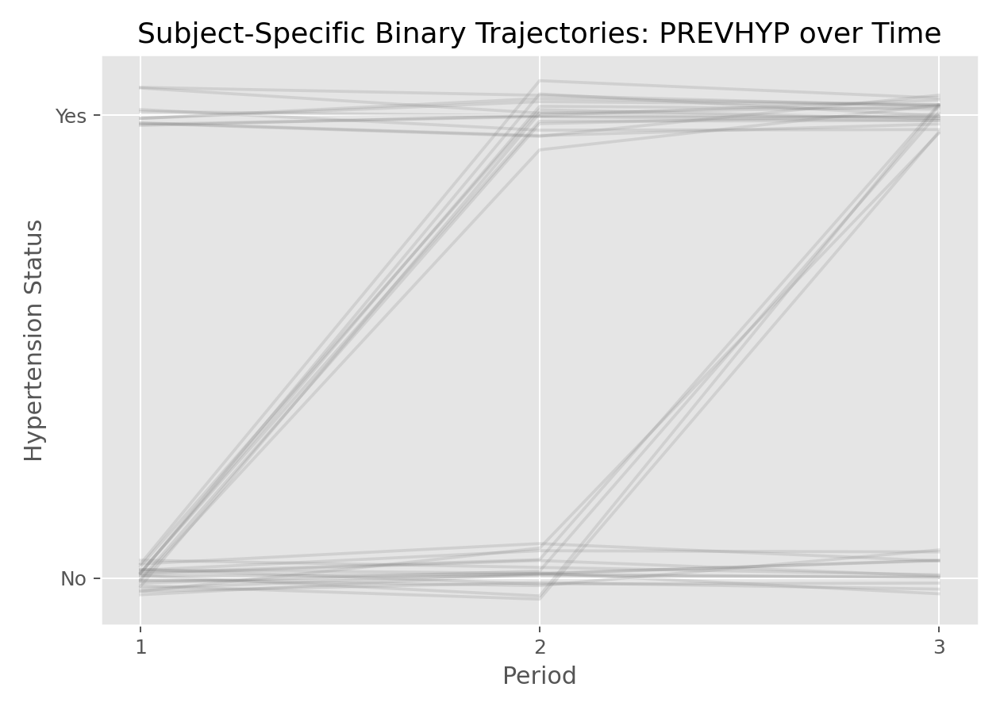

# 广义线性混合效应模型（Generalized Linear Mixed-Effects Model, GLMM）

## 1. 方法概览

### 1.1 定义

GLMM 是把混合效应思想与广义线性模型结合起来的方法，适用于重复测量或层级数据中的二元、计数等非高斯结局。

### 1.2 它主要解决什么问题

- 研究问题：当结局是二元或计数，而且同一主体有重复测量时，如何同时建模个体差异和非独立性。
- 适用任务：纵向二元结局、重复计数结局、随机截距 / 随机斜率非高斯模型。
- 常见医学场景：多次随访的高血压状态、是否达标、某类事件是否发生。

### 1.3 直觉理解

GLMM 可以理解成“每个人都有自己的 Logistic 回归或 Poisson 回归曲线”，个体曲线围绕总体平均结构波动。

## 2. 数学形式

### 2.1 核心公式

$$
\begin{aligned}
Y_{ij} &\sim \text{Exponential Family} \\
g(\mu_{ij}) &= \eta_{ij} = \mathbf{X}_{ij}^\top\boldsymbol{\beta} + \mathbf{Z}_{ij}^\top\mathbf{b}_i \\
\mathbf{b}_i &\sim N(\mathbf{0}, \mathbf{D})
\end{aligned}
$$

### 2.2 参数或统计量含义

- 固定效应 $\boldsymbol{\beta}$：给定个体随机效应后的 subject-specific 效应。
- 随机效应 $\mathbf b_i$：主体特异性的偏移。
- 边际均值 $E(Y_{ij})$ 通常没有简单闭式表达。

### 2.3 关键假设

- 同一主体内观测相关。
- 给定随机效应后，观测条件独立。
- 分布族和连接函数与结局类型匹配。

## 3. 数据形式与输入输出

### 3.1 适合的数据形式

- 自变量类型：时间、处理组、性别、年龄等。
- 因变量类型：二分类或计数型。
- 数据结构：long format 重复测量数据。
- 是否适合高维数据：不是默认首选。
- 是否适合缺失较多数据：比传统方法更灵活，但仍需关注缺失机制。
- 是否适合删失数据：不适合删失结局本身。
- 是否适合重复测量数据：非常适合。

### 3.2 示例表格

例如 `Framingham_data.csv` 中可以把 `PREVHYP` 作为二元重复结局：

| RANDID | PERIOD | SEX | BMI | PREVHYP |
| --- | --- | --- | --- | --- |
| 6238 | 1 | 1 | 28.73 | 0 |
| 6238 | 2 | 1 | 29.43 | 0 |
| 6238 | 3 | 1 | 28.50 | 0 |
| 11263 | 1 | 1 | 30.30 | 1 |
| 11263 | 2 | 1 | 31.36 | 1 |

### 3.3 输入与产出

#### 输入

- 输入数据：long format 的二元或计数结局数据。
- 关键变量：主体 ID、时间、结局、协变量、随机效应结构。
- 需要预处理的内容：长表整理、缺失处理、结局编码。

#### 产出

- 模型对象/统计结果：固定效应、随机效应方差、近似似然结果。
- 参数估计：subject-specific 效应。
- 预测结果：条件概率、个体特异曲线。
- 不确定性指标：标准误、区间估计。

## 4. 适用场景

- 适合：重复测量二元结局或计数结局，且关心个体层面效应。
- 不适合：只关心总体平均效应且不关心个体差异时。
- 使用前需要特别检查的点：随机效应结构、时间形式、拟合收敛、数值积分或近似方法。

## 5. 实现

### 5.1 Python

常用包：

- `statsmodels`

```python
from statsmodels.genmod.bayes_mixed_glm import BinomialBayesMixedGLM

model = BinomialBayesMixedGLM.from_formula(
    "PREVHYP ~ PERIOD + SEX",
    {"RANDID": "0 + C(RANDID)"},
    data=df
)
result = model.fit_vb()
print(result.summary())
```

### 5.2 R

常用包：

- `lme4`

```r
library(lme4)

fit <- glmer(
  PREVHYP ~ PERIOD + SEX + (1 | RANDID),
  family = binomial(link = "logit"),
  data = df
)
summary(fit)
```

## 6. 结果如何解释

- 核心结果看什么：固定效应方向、随机效应方差、个体异质性。
- 每个主要参数如何解释：在给定同一主体随机效应时，协变量变化如何影响 log-odds 或 log-count。
- 临床或医学意义如何表达：GLMM 更适合回答“在同一个体层面”效应如何变化。
- 常见误读：GLMM 的系数通常不等于边际平均意义下的 GEE 系数。

## 7. 推荐可视化

- 个体二元轨迹图。
- 个体拟合概率曲线。
- 随机截距分布图。

### 7.1 图像示例

下图展示部分受试者的高血压状态随时间变化轨迹，突出 GLMM 所关注的个体特异性结构。



## 8. 优势、局限与常见坑

### 优势

- 同时处理相关数据和非高斯结局。
- 可建模个体间异质性。
- 适合 subject-specific 解释。

### 局限

- 拟合计算更复杂。
- 不同近似方法可能给出略有差异的结果。
- 结果解释较 GEE 更偏条件化。

### 常见坑

- 把 GLMM 系数直接当成总体平均效应解释。
- 忽视收敛警告。
- 数据太稀疏却拟合过于复杂的随机效应结构。

## 9. 与相近方法的区别

- 和 Logistic / Poisson 回归的区别：GLMM 显式处理主体内相关性。
- 和 GEE 的区别：GLMM 更偏 subject-specific，GEE 更偏 population-average。
- 和 LMM 的区别：LMM 针对连续正态结局。

## 10. 医学研究中的典型应用

- 多次随访高血压状态建模。
- 反复记录的二元症状或计数事件分析。
- 同一受试者多次门诊达标/未达标研究。

## 11. 相关方法

- [[线性混合效应模型（Linear Mixed-Effects Model, LMM）]]
- [[Logistic回归（Logistic Regression）]]
- [[广义估计方程（Generalized Estimating Equations, GEE）]]

## 12. 参考资料

- Molenberghs G, Verbeke G. *Models for Discrete Longitudinal Data*. Springer; 2005.
- statsmodels Developers. `statsmodels.genmod.bayes_mixed_glm.BinomialBayesMixedGLM`. statsmodels API Reference. [https://www.statsmodels.org/stable/generated/statsmodels.genmod.bayes_mixed_glm.BinomialBayesMixedGLM.html](https://www.statsmodels.org/stable/generated/statsmodels.genmod.bayes_mixed_glm.BinomialBayesMixedGLM.html) （访问日期：2026-07-02）
- CRAN. Package `lme4`. [https://cran.r-project.org/web/packages/lme4/index.html](https://cran.r-project.org/web/packages/lme4/index.html) （访问日期：2026-07-02）
