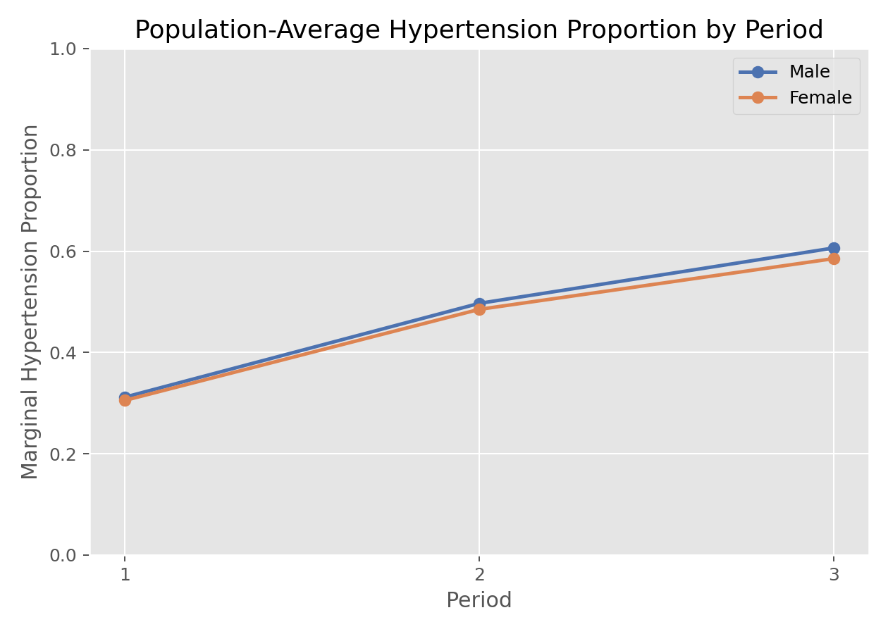

# 广义估计方程（Generalized Estimating Equations, GEE）

## 1. 方法概览

### 1.1 一句话本质

GEE 不给每个人建模，只盯**人群平均**：先用一个「工作相关结构」大致猜同人测量怎么相关（猜错也没关系），再用**三明治（sandwich）稳健方差**兜底——只要均值模型写对，标准误在大样本下就可信。

### 1.2 定义

广义估计方程是把 quasi-likelihood 扩展到相关数据的一类**边际模型**，直接估计 population-average 效应。它通过工作相关矩阵 $\mathbf R(\boldsymbol\alpha)$ 提升效率、通过 sandwich 方差保证稳健推断，是纵向/聚类数据的主力方法之一。

### 1.3 它主要解决什么问题

- 研究问题：在重复测量或聚类数据里，协变量对**总体平均**结局的影响是多少？
- 适用任务：边际均值建模、稳健标准误下的重复测量二元/计数/连续结局分析。
- 常见医学场景：多次随访的人群高血压率、症状发生率、治疗反应比例；同一医院/家庭内聚集的结局。

### 1.4 直觉与类比

延续纵向数据的场景，但换个提问角度。[[广义线性混合效应模型（Generalized Linear Mixed-Effects Model, GLMM）]] 问「对**某个病人**，干预会怎样改变他自己的概率」；GEE 问「在**整个人群**里铺开，平均概率会怎么变」。就像评估一项公共卫生政策：卫生部门通常不关心张三个人的曲线，只关心「全市高血压率从 30% 降到多少」。GEE 因此不去费劲估计每个人的随机效应，而是把「同人相关」当成一个需要**校正标准误**的麻烦，用工作相关结构 + 三明治方差处理掉——它对相关结构的具体形状「不较真」，只求人群平均效应的点估计准、SE 稳。

## 2. 核心思想与原理

### 2.1 它到底在解决什么根本困难

要估人群平均效应，只需把均值模型写对（如 $\text{logit}\,E[Y]=\mathbf X^\top\boldsymbol\beta$）。但重复测量不独立，若按独立似然算，**标准误会错**。想把相关结构建对又很难——你未必知道同人两次测量到底是等相关、还是随时间衰减的 AR(1)。根本困难是：**如何在『不确定相关结构长什么样』的情况下，仍得到可信的人群平均效应及其标准误？**

### 2.2 关键洞察

**把相关结构降级为「工作假设」，用稳健方差兜底。** GEE 只要求指定一个可能错的**工作相关矩阵** $\mathbf R(\boldsymbol\alpha)$（independent / exchangeable / AR(1)），它只影响**效率**（猜得越准 SE 越小），不影响点估计的一致性。真正保证推断可靠的是 **sandwich（三明治）方差估计**：

$$
\widehat{\text{Var}}(\hat{\boldsymbol\beta})=\underbrace{\mathbf B^{-1}}_{\text{面包}}\ \underbrace{\mathbf M}_{\text{肉(经验)}}\ \underbrace{\mathbf B^{-1}}_{\text{面包}}
$$

其中「肉」用**实际残差的经验协方差**替代模型假设的协方差——于是即便工作相关写错，SE 也在大样本下正确。这就是「均值对 + 大样本 ⇒ 稳健」的来历。

### 2.3 与朴素/相邻做法的对比

- 相对**忽略相关直接做 GLM**：点估计接近，但 SE 错（过窄）；GEE 用 sandwich 修正 SE。
- 相对 [[Quasi-Likelihood与过度离散（Quasi-Likelihood and Overdispersion）]]：GEE 是 quasi-likelihood 向「相关数据」的推广（多了工作相关矩阵）。
- 相对 [[广义线性混合效应模型（Generalized Linear Mixed-Effects Model, GLMM）]]：**同一份数据**，GEE 给边际（population-average）系数、GLMM 给条件（subject-specific）系数；非线性连接下 GEE 系数绝对值更小。GEE 不产出个体随机效应、不做个体预测。
- 相对 [[线性混合效应模型（Linear Mixed-Effects Model, LMM）]]：连续正态结局下 GEE 与 LMM 的系数一致（边际=条件），差别只在推断哲学与 SE 构造。

## 3. 数学形式

### 3.1 核心公式

GEE 不最大化似然，而是解一组**估计方程**：

$$
\sum_{i=1}^{n}\mathbf D_i^\top\mathbf V_i^{-1}(\mathbf Y_i-\boldsymbol\mu_i)=\mathbf 0,\qquad
\mathbf V_i=\mathbf A_i^{1/2}\,\mathbf R_i(\boldsymbol\alpha)\,\mathbf A_i^{1/2}
$$

这个式子在说：对每个主体 $i$，把「观测减模型均值」的残差 $(\mathbf Y_i-\boldsymbol\mu_i)$ 按工作协方差 $\mathbf V_i$ 加权、再乘均值对参数的导数 $\mathbf D_i$，全体求和为零——解出使加权残差平衡的 $\boldsymbol\beta$。$\mathbf A_i$ 是边际方差（由均值决定，如 $p(1-p)$），$\mathbf R_i(\boldsymbol\alpha)$ 是工作相关矩阵。

### 3.2 推导脉络

1. 设边际均值模型 $g(\mu_{ij})=\mathbf X_{ij}^\top\boldsymbol\beta$——**只对均值负责**，不设完整联合分布。
2. 借用 quasi-likelihood 的 score 形式，把独立情形的 $\mathbf V_i=\mathbf A_i$ 换成含相关的 $\mathbf V_i=\mathbf A_i^{1/2}\mathbf R_i(\boldsymbol\alpha)\mathbf A_i^{1/2}$。
3. $\boldsymbol\alpha$（相关参数）用残差矩估计，与 $\boldsymbol\beta$ 交替更新至收敛。
4. 推断用 sandwich 方差（§2.2）：只要均值模型对，$\hat{\boldsymbol\beta}$ 一致且渐近正态，SE 对工作相关误设稳健。

### 3.3 参数与统计量含义

- $\boldsymbol\beta$：**population-average（边际）** 效应；二元 logit 下 $e^\beta$ 是人群平均 OR。
- $\boldsymbol\mu_i$：第 $i$ 主体的边际均值向量。
- $\mathbf R_i(\boldsymbol\alpha)$：工作相关矩阵——independent（对角）、exchangeable（等相关）、AR(1)（随时间衰减）、unstructured（全自由）。
- sandwich（稳健/经验）方差：抗工作相关误设的 SE；对应还有 model-based（假设正确时更有效）方差。

### 3.4 关键假设（含违反后果）

| 假设 | 含义 | 违反后会怎样 | 如何粗查 |
| --- | --- | --- | --- |
| **均值模型正确** | $g(E[Y])=\mathbf X^\top\boldsymbol\beta$ 设对 | 点估计有偏（这是最关键前提） | 残差图、拟合优度 |
| 大样本（主体数多） | sandwich 靠渐近 | 主体少时 SE 偏小、覆盖不足 | 主体数经验上 ≥40–50 |
| 主体间独立 | 聚类之间不相关 | SE 失真 | 设计审查 |
| 缺失完全随机 MCAR | 标准 GEE 需 MCAR | MAR 下有偏，需加权 GEE（IPW） | 缺失机制分析 |
| 工作相关不必正确 | 只影响效率非一致性 | 猜太差则效率低（但不偏） | 比较不同 corstr 的 SE |

## 4. 手把手算例

用**独立工作相关**的情形做手算——此时 GEE 的点估计恰好等于普通边际 GLM，可以直接从人群比例算出来，而 GEE 的贡献体现在**用 sandwich 方差修正标准误**。数据与 [[广义线性混合效应模型（Generalized Linear Mixed-Effects Model, GLMM）]] 卡共用。

**数据：** 10 名受试者两期随访，结局「是否高血压」。人群比例：期 1 = 3/10 = 30%，期 2 = 6/10 = 60%。

**Step 1：边际 log-odds 与人群平均时间效应。**

$$
\text{logit}(0.30)=\log\tfrac{0.30}{0.70}=-0.847,\qquad
\text{logit}(0.60)=\log\tfrac{0.60}{0.40}=+0.405
$$

$$
\hat\beta_{\text{PERIOD}}=0.405-(-0.847)=1.253,\qquad
OR=e^{1.253}=\mathbf{3.50}
$$

**Step 2：这就是 GEE（边际）给的答案。** 读作「**整个人群**里，期 2 相对期 1 的患高血压 odds 是 3.5 倍」。工作相关设成 independent 时点估计与此相同；设成 exchangeable 只是让 SE 更有效率，点估计几乎不变。

**Step 3：与 GLMM 的条件效应对照（同一数据）。** GLMM 卡算出条件 OR = 5.10（$\tau^2=2$）。二者关系：

$$
\beta_{\text{边际}}=\frac{\beta_{\text{条件}}}{\sqrt{1+0.346\tau^2}}=\frac{1.63}{1.301}=1.253\ \checkmark
$$

**Step 4：sandwich 方差在做什么。** 若无视相关、用独立似然的朴素 SE，会低估不确定性（把 20 个相关观测当 20 个独立点）。sandwich 方差用「同主体残差的经验协方差」把重复测量的信息冗余扣回来，给出**更大、更诚实**的 SE。相关越强，朴素 SE 与 sandwich SE 的差距越大。

**结论：** GEE 的人群平均时间效应 OR=3.50，比 GLMM 的个体效应 OR=5.10 小——**不是矛盾，是问「人群」还是问「个体」的差别**。GEE 的核心价值在于：点估计像普通 GLM 一样好算好懂（边际、直给人群），而 sandwich 方差在你不确定相关结构时兜住了标准误。

## 5. 数据形式与输入输出

### 5.1 适合的数据形式

- 自变量类型：时间/期别、处理组、性别、暴露、年龄等。
- 因变量类型：连续、二元、计数型。
- 数据结构：long format 重复测量或聚类数据，需主体/聚类 ID。
- 是否适合高维数据：非默认首选。
- 是否适合缺失较多数据：标准 GEE 需 MCAR；MAR 用加权 GEE（IPW）。
- 是否适合删失数据：不直接处理删失。
- 是否适合重复测量数据：主场。

### 5.2 示例表格

`Framingham_data.csv` 中适合 GEE 的 long format：

| RANDID | PERIOD | SEX | PREVHYP |
| --- | --- | --- | --- |
| 6238 | 1 | 1 | 0 |
| 6238 | 2 | 1 | 0 |
| 6238 | 3 | 1 | 0 |
| 11263 | 1 | 1 | 1 |
| 11263 | 2 | 1 | 1 |

总体平均层面，`PREVHYP` 在不同期别、性别上的观测比例（GEE 正是刻画这张边际趋势表）：

| SEX | PERIOD | mean(PREVHYP) |
| --- | --- | --- |
| 0 | 1 | 0.312 |
| 0 | 2 | 0.497 |
| 0 | 3 | 0.606 |
| 1 | 1 | 0.305 |
| 1 | 2 | 0.485 |
| 1 | 3 | 0.585 |

### 5.3 输入与产出

#### 输入

- 输入数据：long format 重复测量数据。
- 关键变量：主体 ID、结局、协变量、工作相关结构。
- 需要预处理的内容：长表整理、结局编码、相关结构选择、按主体排序（AR(1) 需时间有序）。

#### 产出

- 模型对象/统计结果：边际系数、稳健（sandwich）标准误、工作相关参数 $\boldsymbol\alpha$。
- 参数估计：population-average 效应。
- 预测结果：总体平均概率/均值。
- 不确定性指标：robust/sandwich variance（及 model-based 对照）。

## 6. 适用场景

- 适合：关心 population-average 效应的重复测量/聚类分析；主体数足够多；相关结构不确定。
- 不适合：强调 subject-specific 解释或个体预测（用 GLMM）；主体数很少（sandwich 失灵）；结局删失（用生存分析）。
- 使用前需要特别检查的点：主体 ID、工作相关结构、主体数、缺失机制（MCAR？否则用加权 GEE）。

## 7. 实现

### 7.1 Python

常用包：

- `statsmodels`

```python
import statsmodels.api as sm
import statsmodels.formula.api as smf

fit = smf.gee(
    "PREVHYP ~ PERIOD + SEX",
    groups="RANDID",                       # 聚类 ID
    data=df,
    family=sm.families.Binomial(),
    cov_struct=sm.cov_struct.Exchangeable(),  # 工作相关: 等相关
).fit()
print(fit.summary())                        # 系数为边际(人群平均)log-OR
print(fit.cov_struct.summary())             # 估计的工作相关 alpha
# SE 默认即 sandwich(robust)
```

### 7.2 R

常用包：

- `geepack`

```r
library(geepack)

fit <- geeglm(PREVHYP ~ PERIOD + SEX,
              id = RANDID,                  # 聚类 ID(需按 id 排序)
              family = binomial(link = "logit"),
              corstr = "exchangeable",      # 工作相关结构
              data = df)
summary(fit)                                # Std.err 即稳健 SE
exp(cbind(OR = coef(fit),                   # 边际 OR
          confint.default(fit)))
QIC(fit)                                     # 选工作相关结构的准则
```

## 8. 结果如何解读

- 核心结果看什么：边际系数（人群平均 OR/均值差）、**稳健 SE**、工作相关参数。
- 每个主要参数如何解读：`PERIOD` 的 OR=3.50 读作「人群中每过一期患病 odds 增到 3.5 倍」；SEX 系数为人群平均的性别差异。
- 临床或医学意义如何表达：更贴近公共卫生/人群决策语言（「全人群比例如何变」）。
- 常见误读：把 GEE 边际系数当个体效应（它比 GLMM 条件系数小）；主体数很少还依赖 sandwich；无依据地选工作相关结构。

## 9. 假设诊断与稳健性

- 均值模型：这是唯一影响点估计一致性的前提——用残差图、拟合优度检查，比工作相关选择重要得多。
- 工作相关选择：用 **QIC** 准则比较 independent/exchangeable/AR(1)；选得好只是提高效率。
- 主体数：sandwich 靠大样本，主体数少（\<40）时 SE 偏小，用小样本校正（如 Mancl-DeRouen、Kauermann-Carroll）。
- 缺失：标准 GEE 要 MCAR；若 MAR，用逆概率加权 GEE（IPW-GEE）。
- 稳健性对照：比较 model-based 与 sandwich SE，差距大提示工作相关误设（但 sandwich 仍可信）。

## 10. 推荐可视化

- 按时间/分组的边际均值/概率折线图：GEE 的核心刻画对象。
- 观测边际均值 vs 模型拟合均值对比：检查均值模型。
- 工作相关结构示意（相关矩阵热图）：解释 exchangeable/AR(1) 的差别。

### 10.1 图像示例

下图按性别和期别展示总体平均高血压比例，这正是 GEE 重点刻画的边际模式。



## 11. 优势、局限与常见坑

### 优势

- 对工作相关误设稳健（sandwich 方差兜底）。
- 边际效应解释自然，贴合人群/公共卫生问题。
- 只需设均值模型，比 GLMM 拟合更轻、更少收敛问题。

### 局限

- 依赖大样本近似（主体数要多）。
- 不产出个体随机效应、不做个体预测。
- 标准 GEE 对缺失要求高（MCAR）。

### 常见坑

- 误把边际系数当个体层面效应。
- 主体太少却依赖稳健方差（SE 偏小）。
- 工作相关结构乱选（虽不偏但影响效率与 QIC 判断）。
- MAR 缺失直接上标准 GEE 导致有偏。

## 12. 与相近方法的区别

- 和 [[广义线性混合效应模型（Generalized Linear Mixed-Effects Model, GLMM）]]：GEE 边际、GLMM 条件；同数据 GEE 系数绝对值更小（差距随 $\tau^2$）。要人群效应用 GEE，要个体效应用 GLMM。
- 和 [[线性混合效应模型（Linear Mixed-Effects Model, LMM）]]：连续正态下 GEE 与 LMM 系数一致；GEE 不给随机效应/个体轨迹。
- 和 [[Quasi-Likelihood与过度离散（Quasi-Likelihood and Overdispersion）]]：GEE 是其相关数据扩展（加工作相关矩阵）。
- 和普通 GLM：GEE 点估计近似、但用 sandwich 修正相关导致的 SE 偏差。
- 如何选择：**只要人群平均效应、相关结构没把握、主体数多 → GEE；要个体效应/预测 → GLMM；连续正态且要个体轨迹 → LMM**。

## 13. 医学研究中的典型应用

- 随访中人群高血压比例/达标率的总体变化趋势。
- 重复二元结局的群体平均干预效应（尤其公共卫生评估）。
- 家庭/医院/学校等聚类数据中的稳健边际回归。

## 14. 关键术语

- **边际模型 / population-average**：对整个人群平均建模，GEE 的系数含义。
- **工作相关矩阵（Working correlation）**：对同人测量相关结构的假设（independent/exchangeable/AR(1)/unstructured），可错。
- **sandwich（三明治/稳健/经验）方差**：用经验残差协方差构造的方差估计，对工作相关误设稳健。
- **quasi-likelihood**：只设均值-方差关系、不设完整分布的准似然，GEE 的理论基础。
- **QIC**：GEE 版的 AIC 类准则，用于选工作相关结构。
- **IPW-GEE（加权 GEE）**：用逆概率加权处理 MAR 缺失的 GEE 扩展。
- **model-based 方差**：假设工作相关正确时的方差估计，正确时比 sandwich 更有效。

## 15. 相关方法

- [[广义线性混合效应模型（Generalized Linear Mixed-Effects Model, GLMM）]]
- [[线性混合效应模型（Linear Mixed-Effects Model, LMM）]]
- [[Quasi-Likelihood与过度离散（Quasi-Likelihood and Overdispersion）]]
- [[Logistic回归（Logistic Regression）]]

## 16. 参考资料

- Liang KY, Zeger SL. Longitudinal data analysis using generalized linear models. *Biometrika*. 1986;73(1):13-22.
- Zeger SL, Liang KY, Albert PS. Models for longitudinal data: a generalized estimating equation approach. *Biometrics*. 1988;44(4):1049-1060.
- Fitzmaurice GM, Laird NM, Ware JH. *Applied Longitudinal Analysis*. 2nd ed. Wiley; 2011.
- CRAN. Package `geepack`. [https://cran.r-project.org/web/packages/geepack/index.html](https://cran.r-project.org/web/packages/geepack/index.html) （访问日期：2026-07-02）
