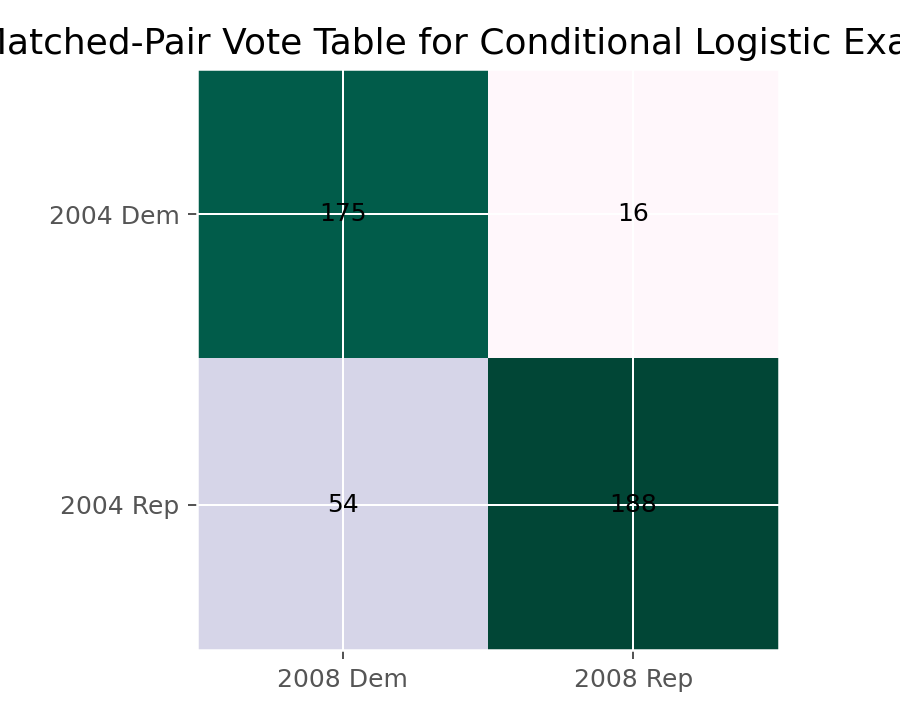

# 条件Logistic回归（Conditional Logistic Regression）

## 1. 方法概览

### 1.1 定义

条件 Logistic 回归用于分析匹配设计中的二元结局，通过对匹配组进行条件化来消去组特异截距，从而估计暴露效应。

### 1.2 它主要解决什么问题

- 研究问题：在配对或匹配设计中，暴露与二元结局之间的关联有多强。
- 适用任务：1:1 匹配病例-对照、匹配对前后比较、成组二元数据建模。
- 常见医学场景：年龄和性别匹配后的病例-对照研究，匹配对中的糖尿病暴露与心肌梗死关联。

### 1.3 直觉理解

条件 Logistic 回归的核心是：既然不同匹配组天生就不一样，那就不要硬比较组与组之间，而只比较同一匹配组内部谁暴露、谁结局发生。

## 2. 数学形式

### 2.1 核心公式

$$
\begin{aligned}
\operatorname{logit} P(Y_{it}=1) &= \alpha_i + \beta X_{it} \\
CL(\beta) &= \prod_{i:(Y_{i1}+Y_{i2}=1)} \frac{\exp(\beta)^{Y_{i2}}}{1+\exp(\beta)}
\end{aligned}
$$

对于 matched-pair 数据，

$$
\hat\beta = \log\frac{n_{12}}{n_{21}},
\qquad
SE(\hat\beta)=\sqrt{\frac{1}{n_{12}}+\frac{1}{n_{21}}}
$$

### 2.2 参数或统计量含义

- $\alpha_i$：第 $i$ 个匹配组的组特异截距。
- $\beta$：组内暴露效应。
- $n_{12}, n_{21}$：discordant pairs 的两种方向计数。

### 2.3 关键假设

- 数据来自匹配对或匹配组。
- 组内比较有意义，组间异质性通过条件化消除。
- 主要信息来自 discordant pairs。

## 3. 数据形式与输入输出

### 3.1 适合的数据形式

- 自变量类型：暴露变量，可为二元或连续。
- 因变量类型：二分类。
- 数据结构：每个匹配组多行记录，需有 `strata / pair_id`。
- 是否适合高维数据：不适合作为高维默认方法。
- 是否适合缺失较多数据：匹配数据缺失会直接损失有效对。
- 是否适合删失数据：不适合；尽管 `clogit` 在 R 中是通过 Cox 例程实现的，但问题本身不是生存分析。
- 是否适合重复测量数据：仅在成组逻辑建模意义下适用。

### 3.2 示例表格

条件 Logistic 回归最适合“每个匹配组多行记录”的格式，例如：

| pair_id | time_or_member | X | Y |
| --- | --- | --- | --- |
| 1 | 1 | 0 | 1 |
| 1 | 2 | 1 | 0 |
| 2 | 1 | 0 | 0 |
| 2 | 2 | 1 | 1 |
| 3 | 1 | 0 | 1 |

一个典型的 matched-pair 2x2 汇总表如下：

| 2004 Election | 2008 Democratic | 2008 Republican |
| --- | --- | --- |
| Democratic | 175 | 16 |
| Republican | 54 | 188 |

### 3.3 输入与产出

#### 输入

- 输入数据：匹配组 ID、暴露变量、二元结局。
- 关键变量：`pair_id / strata`、暴露、结局。
- 需要预处理的内容：长表整理、匹配组核对、稀疏组检查。

#### 产出

- 模型对象/统计结果：条件似然估计、系数、OR、Wald / LR 检验。
- 参数估计：组内 OR。
- 预测结果：通常不强调个体预测，更强调效应估计。
- 不确定性指标：标准误、区间估计。

## 4. 适用场景

- 适合：1:1 匹配病例-对照研究，配对二元设计。
- 不适合：独立样本、无匹配结构的数据。
- 使用前需要特别检查的点：匹配变量、discordant pairs 数量、是否真的需要条件化。

## 5. 实现

### 5.1 Python

常用包：

- `statsmodels`

```python
from statsmodels.discrete.conditional_models import ConditionalLogit

mod = ConditionalLogit(endog=y, exog=X, groups=pair_id)
res = mod.fit()
print(res.summary())
```

### 5.2 R

常用包：

- `survival`

```r
library(survival)

fit <- clogit(y ~ x + strata(pair_id), data = df)
summary(fit)
exp(coef(fit))
```

## 6. 结果如何解释

- 核心结果看什么：匹配组内部的 OR。
- 每个主要参数如何解释：$\exp(\beta)$ 表示在同一匹配组内，暴露组相对未暴露组的 odds ratio。
- 临床或医学意义如何表达：适合强调“在年龄、性别等已匹配条件下”的暴露效应。
- 常见误读：条件 Logistic 回归不利用 concordant pairs 的暴露信息来估计效应。

## 7. 推荐可视化

- 匹配对 2x2 热图。
- discordant pairs 条形图。
- 匹配组 OR 森林图。

### 7.1 图像示例

下图展示条件 Logistic 回归最常见的 2x2 配对表结构，强调 discordant pairs 在估计中的核心作用。



## 8. 优势、局限与常见坑

### 优势

- 能自然控制匹配组层面的固定差异。
- 是匹配病例-对照研究的经典模型。
- 解释聚焦于组内比较，往往更有因果设计意义。

### 局限

- 严重依赖 discordant pairs。
- 无匹配结构时不适合。
- 对数据整理要求高。

### 常见坑

- 把独立样本数据错用条件 Logistic 回归。
- 匹配组 ID 错误或重复。
- 只看 pair 数量，不看 discordant pair 数量。

## 9. 与相近方法的区别

- 和普通 Logistic 回归的区别：普通 Logistic 不控制匹配组截距。
- 和 McNemar 检验的区别：McNemar 更像最简单的 matched-pair 检验；条件 Logistic 回归可扩展到协变量建模。
- 和 Cox 回归的关系：R 中 `clogit` 是通过 Cox 例程实现的，但问题本质是匹配二元数据建模。

## 10. 医学研究中的典型应用

- 匹配病例-对照研究中的暴露效应估计。
- 前后配对二元结局的条件建模。
- 成组二元观察资料中剔除组特异截距的分析。

## 11. 相关方法

- [[Logistic回归（Logistic Regression）]]
- [[McNemar检验（McNemar Test）]]
- [[广义线性混合效应模型（Generalized Linear Mixed-Effects Model, GLMM）]]

## 12. 参考资料

- Breslow NE, Day NE. *Statistical Methods in Cancer Research, Volume I: The Analysis of Case-Control Studies*. IARC; 1980.
- statsmodels Developers. `statsmodels.discrete.conditional_models.ConditionalLogit`. statsmodels API Reference. [https://www.statsmodels.org/stable/generated/statsmodels.discrete.conditional_models.ConditionalLogit.html](https://www.statsmodels.org/stable/generated/statsmodels.discrete.conditional_models.ConditionalLogit.html) （访问日期：2026-07-02）
- R Core Team / survival package. `clogit`. R Manual. [https://stat.ethz.ch/R-manual/R-devel/library/survival/html/clogit.html](https://stat.ethz.ch/R-manual/R-devel/library/survival/html/clogit.html) （访问日期：2026-07-02）
