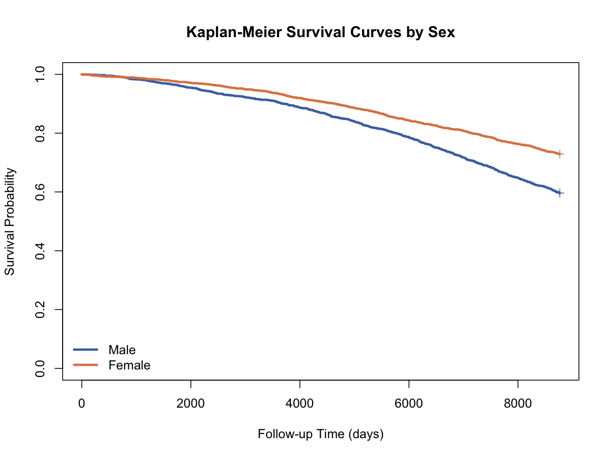

# Kaplan-Meier生存曲线（Kaplan-Meier Estimator）

## 1. 方法概览

### 1.1 定义

Kaplan-Meier 生存曲线是生存分析中最经典的非参数估计方法，用于在存在删失时估计生存函数 $S(t)=P(T>t)$。

### 1.2 它主要解决什么问题

- 研究问题：在不同时间点上，个体“仍未发生事件”的概率是多少。
- 适用任务：描述时间到事件结局、给出生存概率曲线、中位生存时间。
- 常见医学场景：全因死亡、生存率、复发前时间、装置失效时间。

### 1.3 直觉理解

Kaplan-Meier 曲线可以理解为“每发生一次事件就往下掉一格”，每次下降的幅度由该时点的事件数和风险集人数共同决定。删失不会让曲线下降，但会减少后续时点的风险集人数。

## 2. 数学形式

### 2.1 核心公式

$$
\hat S(t)
=
\prod_{t_i \le t}
\left(1-\frac{d_i}{n_i}\right)
$$

其中 $n_i$ 为时点 $t_i$ 前仍在风险集中的人数，$d_i$ 为该时点发生事件的人数。

### 2.2 参数或统计量含义

- $S(t)$：生存函数，表示事件时间超过 $t$ 的概率。
- $n_i$：时点 $t_i$ 前 at risk 的人数。
- $d_i$：时点 $t_i$ 发生事件的数目。
- Greenwood 公式：常用于估计 $\hat S(t)$ 的方差和区间。

### 2.3 关键假设

- 删失是独立 / 非信息性的。
- 同一时间点定义清晰，事件状态编码正确。
- 个体之间相互独立。

## 3. 数据形式与输入输出

### 3.1 适合的数据形式

- 自变量类型：可以无分组，也可加分组变量做分层曲线。
- 因变量类型：时间到事件结局。
- 数据结构：每行一个个体，至少有 `time` 和 `event` 两列。
- 是否适合高维数据：不适合作为高维默认工具。
- 是否适合缺失较多数据：可用，但时间或事件缺失需要单独处理。
- 是否适合删失数据：非常适合。
- 是否适合重复测量数据：不适合直接分析 time-varying covariates。

### 3.2 示例表格

下面是一个典型的生存数据结构示例：

| RANDID | TIMEDTH | DEATH | SEX | BMI | AGE_group |
| --- | --- | --- | --- | --- | --- |
| 2448 | 8766 | 0 | 0 | 26.97 | 1 |
| 6238 | 8766 | 0 | 1 | 28.73 | 1 |
| 9428 | 8766 | 0 | 0 | 25.34 | 1 |
| 10552 | 2956 | 1 | 1 | 28.58 | 2 |
| 11252 | 8766 | 0 | 1 | 23.10 | 1 |
| 11263 | 8766 | 0 | 1 | 30.30 | 1 |

### 3.3 输入与产出

#### 输入

- 输入数据：事件时间、事件指示变量、可选分组变量。
- 关键变量：`time`、`event`、`group`。
- 需要预处理的内容：确认删失编码、时间单位、随访窗口。

#### 产出

- 模型对象/统计结果：生存曲线、中位生存时间、任意时点的生存概率。
- 参数估计：非参数估计，无回归系数。
- 预测结果：生存概率曲线。
- 不确定性指标：点位区间、置信带、Greenwood 标准误。

## 4. 适用场景

- 适合：描述性生存分析、不同组的初步生存比较。
- 不适合：需要调整多个协变量时；比例风险回归问题。
- 使用前需要特别检查的点：删失比例、事件编码、时间单位、是否需要分层。

## 5. 实现

### 5.1 Python

常用包：

- `lifelines`

```python
from lifelines import KaplanMeierFitter

km = KaplanMeierFitter()
km.fit(durations=df["TIMEDTH"], event_observed=df["DEATH"])
km.plot_survival_function()
print(km.median_survival_time_)
```

### 5.2 R

常用包：

- `survival`

```r
library(survival)

fit <- survfit(Surv(TIMEDTH, DEATH) ~ sex_label, data = df, conf.type = "log-log")
summary(fit)
plot(fit)
```

## 6. 结果如何解释

- 核心结果看什么：生存曲线形状、中位生存时间、分组曲线分离程度。
- 每个主要参数如何解释：例如某时点 $S(t)=0.80$ 表示约 80% 个体在该时间点尚未发生事件。
- 临床或医学意义如何表达：适合表达某治疗组或某人群的“保留事件自由状态”的概率。
- 常见误读：Kaplan-Meier 曲线是生存概率，不是危险率；删失点不代表事件发生。

## 7. 推荐可视化

- 单组 Kaplan-Meier 曲线。
- 分组 Kaplan-Meier 曲线。
- Kaplan-Meier 曲线加删失标记。

### 7.1 图像示例

下图展示按性别分层后的 Kaplan-Meier 生存曲线，可直接用于比较不同组的整体生存模式。



## 8. 优势、局限与常见坑

### 优势

- 非参数、直观、解释强。
- 能自然处理右删失。
- 是生存分析最常用的入口工具。

### 局限

- 不能同时调整多个协变量。
- 主要用于描述和分组比较。
- 高删失或尾部风险集过小时不稳定。

### 常见坑

- 误把删失当事件。
- 忽略时间单位和随访窗口差异。
- 尾部样本过少时仍对曲线末端过度解读。

## 9. 与相近方法的区别

- 和 Nelson-Aalen 的区别：Kaplan-Meier 直接估计生存函数，Nelson-Aalen 先估计累积风险。
- 和 Log-rank 的区别：KM 是估计方法，Log-rank 是组间比较检验。
- 和 Cox 模型的区别：Cox 可以调整协变量，KM 主要做描述。

## 10. 医学研究中的典型应用

- 不同性别人群的长期死亡风险描述。
- 随访研究中的无事件生存概率估计。
- 临床研究报告里的中位生存时间和生存率曲线。

## 11. 相关方法

- [[Nelson-Aalen累积风险估计（Nelson-Aalen Estimator）]]
- [[Log-rank检验（Log-rank Test）]]
- [[Cox比例风险模型（Cox Proportional Hazards Model）]]

## 12. 参考资料

- Klein JP, Moeschberger ML. *Survival Analysis: Techniques for Censored and Truncated Data*. 2nd ed. Springer; 2003.
- R Core Team / survival package. `survfit`. R Manual. [https://stat.ethz.ch/R-manual/R-devel/library/survival/html/survfit.html](https://stat.ethz.ch/R-manual/R-devel/library/survival/html/survfit.html) （访问日期：2026-07-02）
