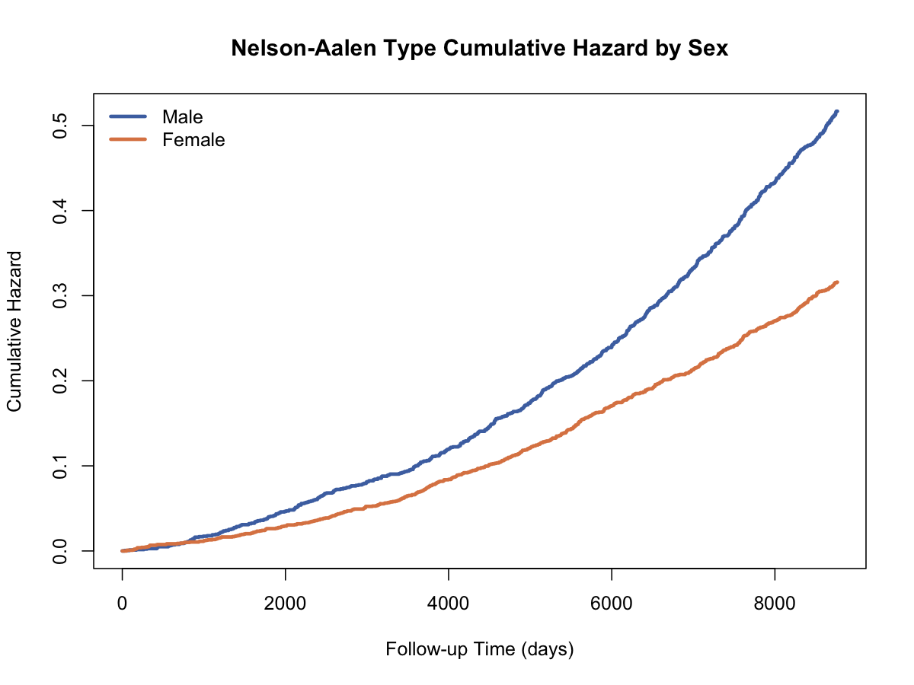

# Nelson-Aalen累积风险估计（Nelson-Aalen Estimator）

## 1. 方法概览

### 1.1 定义

Nelson-Aalen 估计是生存分析中对累积风险函数 $H(t)$ 的经典非参数估计方法。

### 1.2 它主要解决什么问题

- 研究问题：随着时间推移，累积风险增加了多少。
- 适用任务：累积风险函数估计、与 Cox 模型基线累积风险的概念衔接。
- 常见医学场景：描述随访期间风险累积速度，比较不同组风险积累模式。

### 1.3 直觉理解

Nelson-Aalen 估计把每个事件时点的“单位风险增量”逐步累加起来，因此它描述的是风险如何不断积累，而不是剩余生存概率。

## 2. 数学形式

### 2.1 核心公式

$$
\hat H(t)=\sum_{t_i \le t}\frac{d_i}{n_i}
$$

并可通过

$$
\hat S(t)=\exp[-\hat H(t)]
$$

得到对应的生存函数近似。

### 2.2 参数或统计量含义

- $\hat H(t)$：累积风险函数估计。
- $d_i$：时点 $t_i$ 的事件数。
- $n_i$：时点 $t_i$ 前风险集人数。

### 2.3 关键假设

- 删失是独立 / 非信息性的。
- 个体之间相互独立。
- 事件时点定义正确。

## 3. 数据形式与输入输出

### 3.1 适合的数据形式

- 自变量类型：可无分组，也可加分组变量做分层累积风险曲线。
- 因变量类型：时间到事件结局。
- 数据结构：每行一个个体，至少有 `time` 和 `event` 两列。
- 是否适合高维数据：不适合高维默认建模。
- 是否适合缺失较多数据：时间或事件缺失需单独处理。
- 是否适合删失数据：适合。
- 是否适合重复测量数据：不适合 time-varying covariates 直接分析。

### 3.2 示例表格

Nelson-Aalen 估计和 Kaplan-Meier 使用的是同一类生存数据结构：

| RANDID | TIMEDTH | DEATH | SEX | BMI | AGE_group |
| --- | --- | --- | --- | --- | --- |
| 2448 | 8766 | 0 | 0 | 26.97 | 1 |
| 6238 | 8766 | 0 | 1 | 28.73 | 1 |
| 9428 | 8766 | 0 | 0 | 25.34 | 1 |
| 10552 | 2956 | 1 | 1 | 28.58 | 2 |
| 11252 | 8766 | 0 | 1 | 23.10 | 1 |

### 3.3 输入与产出

#### 输入

- 输入数据：事件时间、事件指示变量、可选分组变量。
- 关键变量：`time`、`event`、`group`。
- 需要预处理的内容：删失编码、时间尺度、风险集定义。

#### 产出

- 模型对象/统计结果：累积风险曲线。
- 参数估计：非参数估计，无回归系数。
- 预测结果：任意时点的累积风险。
- 不确定性指标：可构造累积风险区间。

## 4. 适用场景

- 适合：关注风险积累过程、需要与 Cox 基线风险估计衔接的场景。
- 不适合：只想展示“存活概率”的普通读者沟通场景。
- 使用前需要特别检查的点：事件和删失定义、风险集人数。

## 5. 实现

### 5.1 Python

常用包：

- `lifelines`

```python
from lifelines import NelsonAalenFitter

naf = NelsonAalenFitter()
naf.fit(durations=df["TIMEDTH"], event_observed=df["DEATH"])
naf.plot_cumulative_hazard()
```

### 5.2 R

常用包：

- `survival`

```r
library(survival)

fit <- survfit(Surv(TIMEDTH, DEATH) ~ sex_label, data = df)
plot(fit, fun = "cumhaz")
```

## 6. 结果如何解释

- 核心结果看什么：累积风险曲线斜率和组间分离。
- 每个主要参数如何解释：$\hat H(t)$ 越大，表示到时间 $t$ 为止累积的风险越大。
- 临床或医学意义如何表达：适合表达风险随时间“累加”的速度。
- 常见误读：累积风险不是概率，不能直接按百分比解释。

## 7. 推荐可视化

- 单组累积风险曲线。
- 分组累积风险曲线。
- 与 Kaplan-Meier 曲线配对展示。

### 7.1 图像示例

下图展示按性别分层后的累积风险曲线，适合用于呈现风险随时间的积累过程。



## 8. 优势、局限与常见坑

### 优势

- 对累积风险的解释自然。
- 与 Cox 基线风险估计直接相关。
- 与 Kaplan-Meier 渐近等价。

### 局限

- 对非统计背景读者不如 KM 直观。
- 仍然不能调整协变量。
- 尾部样本少时不稳定。

### 常见坑

- 把累积风险当成生存概率。
- 忽略删失对风险集的影响。
- 不区分瞬时风险和累积风险。

## 9. 与相近方法的区别

- 和 Kaplan-Meier 的区别：Kaplan-Meier 估计的是生存概率，Nelson-Aalen 估计的是累积风险。
- 和 Cox 模型的区别：Cox 是回归模型；Nelson-Aalen 是非参数描述性估计。
- 应该如何选择：面向风险累积解释时更偏向 Nelson-Aalen，面向生存概率展示时更偏向 KM。

## 10. 医学研究中的典型应用

- 展示不同人群的累积死亡风险。
- 作为 Cox PH 基线风险估计概念的过渡。
- 配合生存曲线一起帮助解释风险结构。

## 11. 相关方法

- [[Kaplan-Meier生存曲线（Kaplan-Meier Estimator）]]
- [[Cox比例风险模型（Cox Proportional Hazards Model）]]

## 12. 参考资料

- Klein JP, Moeschberger ML. *Survival Analysis: Techniques for Censored and Truncated Data*. 2nd ed. Springer; 2003.
- R Core Team / survival package. `survfit`. R Manual. [https://stat.ethz.ch/R-manual/R-devel/library/survival/html/survfit.html](https://stat.ethz.ch/R-manual/R-devel/library/survival/html/survfit.html) （访问日期：2026-07-02）
