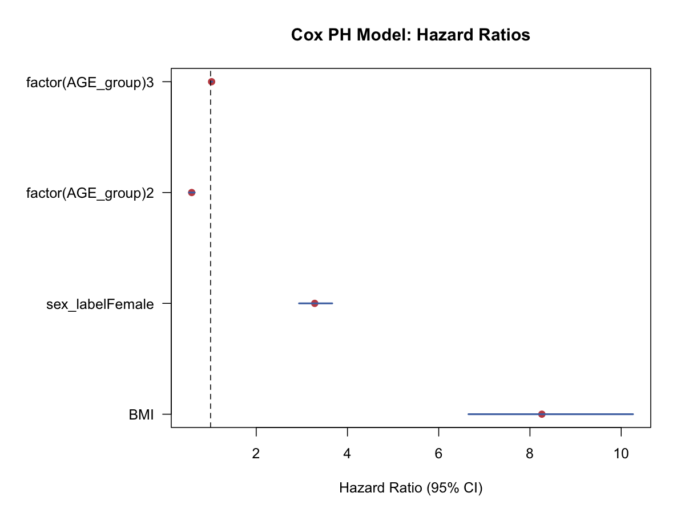

# Cox比例风险模型（Cox Proportional Hazards Model）

## 1. 方法概览

### 1.1 定义

Cox 比例风险模型是最常用的生存回归模型，在不指定基线风险函数具体形式的情况下，估计协变量对危险率的相对影响。

### 1.2 它主要解决什么问题

- 研究问题：在调整多个协变量后，哪些因素会提高或降低事件发生风险。
- 适用任务：时间到事件回归、危险比估计、协变量调整。
- 常见医学场景：死亡风险、复发风险、装置失效风险建模。

### 1.3 直觉理解

Cox 模型把总风险拆成两部分：一部分是所有人共享的“基线风险”，另一部分是由协变量带来的“相对风险倍数”。它最吸引人的地方是，不需要事先假设基线风险的具体形状。

## 2. 数学形式

### 2.1 核心公式

$$
h(t\mid X_i)=h_0(t)\exp(X_i^\top\boldsymbol{\beta})
$$

对应的 hazard ratio 为：

$$
HR(X_1,X_2)=\exp[(X_1-X_2)^\top\boldsymbol{\beta}]
$$

### 2.2 参数或统计量含义

- $h_0(t)$：基线危险率函数。
- $\boldsymbol{\beta}$：协变量对 log hazard 的效应。
- $\exp(\beta_j)$：协变量每增加 1 单位对应的 hazard ratio。
- partial likelihood：Cox 模型估计 $\boldsymbol{\beta}$ 的核心工具。

### 2.3 关键假设

- 比例风险（PH）假设成立。
- 删失独立 / 非信息性。
- 协变量测量合理、时间起点清晰。

## 3. 数据形式与输入输出

### 3.1 适合的数据形式

- 自变量类型：连续、二分类、多分类都可。
- 因变量类型：时间到事件结局。
- 数据结构：每行一个个体的生存数据，至少有 `time` 和 `event`。
- 是否适合高维数据：可扩展，但高维时需更谨慎。
- 是否适合缺失较多数据：需先明确缺失机制和处理策略。
- 是否适合删失数据：非常适合。
- 是否适合重复测量数据：time-varying covariate 需要扩展形式。

### 3.2 示例表格

下面是适合 Cox 模型的基本数据形态：

| RANDID | TIMEDTH | DEATH | SEX | BMI | AGE_group |
| --- | --- | --- | --- | --- | --- |
| 2448 | 8766 | 0 | 0 | 26.97 | 1 |
| 6238 | 8766 | 0 | 1 | 28.73 | 1 |
| 9428 | 8766 | 0 | 0 | 25.34 | 1 |
| 10552 | 2956 | 1 | 1 | 28.58 | 2 |
| 11252 | 8766 | 0 | 1 | 23.10 | 1 |

一个简单示例模型的 HR 结果可整理为：

| 变量 | HR | 95% CI |
| --- | --- | --- |
| BMI | 1.022 | 1.009 - 1.036 |
| Female vs Male | 0.586 | 0.527 - 0.651 |
| AGE_group 2 vs 1 | 3.282 | 2.938 - 3.666 |
| AGE_group 3 vs 1 | 8.261 | 6.653 - 10.258 |

### 3.3 输入与产出

#### 输入

- 输入数据：时间、事件指示变量、协变量。
- 关键变量：`time`、`event`、协变量矩阵、ties 处理方法。
- 需要预处理的内容：删失编码、分类变量编码、必要时构造 time-varying 格式。

#### 产出

- 模型对象/统计结果：系数、HR、Wald / LR / Score 检验。
- 参数估计：$\boldsymbol{\beta}$ 和 HR。
- 预测结果：相对风险、分层预测生存曲线、基线累积风险。
- 不确定性指标：标准误、HR 区间、PH 诊断。

## 4. 适用场景

- 适合：需要调整多个协变量的生存分析。
- 不适合：比例风险假设明显不成立又不做扩展时。
- 使用前需要特别检查的点：PH 假设、ties、删失模式、异常影响点。

## 5. 实现

### 5.1 Python

常用包：

- `lifelines`

```python
from lifelines import CoxPHFitter

cph = CoxPHFitter()
cph.fit(df, duration_col="TIMEDTH", event_col="DEATH")
cph.print_summary()
```

### 5.2 R

常用包：

- `survival`

```r
library(survival)

fit <- coxph(Surv(TIMEDTH, DEATH) ~ BMI + sex_label + factor(AGE_group), data = df)
summary(fit)
```

## 6. 结果如何解释

- 核心结果看什么：HR 的方向、大小、区间和 PH 诊断。
- 每个主要参数如何解释：例如 HR=1.022 表示 BMI 每增加 1 单位，死亡风险约增加 2.2%。
- 临床或医学意义如何表达：HR 是相对风险尺度，不直接等于生存概率差。
- 常见误读：HR 不是固定时间点的风险差，也不是 odds ratio。

## 7. 推荐可视化

- HR 森林图。
- 分组预测生存曲线。
- 累积风险曲线和残差诊断图。

### 7.1 图像示例

下图用区间图展示 Cox 模型的 hazard ratio 及其 95% 置信区间。



## 8. 优势、局限与常见坑

### 优势

- 不需指定基线风险形式。
- 能自然处理删失。
- 是医学时间到事件建模的标准工具。

### 局限

- 依赖比例风险假设。
- 解释主要在相对风险尺度。
- ties 和时间变协变量会增加复杂度。

### 常见坑

- 不检查 PH 假设。
- 把 HR 解释成绝对风险差。
- 只报 p 值，不报 HR 区间和诊断。

## 9. 与相近方法的区别

- 和 Kaplan-Meier / Log-rank 的区别：Cox 可以调整协变量。
- 和 AFT 的区别：Cox 在 hazard 尺度建模，AFT 在生存时间尺度建模。
- 和条件 Logistic 回归的关系：精确 ties 的 Cox 偏似然与某些条件 Logistic 结构有关。

## 10. 医学研究中的典型应用

- 基线风险因素与长期死亡风险建模。
- 调整混杂后的治疗生存效应评估。
- 构建临床风险评分模型。

## 11. 相关方法

- [[Kaplan-Meier生存曲线（Kaplan-Meier Estimator）]]
- [[Log-rank检验（Log-rank Test）]]
- [[加速失效时间模型（Accelerated Failure Time, AFT, Model）]]

## 12. 参考资料

- Therneau TM, Grambsch PM. *Modeling Survival Data: Extending the Cox Model*. Springer; 2000.
- R Core Team / survival package. `coxph`. R Manual. [https://stat.ethz.ch/R-manual/R-devel/library/survival/html/coxph.html](https://stat.ethz.ch/R-manual/R-devel/library/survival/html/coxph.html) （访问日期：2026-07-02）
