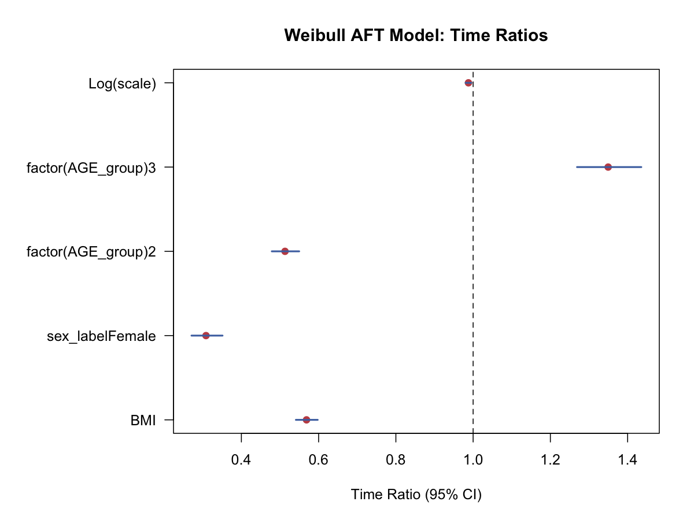

# 加速失效时间模型（Accelerated Failure Time, AFT, Model）

## 1. 方法概览

### 1.1 定义

AFT 模型直接在生存时间尺度上建模，强调协变量如何“拉长”或“缩短”事件发生时间。

### 1.2 它主要解决什么问题

- 研究问题：某些因素会让事件更早发生，还是更晚发生。
- 适用任务：参数生存回归、时间比解释、生存时间加速 / 减速效应分析。
- 常见医学场景：治疗是否延长生存时间，危险因素是否缩短无事件时间。

### 1.3 直觉理解

AFT 模型把协变量的作用理解为“时间轴的伸缩”。如果一个变量的 time ratio 大于 1，意味着在该变量较高时，事件时间整体被拉长；小于 1 则意味着事件时间被压缩。

## 2. 数学形式

### 2.1 核心公式

$$
\log(T)=X^\top\beta+\epsilon
$$

因此

$$
T=e^{X^\top\beta}e^\epsilon
$$

### 2.2 参数或统计量含义

- $\beta_j$：协变量在 log survival time 尺度上的效应。
- $\exp(\beta_j)$：time ratio，表示事件时间被放大或缩小的倍数。
- 常见分布：Weibull、log-normal、log-logistic。

### 2.3 关键假设

- 生存时间在某个参数分布族下可被合理近似。
- 删失独立 / 非信息性。
- 模型形式正确。

## 3. 数据形式与输入输出

### 3.1 适合的数据形式

- 自变量类型：连续、二分类、多分类都可。
- 因变量类型：时间到事件结局。
- 数据结构：每行一个个体，含 `time`、`event` 和协变量。
- 是否适合高维数据：不是默认首选。
- 是否适合缺失较多数据：可用，但需先处理缺失。
- 是否适合删失数据：适合。
- 是否适合重复测量数据：不适合 time-varying covariate 直接分析。

### 3.2 示例表格

下面是适合 AFT 模型的基本数据结构：

| RANDID | TIMEDTH | DEATH | SEX | BMI | AGE_group |
| --- | --- | --- | --- | --- | --- |
| 2448 | 8766 | 0 | 0 | 26.97 | 1 |
| 6238 | 8766 | 0 | 1 | 28.73 | 1 |
| 9428 | 8766 | 0 | 0 | 25.34 | 1 |
| 10552 | 2956 | 1 | 1 | 28.58 | 2 |
| 11252 | 8766 | 0 | 1 | 23.10 | 1 |

一个 Weibull AFT 示例模型的时间比（time ratio）可整理为：

| 变量 | Time Ratio | 95% CI |
| --- | --- | --- |
| BMI | 0.988 | 0.981 - 0.995 |
| Female vs Male | 1.350 | 1.269 - 1.435 |
| AGE_group 2 vs 1 | 0.513 | 0.479 - 0.550 |
| AGE_group 3 vs 1 | 0.308 | 0.271 - 0.351 |

### 3.3 输入与产出

#### 输入

- 输入数据：时间、事件、协变量。
- 关键变量：`time`、`event`、分布假设。
- 需要预处理的内容：删失编码、时间单位、分布选择。

#### 产出

- 模型对象/统计结果：系数、time ratio、分布参数。
- 参数估计：$\boldsymbol{\beta}$ 及其 time ratio。
- 预测结果：条件生存时间分布、分位数生存时间。
- 不确定性指标：标准误、区间估计。

## 4. 适用场景

- 适合：希望直接从时间尺度解释效应时。
- 不适合：难以假设生存时间分布时。
- 使用前需要特别检查的点：分布拟合、删失模式、与 PH 解释的差异。

## 5. 实现

### 5.1 Python

常用包：

- `lifelines`

```python
from lifelines import WeibullAFTFitter

aft = WeibullAFTFitter()
aft.fit(df, duration_col="TIMEDTH", event_col="DEATH")
aft.print_summary()
```

### 5.2 R

常用包：

- `survival`

```r
library(survival)

fit <- survreg(Surv(TIMEDTH, DEATH) ~ BMI + sex_label + factor(AGE_group),
               data = df, dist = "weibull")
summary(fit)
exp(coef(fit))  # time ratios
```

## 6. 结果如何解释

- 核心结果看什么：time ratio 方向和大小。
- 每个主要参数如何解释：例如 time ratio = 1.35 可理解为该组的事件时间大约延长 35%。
- 临床或医学意义如何表达：AFT 的时间尺度往往更贴近“延长多久”这类问题。
- 常见误读：AFT 的 time ratio 与 Cox 的 hazard ratio 不是一回事。

## 7. 推荐可视化

- time ratio 森林图。
- 分组预测生存曲线。
- parametric fit 与 KM 曲线对照图。

### 7.1 图像示例

下图用区间图展示 Weibull AFT 模型中各协变量对应的时间比及其 95% 区间。



## 8. 优势、局限与常见坑

### 优势

- 直接在时间尺度解释效应。
- 适合回答“时间延长 / 缩短多少”的问题。
- 在某些数据上比 PH 解释更自然。

### 局限

- 需要指定分布形式。
- 对分布设定敏感。
- 在实践中使用频率低于 Cox。

### 常见坑

- 把 time ratio 当成 hazard ratio。
- 不检查所选分布是否合理。
- 只因系数显著就忽略模型拟合质量。

## 9. 与相近方法的区别

- 和 Cox 模型的区别：AFT 在时间尺度解释，Cox 在 hazard 尺度解释。
- 和 Kaplan-Meier 的区别：AFT 是参数回归模型，KM 是非参数描述工具。
- 和 Weibull PH 的关系：Weibull 是少数同时兼容 AFT 和 PH 解释的分布族。

## 10. 医学研究中的典型应用

- 治疗是否延长生存时间。
- 某风险因素是否加速事件发生。
- 作为 Cox 模型之外的参数化补充分析。

## 11. 相关方法

- [[Cox比例风险模型（Cox Proportional Hazards Model）]]
- [[Kaplan-Meier生存曲线（Kaplan-Meier Estimator）]]

## 12. 参考资料

- Klein JP, Moeschberger ML. *Survival Analysis: Techniques for Censored and Truncated Data*. 2nd ed. Springer; 2003.
- R Core Team / survival package. `survreg`. R Manual. [https://stat.ethz.ch/R-manual/R-devel/library/survival/html/survreg.html](https://stat.ethz.ch/R-manual/R-devel/library/survival/html/survreg.html) （访问日期：2026-07-02）
