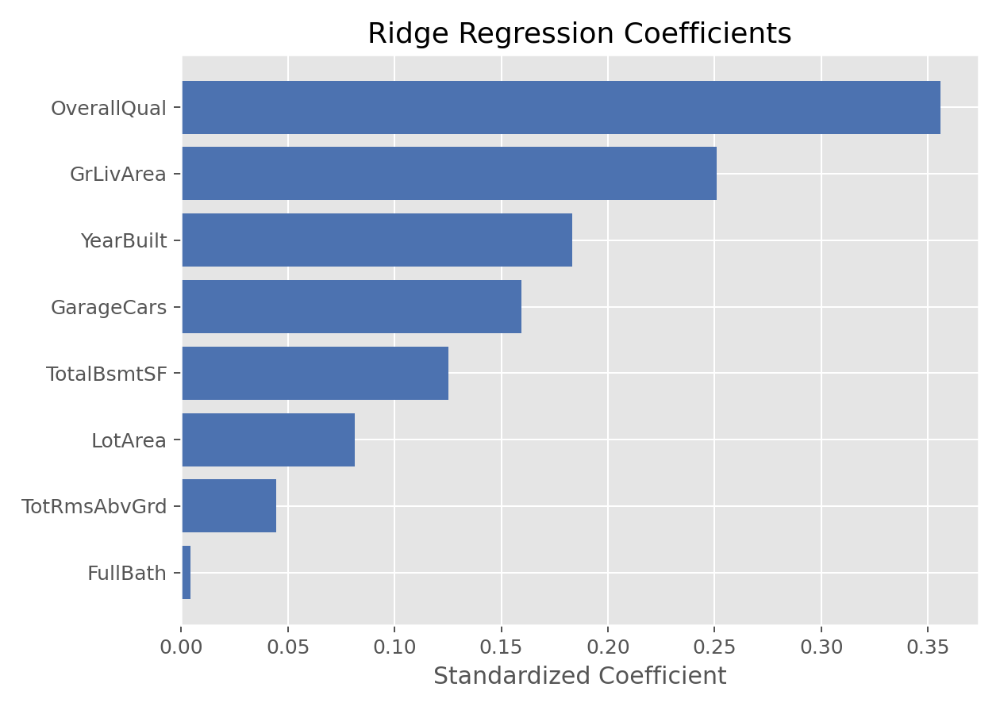

# Ridge回归（Ridge Regression）

## 1. 方法概览

### 1.1 一句话本质

Ridge 回归给回归系数套上一根「橡皮筋」：允许每个变量都参与预测，但惩罚过大的系数，让模型更稳。

### 1.2 定义

Ridge 回归是在普通最小二乘回归中加入 L2 正则化项的方法。它最常用于连续结局预测，尤其适合变量较多、变量之间高度相关、普通线性回归系数不稳定的场景。

### 1.3 它主要解决什么问题

- 研究问题：当多个指标携带相似信息时，怎样避免线性回归系数被数据噪声放大。
- 适用任务：连续结局预测、多重共线性缓解、稳定系数估计。
- 常见医学场景：多个实验室指标联合预测风险评分，影像组学特征预测病灶体积，多项代谢指标预测连续生理结局。

### 1.4 直觉与类比

普通线性回归像让每个变量自由拉动预测值；如果两个变量几乎说的是同一件事，模型可能今天把功劳给 A，明天把功劳给 B，系数大幅摇摆。Ridge 像在每个系数上加弹簧：谁都可以出力，但出力越大惩罚越重，于是模型倾向于把相关变量的贡献分摊得更平滑。

## 2. 核心思想与原理

### 2.1 它到底在解决什么根本困难

普通最小二乘的系数为 $(\mathbf X^\top\mathbf X)^{-1}\mathbf X^\top\mathbf y$。当自变量高度相关时，$\mathbf X^\top\mathbf X$ 接近不可逆，哪怕 $y$ 中有一点噪声，也会被逆矩阵放大成很大的系数波动。根本困难是：**用完全自由的系数去拟合含噪声的相关变量，会得到低偏倚但高方差的模型**。

### 2.2 关键洞察

Ridge 的关键洞察是主动接受一点偏倚，换取大幅降低方差。它在损失函数中加入 $\lambda\sum_j\beta_j^2$，使大系数付出额外代价。这样模型不再追求把训练误差压到最低，而是追求「训练误差可以略高，但系数不要太夸张」，这通常能改善新数据上的表现。

### 2.3 与朴素/相邻做法的对比

- 相对 [[线性回归（Linear Regression）]]：Ridge 多了 L2 惩罚，系数会向 0 收缩，但一般不会正好等于 0。
- 相对删除高度相关变量：Ridge 不必强行二选一，而是保留相关变量并分摊贡献。
- 相对 [[Lasso回归（Lasso Regression）]]：Lasso 会做变量选择，Ridge 更像稳定预测器，适合希望保留全部变量信息的场景。

## 3. 数学形式

### 3.1 核心公式

Ridge 回归求解：

$$
\hat{\boldsymbol{\beta}}_{\mathrm{ridge}}
=
\operatorname*{arg\,min}_{\boldsymbol{\beta}}
\left[
\sum_{i=1}^{n}(y_i-\mathbf x_i^\top\boldsymbol{\beta})^2
+\lambda\sum_{j=1}^{p}\beta_j^2
\right]
$$

当截距不惩罚、特征已中心化时，闭式解为：

$$
\hat{\boldsymbol{\beta}}_{\mathrm{ridge}}
=
(\mathbf X^\top\mathbf X+\lambda\mathbf I)^{-1}\mathbf X^\top\mathbf y
$$

这个式子在说：在普通回归的矩阵里加上一块 $\lambda\mathbf I$，让原本不稳定的逆矩阵变得更好求，也让系数整体缩小。

### 3.2 推导脉络

1. 从最小二乘损失 $\sum_i(y_i-\hat y_i)^2$ 出发，它只关心训练误差。
2. 加入约束「系数平方和不要太大」，等价于惩罚 $\lambda\sum_j\beta_j^2$。
3. 对目标函数求导并令导数为 0，得到 $(\mathbf X^\top\mathbf X+\lambda\mathbf I)\hat{\boldsymbol\beta}=\mathbf X^\top\mathbf y$。
4. $\lambda$ 越大，系数越向 0 收缩；$\lambda=0$ 时退回普通最小二乘。

### 3.3 参数与统计量含义

- $\lambda$：正则化强度，越大表示越不允许系数变大。
- $\boldsymbol{\beta}$：回归系数，通常要求特征标准化后再比较大小。
- L2 惩罚：平方惩罚，大系数会受到更强惩罚，但不会产生精确 0。
- 交叉验证误差：选择 $\lambda$ 的常用依据。
- 有效自由度：Ridge 仍用全部变量，但模型复杂度会随 $\lambda$ 增大而下降。

### 3.4 关键假设(含违反后果)

| 假设 | 含义 | 违反后会怎样 | 如何粗查 |
| --- | --- | --- | --- |
| 线性可加 | 结局均值可由变量线性组合近似 | 预测偏差明显 | 残差图、加入非线性项或样条 |
| 训练和应用人群相似 | 未来数据来自相近分布 | 泛化性能下降 | 外部验证、时间切分验证 |
| 特征尺度可比 | 惩罚应公平作用于各变量 | 大尺度变量被惩罚更重或更轻 | 标准化连续变量 |
| 缺失机制已处理 | 输入矩阵无系统性缺失偏倚 | 系数和预测有偏 | 缺失模式图、多重插补 |
| 结局连续且误差可接受 | 主要用于连续结局平方误差 | 二分类或删失结局不合适 | 换 Logistic/生存正则化模型 |

## 4. 手把手算例

为了能手算，使用 4 个观测、3 个已经中心化且标准化的正交特征。设 $\mathbf X^\top\mathbf X=\mathbf I$，$\mathbf X^\top\mathbf y=(3,\ 0.8,\ 0.3)$，所以普通 OLS 系数就是：

$$
\hat{\boldsymbol\beta}_{\mathrm{OLS}}=(3,\ 0.8,\ 0.3)
$$

这可对应下面这张小表：

| 观测 | x1 | x2 | x3 | y |
| --- | --- | --- | --- | --- |
| 1 | 0.5 | 0.5 | 0.5 | 2.05 |
| 2 | 0.5 | -0.5 | -0.5 | 0.95 |
| 3 | -0.5 | 0.5 | -0.5 | -1.25 |
| 4 | -0.5 | -0.5 | 0.5 | -1.75 |

**Step 1：写出 Ridge 在正交特征下的简化公式。**

因为 $\mathbf X^\top\mathbf X=\mathbf I$：

$$
\hat\beta_j^{\mathrm{ridge}}=\frac{z_j}{1+\lambda},\qquad z_j=(\mathbf X^\top\mathbf y)_j
$$

**Step 2：取 $\lambda=1$。**

$$
\hat{\boldsymbol\beta}_{\mathrm{ridge}}
=
\left(\frac{3}{2},\frac{0.8}{2},\frac{0.3}{2}\right)
=(1.5,\ 0.4,\ 0.15)
$$

**Step 3：读结果。**

三个变量都还在模型中，只是全部减半。最大信号 $x1$ 从 3 收到 1.5，小信号 $x3$ 从 0.3 收到 0.15，但没有被删掉。

**结论：** Ridge 的动作是「整体收缩」，不是「变量筛选」。它牺牲一点训练拟合强度，换来更平滑、更不容易被噪声牵着走的系数。

## 5. 数据形式与输入输出

### 5.1 适合的数据形式

- 自变量类型：连续变量、哑变量编码后的分类变量、标准化后的高维特征。
- 因变量类型：连续型。
- 数据结构：宽表数据，每行一个样本，每列一个候选特征。
- 是否适合高维数据：适合，尤其适合 $p$ 接近或大于 $n$ 且变量相关的场景。
- 是否适合缺失较多数据：需先处理缺失，Ridge 本身不解决缺失。
- 是否适合删失数据：普通 Ridge 不适合；需正则化 Cox 等扩展。
- 是否适合重复测量数据：不直接适合；需混合模型、GEE 或先定义独立样本层级。

### 5.2 示例表格

以连续房价预测或临床连续风险评分预测为例：

| OverallQual | GrLivArea | GarageCars | TotalBsmtSF | YearBuilt | SalePrice |
| --- | --- | --- | --- | --- | --- |
| 7 | 1710 | 2 | 856 | 2003 | 208500 |
| 6 | 1262 | 2 | 1262 | 1976 | 181500 |
| 7 | 1786 | 2 | 920 | 2001 | 223500 |
| 7 | 1717 | 3 | 756 | 1915 | 140000 |
| 8 | 2198 | 3 | 1145 | 2000 | 250000 |

### 5.3 输入与产出

#### 输入

- 输入数据：连续结局 $\mathbf y$ 和特征矩阵 $\mathbf X$。
- 关键变量：$\lambda$ 或软件中的 `alpha`。
- 需要预处理的内容：缺失处理、分类变量编码、连续变量标准化、训练/验证划分。

#### 产出

- 模型对象/统计结果：Ridge 系数、截距、最佳 $\lambda$。
- 参数估计：收缩后的每个特征系数。
- 预测结果：连续型预测值。
- 不确定性指标：交叉验证误差、测试集 MSE、RMSE、$R^2$；传统 p 值通常不是重点。

## 6. 适用场景

- 适合：变量相关性强、预测导向、希望保留全部变量、普通 OLS 系数不稳定。
- 不适合：目标是获得很少几个变量的稀疏模型；需要正式因果解释；结局为删失时间。
- 使用前需要特别检查的点：标准化是否在训练集内完成、$\lambda$ 是否由交叉验证选择、外部验证性能是否稳定。

## 7. 实现

### 7.1 Python

常用包:

- `scikit-learn`

```python
from sklearn.linear_model import RidgeCV
from sklearn.pipeline import make_pipeline
from sklearn.preprocessing import StandardScaler
from sklearn.metrics import mean_squared_error

alphas = [0.01, 0.1, 1, 10, 100]
model = make_pipeline(
    StandardScaler(),
    RidgeCV(alphas=alphas, cv=5)
)

model.fit(X_train, y_train)
y_pred = model.predict(X_test)
print(mean_squared_error(y_test, y_pred, squared=False))
print(model.named_steps["ridgecv"].alpha_)
```

### 7.2 R

常用包:

- `glmnet`

```r
library(glmnet)

x <- model.matrix(SalePrice ~ . - 1, data = train_df)
y <- train_df$SalePrice

fit <- cv.glmnet(x, y, alpha = 0, standardize = TRUE)
coef(fit, s = "lambda.min")

x_test <- model.matrix(SalePrice ~ . - 1, data = test_df)
pred <- predict(fit, newx = x_test, s = "lambda.min")
```

## 8. 结果如何解读

- 核心结果看什么：最佳 $\lambda$、测试集误差、系数路径是否随 $\lambda$ 平滑收缩。
- 每个主要参数如何解读：在特征标准化后，系数方向仍表示变量与结局的正负关系，但数值已被惩罚收缩。
- 临床或医学意义如何表达：更适合说「用于稳定预测」而不是说某变量有独立因果效应。
- 常见误读：系数变小不代表变量不重要，只表示模型用更保守的权重控制过拟合。

## 9. 假设诊断与稳健性

- 标准化检查：确认标准化参数只从训练集学习，避免数据泄漏。
- $\lambda$ 稳定性：查看交叉验证误差曲线，避免最佳值只由单次划分偶然决定。
- 外部验证：在时间外、中心外或独立队列上验证预测性能。
- 残差诊断：看真实值-预测值图和残差图，识别非线性、异方差和离群点。
- 共线性诊断：Ridge 能缓解共线性导致的方差膨胀，但不能让错误变量变成因果解释。

## 10. 推荐可视化

- 系数路径图：横轴为 $\lambda$，纵轴为标准化系数，观察整体收缩。
- 交叉验证误差曲线：展示最佳 $\lambda$ 和 1-SE 规则。
- 真实值 vs 预测值散点图：评估预测校准。

### 10.1 图像示例

下图展示 Ridge 回归在房价建模中的标准化系数分布，体现了「整体收缩但不清零」的特征。



## 11. 优势、局限与常见坑

### 优势

- 对多重共线性和小样本噪声更稳健。
- 保留所有变量信息，适合相关变量组共同预测。
- 计算稳定，交叉验证选参成熟。

### 局限

- 不产生稀疏模型，不能自动筛出少数变量。
- 系数有偏，传统 OLS 式 p 值不再是重点。
- 若真实关系强非线性，单纯 Ridge 仍会偏。

### 常见坑

- 不标准化就比较系数大小。
- 在全数据上标准化后再切分训练测试，造成数据泄漏。
- 把 Ridge 的稳定预测系数解释成因果效应。
- 只报告训练误差，不报告交叉验证或外部验证误差。

## 12. 与相近方法的区别

- 和 [[线性回归（Linear Regression）]] 的区别：线性回归只最小化误差，Ridge 还惩罚系数平方和。
- 和 [[Lasso回归（Lasso Regression）]] 的区别：Ridge 收缩但不清零，Lasso 可以把变量删到 0。
- 和 [[弹性网络回归（Elastic Net Regression）]] 的区别：Elastic Net 同时有 L1 和 L2，兼顾稀疏性和相关变量组稳定性。
- 如何选择：想保留全部相关变量并稳定预测时用 Ridge；想做变量筛选时看 Lasso 或 Elastic Net。

## 13. 医学研究中的典型应用

- 多个相关实验室指标联合预测连续风险评分或生理指标。
- 影像组学、代谢组学中变量多且相关性强的连续结局预测。
- 小样本多变量模型中，作为比普通 OLS 更稳健的基线模型。

## 14. 关键术语

- **正则化（Regularization）**：在拟合误差外增加惩罚项，控制模型复杂度。
- **L2 惩罚（L2 Penalty）**：对系数平方和进行惩罚，会平滑收缩系数。
- **收缩（Shrinkage）**：把系数往 0 拉，降低方差。
- **多重共线性（Multicollinearity）**：多个自变量高度相关，导致普通回归系数不稳定。
- **超参数（Hyperparameter）**：训练前或通过验证选择的参数，如 $\lambda$。
- **系数路径（Coefficient Path）**：正则化强度变化时，每个系数的变化轨迹。
- **数据泄漏（Data Leakage）**：验证或测试信息进入训练流程，使性能估计过于乐观。

## 15. 相关方法

- [[线性回归（Linear Regression）]]
- [[Lasso回归（Lasso Regression）]]
- [[弹性网络回归（Elastic Net Regression）]]
- [[嵌入式特征选择（Embedded Feature Selection）]]
- [[相关系数特征选择（Correlation-based Feature Selection）]]

## 16. 参考资料

- Hoerl AE, Kennard RW. Ridge regression: biased estimation for nonorthogonal problems. *Technometrics*. 1970;12(1):55-67.
- Hastie T, Tibshirani R, Friedman J. *The Elements of Statistical Learning*. 2nd ed. Springer; 2009.
- James G, Witten D, Hastie T, Tibshirani R. *An Introduction to Statistical Learning*. 2nd ed. Springer; 2021.
- Friedman J, Hastie T, Tibshirani R. Regularization paths for generalized linear models via coordinate descent. *J Stat Softw*. 2010;33(1):1-22.
