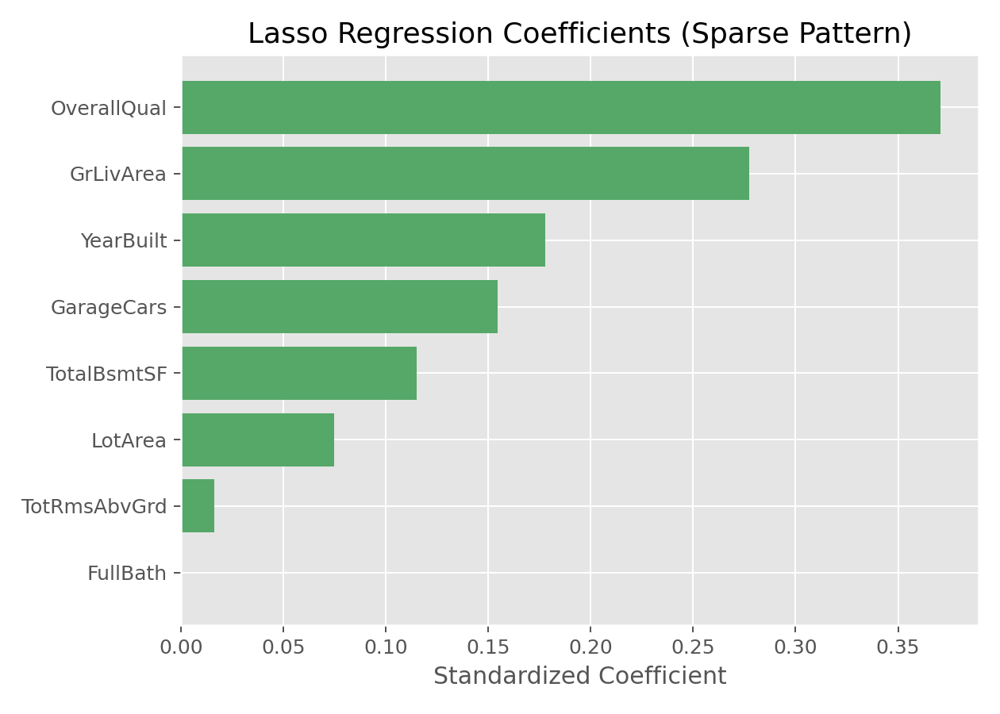

# Lasso回归（Lasso Regression）

## 1. 方法概览

### 1.1 定义

Lasso 回归是在普通线性回归中加入 L1 正则化项的一种方法，它不仅能做回归拟合，还能自动把部分不重要特征的系数压缩到 0，从而实现变量选择。

### 1.2 它主要解决什么问题

- 研究问题：在特征较多的情况下，如何做更简洁、更稀疏的回归建模。
- 适用任务：连续结局预测、变量筛选、特征降噪。
- 常见医学场景：多变量临床预测、组学数据初筛、影像组学特征压缩。

### 1.3 直觉理解

Lasso 可以理解成“边拟合、边做筛选”。它会优先保留对预测最有贡献的变量，把贡献较弱的变量系数直接压成 0。

## 2. 数学形式

### 2.1 核心公式

$$
\hat{\boldsymbol{\beta}}
=
\arg\min_{\boldsymbol{\beta}}
\left[
\sum_{i=1}^n (y_i - \mathbf{x}_i^\top \boldsymbol{\beta})^2
+
\lambda \sum_{j=1}^p |\beta_j|
\right]
$$

### 2.2 参数或统计量含义

- $\lambda$：正则化强度。
- L1 惩罚：促使部分系数被压到 0。
- 稀疏性：Lasso 最大的特点是得到“稀疏模型”。

### 2.3 关键假设

- 结局为连续型。
- 线性可加结构基本合理。
- 特征已做合理预处理，通常建议标准化。

## 3. 数据形式与输入输出

### 3.1 适合的数据形式

- 自变量类型：连续变量为主，也可包含编码后的分类变量。
- 因变量类型：连续型。
- 数据结构：宽表数据。
- 是否适合高维数据：适合高维、特征较多的场景。
- 是否适合缺失较多数据：需先完成缺失处理。
- 是否适合删失数据：不适合。
- 是否适合重复测量数据：不直接适合。

### 3.2 示例表格

下面是适合 Lasso 回归的典型宽表结构：

| OverallQual | GrLivArea | GarageCars | TotalBsmtSF | YearBuilt | SalePrice |
| --- | --- | --- | --- | --- | --- |
| 7 | 1710 | 2 | 856 | 2003 | 208500 |
| 6 | 1262 | 2 | 1262 | 1976 | 181500 |
| 7 | 1786 | 2 | 920 | 2001 | 223500 |
| 7 | 1717 | 3 | 756 | 1915 | 140000 |
| 8 | 2198 | 3 | 1145 | 2000 | 250000 |

### 3.3 输入与产出

#### 输入

- 输入数据：连续结局和候选特征集。
- 关键变量：正则化强度 `alpha / lambda`。
- 需要预处理的内容：标准化、缺失值处理、训练测试集划分。

#### 产出

- 模型对象/统计结果：稀疏回归系数、最佳 `alpha`。
- 参数估计：被保留特征的系数，以及被压到 0 的特征。
- 预测结果：连续型预测值。
- 不确定性指标：测试集误差、交叉验证误差。

## 4. 适用场景

- 适合：特征多、需要自动筛选变量、希望模型更简洁的场景。
- 不适合：高度相关的一组变量都希望保留时。
- 使用前需要特别检查的点：标准化、特征相关结构、`alpha` 调参范围。

## 5. 实现

### 5.1 Python

常用包：

- `scikit-learn`

```python
from sklearn.linear_model import LassoCV
from sklearn.pipeline import make_pipeline
from sklearn.preprocessing import StandardScaler

fit = make_pipeline(
    StandardScaler(),
    LassoCV(cv=5, max_iter=20000)
)
fit.fit(X_train, y_train)
y_pred = fit.predict(X_test)
```

### 5.2 R

常用包：

- `glmnet`

```r
library(glmnet)

x <- model.matrix(SalePrice ~ . - 1, data = df)
y <- df$SalePrice

fit <- cv.glmnet(x, y, alpha = 1)  # alpha = 1 -> lasso
coef(fit, s = "lambda.min")
```

## 6. 结果如何解释

- 核心结果看什么：哪些变量被保留、哪些变量被压成 0。
- 每个主要参数如何解释：非零系数变量可做方向解释，但数值已受到正则化影响。
- 临床或医学意义如何表达：Lasso 常用于“从很多候选变量中筛出更少、更稳定的一组”。
- 常见误读：系数为 0 不等于变量毫无科学意义，只表示在当前数据和惩罚强度下它未被选中。

## 7. 推荐可视化

- 系数条形图。
- 系数路径图。
- 非零系数个数随 `alpha` 变化图。

### 7.1 图像示例

下图展示 Lasso 回归得到的稀疏系数分布，能直观看到哪些变量被保留、哪些变量被压缩到接近 0。



## 8. 优势、局限与常见坑

### 优势

- 自动做变量选择。
- 模型更简洁。
- 对高维数据更友好。

### 局限

- 在强相关变量中常只保留其中一部分。
- 系数估计会有偏。
- `alpha` 敏感。

### 常见坑

- 不标准化就直接做 Lasso。
- 把被删除变量解释成“毫无意义”。
- 在高相关特征组中期待它稳定地同时保留全部变量。

## 9. 与相近方法的区别

- 和 Ridge 的区别：Lasso 会产生稀疏解，Ridge 不会。
- 和 Elastic Net 的区别：Elastic Net 在 Lasso 基础上加入 L2，更适合相关特征组。
- 和逐步回归的区别：Lasso 是连续优化框架，不是离散式逐步筛选。

## 10. 医学研究中的典型应用

- 组学特征初步筛选。
- 多个临床指标联合预测时的变量压缩。
- 需要兼顾预测与可解释性的建模场景。

## 11. 相关方法

- [[Ridge回归（Ridge Regression）]]
- [[弹性网络回归（Elastic Net Regression）]]
- [[线性回归（Linear Regression）]]

## 12. 参考资料

- Tibshirani R. Regression shrinkage and selection via the lasso. *J R Stat Soc Series B*. 1996;58(1):267-288.
- scikit-learn Developers. `sklearn.linear_model.Lasso`. scikit-learn API Reference. [https://scikit-learn.org/stable/modules/generated/sklearn.linear_model.Lasso.html](https://scikit-learn.org/stable/modules/generated/sklearn.linear_model.Lasso.html) （访问日期：2026-07-02）
- CRAN. Package `glmnet`. [https://cran.r-project.org/package=glmnet](https://cran.r-project.org/package=glmnet) （访问日期：2026-07-02）
