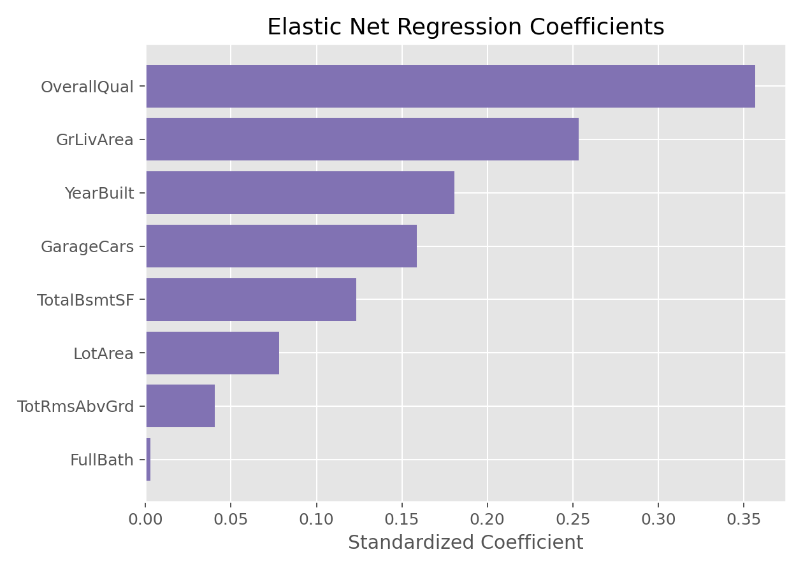

# 弹性网络回归（Elastic Net Regression）

## 1. 方法概览

### 1.1 定义

弹性网络回归结合了 Lasso 的 L1 正则化和 Ridge 的 L2 正则化，既能做变量选择，也能在高度相关特征中保持更稳定的系数结构。

### 1.2 它主要解决什么问题

- 研究问题：当变量很多且彼此相关时，如何同时获得稀疏性和稳定性。
- 适用任务：高维预测、相关特征组建模、变量筛选。
- 常见医学场景：多组学、影像组学、多个相关临床指标联合建模。

### 1.3 直觉理解

Elastic Net 像是在 Lasso 和 Ridge 之间做折中：既希望删掉不重要的变量，又不希望在高度相关的一组变量里只留下一个“幸存者”。

## 2. 数学形式

### 2.1 核心公式

$$
\hat{\boldsymbol{\beta}}
=
\arg\min_{\boldsymbol{\beta}}
\left[
\frac{1}{n}\|y-\mathbf{X}\boldsymbol{\beta}\|_2^2
+
\alpha\left(
\rho\|\boldsymbol{\beta}\|_1
+
\frac{1-\rho}{2}\|\boldsymbol{\beta}\|_2^2
\right)
\right]
$$

### 2.2 参数或统计量含义

- $\alpha$：正则化整体强度。
- $\rho$（或 `l1_ratio`）：控制 L1 与 L2 的权重平衡。
- 当 $\rho=1$ 时退化为 Lasso；当 $\rho=0$ 时退化为 Ridge。

### 2.3 关键假设

- 结局为连续型。
- 线性可加结构基本合理。
- 特征通常需要标准化。

## 3. 数据形式与输入输出

### 3.1 适合的数据形式

- 自变量类型：连续变量为主，也可包含编码后的分类变量。
- 因变量类型：连续型。
- 数据结构：宽表数据。
- 是否适合高维数据：非常适合。
- 是否适合缺失较多数据：需先完成缺失值处理。
- 是否适合删失数据：不适合。
- 是否适合重复测量数据：不直接适合。

### 3.2 示例表格

Elastic Net 常用于这类“多个相关特征共同预测连续结局”的宽表：

| OverallQual | GrLivArea | GarageCars | TotalBsmtSF | YearBuilt | SalePrice |
| --- | --- | --- | --- | --- | --- |
| 7 | 1710 | 2 | 856 | 2003 | 208500 |
| 6 | 1262 | 2 | 1262 | 1976 | 181500 |
| 7 | 1786 | 2 | 920 | 2001 | 223500 |
| 7 | 1717 | 3 | 756 | 1915 | 140000 |
| 8 | 2198 | 3 | 1145 | 2000 | 250000 |

### 3.3 输入与产出

#### 输入

- 输入数据：连续结局和一组候选特征。
- 关键变量：`alpha` 和 `l1_ratio`。
- 需要预处理的内容：标准化、缺失处理、训练测试集划分。

#### 产出

- 模型对象/统计结果：混合正则化后的系数、最佳 `alpha`、最佳 `l1_ratio`。
- 参数估计：兼顾稀疏性与稳定性的收缩系数。
- 预测结果：连续型预测值。
- 不确定性指标：交叉验证误差、测试集性能。

## 4. 适用场景

- 适合：高维、变量相关性强、希望做稳定筛选的场景。
- 不适合：特征很少且共线性不明显时。
- 使用前需要特别检查的点：标准化、超参数网格、相关特征组结构。

## 5. 实现

### 5.1 Python

常用包：

- `scikit-learn`

```python
from sklearn.linear_model import ElasticNetCV
from sklearn.pipeline import make_pipeline
from sklearn.preprocessing import StandardScaler

fit = make_pipeline(
    StandardScaler(),
    ElasticNetCV(
        l1_ratio=[0.1, 0.3, 0.5, 0.7, 0.9],
        cv=5,
        max_iter=20000
    )
)
fit.fit(X_train, y_train)
```

### 5.2 R

常用包：

- `glmnet`

```r
library(glmnet)

x <- model.matrix(SalePrice ~ . - 1, data = df)
y <- df$SalePrice

fit <- cv.glmnet(x, y, alpha = 0.5)  # alpha between 0 and 1
coef(fit, s = "lambda.min")
```

## 6. 结果如何解释

- 核心结果看什么：被保留的变量、系数大小、`l1_ratio` 所代表的惩罚平衡。
- 每个主要参数如何解释：Elastic Net 系数同样受到收缩影响，更适合解释变量相对重要性和方向。
- 临床或医学意义如何表达：适合在很多相关变量中筛出一组更稳定的候选因子。
- 常见误读：Elastic Net 不是“自动最优”，仍然依赖超参数选择。

## 7. 推荐可视化

- 系数条形图。
- 系数路径图。
- 不同 `l1_ratio` 下的性能比较图。

### 7.1 图像示例

下图展示 Elastic Net 回归在房价建模中的系数分布，体现了它在稀疏性和稳定性之间的折中。



## 8. 优势、局限与常见坑

### 优势

- 兼顾变量选择和系数稳定性。
- 对高度相关特征更友好。
- 很适合中高维数据。

### 局限

- 超参数更多，调参更复杂。
- 解释比普通线性回归更弱。
- 若数据很简单，未必比 Ridge/Lasso 更必要。

### 常见坑

- 只调 `alpha` 不调 `l1_ratio`。
- 不标准化就直接上 Elastic Net。
- 把非零系数当成严格因果证据。

## 9. 与相近方法的区别

- 和 Ridge 的区别：Elastic Net 允许产生稀疏解。
- 和 Lasso 的区别：Elastic Net 对相关变量组更稳定。
- 和逐步回归的区别：Elastic Net 通过连续优化完成筛选。

## 10. 医学研究中的典型应用

- 多组学特征筛选。
- 多个相关危险因素联合预测。
- 需要在稀疏性和稳定性之间折中的预测模型。

## 11. 相关方法

- [[Ridge回归（Ridge Regression）]]
- [[Lasso回归（Lasso Regression）]]
- [[线性回归（Linear Regression）]]
- [[嵌入式特征选择（Embedded Feature Selection）]]
- [[相关系数特征选择（Correlation-based Feature Selection）]]

## 12. 参考资料

- Zou H, Hastie T. Regularization and variable selection via the elastic net. *J R Stat Soc Series B*. 2005;67(2):301-320.
- scikit-learn Developers. `sklearn.linear_model.ElasticNet`. scikit-learn API Reference. [https://scikit-learn.org/stable/modules/generated/sklearn.linear_model.ElasticNet.html](https://scikit-learn.org/stable/modules/generated/sklearn.linear_model.ElasticNet.html) （访问日期：2026-07-02）
- CRAN. Package `glmnet`. [https://cran.r-project.org/package=glmnet](https://cran.r-project.org/package=glmnet) （访问日期：2026-07-02）
