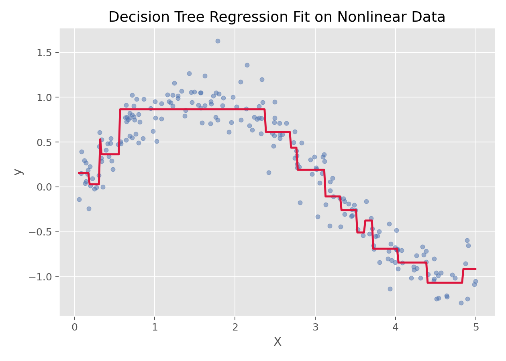

# 决策树回归（Decision Tree Regression）

## 1. 方法概览

### 1.1 定义

决策树回归是一种通过递归划分特征空间，把连续结局映射到一系列区域均值上的非参数回归方法。

### 1.2 它主要解决什么问题

- 研究问题：当连续结局与特征之间存在明显非线性和交互作用时，如何不依赖线性假设来建模。
- 适用任务：连续结局预测、规则提取、非线性建模。
- 常见医学场景：由多种临床特征预测连续风险评分、费用、住院时长或实验室指标。

### 1.3 直觉理解

决策树回归可以理解为不断问“是/否”问题，把样本切成越来越纯的小区域，最后每个叶子节点用该区域样本的平均值做预测。

## 2. 数学形式

### 2.1 核心公式

回归树的预测函数可写为分段常数形式：

$$
f(x)=\sum_{m=1}^{M} c_m I(x\in R_m)
$$

其中 $R_m$ 是树划分出的第 $m$ 个区域，$c_m$ 通常取该区域内目标变量的均值。

一次划分的目标通常是最小化：

$$
\min_{j,s}
\left[
\sum_{x_i \in R_{\text{left}}(j,s)} (y_i-\bar y_{\text{left}})^2
+
\sum_{x_i \in R_{\text{right}}(j,s)} (y_i-\bar y_{\text{right}})^2
\right]
$$

### 2.2 参数或统计量含义

- $j$：当前选择用于划分的特征。
- $s$：当前特征上的切分阈值。
- $R_{\text{left}}, R_{\text{right}}$：阈值划分后的左右子区域。
- $c_m$：叶节点预测值，通常为叶节点样本均值。

### 2.3 关键假设

- 对线性关系没有强假设。
- 主要依赖递归分割规则。
- 若树长得太深，容易过拟合。

## 3. 数据形式与输入输出

### 3.1 适合的数据形式

- 自变量类型：连续、分类或编码后的离散变量都可。
- 因变量类型：连续型。
- 数据结构：宽表数据，每行一个样本。
- 是否适合高维数据：能用，但高维时单棵树不一定稳定。
- 是否适合缺失较多数据：需先完成缺失处理。
- 是否适合删失数据：不适合。
- 是否适合重复测量数据：不直接适合。

### 3.2 示例表格

下面是典型的房价预测宽表结构：

| OverallQual | GrLivArea | GarageCars | TotalBsmtSF | YearBuilt | SalePrice |
| --- | --- | --- | --- | --- | --- |
| 7 | 1710 | 2 | 856 | 2003 | 208500 |
| 6 | 1262 | 2 | 1262 | 1976 | 181500 |
| 7 | 1786 | 2 | 920 | 2001 | 223500 |
| 7 | 1717 | 3 | 756 | 1915 | 140000 |
| 8 | 2198 | 3 | 1145 | 2000 | 250000 |

### 3.3 输入与产出

#### 输入

- 输入数据：连续结局和一组特征。
- 关键变量：最大深度、最小分裂样本数、最小叶节点样本数。
- 需要预处理的内容：缺失值处理、训练测试集划分。

#### 产出

- 模型对象/统计结果：树结构、叶节点预测值、特征重要性。
- 参数估计：不是传统系数，而是分裂规则与叶节点均值。
- 预测结果：连续型预测值。
- 不确定性指标：常用测试集误差、交叉验证误差。

## 4. 适用场景

- 适合：非线性关系明显、交互复杂、希望模型规则直观可视化时。
- 不适合：噪声较大但样本量很小时，单棵树往往不稳定。
- 使用前需要特别检查的点：树深度、过拟合、叶节点大小。

## 5. 实现

### 5.1 Python

常用包：

- `scikit-learn`

```python
from sklearn.tree import DecisionTreeRegressor

fit = DecisionTreeRegressor(max_depth=4, random_state=42)
fit.fit(X_train, y_train)
y_pred = fit.predict(X_test)
```

### 5.2 R

常用包：

- `rpart`

```r
library(rpart)

fit <- rpart(SalePrice ~ ., data = df, method = "anova")
pred <- predict(fit, newdata = df_test)
```

## 6. 结果如何解释

- 核心结果看什么：分裂规则、叶节点均值、测试集误差。
- 每个主要参数如何解释：节点分裂条件比“系数”更重要。
- 临床或医学意义如何表达：适合用“若满足某些特征条件，则预期值大致落在某个范围”来解释。
- 常见误读：树能拟合训练集很好，不代表泛化性能一定好。

## 7. 推荐可视化

- 原始散点图 + 阶梯状拟合曲线。
- 决策树结构图。
- 特征重要性条形图。

### 7.1 图像示例

下图展示决策树回归在一组非线性数据上的分段拟合效果，能够直观看到其“阶梯式”近似特征。



## 8. 优势、局限与常见坑

### 优势

- 不需要线性假设。
- 能自动捕捉交互作用。
- 规则形式容易可视化。

### 局限

- 单棵树不稳定。
- 容易过拟合。
- 对数据轻微扰动较敏感。

### 常见坑

- 只看训练集拟合效果。
- 不限制树深度。
- 把单棵树结果当成非常稳健的结论。

## 9. 与相近方法的区别

- 和线性回归的区别：树模型做分段拟合，不用假设线性关系。
- 和决策树的区别：这里是连续结局版本，分类任务通常看主条目“决策树”。
- 和随机森林的区别：随机森林是多棵树集成，通常更稳。
- 和梯度提升的区别：梯度提升是序列式集成，更偏 boosting。

## 10. 医学研究中的典型应用

- 连续风险评分预测。
- 成本、住院天数、实验室指标预测。
- 需要给出直观规则划分的场景。

## 11. 相关方法

- [[决策树（Decision Tree）]]
- [[随机森林回归（Random Forest Regression）]]
- [[梯度提升回归（Gradient Boosting Regression）]]
- [[线性回归（Linear Regression）]]
- [[K近邻回归（K-Nearest Neighbors Regression）]]

## 12. 参考资料

- Breiman L, Friedman JH, Olshen RA, Stone CJ. *Classification and Regression Trees*. Wadsworth; 1984.
- scikit-learn Developers. `sklearn.tree.DecisionTreeRegressor`. scikit-learn API Reference. [https://scikit-learn.org/stable/modules/generated/sklearn.tree.DecisionTreeRegressor.html](https://scikit-learn.org/stable/modules/generated/sklearn.tree.DecisionTreeRegressor.html) （访问日期：2026-07-02）
