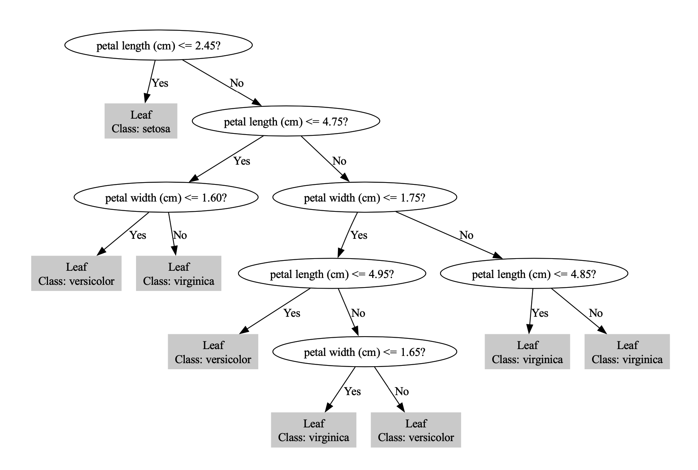

# C4.5决策树（C4.5 Decision Tree）

## 1. 方法概览

### 1.1 一句话本质

C4.5 是 ID3 的实用升级版：它用信息增益率惩罚「把数据切得过碎」的特征，并支持连续变量、缺失处理和剪枝。

### 1.2 定义

C4.5 是 Quinlan 在 ID3 基础上提出的分类树算法。它仍然用信息论思想选择分裂，但把单纯信息增益改为信息增益率，从而降低高基数特征偏倚；同时加入连续阈值搜索和后剪枝，更接近实际建模需要。

### 1.3 它主要解决什么问题

- 研究问题：如何在离散和连续特征混合的数据中构建可解释分类规则，并避免取值很多的特征被过度偏爱。
- 适用任务：分类规则学习、混合型特征建模、可解释风险分层。
- 常见医学场景：结合实验室连续指标、病史分类变量和症状分级做疾病分型或重症风险判别。

### 1.4 直觉与类比

ID3 只问「这个特征能减少多少不确定性」；C4.5 还会问「它是不是靠把每个人都单独分出去才显得有用」。患者 ID 可以把每个患者分成单独叶子，训练集看似完美，但毫无泛化意义。增益率正是给这种过度细分打折。

## 2. 核心思想与原理

### 2.1 它到底在解决什么根本困难

单纯信息增益偏爱取值多的特征。比如患者 ID、住院号、罕见类别变量，可能把训练样本切得很碎，使每个叶子看起来很纯，但这不是可推广的医学规律。C4.5 解决的是：**如何区分真正有分类信息的特征，与只是因为取值太多而制造纯节点的特征**。

### 2.2 关键洞察

C4.5 的关键洞察是把信息增益除以分裂本身的复杂度。若一个特征把样本切成许多小块，它的 Split Information 会很大；即使信息增益高，增益率也会被拉低。这样更偏向选择既能降低类别不确定性、又不过度碎片化的分裂。

### 2.3 与朴素/相邻做法的对比

- 相对 [[ID3决策树（ID3 Decision Tree）]]：C4.5 用增益率、支持连续变量、缺失值和后剪枝。
- 相对 CART：CART 常用 Gini 并偏二叉分裂；C4.5 的标志是信息增益率。
- 相对 [[随机森林（Random Forest）]]：C4.5 仍是单棵树，规则更清楚，但稳定性和预测性能通常不如集成树。

## 3. 数学形式

### 3.1 核心公式

先计算信息增益：

$$
\operatorname{IG}(S,A)=H(S)-H(S\mid A)
$$

再计算特征 $A$ 的分裂信息：

$$
\operatorname{SI}(S,A)=
-\sum_{v\in\mathcal V(A)}
\frac{|S_v|}{|S|}
\log_2\frac{|S_v|}{|S|}
$$

信息增益率为：

$$
\operatorname{GR}(S,A)=
\frac{\operatorname{IG}(S,A)}{\operatorname{SI}(S,A)}
$$

连续变量可枚举候选阈值 $c$，比较按 $X\le c$ 与 $X\gt c$ 分裂后的增益率。

这个式子在说：分裂既要带来类别信息，也不能只是靠过度细分来制造纯度。

### 3.2 推导脉络

1. 按 ID3 的方式计算每个候选特征的信息增益。
2. 再计算该特征把数据切分得多细，即 Split Information。
3. 用信息增益除以 Split Information，得到增益率。
4. 对连续变量，先排序并枚举相邻类别变化处的阈值。
5. 树生成后做后剪枝，减少对训练集噪声的依赖。

### 3.3 参数与统计量含义

- $\operatorname{IG}$：特征带来的类别不确定性下降。
- $\operatorname{SI}$：特征自身分裂的复杂度。
- $\operatorname{GR}$：单位分裂复杂度带来的信息收益。
- 阈值 $c$：连续变量的候选切分点。
- 剪枝参数：控制是否合并对泛化帮助不大的子树。

### 3.4 关键假设(含违反后果)

| 假设 | 含义 | 违反后会怎样 | 如何粗查 |
| --- | --- | --- | --- |
| 可解释规则存在 | 类别可由分段规则近似 | 树复杂且泛化差 | 验证集误差、树深度 |
| 高基数特征需惩罚 | 取值多不等于有医学意义 | 训练集过拟合 | 检查 ID、编码变量 |
| 连续阈值可泛化 | 阈值不是样本偶然产物 | cut-off 不稳定 | 重采样阈值稳定性 |
| 缺失机制可处理 | 缺失不会完全破坏分裂 | 分裂偏向缺失模式 | 缺失图、敏感性分析 |
| 剪枝合理 | 简化树能改善泛化 | 过剪枝欠拟合，少剪枝过拟合 | 交叉验证 |

## 4. 手把手算例

沿用 ID3 的 8 名患者数据，并额外加入「患者ID」这个高基数特征。

| 患者ID | CRP高 | 乳酸高 | 重症Y |
| --- | --- | --- | --- |
| P1 | 是 | 是 | 1 |
| P2 | 是 | 否 | 1 |
| P3 | 是 | 是 | 1 |
| P4 | 是 | 否 | 1 |
| P5 | 否 | 是 | 1 |
| P6 | 否 | 是 | 0 |
| P7 | 否 | 否 | 0 |
| P8 | 否 | 否 | 0 |

父节点熵仍为：

$$
H(S)=0.954
$$

**Step 1：CRP 高的增益率。**

ID3 卡已算出：

$$
\operatorname{IG}(S,\mathrm{CRP})=0.548
$$

CRP 高低各 4 人，因此：

$$
\operatorname{SI}(S,\mathrm{CRP})=
-\frac48\log_2\frac48-\frac48\log_2\frac48=1
$$

$$
\operatorname{GR}(S,\mathrm{CRP})=\frac{0.548}{1}=0.548
$$

**Step 2：患者 ID 的信息增益。**

按患者 ID 分裂后，每个子节点只有 1 人，熵都是 0，所以条件熵为 0：

$$
\operatorname{IG}(S,\mathrm{ID})=0.954-0=0.954
$$

如果只看信息增益，ID 会赢过 CRP，这显然荒唐。

**Step 3：患者 ID 的增益率。**

8 个 ID 各占 $1/8$：

$$
\operatorname{SI}(S,\mathrm{ID})
=-\sum_{i=1}^{8}\frac18\log_2\frac18=3
$$

$$
\operatorname{GR}(S,\mathrm{ID})=\frac{0.954}{3}=0.318
$$

**结论：** ID 的信息增益最高，但增益率只有 0.318，低于 CRP 的 0.548。C4.5 因此更可能选择 CRP，而不是被患者 ID 这种无泛化意义的高基数字段骗走。

## 5. 数据形式与输入输出

### 5.1 适合的数据形式

- 自变量类型：离散和连续变量均可。
- 因变量类型：二分类或多分类。
- 数据结构：宽表数据。
- 是否适合高维数据：可以，但单棵树仍可能不稳定。
- 是否适合缺失较多数据：比 ID3 更友好，但大量缺失仍需系统处理。
- 是否适合删失数据：不适合。
- 是否适合重复测量数据：不直接适合。

### 5.2 示例表格

| Age | WBC | CRP | Ventilator | AntibioticHistory | InfectionClass |
| --- | --- | --- | --- | --- | --- |
| 72 | 13.2 | 88.0 | yes | yes | Bacterial |
| 51 | 6.8 | 14.3 | no | no | Viral |
| 63 | 11.0 | 52.5 | yes | no | Bacterial |
| 29 | 5.9 | 8.1 | no | no | Viral |
| 44 | 7.3 | 18.2 | no | yes | Other |

### 5.3 输入与产出

#### 输入

- 输入数据：类别标签与混合型特征。
- 关键变量：候选切分点、最小样本阈值、剪枝策略。
- 需要预处理的内容：异常值检查、缺失处理、训练测试集划分、高基数字段筛查。

#### 产出

- 模型对象/统计结果：树结构、候选阈值、剪枝后树、分类规则。
- 参数估计：分裂规则、增益率排序、叶节点类别概率。
- 预测结果：类别标签与概率。
- 不确定性指标：验证集准确率、宏平均 F1、校准情况。

## 6. 适用场景

- 适合：混合型特征分类、需要规则解释、希望比 ID3 更稳健的场景。
- 不适合：极大规模复杂预测、强噪声小样本、主要目标是最优预测性能而非规则解释。
- 使用前需要特别检查的点：高基数字段、连续阈值稳定性、剪枝策略、类别不平衡。

## 7. 实现

### 7.1 Python

常用包:

- `scikit-learn`

```python
import pandas as pd
from sklearn.tree import DecisionTreeClassifier

X = df[["Age", "WBC", "CRP", "Ventilator", "AntibioticHistory"]]
X = pd.get_dummies(X, drop_first=True)
y = df["InfectionClass"]

# scikit-learn 更接近 CART；criterion="entropy" 可近似信息论分裂，
# 严格 C4.5/J48 通常在 R/Weka 中实现。
model = DecisionTreeClassifier(
    criterion="entropy",
    ccp_alpha=0.002,
    min_samples_leaf=10,
    random_state=42
)
model.fit(X, y)
```

### 7.2 R

常用包:

- `RWeka`

```r
library(RWeka)

fit <- J48(
  InfectionClass ~ Age + WBC + CRP + Ventilator + AntibioticHistory,
  data = train_df
)

pred <- predict(fit, newdata = test_df)
```

## 8. 结果如何解读

- 核心结果看什么：根节点分裂、连续变量阈值、剪枝后树深度、测试集表现。
- 每个主要参数如何解读：增益率高表示该分裂在控制碎片化后仍有较高信息收益。
- 临床或医学意义如何表达：可写作「在该样本中，CRP 阈值提供了比患者 ID 更可推广的分类信息」。
- 常见误读：增益率更高不代表该变量单独足以做临床决策，也不代表因果作用。

## 9. 假设诊断与稳健性

- 高基数诊断：移除 ID、编码、极稀有类别变量，或明确其无预测泛化意义。
- 阈值稳定性：重采样后检查连续变量阈值是否大幅变化。
- 剪枝诊断：比较剪枝前后验证集误差和树复杂度。
- 类别不平衡：报告每类召回率和宏平均 F1。
- 实现差异：说明所用软件是否是真正 C4.5/J48，还是 CART 的近似替代。

## 10. 推荐可视化

- 剪枝前后树结构对比图。
- 连续变量最佳阈值示意图。
- 信息增益与增益率对比条形图。
- 混淆矩阵和每类召回率图。

### 10.1 图像示例

下图给出一个 C4.5 风格分类树的规则结构示意，适合说明连续特征阈值切分和逐层判别路径。



## 11. 优势、局限与常见坑

### 优势

- 比 ID3 更能抵抗高基数特征偏倚。
- 能处理连续特征和缺失值。
- 规则仍然清晰，适合解释和教学。

### 局限

- 仍是单棵树，稳定性有限。
- 在复杂表格预测中常不如随机森林和梯度提升。
- 不同软件实现细节差异较大。

### 常见坑

- 把 scikit-learn 的 CART 结果直接当作严格 C4.5。
- 忽略剪枝，得到过深规则。
- 把树阈值当成通用医学 cut-off。
- 不处理 ID、住院号等高基数字段。

## 12. 与相近方法的区别

- 和 [[ID3决策树（ID3 Decision Tree）]] 的区别：C4.5 使用信息增益率，并支持连续特征、缺失值与后剪枝。
- 和 [[决策树（Decision Tree）]] 的关系：C4.5 是决策树家族的一种具体算法。
- 和 CART 的区别：CART 常用基尼指数和二叉分裂；C4.5 的核心是增益率。
- 和 [[随机森林（Random Forest）]] 的区别：随机森林集成多棵树，更稳但单棵规则不如 C4.5 清楚。
- 如何选择：需要解释单棵规则且特征混合时可考虑 C4.5；生产预测常用集成树。

## 13. 医学研究中的典型应用

- 混合型临床指标的疾病分类。
- 可解释分诊规则或风险分层规则原型。
- 医学教学中的信息增益率与剪枝示例。

## 14. 关键术语

- **信息增益率（Gain Ratio）**：信息增益除以分裂信息后的评分。
- **分裂信息（Split Information）**：衡量一个特征把数据切得多碎。
- **高基数特征（High-cardinality Feature）**：取值很多的类别变量，如 ID。
- **连续阈值（Continuous Threshold）**：连续变量用于二叉切分的 cut-point。
- **后剪枝（Post-pruning）**：先长树，再删除泛化帮助不大的子树。
- **J48**：Weka/RWeka 中 C4.5 的常用实现名称。
- **泛化（Generalization）**：模型在新样本上的表现能力。

## 15. 相关方法

- [[决策树（Decision Tree）]]
- [[ID3决策树（ID3 Decision Tree）]]
- [[随机森林（Random Forest）]]
- [[信息增益（Information Gain）]]

## 16. 参考资料

- Quinlan JR. *C4.5: Programs for Machine Learning*. Morgan Kaufmann; 1993.
- Quinlan JR. Induction of decision trees. *Mach Learn*. 1986;1:81-106.
- Witten IH, Frank E, Hall MA, Pal CJ. *Data Mining: Practical Machine Learning Tools and Techniques*. 4th ed. Morgan Kaufmann; 2016.
- Hastie T, Tibshirani R, Friedman J. *The Elements of Statistical Learning*. 2nd ed. Springer; 2009.
