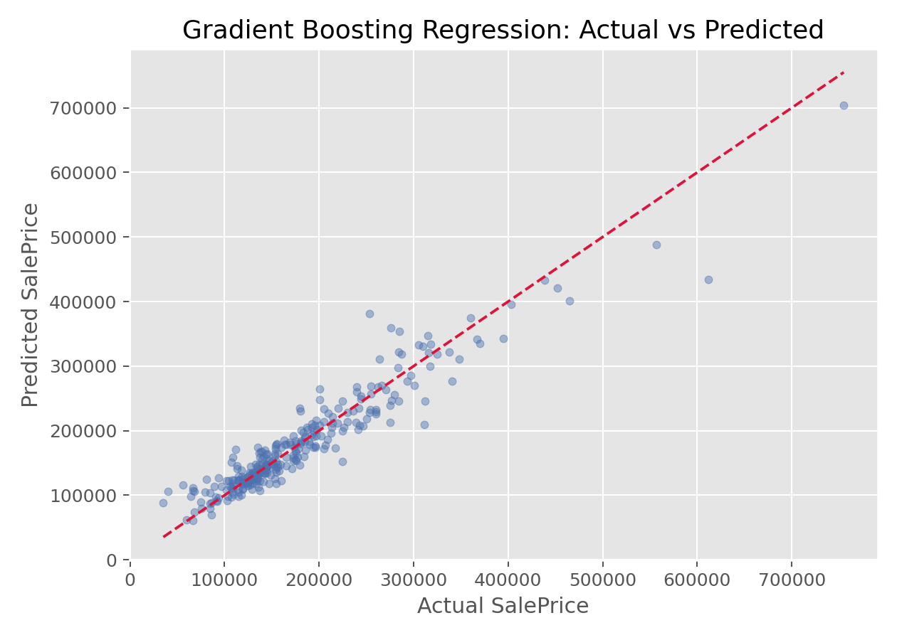

# 梯度提升回归（Gradient Boosting Regression）

## 1. 方法概览

### 1.1 定义

梯度提升回归是一类通过逐步叠加弱学习器来逼近目标函数的集成回归方法，常见实现是以浅层回归树作为基学习器。

### 1.2 它主要解决什么问题

- 研究问题：如何通过一系列逐步修正残差的小模型，得到更强的预测器。
- 适用任务：表格数据连续结局预测、复杂非线性回归、性能导向建模。
- 常见医学场景：连续风险评分预测、成本预测、住院时长预测。

### 1.3 直觉理解

梯度提升的思路像是“不断纠错”：先用一个简单模型做粗略预测，再让后续模型专门去学习前面模型留下的误差，逐步把预测修正得更准。

## 2. 数学形式

### 2.1 核心公式

梯度提升的加法模型可写成：

$$
F_M(x)=F_{M-1}(x)+\nu h_M(x)
$$

其中 $h_M(x)$ 是第 $M$ 轮拟合到负梯度（在平方损失下就是残差）的弱学习器，$\nu$ 是学习率。

在平方误差损失下：

$$
r_{im}=y_i-F_{m-1}(x_i)
$$

第 $m$ 棵树就是去拟合这些残差。

### 2.2 参数或统计量含义

- `n_estimators`：基学习器数量。
- `learning_rate`：每一步修正幅度。
- `max_depth`：每棵基树复杂度。
- boosting：串行逐步纠错。

### 2.3 关键假设

- 对函数形式没有强线性假设。
- 依赖较多超参数控制模型复杂度。
- 学习率和树数之间需要平衡。

## 3. 数据形式与输入输出

### 3.1 适合的数据形式

- 自变量类型：连续、离散或编码后的分类变量。
- 因变量类型：连续型。
- 数据结构：宽表数据。
- 是否适合高维数据：适合表格型中高维数据。
- 是否适合缺失较多数据：需先处理缺失值。
- 是否适合删失数据：不适合。
- 是否适合重复测量数据：不直接适合。

### 3.2 示例表格

梯度提升回归常用在这类表格型预测任务：

| OverallQual | GrLivArea | GarageCars | TotalBsmtSF | YearBuilt | SalePrice |
| --- | --- | --- | --- | --- | --- |
| 7 | 1710 | 2 | 856 | 2003 | 208500 |
| 6 | 1262 | 2 | 1262 | 1976 | 181500 |
| 7 | 1786 | 2 | 920 | 2001 | 223500 |
| 7 | 1717 | 3 | 756 | 1915 | 140000 |
| 8 | 2198 | 3 | 1145 | 2000 | 250000 |

### 3.3 输入与产出

#### 输入

- 输入数据：连续结局和特征矩阵。
- 关键变量：树数、学习率、每棵树深度。
- 需要预处理的内容：缺失处理、训练测试集划分。

#### 产出

- 模型对象/统计结果：集成模型、特征重要性、预测值。
- 参数估计：不强调系数，更强调整体模型表现。
- 预测结果：连续型预测值。
- 不确定性指标：测试集误差、交叉验证误差。

## 4. 适用场景

- 适合：追求较高预测性能、非线性和交互明显的表格数据场景。
- 不适合：只追求简单解释或样本非常小的场景。
- 使用前需要特别检查的点：学习率、树数、过拟合、早停策略。

## 5. 实现

### 5.1 Python

常用包：

- `scikit-learn`

```python
from sklearn.ensemble import GradientBoostingRegressor

fit = GradientBoostingRegressor(
    n_estimators=200,
    learning_rate=0.05,
    max_depth=3,
    random_state=42
)
fit.fit(X_train, y_train)
y_pred = fit.predict(X_test)
```

### 5.2 R

常用包：

- `gbm`

```r
library(gbm)

fit <- gbm(
  formula = SalePrice ~ .,
  data = df,
  distribution = "gaussian",
  n.trees = 200,
  interaction.depth = 3,
  shrinkage = 0.05
)
```

## 6. 结果如何解释

- 核心结果看什么：测试集性能、学习曲线、重要特征。
- 每个主要参数如何解释：更多从模型复杂度和学习过程角度解释，而不是单个系数解释。
- 临床或医学意义如何表达：适合强调预测精度和高阶模式捕捉能力。
- 常见误读：更多的树并不总是更好，学习率和树数需要一起看。

## 7. 推荐可视化

- 真实值 vs 预测值散点图。
- 学习曲线。
- 特征重要性条形图。

### 7.1 图像示例

下图展示梯度提升回归在房价数据上的真实值与预测值对照关系，用来直观查看拟合效果。



## 8. 优势、局限与常见坑

### 优势

- 对表格数据性能通常很强。
- 能处理复杂非线性和交互。
- 可逐步提升预测精度。

### 局限

- 调参较多。
- 训练时间通常比单棵树更长。
- 若学习率和树数设置不当，容易过拟合。

### 常见坑

- 学习率太大、树太深导致过拟合。
- 只看训练误差不看验证集误差。
- 误把特征重要性当成因果重要性。

## 9. 与相近方法的区别

- 和随机森林的区别：随机森林是并行 bagging；梯度提升是串行 boosting。
- 和 XGBoost/LightGBM 的区别：后者是在 boosting 基础上的工程和算法增强。
- 和决策树回归的区别：梯度提升是多棵树逐步叠加。

## 10. 医学研究中的典型应用

- 表格型连续风险预测。
- 多变量费用和资源消耗预测。
- 临床数据中的复杂非线性建模。

## 11. 相关方法

- [[XGBoost（Extreme Gradient Boosting, XGBoost）]]
- [[LightGBM（Light Gradient Boosting Machine）]]
- [[决策树回归（Decision Tree Regression）]]
- [[随机森林回归（Random Forest Regression）]]

## 12. 参考资料

- Friedman JH. Greedy function approximation: a gradient boosting machine. *Ann Stat*. 2001;29(5):1189-1232.
- scikit-learn Developers. `sklearn.ensemble.GradientBoostingRegressor`. scikit-learn API Reference. [https://scikit-learn.org/stable/modules/generated/sklearn.ensemble.GradientBoostingRegressor.html](https://scikit-learn.org/stable/modules/generated/sklearn.ensemble.GradientBoostingRegressor.html) （访问日期：2026-07-02）
- CRAN. Package `gbm`. [https://cran.r-project.org/package=gbm](https://cran.r-project.org/package=gbm) （访问日期：2026-07-02）
