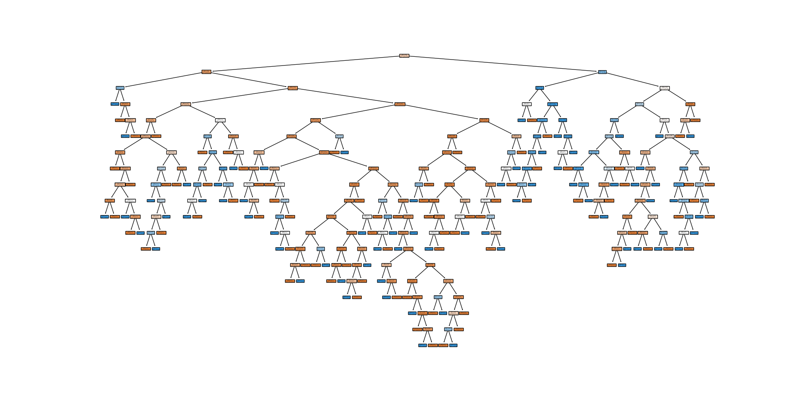

# 决策树（Decision Tree）

## 1. 方法概览

### 1.1 定义

决策树是一类通过递归划分特征空间来完成分类或回归的树状模型。对于分类任务，它把样本一步步分到更“纯”的叶节点中，再用叶节点中的多数类别作为预测结果。

### 1.2 它主要解决什么问题

- 研究问题：如何根据一组特征生成清晰可解释的分类规则。
- 适用任务：二分类、多分类、规则提取、特征交互发现。
- 常见医学场景：根据年龄、症状、实验室指标对疾病状态、重症风险或分型标签进行初步判别。

### 1.3 直觉理解

可以把决策树理解成一串连续的“如果……那么……”问题。每问一次，就把样本分成更相似的两组或多组，直到叶节点里的样本已经足够一致。

## 2. 数学形式

### 2.1 核心公式

分类树常用的不纯度指标包括基尼不纯度和信息熵：

$$
G(t) = 1 - \sum_{k=1}^{K} p_{k|t}^2
$$

$$
H(t) = - \sum_{k=1}^{K} p_{k|t} \log p_{k|t}
$$

其中 $p_{k|t}$ 表示节点 $t$ 中第 $k$ 类样本的比例。一次划分的目标是最大化不纯度下降：

$$
\Delta I(s, t) = I(t) - \left( \frac{N_{left}}{N_t} I(t_{left}) + \frac{N_{right}}{N_t} I(t_{right}) \right)
$$

### 2.2 参数或统计量含义

- $I(t)$：节点 $t$ 的不纯度，可取基尼指数或熵。
- $s$：候选划分规则，通常由“特征 + 阈值”组成。
- $N_t$：当前节点样本数。
- 叶节点类别概率：叶节点内各类样本比例，常用于概率输出。

### 2.3 关键假设

- 不要求线性关系或正态性假设。
- 假设可通过递归切分把类别逐步分开。
- 若树过深、叶节点过小，模型容易过拟合。

## 3. 数据形式与输入输出

### 3.1 适合的数据形式

- 自变量类型：连续、二分类、多分类变量均可。
- 因变量类型：二分类或多分类。
- 数据结构：宽表数据，每行一个个体。
- 是否适合高维数据：可用，但单棵树在高维下稳定性有限。
- 是否适合缺失较多数据：通常应先处理缺失。
- 是否适合删失数据：不适合。
- 是否适合重复测量数据：不直接适合。

### 3.2 示例表格

以住院患者是否发生重症并发症为例：

| Age | Sex | CRP | Lactate | Diabetes | SevereComplication |
| --- | --- | --- | --- | --- | --- |
| 72 | 1 | 65.2 | 2.8 | 1 | 1 |
| 49 | 0 | 12.6 | 1.1 | 0 | 0 |
| 63 | 1 | 34.0 | 1.9 | 1 | 1 |
| 38 | 0 | 8.4 | 0.9 | 0 | 0 |
| 57 | 1 | 28.1 | 1.5 | 0 | 0 |

### 3.3 输入与产出

#### 输入

- 输入数据：离散结局和一组候选特征。
- 关键变量：最大深度、最小分裂样本数、最小叶节点样本数、剪枝强度。
- 需要预处理的内容：缺失处理、类别编码、训练测试集划分。

#### 产出

- 模型对象/统计结果：树结构、叶节点类别、节点概率、特征重要性。
- 参数估计：没有线性系数，主要是分裂规则。
- 预测结果：类别标签和类别概率。
- 不确定性指标：交叉验证误差、测试集准确率、AUC、Brier score。

## 4. 适用场景

- 适合：需要直观规则、怀疑存在明显非线性与交互、想快速获得可解释基线模型。
- 不适合：数据极小但噪声较大、需要稳定概率估计或线性参数解释的场景。
- 使用前需要特别检查的点：是否过拟合、类别是否极不平衡、是否需要剪枝。

## 5. 实现

### 5.1 Python

常用包：

- `scikit-learn`

```python
import pandas as pd
from sklearn.model_selection import train_test_split
from sklearn.tree import DecisionTreeClassifier

df = pd.read_csv("clinical_risk.csv")
X = df[["Age", "CRP", "Lactate", "Diabetes"]]
y = df["SevereComplication"].astype(int)

X_train, X_test, y_train, y_test = train_test_split(
    X, y, test_size=0.2, random_state=42, stratify=y
)

fit = DecisionTreeClassifier(
    criterion="gini",
    max_depth=4,
    min_samples_leaf=20,
    random_state=42
)
fit.fit(X_train, y_train)

print(fit.predict_proba(X_test[:5]))
```

### 5.2 R

常用包：

- `rpart`

```r
library(rpart)

fit <- rpart(
  SevereComplication ~ Age + CRP + Lactate + Diabetes,
  data = df,
  method = "class",
  control = rpart.control(maxdepth = 4, minbucket = 20)
)

pred_prob <- predict(fit, newdata = df_test, type = "prob")
```

## 6. 结果如何解释

- 核心结果看什么：根节点和高层分裂规则、叶节点纯度、测试集表现。
- 每个主要参数如何解释：树深度越大越灵活，但也更容易过拟合。
- 临床或医学意义如何表达：适合表述为“当 CRP 高于某阈值且乳酸升高时，患者更可能进入高风险叶节点”。
- 常见误读：特征出现在高层分裂不等于它具有因果作用。

## 7. 推荐可视化

- 决策树结构图。
- 混淆矩阵或 ROC 曲线。
- 剪枝强度或树深度与验证误差关系图。

### 7.1 图像示例

下图展示分类决策树的完整树结构，可直观看到节点分裂、叶节点类别和整体规则层级。



## 8. 优势、局限与常见坑

### 优势

- 规则直观，可读性强。
- 能自动捕捉非线性和交互。
- 对特征缩放不敏感。

### 局限

- 单棵树稳定性较差。
- 容易过拟合。
- 概率输出常不如参数模型稳定。

### 常见坑

- 不做剪枝或复杂度控制。
- 只看训练集效果。
- 把树路径当成固定不变的医学阈值。

## 9. 与相近方法的区别

- 和 Logistic 回归的区别：Logistic 回归给出平滑的 log-odds 关系，决策树给出分段规则。
- 和随机森林的区别：随机森林是多棵树集成，通常更稳健，但解释性更弱。
- 和 ID3 / C4.5 的区别：这两者是具体的树构建策略，而“决策树”是更宽泛的模型家族。

## 10. 医学研究中的典型应用

- 患者分层与风险分组。
- 早筛规则的初步构建。
- 多指标组合形成简单判别路径。

## 11. 相关方法

- [[ID3决策树（ID3 Decision Tree）]]
- [[C4.5决策树（C4.5 Decision Tree）]]
- [[随机森林（Random Forest）]]
- [[决策树回归（Decision Tree Regression）]]

## 12. 参考资料

- Breiman L, Friedman JH, Olshen RA, Stone CJ. *Classification and Regression Trees*. Wadsworth; 1984.
- scikit-learn Developers. `sklearn.tree.DecisionTreeClassifier`. scikit-learn API Reference. [https://scikit-learn.org/stable/modules/generated/sklearn.tree.DecisionTreeClassifier.html](https://scikit-learn.org/stable/modules/generated/sklearn.tree.DecisionTreeClassifier.html) （访问日期：2026-07-02）
- Therneau T, Atkinson B, Ripley B. Package `rpart`. CRAN. [https://cran.r-project.org/package=rpart](https://cran.r-project.org/package=rpart) （访问日期：2026-07-02）
