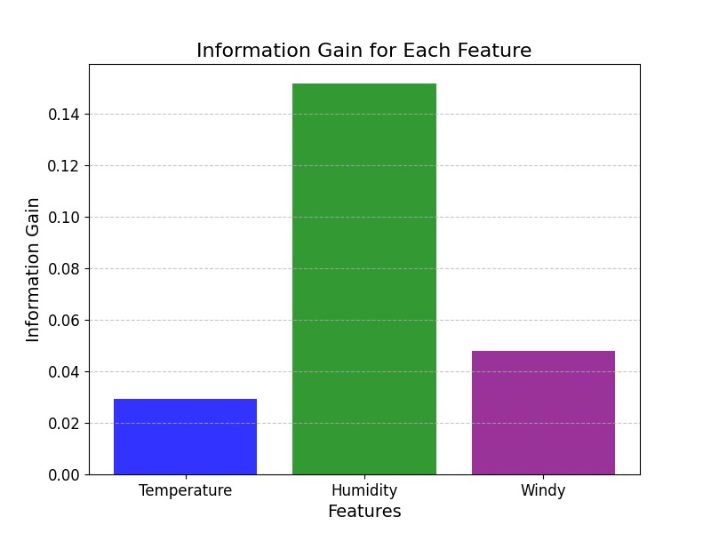

# ID3决策树（ID3 Decision Tree）

## 1. 方法概览

### 1.1 定义

ID3 是 Ross Quinlan 提出的经典决策树构建算法。它用信息增益作为特征选择标准，递归地挑选最能降低类别不确定性的特征来生成分类树。

### 1.2 它主要解决什么问题

- 研究问题：面对一组离散特征，如何用最“有信息量”的特征构造分类规则。
- 适用任务：离散特征分类、教学演示、信息论驱动的规则提取。
- 常见医学场景：问卷条目、症状分级、分层编码变量驱动的初步疾病判别。

### 1.3 直觉理解

ID3 每一步都在问：“哪个特征一旦知道，就能最大程度减少我对类别的不确定性？”然后沿着这个最有帮助的特征继续往下分。

## 2. 数学形式

### 2.1 核心公式

节点熵定义为：

$$
H(S) = - \sum_{k=1}^{K} p_k \log_2 p_k
$$

特征 $A$ 的条件熵为：

$$
H(S \mid A) = \sum_{v \in \mathcal{V}(A)} \frac{|S_v|}{|S|} H(S_v)
$$

信息增益为：

$$
Gain(S, A) = H(S) - H(S \mid A)
$$

ID3 在每个节点选择信息增益最大的特征。

### 2.2 参数或统计量含义

- $H(S)$：当前节点的类别不确定性。
- $\mathcal{V}(A)$：特征 $A$ 的取值集合。
- $Gain(S, A)$：知道特征 $A$ 后减少了多少不确定性。
- 叶节点类别：子节点中占多数的类别。

### 2.3 关键假设

- 特征多为离散型，或已预先离散化。
- 分类边界适合用递归树结构表达。
- 信息增益足以反映特征的重要性。

## 3. 数据形式与输入输出

### 3.1 适合的数据形式

- 自变量类型：离散特征为主。
- 因变量类型：二分类或多分类。
- 数据结构：宽表数据。
- 是否适合高维数据：可用于中等维度，但过多特征时容易不稳定。
- 是否适合缺失较多数据：不理想，经典 ID3 对缺失支持较弱。
- 是否适合删失数据：不适合。
- 是否适合重复测量数据：不直接适合。

### 3.2 示例表格

一个教学型示例可以是门诊分诊规则数据：

| Fever | Cough | Rash | TravelHistory | InfectionClass |
| --- | --- | --- | --- | --- |
| high | yes | no | yes | A |
| low | yes | no | no | B |
| high | no | yes | no | C |
| normal | yes | no | yes | A |
| low | no | no | no | B |

### 3.3 输入与产出

#### 输入

- 输入数据：离散特征和类别标签。
- 关键变量：特征集合、停止条件、最小样本阈值。
- 需要预处理的内容：连续变量离散化、缺失处理、类别统一编码。

#### 产出

- 模型对象/统计结果：树结构、节点熵、信息增益排序。
- 参数估计：主要是分裂特征及其分支。
- 预测结果：类别标签。
- 不确定性指标：验证集准确率、宏平均 F1、叶节点纯度。

## 4. 适用场景

- 适合：离散特征较多、规则解释优先、教学演示树生长机制。
- 不适合：连续特征为主、缺失值多、对泛化性能要求高的任务。
- 使用前需要特别检查的点：是否存在高基数特征、是否需要剪枝或后续集成。

## 5. 实现

### 5.1 Python

常用包：

- `scikit-learn`

```python
import pandas as pd
from sklearn.preprocessing import OrdinalEncoder
from sklearn.tree import DecisionTreeClassifier

df = pd.read_csv("triage_rules.csv")
X = df[["Fever", "Cough", "Rash", "TravelHistory"]]
y = df["InfectionClass"]

enc = OrdinalEncoder()
X_enc = enc.fit_transform(X)

# 这是接近 ID3 思路的教学实现：使用熵而不是严格复现多叉 ID3
fit = DecisionTreeClassifier(
    criterion="entropy",
    max_depth=4,
    random_state=42
)
fit.fit(X_enc, y)
```

### 5.2 R

常用包：

- `RWeka`

```r
library(RWeka)

fit <- Id3(InfectionClass ~ Fever + Cough + Rash + TravelHistory, data = df)
pred <- predict(fit, newdata = df_test)
```

## 6. 结果如何解释

- 核心结果看什么：每层选中了哪个特征、信息增益大小、叶节点类别纯度。
- 每个主要参数如何解释：最大深度和最小样本数决定树会长多复杂。
- 临床或医学意义如何表达：适合转化为“若发热高且有旅行史，则优先归入 A 类”的规则语言。
- 常见误读：信息增益高不等于该特征在生物学上更重要。

## 7. 推荐可视化

- 信息增益条形图。
- 决策树结构图。
- 不同深度下验证集性能曲线。

### 7.1 图像示例

下图展示 ID3 案例中各候选特征的信息增益大小，体现了该方法“优先选择信息增益最大特征”的核心思想。



## 8. 优势、局限与常见坑

### 优势

- 原理直观，便于教学。
- 对离散特征友好。
- 规则容易直接写成流程图。

### 局限

- 偏向选择取值较多的特征。
- 对连续特征不友好。
- 不剪枝时容易过拟合。

### 常见坑

- 未离散化连续特征就直接套用经典 ID3 解释。
- 忽略高基数特征的偏倚。
- 把教学型算法当作最佳生产模型。

## 9. 与相近方法的区别

- 和一般决策树的区别：ID3 是决策树的一种具体构建算法。
- 和 C4.5 的区别：C4.5 用信息增益率，且能更自然处理连续特征和缺失值。
- 和随机森林的区别：随机森林追求预测稳健性，ID3 更偏规则学习与教学演示。

## 10. 医学研究中的典型应用

- 症状问卷驱动的初步分类规则。
- 教学场景中的信息增益示例。
- 离散临床路径规则的原型构建。

## 11. 相关方法

- [[决策树（Decision Tree）]]
- [[C4.5决策树（C4.5 Decision Tree）]]
- [[随机森林（Random Forest）]]

## 12. 参考资料

- Quinlan JR. Induction of decision trees. *Mach Learn*. 1986;1:81-106.
- Mitchell TM. *Machine Learning*. McGraw-Hill; 1997.
- Hornik K, Buchta C, Zeileis A. Open-source machine learning: RWeka package. *Comput Stat*. 2009;24:225-232.
