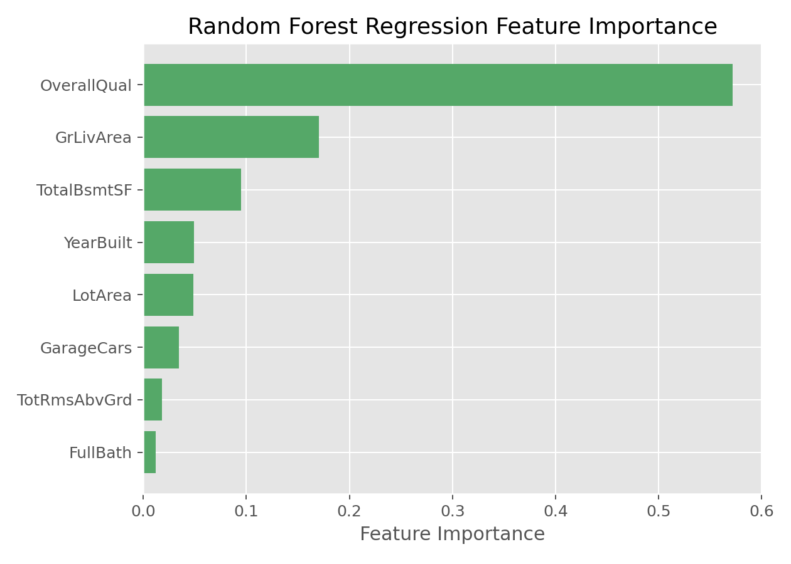

# 随机森林回归（Random Forest Regression）

## 1. 方法概览

### 1.1 一句话本质

随机森林回归训练许多带随机性的回归树，再把它们的连续预测取平均，得到比单棵树更稳定的预测值。

### 1.2 定义

随机森林回归是随机森林用于连续结局的版本。每棵树通过 bootstrap 样本和节点特征随机生成，叶节点输出均值；森林最终对所有树的预测取平均。

### 1.3 它主要解决什么问题

- 研究问题：连续结局与变量之间有非线性和交互时，如何比单棵回归树更稳健地预测。
- 适用任务：连续风险评分、费用、住院天数、实验室指标或生理指标预测。
- 常见医学场景：根据年龄、合并症、实验室指标预测住院时长、医疗费用、炎症水平或连续风险评分。

### 1.4 直觉与类比

单棵回归树像一个人给出粗略分段估计，容易受训练病例影响。随机森林回归让许多棵树各自估计一个连续值，然后取平均：有的树估高一点，有的估低一点，平均后更稳。

## 2. 核心思想与原理

### 2.1 它到底在解决什么根本困难

[[决策树回归（Decision Tree Regression）]] 能捕捉阈值和交互，但单棵树预测是阶梯状且不稳定。训练集稍有变化，切分阈值和叶节点均值就可能改变。根本困难是：**回归树低偏差但高方差，连续预测容易随样本扰动大幅摇摆**。

### 2.2 关键洞察

随机森林回归的关键洞察与分类随机森林相同：通过 bootstrap 样本和随机特征制造许多不同的回归树，再取平均。连续预测的平均能平滑单树的阶梯和偶然阈值，使模型方差下降。

### 2.3 与朴素/相邻做法的对比

- 相对单棵回归树：随机森林回归更稳，预测曲线更平滑。
- 相对 [[线性回归（Linear Regression）]]：随机森林不要求线性和可加关系。
- 相对 [[梯度提升回归（Gradient Boosting Regression）]]：随机森林并行平均，调参相对宽容；梯度提升串行纠错，常有更高上限但更敏感。

## 3. 数学形式

### 3.1 核心公式

设第 $b$ 棵回归树预测为 $T_b(x)$，共有 $B$ 棵树，则：

$$
\hat f_{\mathrm{RF}}(x)=\frac{1}{B}\sum_{b=1}^{B}T_b(x)
$$

若第 $b$ 棵树将样本 $x$ 分到叶节点 $R_{b}(x)$，该树预测为叶节点均值：

$$
T_b(x)=\frac{1}{|R_b(x)|}\sum_{i:x_i\in R_b(x)}y_i
$$

这个式子在说：每棵树给出一个局部均值，森林再把这些局部均值平均。

### 3.2 推导脉络

1. 用 bootstrap 抽样生成每棵树的训练数据。
2. 每个节点只看随机抽取的一部分特征来找分裂。
3. 每棵树输出叶节点均值，得到 $T_b(x)$。
4. 对 $B$ 棵树预测取平均，降低单树方差。
5. 可用袋外样本或独立测试集估计 RMSE、MAE 和 $R^2$。

### 3.3 参数与统计量含义

- $B$ / `n_estimators`：树的数量。
- `max_features`：每次分裂候选特征数，影响树间相关性。
- `min_samples_leaf`：叶节点最小样本数，越大预测越平滑。
- OOB 误差：袋外样本估计的内部泛化误差。
- 特征重要性：变量对 MSE 降低或预测性能的贡献。

### 3.4 关键假设(含违反后果)

| 假设 | 含义 | 违反后会怎样 | 如何粗查 |
| --- | --- | --- | --- |
| 非线性信号可由树捕捉 | 阈值和交互有预测价值 | 模型表现不优于简单基线 | 与线性模型比较 |
| 树之间不完全相关 | 平均能降低方差 | 收益有限 | 调整 `max_features` |
| 叶节点均值稳定 | 每个叶子有足够样本 | 预测噪声大 | 查看 `min_samples_leaf` |
| 训练人群代表应用人群 | 预测关系可迁移 | 外部误差升高 | 时间外/中心外验证 |
| 连续结局异常值可控 | 均值不被极端值支配 | MSE 和叶均值受影响 | 残差图、MAE、截尾敏感性 |

## 4. 手把手算例

3 棵回归树预测 4 位患者住院天数：

| 患者 | 树1 | 树2 | 树3 | 森林平均预测 |
| --- | --- | --- | --- | --- |
| A | 5 | 6 | 7 | $(5+6+7)/3=6.0$ |
| B | 9 | 8 | 10 | $(9+8+10)/3=9.0$ |
| C | 4 | 5 | 4 | $(4+5+4)/3=4.33$ |
| D | 12 | 10 | 11 | $(12+10+11)/3=11.0$ |

若患者 A 的真实住院天数为 6 天，树1 低估 1 天，树3 高估 1 天，但平均正好为 6 天。

再看方差：假设每棵树预测方差为 16，树间相关性为 0.25，树数 $B=100$：

$$
16\left(0.25+\frac{0.75}{100}\right)=16(0.2575)=4.12
$$

**结论：** 随机森林回归不是让每棵树都准，而是用平均让单树的高低波动互相抵消。树越多、相关性越低，预测越稳定。

## 5. 数据形式与输入输出

### 5.1 适合的数据形式

- 自变量类型：连续、分类、二分类变量均可。
- 因变量类型：连续型。
- 数据结构：宽表数据。
- 是否适合高维数据：可以，但极高维稀疏场景未必最优。
- 是否适合缺失较多数据：通常先做缺失处理更稳妥。
- 是否适合删失数据：普通随机森林回归不适合，需要随机生存森林。
- 是否适合重复测量数据：不直接适合。

### 5.2 示例表格

| OverallQual | GrLivArea | GarageCars | TotalBsmtSF | YearBuilt | SalePrice |
| --- | --- | --- | --- | --- | --- |
| 7 | 1710 | 2 | 856 | 2003 | 208500 |
| 6 | 1262 | 2 | 1262 | 1976 | 181500 |
| 7 | 1786 | 2 | 920 | 2001 | 223500 |
| 7 | 1717 | 3 | 756 | 1915 | 140000 |
| 8 | 2198 | 3 | 1145 | 2000 | 250000 |

### 5.3 输入与产出

#### 输入

- 输入数据：连续结局和特征矩阵。
- 关键变量：树数、树深、最小叶节点样本数、最大特征数。
- 需要预处理的内容：缺失处理、训练测试集划分、异常值检查。

#### 产出

- 模型对象/统计结果：多棵树的集成模型、OOB 误差、特征重要性。
- 参数估计：不提供传统线性系数。
- 预测结果：连续型预测值。
- 不确定性指标：测试集 RMSE、MAE、$R^2$、交叉验证误差。

## 6. 适用场景

- 适合：表格数据、非线性关系、交互复杂、对预测性能要求较高的连续结局任务。
- 不适合：强解释导向、需要简单系数、需要外推到训练范围外的线性趋势。
- 使用前需要特别检查的点：特征重要性偏倚、外部验证、异常值影响、训练成本。

## 7. 实现

### 7.1 Python

常用包:

- `scikit-learn`

```python
from sklearn.ensemble import RandomForestRegressor
from sklearn.metrics import mean_absolute_error

model = RandomForestRegressor(
    n_estimators=500,
    max_features="sqrt",
    min_samples_leaf=5,
    random_state=42,
    n_jobs=-1,
    oob_score=True
)

model.fit(X_train, y_train)
y_pred = model.predict(X_test)
print(mean_absolute_error(y_test, y_pred))
```

### 7.2 R

常用包:

- `randomForest`

```r
library(randomForest)

fit <- randomForest(
  SalePrice ~ .,
  data = train_df,
  ntree = 500,
  mtry = 3,
  nodesize = 5,
  importance = TRUE
)

pred <- predict(fit, newdata = test_df)
importance(fit)
```

## 8. 结果如何解读

- 核心结果看什么：测试集 RMSE/MAE、OOB 误差、预测-真实散点图、特征重要性。
- 每个主要参数如何解读：树数影响稳定性，`min_samples_leaf` 影响预测平滑程度，`max_features` 影响树间差异。
- 临床或医学意义如何表达：适合说「模型能较好预测住院天数，主要依赖哪些变量」，不宜说某变量每增加一单位导致多少变化。
- 常见误读：特征重要性高不等于因果效应，也不提供线性斜率。

## 9. 假设诊断与稳健性

- 外部验证：用新时间段或新中心数据检查 RMSE/MAE。
- 残差分析：看高预测值、低预测值区域是否系统性偏差。
- 重要性稳健性：比较 impurity importance 与 permutation importance。
- 超参数敏感性：调整 `max_features`、`min_samples_leaf`、树数，看性能是否稳定。
- 外推风险：随机森林对训练范围外的连续趋势外推能力弱，应检查变量范围。

## 10. 推荐可视化

- 真实值 vs 预测值散点图。
- 特征重要性条形图。
- 残差图和误差分布图。
- 部分依赖图或 SHAP 图，用于辅助解释非线性关系。

### 10.1 图像示例

下图给出随机森林回归在房价数据上的特征重要性排序，适合说明模型关注的主要变量。



## 11. 优势、局限与常见坑

### 优势

- 非线性与交互建模能力强。
- 一般比单棵回归树泛化更好。
- 对特征缩放不敏感，能处理复杂表格模式。

### 局限

- 解释性弱于单棵树和线性模型。
- 训练和调参成本更高。
- 重要性指标可能偏向连续变量或高基数变量。

### 常见坑

- 只看重要性排序，不做外部验证。
- 把高重要性变量误解成因果变量。
- 树数太少导致结果不稳定。
- 忘记检查模型对高值和低值结局的系统性偏差。

## 12. 与相近方法的区别

- 和 [[决策树回归（Decision Tree Regression）]] 的区别：随机森林回归通过多树平均降方差。
- 和 [[随机森林（Random Forest）]] 的关系：两者框架相同，本卡聚焦连续结局。
- 和 [[梯度提升回归（Gradient Boosting Regression）]] 的区别：随机森林是并行 bagging，梯度提升是串行 boosting。
- 和 [[线性回归（Linear Regression）]] 的区别：随机森林不依赖线性假设，但难以给出简单系数解释。
- 如何选择：要稳健非线性连续预测，用随机森林回归；要更强性能可比较梯度提升。

## 13. 医学研究中的典型应用

- 预测住院天数、医疗费用、连续风险评分。
- 多变量连续结局风险建模。
- 生理指标、实验室指标或生活质量评分预测。

## 14. 关键术语

- **回归森林（Regression Forest）**：用于连续结局预测的随机森林。
- **叶节点均值（Leaf Mean）**：单棵树叶节点内样本结局均值。
- **OOB 误差（Out-of-Bag Error）**：袋外样本估计的内部预测误差。
- **RMSE（Root Mean Squared Error）**：均方误差平方根，强调大误差。
- **MAE（Mean Absolute Error）**：平均绝对误差，解释为平均错多少单位。
- **部分依赖图（Partial Dependence Plot）**：展示某变量改变时模型平均预测如何变化。
- **外推（Extrapolation）**：预测训练数据范围之外的情况，树模型通常不擅长。

## 15. 相关方法

- [[随机森林（Random Forest）]]
- [[决策树回归（Decision Tree Regression）]]
- [[梯度提升回归（Gradient Boosting Regression）]]
- [[支持向量回归（Support Vector Regression, SVR）]]
- [[线性回归（Linear Regression）]]

## 16. 参考资料

- Breiman L. Random forests. *Mach Learn*. 2001;45:5-32.
- Breiman L, Friedman JH, Olshen RA, Stone CJ. *Classification and Regression Trees*. Wadsworth; 1984.
- Hastie T, Tibshirani R, Friedman J. *The Elements of Statistical Learning*. 2nd ed. Springer; 2009.
- James G, Witten D, Hastie T, Tibshirani R. *An Introduction to Statistical Learning*. 2nd ed. Springer; 2021.
