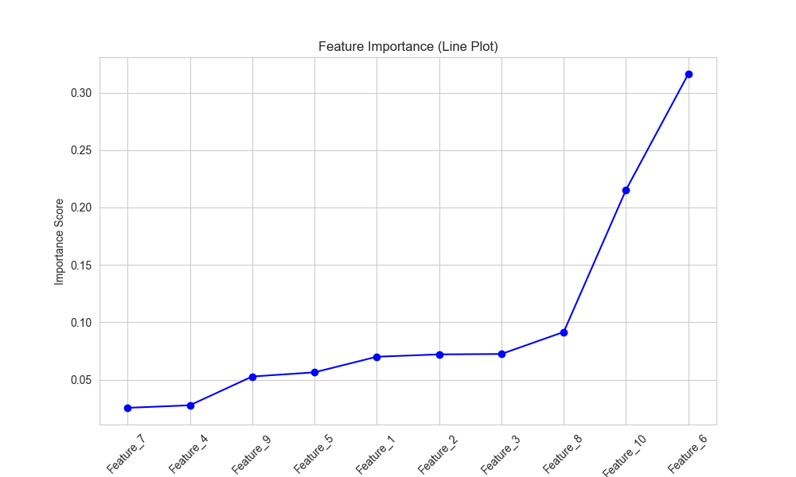

# 随机森林（Random Forest）

## 1. 方法概览

### 1.1 定义

随机森林是一类基于 bagging 的树集成方法。它通过对样本做 bootstrap 抽样、对特征做随机子采样，训练许多彼此不同的决策树，再把它们的结果投票或平均起来。

### 1.2 它主要解决什么问题

- 研究问题：如何在复杂非线性和多重交互存在时，获得比单棵树更稳定的预测模型。
- 适用任务：二分类、多分类、连续结局预测、变量重要性评估。
- 常见医学场景：临床表格数据风险预测、疾病分型辅助分类、生物标志物初筛。

### 1.3 直觉理解

单棵树像一个观点鲜明但容易摇摆的专家；随机森林像一组来自不同视角的专家共同投票，因此更稳健。

## 2. 数学形式

### 2.1 核心公式

若共有 $B$ 棵树，则分类任务的预测为：

$$
\hat y = \arg\max_k \sum_{b=1}^{B} I(T_b(x)=k)
$$

回归任务的预测为：

$$
\hat f(x) = \frac{1}{B}\sum_{b=1}^{B} T_b(x)
$$

其中 $T_b(x)$ 是第 $b$ 棵树的预测。

### 2.2 参数或统计量含义

- $B$：树的数量。
- bootstrap 采样：每棵树使用带放回抽样得到的训练子集。
- `max_features`：每次分裂时参与竞争的特征数量。
- OOB 误差：利用袋外样本估计泛化误差。

### 2.3 关键假设

- 样本之间存在可被树模型捕捉的局部划分结构。
- 通过多树平均或投票可以显著降低单棵树方差。
- 结果解释更偏变量重要性和预测性能，而非参数系数。

## 3. 数据形式与输入输出

### 3.1 适合的数据形式

- 自变量类型：连续、二分类、多分类变量均可。
- 因变量类型：二分类、多分类或连续型。
- 数据结构：宽表数据。
- 是否适合高维数据：可用，但极高维稀疏问题未必最优。
- 是否适合缺失较多数据：通常建议先系统处理缺失。
- 是否适合删失数据：原始随机森林不适合，需使用生存森林变体。
- 是否适合重复测量数据：不直接适合。

### 3.2 示例表格

以 30 天再入院风险二分类任务为例：

| Age | Charlson | HbA1c | eGFR | PriorAdmission | Readmit30d |
| --- | --- | --- | --- | --- | --- |
| 71 | 4 | 8.9 | 48 | 1 | 1 |
| 52 | 1 | 6.7 | 92 | 0 | 0 |
| 63 | 3 | 7.8 | 55 | 1 | 1 |
| 44 | 0 | 6.1 | 101 | 0 | 0 |
| 68 | 2 | 7.1 | 60 | 0 | 0 |

### 3.3 输入与产出

#### 输入

- 输入数据：目标变量和特征矩阵。
- 关键变量：树数、最大深度、最小叶节点、最大特征数、类权重。
- 需要预处理的内容：缺失处理、训练测试集划分、可能的类别不平衡处理。

#### 产出

- 模型对象/统计结果：森林、OOB 误差、特征重要性。
- 参数估计：不提供传统回归系数。
- 预测结果：类别、概率或连续预测值。
- 不确定性指标：OOB 误差、交叉验证指标、测试集 AUC / F1 / MSE。

## 4. 适用场景

- 适合：表格数据、非线性和交互复杂、以预测性能为导向的任务。
- 不适合：强解释导向、样本极小且想稳定估计概率的场景。
- 使用前需要特别检查的点：类别不平衡、重要性偏倚、外部验证。

## 5. 实现

### 5.1 Python

常用包：

- `scikit-learn`

```python
import pandas as pd
from sklearn.ensemble import RandomForestClassifier
from sklearn.model_selection import train_test_split

df = pd.read_csv("readmission.csv")
X = df[["Age", "Charlson", "HbA1c", "eGFR", "PriorAdmission"]]
y = df["Readmit30d"].astype(int)

X_train, X_test, y_train, y_test = train_test_split(
    X, y, test_size=0.2, random_state=42, stratify=y
)

fit = RandomForestClassifier(
    n_estimators=500,
    max_features="sqrt",
    min_samples_leaf=10,
    random_state=42,
    n_jobs=-1,
    oob_score=True
)
fit.fit(X_train, y_train)

print("OOB score:", fit.oob_score_)
print("feature importance:", fit.feature_importances_)
```

### 5.2 R

常用包：

- `ranger`

```r
library(ranger)

fit <- ranger(
  Readmit30d ~ Age + Charlson + HbA1c + eGFR + PriorAdmission,
  data = df,
  probability = TRUE,
  num.trees = 500,
  importance = "impurity"
)

pred <- predict(fit, data = df_test)$predictions
```

## 6. 结果如何解释

- 核心结果看什么：外部或测试集性能、OOB 误差、变量重要性。
- 每个主要参数如何解释：树数增多通常提升稳定性，`max_features` 控制树间相关性。
- 临床或医学意义如何表达：更适合表达“哪些变量对预测最有贡献”，不适合直接解释成线性效应或因果效应。
- 常见误读：高特征重要性不等于该变量具有因果作用。

## 7. 推荐可视化

- 特征重要性条形图。
- ROC 曲线、PR 曲线。
- 真实标签与预测概率分布图。

### 7.1 图像示例

下图展示随机森林分类案例中的特征重要性排序，用来观察模型主要依赖哪些输入变量完成判别。



## 8. 优势、局限与常见坑

### 优势

- 对非线性和交互建模能力强。
- 一般比单棵树稳定。
- 对特征缩放不敏感。

### 局限

- 可解释性弱于单棵树与参数模型。
- 变量重要性可能有偏倚。
- 预测概率常需要额外校准。

### 常见坑

- 只看内部 OOB 表现，不做外部验证。
- 把变量重要性当作因果证据。
- 在强类别不平衡下仍沿用默认阈值。

## 9. 与相近方法的区别

- 和决策树的区别：随机森林通过多树集成降方差，通常泛化更好。
- 和梯度提升的区别：随机森林是并行 bagging，梯度提升是串行 boosting。
- 和随机森林回归的区别：两者核心框架相同，只是结局类型和聚合方式不同。

## 10. 医学研究中的典型应用

- 再入院、死亡、并发症等临床风险预测。
- 生物标志物筛选与变量重要性初探。
- 多特征疾病分类与辅助决策。

## 11. 相关方法

- [[决策树（Decision Tree）]]
- [[随机森林回归（Random Forest Regression）]]
- [[梯度提升回归（Gradient Boosting Regression）]]

## 12. 参考资料

- Breiman L. Random forests. *Mach Learn*. 2001;45:5-32.
- scikit-learn Developers. `sklearn.ensemble.RandomForestClassifier`. scikit-learn API Reference. [https://scikit-learn.org/stable/modules/generated/sklearn.ensemble.RandomForestClassifier.html](https://scikit-learn.org/stable/modules/generated/sklearn.ensemble.RandomForestClassifier.html) （访问日期：2026-07-02）
- Wright MN, Ziegler A. ranger: A fast implementation of random forests for high dimensional data in C++ and R. *J Stat Softw*. 2017;77(1):1-17.
