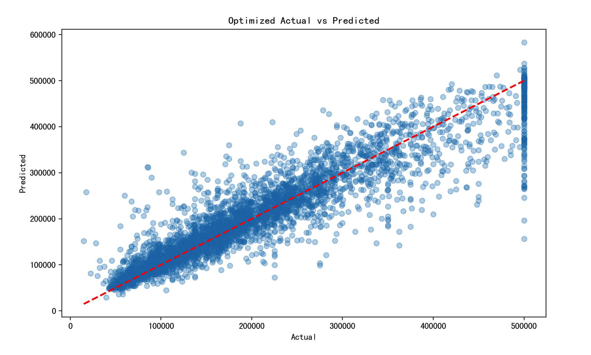

# XGBoost（Extreme Gradient Boosting, XGBoost）

## 1. 方法概览

### 1.1 定义

XGBoost 是一种基于梯度提升树的高性能集成学习方法。它在经典 GBDT 基础上加入了二阶优化、显式正则化、列采样、缺失值处理和工程级并行优化，因此在表格数据预测中非常常用。

### 1.2 它主要解决什么问题

- 研究问题：如何在复杂非线性和高阶交互存在时，获得强预测性能且可扩展的表格数据模型。
- 适用任务：二分类、多分类、连续结局预测、排序与特征筛选辅助分析。
- 常见医学场景：死亡风险预测、再入院预测、并发症判别、生物标志物驱动的表格型建模。

### 1.3 直觉理解

XGBoost 像是在不断“补错题”。第一棵树先给出粗略判断，后面的树专门学习前面没学好的地方；与此同时，它还会主动惩罚过于复杂的树，让模型不至于只会死记训练集。

## 2. 数学形式

### 2.1 核心公式

XGBoost 的目标函数写成：

$$
\mathcal{L}(\theta) = \sum_{i=1}^{n} l(y_i, \hat y_i) + \sum_{t=1}^{T}\Omega(f_t)
$$

其中每棵树的正则化项为：

$$
\Omega(f) = \gamma J + \frac{1}{2}\lambda \sum_{j=1}^{J} w_j^2
$$

在第 $t$ 轮，使用二阶泰勒展开得到近似目标：

$$
\mathcal{L}^{(t)} \approx \sum_{i=1}^{n}\left[g_i f_t(x_i) + \frac{1}{2} h_i f_t(x_i)^2\right] + \Omega(f_t)
$$

其中 $g_i$ 和 $h_i$ 分别是一阶梯度和二阶 Hessian。若第 $j$ 个叶节点的样本集合为 $I_j$，则最优叶子权重为：

$$
w_j^* = -\frac{G_j}{H_j + \lambda}
$$

其中：

$$
G_j = \sum_{i \in I_j} g_i, \qquad H_j = \sum_{i \in I_j} h_i
$$

候选分裂的增益为：

$$
\text{Gain} = \frac{1}{2}\left(\frac{G_L^2}{H_L+\lambda} + \frac{G_R^2}{H_R+\lambda} - \frac{(G_L+G_R)^2}{H_L+H_R+\lambda}\right) - \gamma
$$

### 2.2 参数或统计量含义

- `n_estimators`：提升轮数。
- `learning_rate`：每轮更新步长。
- `max_depth`：单棵树复杂度上限。
- `subsample`、`colsample_bytree`：样本和特征子采样比例。
- `lambda`、`gamma`：控制叶子权重和分裂复杂度的正则化参数。

### 2.3 关键假设

- 表格数据中存在可被树模型捕捉的非线性与交互。
- 最终目标更偏预测性能而非参数解释。
- 若样本量较小或调参不当，模型仍可能过拟合。

## 3. 数据形式与输入输出

### 3.1 适合的数据形式

- 自变量类型：连续、二分类、多分类变量均可，类别变量通常需编码。
- 因变量类型：二分类、多分类或连续型。
- 数据结构：宽表数据。
- 是否适合高维数据：适合中高维表格数据。
- 是否适合缺失较多数据：对缺失有一定原生处理能力，但仍建议先理解缺失机制。
- 是否适合删失数据：原始 XGBoost 不直接适合删失结局。
- 是否适合重复测量数据：不直接适合。

### 3.2 示例表格

以 ICU 患者 30 天死亡风险预测为例：

| Age | SOFA | Lactate | Creatinine | Vasopressor | Death30d |
| --- | --- | --- | --- | --- | --- |
| 73 | 9 | 3.1 | 2.0 | 1 | 1 |
| 46 | 3 | 1.1 | 0.9 | 0 | 0 |
| 65 | 7 | 2.4 | 1.5 | 1 | 1 |
| 39 | 2 | 0.8 | 0.7 | 0 | 0 |
| 58 | 5 | 1.6 | 1.2 | 0 | 0 |

### 3.3 输入与产出

#### 输入

- 输入数据：目标变量和特征矩阵。
- 关键变量：树数、学习率、树深、正则化参数、采样比例。
- 需要预处理的内容：训练测试集划分、类别编码、可选的缺失和不平衡处理。

#### 产出

- 模型对象/统计结果：树集成模型、特征重要性、训练/验证误差。
- 参数估计：不提供传统线性系数。
- 预测结果：类别、概率或连续预测值。
- 不确定性指标：交叉验证性能、测试集 AUC / PR-AUC / MSE、概率校准结果。

## 4. 适用场景

- 适合：表格数据预测、变量间关系复杂、以性能为导向的建模任务。
- 不适合：极小样本、强可解释性或严格因果推断为主的场景。
- 使用前需要特别检查的点：类别不平衡、概率校准、外部验证、早停设置。

## 5. 实现

### 5.1 Python

常用包：

- `xgboost`
- `scikit-learn`

```python
import pandas as pd
from sklearn.model_selection import train_test_split
from xgboost import XGBClassifier

df = pd.read_csv("icu_mortality.csv")
X = df[["Age", "SOFA", "Lactate", "Creatinine", "Vasopressor"]]
y = df["Death30d"].astype(int)

X_train, X_test, y_train, y_test = train_test_split(
    X, y, test_size=0.2, random_state=42, stratify=y
)

fit = XGBClassifier(
    objective="binary:logistic",
    n_estimators=300,
    learning_rate=0.05,
    max_depth=4,
    subsample=0.8,
    colsample_bytree=0.8,
    reg_lambda=1.0,
    random_state=42,
    eval_metric="logloss"
)
fit.fit(X_train, y_train)

pred_prob = fit.predict_proba(X_test)[:, 1]
```

### 5.2 R

常用包：

- `xgboost`

```r
library(xgboost)

X_mat <- as.matrix(df[, c("Age", "SOFA", "Lactate", "Creatinine", "Vasopressor")])
y <- df$Death30d

fit <- xgboost(
  data = X_mat,
  label = y,
  objective = "binary:logistic",
  nrounds = 300,
  eta = 0.05,
  max_depth = 4,
  subsample = 0.8,
  colsample_bytree = 0.8,
  verbose = 0
)
```

## 6. 结果如何解释

- 核心结果看什么：验证集或外部测试集性能、早停轮数、特征重要性、校准表现。
- 每个主要参数如何解释：学习率越小通常需要更多树；树越深越灵活但也更容易过拟合。
- 临床或医学意义如何表达：更适合表达“模型对个体风险的判别能力和排序能力”，不适合直接把重要性当作独立因果效应。
- 常见误读：特征重要性高不等于因果重要，也不等于临床上最值得干预。

## 7. 推荐可视化

- ROC 曲线、PR 曲线。
- 特征重要性条形图。
- SHAP 总结图或局部解释图。

### 7.1 图像示例

下图展示 XGBoost 案例在优化后的真实值与预测值对照关系，适合直观看模型拟合质量和误差分布。



## 8. 优势、局限与常见坑

### 优势

- 表格数据性能通常很强。
- 二阶优化和正则化让训练更稳。
- 支持缺失值和多种任务目标。

### 局限

- 调参空间较大。
- 可解释性弱于参数模型。
- 概率输出常需要再校准。

### 常见坑

- 只看内部验证结果，不做外部验证。
- 过度追求 AUC，忽略校准和临床阈值。
- 让树太深或学习率太大导致过拟合。

## 9. 与相近方法的区别

- 和梯度提升回归的区别：XGBoost 是 GBDT 的增强实现，加入了二阶信息、显式正则化和工程优化。
- 和 LightGBM 的区别：LightGBM 更强调直方图和 leaf-wise 生长，常在大样本场景更快。
- 和随机森林的区别：随机森林是并行 bagging，XGBoost 是串行 boosting。

## 10. 医学研究中的典型应用

- ICU 或住院患者短期死亡风险预测。
- 再入院、败血症、并发症等二分类风险模型。
- 多变量表格数据中的高性能预测基线。

## 11. 相关方法

- [[梯度提升回归（Gradient Boosting Regression）]]
- [[LightGBM（Light Gradient Boosting Machine）]]
- [[随机森林（Random Forest）]]

## 12. 参考资料

- Chen T, Guestrin C. XGBoost: A scalable tree boosting system. In: *Proceedings of KDD 2016*. 2016:785-794.
- XGBoost Contributors. XGBoost Documentation. [https://xgboost.readthedocs.io/](https://xgboost.readthedocs.io/) （访问日期：2026-07-02）
- Mitchell R, Frank E. Accelerating the XGBoost algorithm using GPU computing. *PeerJ Comput Sci*. 2017;3:e127.
