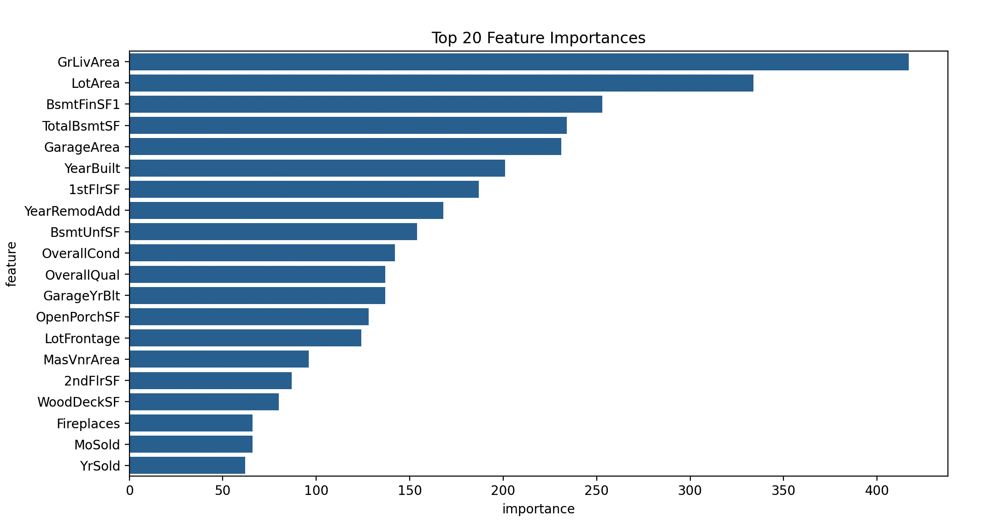

# LightGBM（Light Gradient Boosting Machine）

## 1. 方法概览

### 1.1 定义

LightGBM 是一种高效的梯度提升树实现。它在传统 GBDT 基础上引入直方图分桶、leaf-wise 生长策略，以及大样本场景常用的 GOSS 和 EFB 等优化，使其在大规模表格数据上训练更快、内存占用更低。

### 1.2 它主要解决什么问题

- 研究问题：如何在保持提升树高性能的同时，进一步提升训练效率和扩展性。
- 适用任务：二分类、多分类、连续结局预测、排序。
- 常见医学场景：电子病历大样本风险预测、多中心临床数据建模、需要频繁调参迭代的预测任务。

### 1.3 直觉理解

LightGBM 依然是在不断用新树纠正旧树的错误，但它会先把连续特征压缩成“桶”，再优先生长当前最值得分裂的叶子，所以通常能用更少的时间学到很强的模型。

## 2. 数学形式

### 2.1 核心公式

其加法模型与一般梯度提升一致：

$$
F_M(x) = \sum_{m=1}^{M} \nu h_m(x)
$$

在每一轮，弱学习器 $h_m(x)$ 用来拟合损失函数对当前预测的负梯度。对于树分裂，常见增益形式为：

$$
\text{Gain} = \frac{1}{2}\left(\frac{G_L^2}{H_L+\lambda} + \frac{G_R^2}{H_R+\lambda} - \frac{(G_L+G_R)^2}{H_L+H_R+\lambda}\right) - \gamma
$$

与一般 GBDT 的不同点主要不在公式本身，而在实现策略：

- 直方图算法：连续值先离散到有限桶中，加速分裂搜索。
- leaf-wise 生长：每次优先分裂收益最大的叶节点。
- GOSS：保留大梯度样本、下采样小梯度样本。
- EFB：把互斥特征打包，减少高维稀疏特征计算量。

### 2.2 参数或统计量含义

- `num_leaves`：树的叶子数上限，是 LightGBM 最关键的复杂度参数之一。
- `learning_rate`：每轮更新步长。
- `n_estimators`：提升轮数。
- `max_depth`：最大树深，常和 `num_leaves` 一起约束复杂度。
- `feature_fraction`、`bagging_fraction`：特征和样本采样比例。

### 2.3 关键假设

- 主要适用于表格型监督学习任务。
- 若 leaf-wise 生长限制不足，模型容易过拟合。
- 类别变量与缺失值虽可原生支持，但仍需结合具体数据质量判断。

## 3. 数据形式与输入输出

### 3.1 适合的数据形式

- 自变量类型：连续、二分类、多分类变量均可。
- 因变量类型：二分类、多分类或连续型。
- 数据结构：宽表数据，尤其适合大规模样本。
- 是否适合高维数据：适合高维稀疏表格数据。
- 是否适合缺失较多数据：具备原生缺失处理能力，但不应替代缺失机制分析。
- 是否适合删失数据：原始 LightGBM 不直接处理删失时间结局。
- 是否适合重复测量数据：不直接适合。

### 3.2 示例表格

以全院住院患者院内恶化风险预测为例：

| Age | NEWS2 | WBC | Albumin | Cancer | Deterioration |
| --- | --- | --- | --- | --- | --- |
| 78 | 8 | 14.2 | 29 | 1 | 1 |
| 49 | 2 | 6.3 | 41 | 0 | 0 |
| 66 | 5 | 10.8 | 34 | 1 | 1 |
| 37 | 1 | 5.8 | 43 | 0 | 0 |
| 57 | 4 | 8.4 | 38 | 0 | 0 |

### 3.3 输入与产出

#### 输入

- 输入数据：目标变量和特征矩阵。
- 关键变量：叶子数、学习率、树数、最小叶节点样本数、采样比例。
- 需要预处理的内容：训练测试集划分、类别变量整理、类别不平衡处理。

#### 产出

- 模型对象/统计结果：提升树模型、重要性排序、训练与验证指标。
- 参数估计：以树结构和分裂收益为主，没有传统系数。
- 预测结果：类别、概率或连续预测值。
- 不确定性指标：验证集性能、外部测试表现、校准与决策阈值表现。

## 4. 适用场景

- 适合：大样本表格数据、需要高效训练和频繁调参的预测任务。
- 不适合：样本特别少、解释优先、强因果分析导向的场景。
- 使用前需要特别检查的点：`num_leaves` 是否过大、是否发生过拟合、概率是否需要校准。

## 5. 实现

### 5.1 Python

常用包：

- `lightgbm`
- `scikit-learn`

```python
import pandas as pd
from sklearn.model_selection import train_test_split
from lightgbm import LGBMClassifier

df = pd.read_csv("deterioration.csv")
X = df[["Age", "NEWS2", "WBC", "Albumin", "Cancer"]]
y = df["Deterioration"].astype(int)

X_train, X_test, y_train, y_test = train_test_split(
    X, y, test_size=0.2, random_state=42, stratify=y
)

fit = LGBMClassifier(
    objective="binary",
    num_leaves=31,
    learning_rate=0.05,
    n_estimators=400,
    subsample=0.8,
    colsample_bytree=0.8,
    random_state=42
)
fit.fit(X_train, y_train)

pred_prob = fit.predict_proba(X_test)[:, 1]
```

### 5.2 R

常用包：

- `lightgbm`

```r
library(lightgbm)

X_mat <- as.matrix(df[, c("Age", "NEWS2", "WBC", "Albumin", "Cancer")])
y <- df$Deterioration

dtrain <- lgb.Dataset(data = X_mat, label = y)

fit <- lgb.train(
  params = list(objective = "binary", learning_rate = 0.05, num_leaves = 31),
  data = dtrain,
  nrounds = 400
)
```

## 6. 结果如何解释

- 核心结果看什么：外部测试性能、最佳迭代轮数、重要特征、校准情况。
- 每个主要参数如何解释：`num_leaves` 越大越灵活，若约束不够容易过拟合；学习率越小通常需要更多轮数。
- 临床或医学意义如何表达：更适合强调预测准确性和高危个体识别能力，而不是单变量效应解释。
- 常见误读：训练快不代表一定更好，LightGBM 同样需要严格验证和阈值评估。

## 7. 推荐可视化

- 验证集指标随迭代轮数变化图。
- 特征重要性图。
- ROC / PR 曲线与概率校准图。

### 7.1 图像示例

下图给出 LightGBM 案例中的前 20 个特征重要性排序，用来快速观察模型最依赖的关键信息来源。



## 8. 优势、局限与常见坑

### 优势

- 在大样本表格数据上通常很快。
- 内存效率高。
- 对稀疏和高维特征更友好。

### 局限

- leaf-wise 生长更容易过拟合。
- 仍然缺乏直接参数解释。
- 概率预测可能需要额外校准。

### 常见坑

- `num_leaves` 过大但缺少深度和叶节点样本约束。
- 只看内部验证，不做外部验证。
- 把重要性或 SHAP 解释直接视作因果发现。

## 9. 与相近方法的区别

- 和 XGBoost 的区别：LightGBM 更强调直方图、leaf-wise、生长效率和大样本扩展性。
- 和梯度提升回归的区别：LightGBM 是更偏工程化和规模化的 GBDT 实现。
- 和随机森林的区别：LightGBM 通过串行 boosting 纠错；随机森林通过并行 bagging 降方差。

## 10. 医学研究中的典型应用

- 大规模电子病历风险分层。
- 多中心临床数据的高性能分类与回归。
- 快速迭代调参与模型对比场景。

## 11. 相关方法

- [[XGBoost（Extreme Gradient Boosting, XGBoost）]]
- [[梯度提升回归（Gradient Boosting Regression）]]
- [[随机森林（Random Forest）]]

## 12. 参考资料

- Ke G, Meng Q, Finley T, et al. LightGBM: A highly efficient gradient boosting decision tree. In: *Advances in Neural Information Processing Systems 30*. 2017.
- LightGBM Contributors. LightGBM Documentation. [https://lightgbm.readthedocs.io/](https://lightgbm.readthedocs.io/) （访问日期：2026-07-02）
- Shi X, Wong YD, Li MZ, Palanisamy C, Chai C. A feature learning approach based on XGBoost for driving assessment and risk prediction. *Accid Anal Prev*. 2019;129:170-179.
