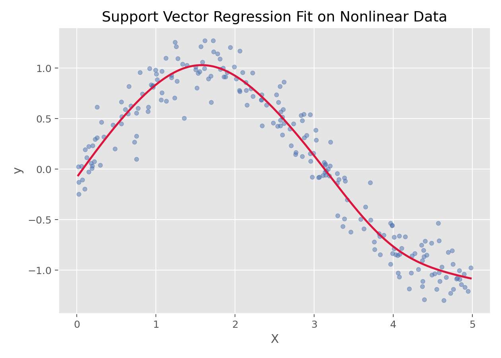
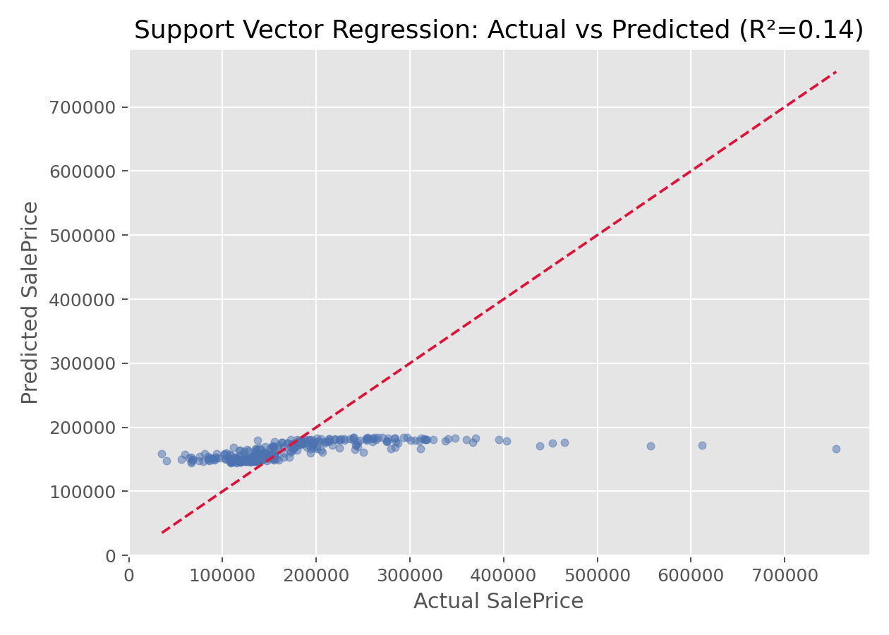

# 支持向量回归（Support Vector Regression, SVR）

## 1. 方法概览

### 1.1 定义

支持向量回归是支持向量机在回归问题中的扩展，它通过引入 $\epsilon$-不敏感损失函数，在允许一定误差带的同时寻找最平滑的回归函数。

### 1.2 它主要解决什么问题

- 研究问题：如何在复杂非线性关系下做稳健的连续结局预测。
- 适用任务：非线性回归、小到中等规模数据预测、核方法回归。
- 常见医学场景：复杂生理指标预测、连续风险评分估计、非线性剂量-反应曲线拟合。

### 1.3 直觉理解

SVR 不要求每个点都精确拟合，而是在预测曲线周围放一个“容忍带”（$\epsilon$-tube）。只要点落在带内，就不产生损失；真正决定模型形状的是落在带外的那些支持向量。

## 2. 数学形式

### 2.1 核心公式

线性 SVR 的优化问题可写成：

$$
\min_{w,b,\xi_i,\xi_i^*}
\frac{1}{2}\|w\|^2
+
C\sum_{i=1}^n(\xi_i+\xi_i^*)
$$

满足约束：

$$
\begin{aligned}
y_i - (w^\top x_i + b) &\le \epsilon + \xi_i \\
(w^\top x_i + b) - y_i &\le \epsilon + \xi_i^* \\
\xi_i,\xi_i^* &\ge 0
\end{aligned}
$$

核化后预测函数为：

$$
f(x)=\sum_{i=1}^n (\alpha_i-\alpha_i^*)K(x_i,x)+b
$$

### 2.2 参数或统计量含义

- $\epsilon$：误差容忍带宽度。
- $C$：误差惩罚强度。
- $K(\cdot,\cdot)$：核函数，如线性核、多项式核、RBF 核。
- 支持向量：落在 $\epsilon$ 带外、真正决定模型的样本点。

### 2.3 关键假设

- 结局为连续型。
- 数据规模通常不宜过大，否则计算成本会较高。
- 特征尺度通常需要标准化。

## 3. 数据形式与输入输出

### 3.1 适合的数据形式

- 自变量类型：连续变量为主，也可混合编码后的分类变量。
- 因变量类型：连续型。
- 数据结构：宽表数据，或低维非线性散点数据。
- 是否适合高维数据：可以，但训练成本会提高。
- 是否适合缺失较多数据：需先处理缺失值。
- 是否适合删失数据：不适合。
- 是否适合重复测量数据：不直接适合。

### 3.2 示例表格

一个简单的一维非线性回归表格如下：

| X | y |
| --- | --- |
| 0.026 | 0.045 |
| 1.126 | 0.735 |
| 1.392 | 0.979 |
| 1.501 | 1.123 |
| 1.515 | 0.756 |
| 2.340 | 0.636 |

### 3.3 输入与产出

#### 输入

- 输入数据：连续结局和特征矩阵。
- 关键变量：核函数、`C`、`epsilon`、`gamma`。
- 需要预处理的内容：标准化、训练测试集划分、超参数搜索。

#### 产出

- 模型对象/统计结果：支持向量集合、拟合函数、最佳超参数。
- 参数估计：核参数和支持向量权重，不像线性回归那样直观。
- 预测结果：连续型预测值。
- 不确定性指标：通常依赖交叉验证误差和测试集性能。

## 4. 适用场景

- 适合：复杂非线性、小到中等规模回归任务。
- 不适合：超大规模数据、强调强可解释性的场景。
- 使用前需要特别检查的点：标准化、核函数选择、`C/epsilon/gamma` 调参。

## 5. 实现

### 5.1 Python

常用包：

- `scikit-learn`

```python
from sklearn.pipeline import make_pipeline
from sklearn.preprocessing import StandardScaler
from sklearn.svm import SVR

fit = make_pipeline(
    StandardScaler(),
    SVR(kernel="rbf", C=10, epsilon=0.1, gamma="scale")
)
fit.fit(X_train, y_train)
y_pred = fit.predict(X_test)
```

### 5.2 R

常用包：

- `e1071`

```r
library(e1071)

fit <- svm(y ~ ., data = df, type = "eps-regression", kernel = "radial")
pred <- predict(fit, newdata = df_test)
```

## 6. 结果如何解释

- 核心结果看什么：预测误差、支持向量数量、核参数。
- 每个主要参数如何解释：SVR 更偏预测导向，参数解释通常不如线性模型直接。
- 临床或医学意义如何表达：更适合强调“预测性能”和“非线性拟合能力”。
- 常见误读：支持向量回归不是简单的“线性回归 + 核函数”，其损失函数和优化目标都不同。

## 7. 推荐可视化

- 原始散点图 + SVR 拟合曲线。
- 真实值 vs 预测值散点图。
- 不同核函数拟合曲线对比图。

### 7.1 图像示例

下图展示 SVR 在一组非线性数据上的拟合曲线，体现了核方法对复杂曲线关系的刻画能力。



下图为 SVR 在房价数据上的真实值 vs 预测值散点图，点越贴近对角线说明预测越准确。



## 8. 优势、局限与常见坑

### 优势

- 非线性拟合能力强。
- 对小误差不敏感，具有一定稳健性。
- 核技巧让它在低到中等规模问题上很灵活。

### 局限

- 大样本计算成本高。
- 参数调优复杂。
- 模型解释性一般。

### 常见坑

- 不标准化特征就直接训练。
- 在大数据上直接用 RBF-SVR。
- 只调 `C` 不调 `epsilon` 和 `gamma`。

## 9. 与相近方法的区别

- 和线性回归的区别：SVR 关注支持向量和 $\epsilon$-带，而不是整体平方误差最小化。
- 和支持向量机的区别：SVR 处理连续结局，SVM 主条目聚焦分类任务。
- 和多项式回归的区别：多项式回归靠特征扩展，SVR 靠核函数与 margin 思想。
- 和随机森林回归的区别：SVR 更适合平滑非线性曲线，树模型更擅长复杂交互和局部结构。

## 10. 医学研究中的典型应用

- 非线性连续风险预测。
- 生理参数与疾病评分之间的复杂关系拟合。
- 小中样本、高维但非线性明显的预测任务。

## 11. 相关方法

- [[支持向量机（Support Vector Machine, SVM）]]
- [[多项式回归（Polynomial Regression）]]
- [[Ridge回归（Ridge Regression）]]
- [[线性回归（Linear Regression）]]

## 12. 参考资料

- Smola AJ, Schölkopf B. A tutorial on support vector regression. *Stat Comput*. 2004;14:199-222.
- scikit-learn Developers. `sklearn.svm.SVR`. scikit-learn API Reference. [https://scikit-learn.org/stable/modules/generated/sklearn.svm.SVR.html](https://scikit-learn.org/stable/modules/generated/sklearn.svm.SVR.html) （访问日期：2026-07-02）
- CRAN. Package `e1071`. [https://cran.r-project.org/package=e1071](https://cran.r-project.org/package=e1071) （访问日期：2026-07-02）
