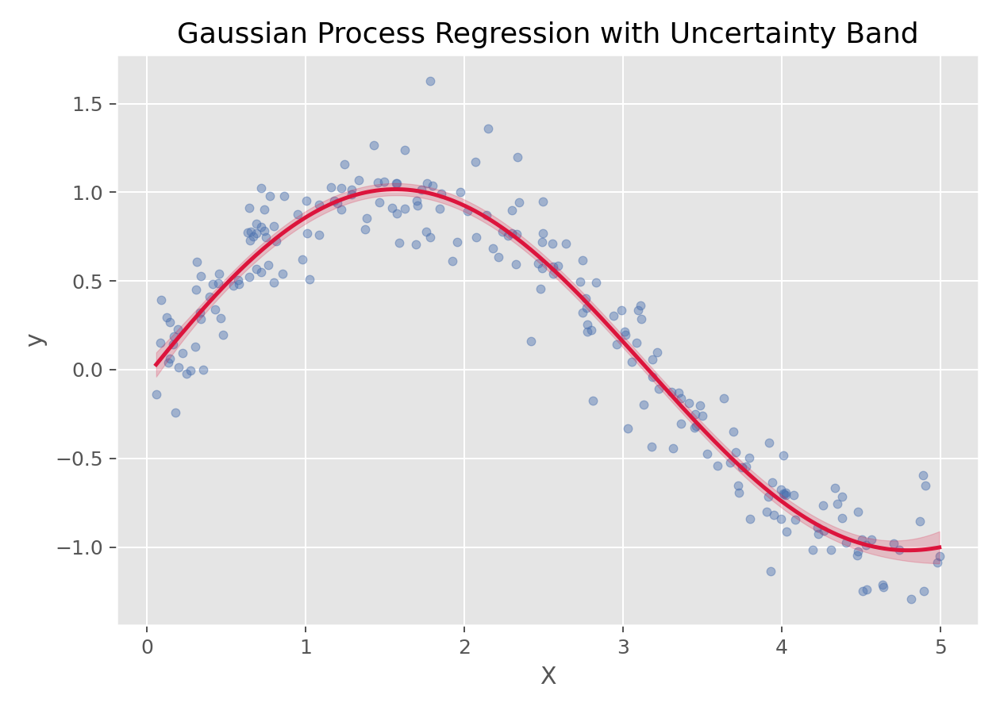

# 高斯过程回归（Gaussian Process Regression）

## 1. 方法概览

### 1.1 定义

高斯过程回归是一种以“函数分布”为对象的贝叶斯非参数回归方法，不仅能给出预测均值，还能自然给出预测不确定性。

### 1.2 它主要解决什么问题

- 研究问题：如何在非线性回归中同时获得平滑预测和不确定性估计。
- 适用任务：小到中等规模非线性回归、函数拟合、不确定性量化。
- 常见医学场景：剂量-反应曲线拟合、连续生理信号建模、小样本平滑预测。

### 1.3 直觉理解

高斯过程不是先假设一个固定形式的函数，而是直接对“所有可能的函数形状”施加概率分布。观测到数据后，再更新这组函数的分布，从而得到预测均值和置信带。

## 2. 数学形式

### 2.1 核心公式

高斯过程写作：

$$
f(x)\sim \mathcal{GP}(m(x), k(x,x'))
$$

其中 $m(x)$ 是均值函数，$k(x,x')$ 是核函数（协方差函数）。

给定训练数据后，对新点 $x_*$ 的预测分布仍为高斯分布：

$$
f_* \mid X, y, x_* \sim N(\mu_*, \sigma_*^2)
$$

### 2.2 参数或统计量含义

- $m(x)$：均值函数，常设为 0。
- $k(x,x')$：核函数，决定平滑性、相关性和函数形状。
- $\mu_*$：预测均值。
- $\sigma_*^2$：预测不确定性。

### 2.3 关键假设

- 函数可由所选核函数合理描述。
- 常见实现对样本量较敏感，规模过大时计算成本高。
- 核函数和超参数选择非常关键。

## 3. 数据形式与输入输出

### 3.1 适合的数据形式

- 自变量类型：连续变量最典型。
- 因变量类型：连续型。
- 数据结构：低维到中等维度的宽表或一维曲线数据。
- 是否适合高维数据：高维和大样本时计算成本显著增加。
- 是否适合缺失较多数据：需先处理缺失值。
- 是否适合删失数据：不直接适合。
- 是否适合重复测量数据：可扩展，但基础形式不直接针对纵向相关结构。

### 3.2 示例表格

一个典型的一维平滑回归表格如下：

| X | y |
| --- | --- |
| 0.026 | 0.045 |
| 1.126 | 0.735 |
| 1.392 | 0.979 |
| 1.501 | 1.123 |
| 1.515 | 0.756 |
| 2.340 | 0.636 |

### 3.3 输入与产出

#### 输入

- 输入数据：连续结局和特征矩阵。
- 关键变量：核函数、长度尺度、噪声参数。
- 需要预处理的内容：标准化（可选）、训练测试划分、核函数选择。

#### 产出

- 模型对象/统计结果：后验均值、后验方差、核超参数。
- 参数估计：函数空间层面的平滑结构，而非传统系数。
- 预测结果：预测均值和区间。
- 不确定性指标：预测标准差和置信带。

## 4. 适用场景

- 适合：小样本、低维、需要高质量不确定性估计的非线性回归。
- 不适合：超大样本、大规模高维数据。
- 使用前需要特别检查的点：核函数选择、超参数、数值稳定性。

## 5. 实现

### 5.1 Python

常用包：

- `scikit-learn`

```python
from sklearn.gaussian_process import GaussianProcessRegressor
from sklearn.gaussian_process.kernels import RBF, ConstantKernel as C

kernel = C(1.0) * RBF(length_scale=1.0)
fit = GaussianProcessRegressor(kernel=kernel, alpha=0.1**2, normalize_y=True)
fit.fit(X_train, y_train)
y_mean, y_std = fit.predict(X_test, return_std=True)
```

### 5.2 R

常用包：

- `kernlab`

```r
library(kernlab)

fit <- gausspr(x = X_train, y = y_train, kernel = "rbfdot")
pred <- predict(fit, X_test)
```

## 6. 结果如何解释

- 核心结果看什么：拟合曲线、置信带宽度、核超参数。
- 每个主要参数如何解释：比起系数，更重要的是曲线形状和不确定性区域。
- 临床或医学意义如何表达：适合表达“某个输入区域预测更确定、某个区域更不确定”。
- 常见误读：高斯过程不是“普通回归再加一个置信区间”，它从一开始就在函数空间里做概率建模。

## 7. 推荐可视化

- 原始散点图 + 预测均值曲线。
- 预测不确定性带。
- 不同核函数下的拟合对比。

### 7.1 图像示例

下图展示高斯过程回归的拟合均值和不确定性带，适合说明其“预测 + 置信度”并存的特点。



## 8. 优势、局限与常见坑

### 优势

- 非线性拟合能力强。
- 自然给出不确定性。
- 小样本时很有吸引力。

### 局限

- 计算复杂度高。
- 核函数选择敏感。
- 高维和大样本下扩展性有限。

### 常见坑

- 样本很多时仍强行使用标准 GPR。
- 不检查核函数是否适配问题。
- 只看均值曲线，不看不确定性带。

## 9. 与相近方法的区别

- 和贝叶斯回归的区别：贝叶斯回归通常在参数空间建模，高斯过程直接在函数空间建模。
- 和 SVR 的区别：SVR 更偏 margin 优化，高斯过程更偏概率建模。
- 和局部加权回归的区别：局部加权回归偏局部拟合，高斯过程通过核函数整体定义平滑结构。

## 10. 医学研究中的典型应用

- 小样本非线性生理曲线建模。
- 连续指标的平滑预测与置信区间展示。
- 需要明确不确定性区域的回归问题。

## 11. 相关方法

- [[贝叶斯回归（Bayesian Regression）]]
- [[支持向量回归（Support Vector Regression, SVR）]]
- [[局部加权回归（Locally Weighted Regression）]]

## 12. 参考资料

- Rasmussen CE, Williams CKI. *Gaussian Processes for Machine Learning*. MIT Press; 2006.
- scikit-learn Developers. `sklearn.gaussian_process.GaussianProcessRegressor`. scikit-learn API Reference. [https://scikit-learn.org/stable/modules/generated/sklearn.gaussian_process.GaussianProcessRegressor.html](https://scikit-learn.org/stable/modules/generated/sklearn.gaussian_process.GaussianProcessRegressor.html) （访问日期：2026-07-02）
