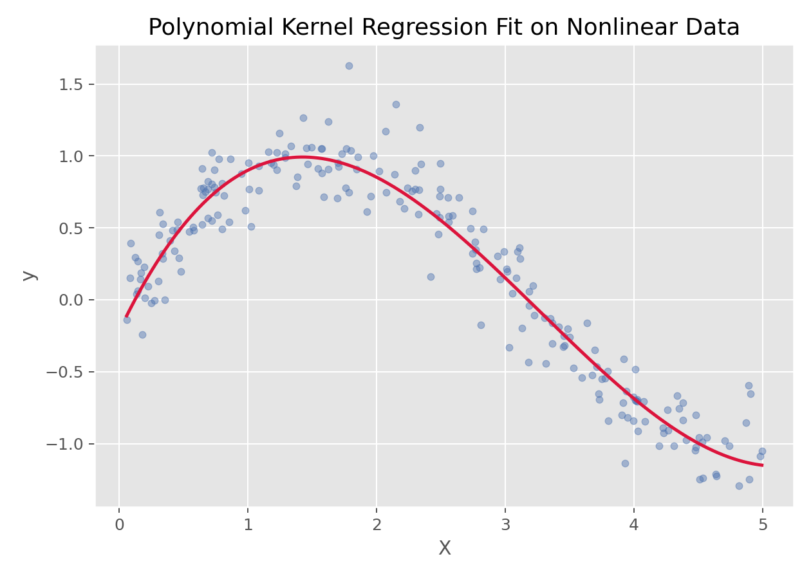

# 多项式核回归（Polynomial Kernel Regression）

## 1. 方法概览

### 1.1 定义

多项式核回归是一类利用多项式核函数实现非线性拟合的回归方法，实践中常见形式是“带多项式核的支持向量回归”。

### 1.2 它主要解决什么问题

- 研究问题：如何在不显式构造高次多项式特征的情况下拟合弯曲的非线性关系。
- 适用任务：非线性回归、核方法回归、复杂曲线拟合。
- 常见医学场景：非线性剂量-反应关系、复杂连续指标拟合。

### 1.3 直觉理解

多项式核的作用像是给原始数据做了一个“高维多项式扩展”，但这种扩展不需要显式写出来，而是通过核函数直接完成。

## 2. 数学形式

### 2.1 核心公式

多项式核函数定义为：

$$
K(x,x') = (\langle x, x' \rangle + c)^d
$$

在核回归模型中，预测函数通常写成：

$$
f(x)=\sum_{i=1}^n \alpha_i K(x_i,x)+b
$$

### 2.2 参数或统计量含义

- $d$：多项式阶数。
- $c$：偏置常数（`coef0`）。
- $\alpha_i$：由训练样本决定的权重。
- 核技巧：不显式构造高维特征映射，而直接计算核内积。

### 2.3 关键假设

- 关系具有可用多项式结构近似的非线性。
- 模型复杂度由核阶数和正则化共同控制。
- 常需配合标准化使用。

## 3. 数据形式与输入输出

### 3.1 适合的数据形式

- 自变量类型：连续变量最典型。
- 因变量类型：连续型。
- 数据结构：宽表数据或一维曲线数据。
- 是否适合高维数据：可用，但核方法在大样本下代价高。
- 是否适合缺失较多数据：需先处理缺失值。
- 是否适合删失数据：不适合。
- 是否适合重复测量数据：不直接适合。

### 3.2 示例表格

一个典型的非线性一维回归表格如下：

| X | y |
| --- | --- |
| 0.026 | 0.045 |
| 1.126 | 0.735 |
| 1.392 | 0.979 |
| 1.501 | 1.123 |
| 1.515 | 0.756 |
| 2.340 | 0.636 |

### 3.3 输入与产出

#### 输入

- 输入数据：连续结局与特征矩阵。
- 关键变量：核函数阶数 `degree`、惩罚参数 `C`、`epsilon`、`coef0`。
- 需要预处理的内容：标准化、训练测试划分、调参。

#### 产出

- 模型对象/统计结果：核回归模型、超参数、预测函数。
- 参数估计：不强调传统回归系数。
- 预测结果：连续型预测值。
- 不确定性指标：多依赖交叉验证和测试集误差。

## 4. 适用场景

- 适合：存在明显曲线关系、但希望通过核技巧避免显式高次展开的场景。
- 不适合：超大样本或对可解释性要求很高的场景。
- 使用前需要特别检查的点：核阶数、正则化、是否过拟合。

## 5. 实现

### 5.1 Python

常用包：

- `scikit-learn`

```python
from sklearn.pipeline import make_pipeline
from sklearn.preprocessing import StandardScaler
from sklearn.svm import SVR

fit = make_pipeline(
    StandardScaler(),
    SVR(kernel='poly', degree=3, C=10, epsilon=0.1, coef0=1)
)
fit.fit(X_train, y_train)
y_pred = fit.predict(X_test)
```

### 5.2 R

常用包：

- `e1071`

```r
library(e1071)

fit <- svm(y ~ x, data = df, type = "eps-regression", kernel = "polynomial", degree = 3)
pred <- predict(fit, newdata = df_test)
```

## 6. 结果如何解释

- 核心结果看什么：拟合曲线、预测误差、阶数与复杂度。
- 每个主要参数如何解释：更应关注整体拟合形状，而不是单个核参数的语义。
- 临床或医学意义如何表达：适合解释“存在平滑但弯曲的非线性趋势”。
- 常见误读：它并不等同于普通多项式回归，只是都能产生弯曲拟合。

## 7. 推荐可视化

- 原始散点图 + 多项式核拟合曲线。
- 不同阶数核的拟合对比图。

### 7.1 图像示例

下图展示多项式核回归在非线性数据上的拟合效果，体现了核技巧带来的曲线建模能力。



## 8. 优势、局限与常见坑

### 优势

- 可以捕捉复杂非线性。
- 无需显式手工展开多项式特征。
- 能自然纳入支持向量机框架。

### 局限

- 参数调优较复杂。
- 可解释性弱于普通多项式回归。
- 样本规模大时训练成本高。

### 常见坑

- 核阶数过高导致过拟合。
- 不标准化特征。
- 把它和普通多项式回归完全等同。

## 9. 与相近方法的区别

- 和多项式回归的区别：多项式回归显式展开特征，多项式核回归通过核函数隐式展开。
- 和 RBF-SVR 的区别：多项式核更适合多项式型弯曲，RBF 更灵活但更黑盒。
- 和高斯过程回归的区别：两者都依赖核函数，但高斯过程额外提供概率不确定性。

## 10. 医学研究中的典型应用

- 剂量-反应或指标-反应的平滑非线性拟合。
- 低维复杂曲线建模。

## 11. 相关方法

- [[支持向量回归（Support Vector Regression, SVR）]]
- [[多项式回归（Polynomial Regression）]]
- [[高斯过程回归（Gaussian Process Regression）]]

## 12. 参考资料

- Smola AJ, Schölkopf B. A tutorial on support vector regression. *Stat Comput*. 2004;14:199-222.
- scikit-learn Developers. `sklearn.svm.SVR`. scikit-learn API Reference. [https://scikit-learn.org/stable/modules/generated/sklearn.svm.SVR.html](https://scikit-learn.org/stable/modules/generated/sklearn.svm.SVR.html) （访问日期：2026-07-02）
- CRAN. Package `e1071`. [https://cran.r-project.org/package=e1071](https://cran.r-project.org/package=e1071) （访问日期：2026-07-02）
