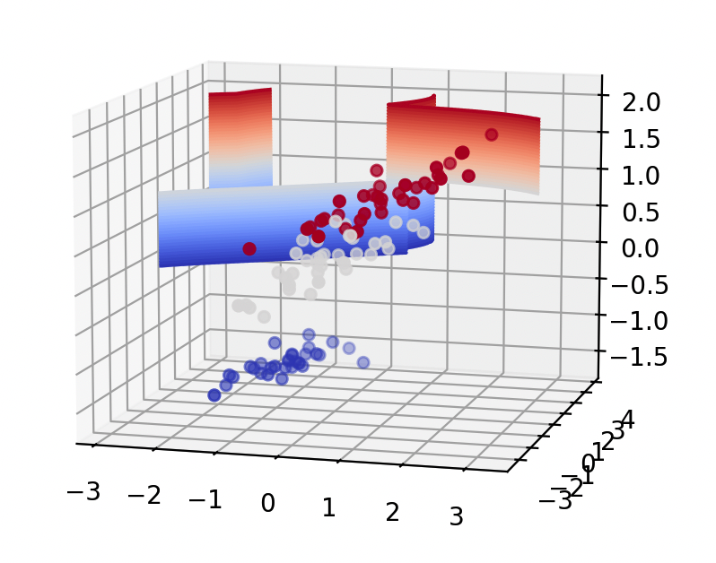

# 支持向量机（Support Vector Machine, SVM）

## 1. 方法概览

### 1.1 定义

支持向量机是一类通过最大化分类间隔来学习判别边界的监督学习方法。它最经典的用途是二分类，也可以扩展到多分类和非线性分类。

### 1.2 它主要解决什么问题

- 研究问题：如何在高维特征空间中找到一条泛化能力较强的分类边界。
- 适用任务：二分类、多分类、小到中等样本高维分类、核方法建模。
- 常见医学场景：基因表达谱分类、影像特征判别、文本病历标签分类。

### 1.3 直觉理解

SVM 不只想把两类样本分开，它还想把它们“分得尽可能远”。真正决定边界位置的，往往只是那些最靠近边界的支持向量。

## 2. 数学形式

### 2.1 核心公式

线性软间隔 SVM 的优化问题为：

$$
\min_{w, b, \xi} \frac{1}{2}\|w\|^2 + C \sum_{i=1}^{n}\xi_i
$$

满足：

$$
y_i(w^\top x_i + b) \ge 1 - \xi_i, \quad \xi_i \ge 0
$$

核化后的决策函数为：

$$
f(x) = \operatorname{sign}\left(\sum_{i=1}^{n}\alpha_i y_i K(x_i, x) + b\right)
$$

### 2.2 参数或统计量含义

- $w, b$：线性分类超平面的参数。
- $C$：误分类惩罚强度。
- $\xi_i$：第 $i$ 个样本的松弛变量。
- $K(x_i, x)$：核函数，常见有线性核、多项式核和 RBF 核。

### 2.3 关键假设

- 分类边界可由最大间隔思想刻画。
- 特征经过适当变换后可在某个空间中更好地区分。
- 特征缩放通常很重要。

## 3. 数据形式与输入输出

### 3.1 适合的数据形式

- 自变量类型：连续变量或向量化特征为主。
- 因变量类型：二分类或多分类。
- 数据结构：宽表数据或向量化高维特征。
- 是否适合高维数据：适合中高维，但样本极大时训练成本高。
- 是否适合缺失较多数据：需先处理缺失。
- 是否适合删失数据：不适合。
- 是否适合重复测量数据：不直接适合。

### 3.2 示例表格

以肿瘤分子分型为例：

| Gene1 | Gene2 | Gene3 | Gene4 | Stage | TumorSubtype |
| --- | --- | --- | --- | --- | --- |
| 2.31 | 0.84 | 4.12 | 1.03 | 3 | A |
| 0.91 | 1.25 | 2.08 | 0.72 | 1 | B |
| 1.88 | 0.97 | 3.41 | 1.11 | 2 | A |
| 0.65 | 1.56 | 1.72 | 0.58 | 1 | B |
| 1.44 | 1.02 | 2.95 | 0.93 | 2 | A |

### 3.3 输入与产出

#### 输入

- 输入数据：类别标签和特征矩阵。
- 关键变量：核函数、`C`、`gamma`、类别权重。
- 需要预处理的内容：标准化、训练测试集划分、类别不平衡处理。

#### 产出

- 模型对象/统计结果：支持向量、超参数、决策函数。
- 参数估计：支持向量权重和核参数，不是线性可解释系数。
- 预测结果：类别标签、决策值、可选的概率输出。
- 不确定性指标：交叉验证性能、测试集 AUC / F1、概率校准结果。

## 4. 适用场景

- 适合：小到中等样本、高维特征、边界清晰或经核映射后可分的分类问题。
- 不适合：超大规模数据、强可解释性要求、需要天然概率模型的场景。
- 使用前需要特别检查的点：标准化、核函数选择、`C` 与 `gamma` 调参、类别不平衡。

## 5. 实现

### 5.1 Python

常用包：

- `scikit-learn`

```python
import pandas as pd
from sklearn.model_selection import train_test_split
from sklearn.pipeline import make_pipeline
from sklearn.preprocessing import StandardScaler
from sklearn.svm import SVC

df = pd.read_csv("tumor_subtype.csv")
X = df.drop(columns=["TumorSubtype"])
y = df["TumorSubtype"]

X_train, X_test, y_train, y_test = train_test_split(
    X, y, test_size=0.2, random_state=42, stratify=y
)

fit = make_pipeline(
    StandardScaler(),
    SVC(kernel="rbf", C=1.0, gamma="scale", probability=True)
)
fit.fit(X_train, y_train)
```

### 5.2 R

常用包：

- `e1071`

```r
library(e1071)

fit <- svm(
  TumorSubtype ~ .,
  data = df,
  kernel = "radial",
  cost = 1,
  probability = TRUE
)

pred <- predict(fit, newdata = df_test, probability = TRUE)
```

## 6. 结果如何解释

- 核心结果看什么：测试集分类性能、支持向量数量、核参数和概率校准。
- 每个主要参数如何解释：`C` 越大越强调训练集拟合；`gamma` 越大边界越局部、越复杂。
- 临床或医学意义如何表达：更适合强调“判别性能”和“样本分离能力”，不适合直接做系数级效应解释。
- 常见误读：SVM 的默认概率输出通常需要额外校准，不能把它当作天然概率模型。

## 7. 推荐可视化

- ROC 曲线或 PR 曲线。
- 降维后的决策边界示意图。
- 支持向量数量或类别间间隔示意图。

### 7.1 图像示例

下图展示支持向量机在降维后三维空间中的分类边界示意，可帮助理解 margin 和支持向量附近的分离结构。



## 8. 优势、局限与常见坑

### 优势

- 在高维小样本问题上常有竞争力。
- 核方法能处理复杂非线性边界。
- 关注边界样本，泛化能力常较好。

### 局限

- 参数调优较敏感。
- 大样本计算成本高。
- 结果解释性一般。

### 常见坑

- 不标准化特征。
- 样本量很大时仍直接使用复杂核。
- 把概率输出当作天然校准后的概率。

## 9. 与相近方法的区别

- 和 Logistic 回归的区别：Logistic 回归是概率模型，SVM 是 margin-based 判别模型。
- 和支持向量回归的区别：SVR 处理连续结局，SVM 主要处理分类。
- 和随机森林的区别：SVM 更依赖核与间隔，随机森林更依赖局部切分和集成。

## 10. 医学研究中的典型应用

- 基因表达或代谢组特征驱动的肿瘤亚型分类。
- 影像组学特征判别。
- 病历文本或病种编码分类。

## 11. 相关方法

- [[支持向量回归（Support Vector Regression, SVR）]]
- [[Logistic回归（Logistic Regression）]]
- [[随机森林（Random Forest）]]

## 12. 参考资料

- Cortes C, Vapnik V. Support-vector networks. *Mach Learn*. 1995;20:273-297.
- Hastie T, Tibshirani R, Friedman J. *The Elements of Statistical Learning*. 2nd ed. Springer; 2009.
- scikit-learn Developers. `sklearn.svm.SVC`. scikit-learn API Reference. [https://scikit-learn.org/stable/modules/generated/sklearn.svm.SVC.html](https://scikit-learn.org/stable/modules/generated/sklearn.svm.SVC.html) （访问日期：2026-07-02）
