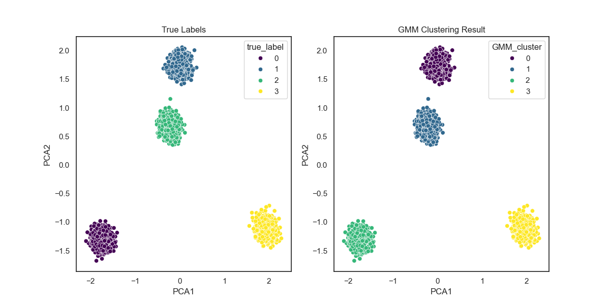

# 高斯混合模型（Gaussian Mixture Model, GMM）

## 1. 方法概览

### 1.1 定义

高斯混合模型是假设观测数据由多个高斯分布按一定权重混合而成的概率模型。它既可以做密度估计，也可以用于软聚类，即给每个样本分配“属于各个簇的概率”。

### 1.2 它主要解决什么问题

- 研究问题：当数据中存在多个潜在亚群、且每个亚群近似服从椭圆形分布时，如何估计这些潜在成分及其混合比例。
- 适用任务：软聚类、亚型发现、密度估计、异常检测辅助分析。
- 常见医学场景：疾病表型分群、多生物标志物亚群识别、患者风险画像的潜在成分建模。

### 1.3 直觉理解

如果你看到一团混在一起的病人数据，GMM 的思路是：这可能不是一个整体，而是几群不同来源的患者混在一起。每一群都有自己的均值、波动和占比，模型要做的就是把这些“隐藏人群”拆出来。

## 2. 数学形式

### 2.1 核心公式

设观测向量为 $x \in \mathbb{R}^d$，则 GMM 的密度函数写为：

$$
p(x) = \sum_{k=1}^{K}\pi_k \mathcal{N}(x \mid \mu_k, \Sigma_k)
$$

其中：

- $\pi_k \ge 0$，且 $\sum_{k=1}^{K}\pi_k = 1$
- $\mu_k$ 为第 $k$ 个成分的均值向量
- $\Sigma_k$ 为第 $k$ 个成分的协方差矩阵

EM 算法中的责任概率为：

$$
\gamma_{ik} = P(z_i = k \mid x_i) =
\frac{\pi_k \mathcal{N}(x_i \mid \mu_k, \Sigma_k)}
{\sum_{j=1}^{K}\pi_j \mathcal{N}(x_i \mid \mu_j, \Sigma_j)}
$$

### 2.2 参数或统计量含义

- `n_components`：混合成分数，也常被理解为潜在簇数。
- $\pi_k$：第 $k$ 个簇在总体中的权重。
- $\mu_k$、$\Sigma_k$：第 $k$ 个簇的位置和形状。
- `covariance_type`：协方差结构，如 `full`、`diag`、`tied`、`spherical`。
- AIC / BIC：用于选择成分数和模型复杂度。

### 2.3 关键假设

- 每个潜在簇近似服从高斯分布。
- 聚类边界允许重叠，样本可以有软归属。
- 成分数选择会显著影响结果。

## 3. 数据形式与输入输出

### 3.1 适合的数据形式

- 自变量类型：连续变量为主。
- 因变量类型：无监督任务，没有显式结局变量。
- 数据结构：宽表数据，每行一个样本。
- 是否适合高维数据：可以，但高维时常需降维或正则化协方差。
- 是否适合缺失较多数据：通常需先处理缺失。
- 是否适合删失数据：不适合。
- 是否适合重复测量数据：不直接适合。

### 3.2 示例表格

以代谢指标驱动的患者亚型分群为例：

| BMI | TG | HDL | FastingGlucose | SBP |
| --- | --- | --- | --- | --- |
| 31.2 | 2.4 | 0.9 | 7.8 | 146 |
| 24.8 | 1.1 | 1.5 | 5.2 | 122 |
| 29.5 | 2.0 | 1.0 | 6.9 | 138 |
| 22.9 | 0.9 | 1.7 | 4.9 | 116 |
| 33.1 | 2.8 | 0.8 | 8.2 | 151 |

### 3.3 输入与产出

#### 输入

- 输入数据：连续型特征矩阵。
- 关键变量：成分数、协方差类型、初始化方式、收敛阈值。
- 需要预处理的内容：标准化、异常值检查、可能的降维。

#### 产出

- 模型对象/统计结果：各成分权重、均值、协方差、对数似然、AIC/BIC。
- 参数估计：每个成分的概率分布参数。
- 预测结果：硬聚类标签和软聚类概率。
- 不确定性指标：后验责任概率、不同成分数下的 AIC/BIC 变化。

## 4. 适用场景

- 适合：潜在亚群发现、簇之间有重叠、希望得到概率归属而不只是硬分组。
- 不适合：簇形状非常复杂、明显非高斯、类别变量为主的场景。
- 使用前需要特别检查的点：是否标准化、成分数选择、局部最优和初始化敏感性。

## 5. 实现

### 5.1 Python

常用包：

- `scikit-learn`

```python
import pandas as pd
from sklearn.mixture import GaussianMixture
from sklearn.preprocessing import StandardScaler

df = pd.read_csv("metabolic_profiles.csv")
X = df[["BMI", "TG", "HDL", "FastingGlucose", "SBP"]]
X_scaled = StandardScaler().fit_transform(X)

fit = GaussianMixture(
    n_components=3,
    covariance_type="full",
    random_state=42
)
fit.fit(X_scaled)

cluster = fit.predict(X_scaled)
prob = fit.predict_proba(X_scaled)
```

### 5.2 R

常用包：

- `mclust`

```r
library(mclust)

X <- scale(df[, c("BMI", "TG", "HDL", "FastingGlucose", "SBP")])
fit <- Mclust(X, G = 1:6)

cluster <- fit$classification
prob <- fit$z
```

## 6. 结果如何解释

- 核心结果看什么：成分数、各簇权重、各簇均值模式、样本归属概率。
- 每个主要参数如何解释：协方差决定簇的形状和方向，权重决定各亚群所占比例。
- 临床或医学意义如何表达：适合用“识别出若干代谢表型亚群，并比较其临床特征差异”来表述。
- 常见误读：GMM 输出的是统计成分，不一定天然对应真实生物学实体。

## 7. 推荐可视化

- AIC / BIC 随成分数变化图。
- PCA 或 UMAP 降维后的聚类散点图。
- 各簇特征均值雷达图或热图。

### 7.1 图像示例

下图展示 GMM 在 PCA 二维空间中的聚类结果，可用于观察软聚类在近似高斯簇结构上的分群效果。



## 8. 优势、局限与常见坑

### 优势

- 能给出软聚类概率。
- 比 K-means 更灵活，可拟合椭圆形簇。
- 同时兼顾聚类和密度估计。

### 局限

- 对初始化敏感，可能陷入局部最优。
- 对非高斯结构不一定适合。
- 成分数选择会明显影响结论。

### 常见坑

- 不做标准化就直接聚类。
- 把统计成分直接当作真实疾病亚型。
- 只看某一次初始化结果，不比较稳定性。

## 9. 与相近方法的区别

- 和 K-means 的区别：K-means 做硬聚类且默认球形簇；GMM 允许软归属和更灵活的协方差结构。
- 和核密度估计的区别：KDE 主要做平滑密度估计；GMM 更强调有限成分结构。
- 和朴素贝叶斯的区别：二者都用概率分布建模，但 GMM 主要做无监督成分分解，朴素贝叶斯主要做监督分类。

## 10. 医学研究中的典型应用

- 代谢综合征或炎症表型分群。
- 多组学生物标志物潜在亚型发现。
- 聚类前的密度建模与异常样本识别。

## 11. 相关方法

- [[K-means聚类（K-means Clustering）]]
- [[核密度估计（Kernel Density Estimation, KDE）]]
- [[朴素贝叶斯（Naive Bayes）]]
- [[主成分分析（Principal Component Analysis, PCA）]]

## 12. 参考资料

- Bishop CM. *Pattern Recognition and Machine Learning*. Springer; 2006.
- McLachlan G, Peel D. *Finite Mixture Models*. Wiley; 2000.
- scikit-learn Developers. `sklearn.mixture.GaussianMixture`. scikit-learn API Reference. [https://scikit-learn.org/stable/modules/generated/sklearn.mixture.GaussianMixture.html](https://scikit-learn.org/stable/modules/generated/sklearn.mixture.GaussianMixture.html) （访问日期：2026-07-02）
