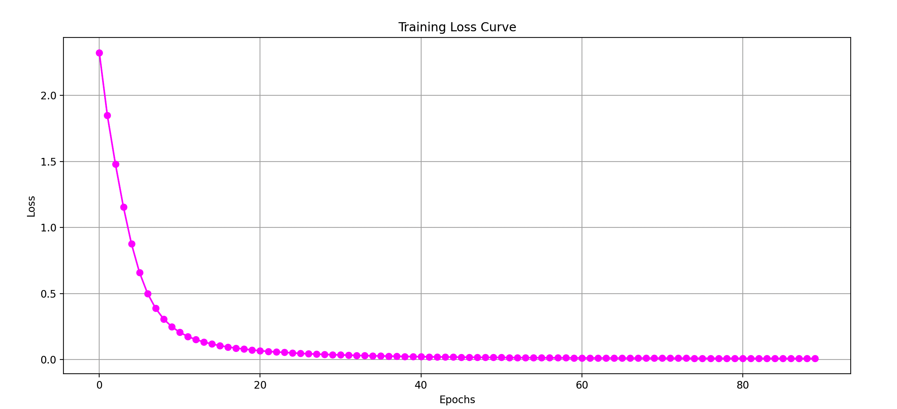

# 多层感知机分类器（Multilayer Perceptron Classifier, MLP）

## 1. 方法概览

### 1.1 定义

多层感知机分类器是一类前馈神经网络模型。它通过若干隐藏层和非线性激活函数，把输入特征映射到输出类别概率，适合学习复杂的非线性判别边界。

### 1.2 它主要解决什么问题

- 研究问题：当特征与类别之间关系复杂、难以用简单线性或树规则表达时，如何学习更灵活的分类函数。
- 适用任务：二分类、多分类、向量化图像或表格数据分类。
- 常见医学场景：病人风险分层、多指标诊断分类、结构化生理信号或向量化图像特征分类。

### 1.3 直觉理解

MLP 可以理解成一层层“特征变换器”。前面几层先把原始输入组合成更有判别力的中间表示，最后一层再根据这些表示给出属于各个类别的概率。

## 2. 数学形式

### 2.1 核心公式

第 $l$ 层的前向传播可写为：

$$
z^{[l]} = W^{[l]} a^{[l-1]} + b^{[l]}
$$

$$
a^{[l]} = \phi^{[l]}(z^{[l]})
$$

其中 $a^{[0]} = x$ 为输入。对多分类任务，输出层常用 softmax：

$$
\hat y_k = \frac{\exp(z_k^{[L]})}{\sum_{j=1}^{K}\exp(z_j^{[L]})}
$$

损失函数常用交叉熵：

$$
\mathcal{L} = -\sum_{k=1}^{K} y_k \log \hat y_k
$$

模型参数通过反向传播和梯度下降类优化器更新。

### 2.2 参数或统计量含义

- `hidden_layer_sizes`：每个隐藏层的神经元数量。
- `activation`：激活函数，如 `relu`、`tanh`、`logistic`。
- `alpha`：L2 正则化强度。
- `learning_rate_init`：初始学习率。
- `max_iter` 或训练轮数：优化迭代次数。

### 2.3 关键假设

- 非线性映射对分类有帮助。
- 训练数据量、特征表示和优化设置足以支撑网络学习。
- 特征通常需要标准化，且训练稳定性受超参数影响较大。

## 3. 数据形式与输入输出

### 3.1 适合的数据形式

- 自变量类型：数值化特征、嵌入向量、图像展开向量等。
- 因变量类型：二分类或多分类。
- 数据结构：宽表数据，或已向量化后的高维输入。
- 是否适合高维数据：适合，但更依赖样本量和正则化。
- 是否适合缺失较多数据：通常需先处理缺失。
- 是否适合删失数据：不适合。
- 是否适合重复测量数据：基础 MLP 不直接利用时间结构。

### 3.2 示例表格

以急诊患者分诊等级分类为例：

| Age | HR | RR | SBP | Lactate | TriageClass |
| --- | --- | --- | --- | --- | --- |
| 71 | 118 | 28 | 92 | 3.0 | high |
| 34 | 78 | 16 | 124 | 1.0 | low |
| 59 | 102 | 22 | 104 | 2.1 | medium |
| 42 | 81 | 18 | 130 | 1.2 | low |
| 67 | 110 | 26 | 96 | 2.8 | high |

### 3.3 输入与产出

#### 输入

- 输入数据：特征矩阵和类别标签。
- 关键变量：网络结构、激活函数、正则化、学习率、批大小。
- 需要预处理的内容：标准化、训练验证划分、类别不平衡处理。

#### 产出

- 模型对象/统计结果：训练好的网络权重、损失曲线、验证集指标。
- 参数估计：权重矩阵和偏置，不适合逐个直接解释。
- 预测结果：类别标签和类别概率。
- 不确定性指标：测试集准确率、宏平均 F1、AUC、概率校准情况。

## 4. 适用场景

- 适合：中到大型数据集、非线性关系明显、特征经过良好数值化的分类问题。
- 不适合：样本很小、需要强解释性或明确规则输出的场景。
- 使用前需要特别检查的点：标准化、过拟合、类别不平衡、早停和正则化设置。

## 5. 实现

### 5.1 Python

常用包：

- `scikit-learn`

```python
import pandas as pd
from sklearn.model_selection import train_test_split
from sklearn.pipeline import make_pipeline
from sklearn.preprocessing import StandardScaler
from sklearn.neural_network import MLPClassifier

df = pd.read_csv("triage_classification.csv")
X = df[["Age", "HR", "RR", "SBP", "Lactate"]]
y = df["TriageClass"]

X_train, X_test, y_train, y_test = train_test_split(
    X, y, test_size=0.2, random_state=42, stratify=y
)

fit = make_pipeline(
    StandardScaler(),
    MLPClassifier(
        hidden_layer_sizes=(64, 32),
        activation="relu",
        alpha=1e-4,
        learning_rate_init=1e-3,
        max_iter=300,
        random_state=42
    )
)
fit.fit(X_train, y_train)
```

### 5.2 R

常用包：

- `nnet`

```r
library(nnet)

fit <- nnet(
  TriageClass ~ Age + HR + RR + SBP + Lactate,
  data = df,
  size = 10,
  decay = 1e-4,
  maxit = 300,
  trace = FALSE
)

pred <- predict(fit, newdata = df_test, type = "class")
```

## 6. 结果如何解释

- 核心结果看什么：验证集性能、损失曲线、过拟合迹象、概率校准。
- 每个主要参数如何解释：隐藏层越大模型越灵活，但也更容易过拟合；正则化越强，参数越受约束。
- 临床或医学意义如何表达：更适合强调复杂模式识别能力，而不是对单变量方向和大小做直接解释。
- 常见误读：神经网络性能高不代表一定更稳，需要严格外部验证和可重复训练。

## 7. 推荐可视化

- 训练与验证损失曲线。
- 混淆矩阵。
- 降维后的分类边界或嵌入可视化。

### 7.1 图像示例

下图展示 MLP 分类器训练过程中的损失曲线，可帮助判断模型是否稳定收敛以及是否还存在继续训练的空间。



## 8. 优势、局限与常见坑

### 优势

- 能学习复杂非线性关系。
- 对高维向量输入有较强表达能力。
- 适合作为更深层网络的入门基线。

### 局限

- 可解释性较弱。
- 对标准化和超参数较敏感。
- 小样本时容易不稳定或过拟合。

### 常见坑

- 不做标准化直接训练。
- 网络过大但缺少正则化或早停。
- 只看准确率，不看召回率、校准和类别不平衡。

## 9. 与相近方法的区别

- 和 Logistic 回归的区别：Logistic 回归是单层线性判别；MLP 通过隐藏层学习非线性表示。
- 和支持向量机的区别：SVM 依赖 margin 和核技巧；MLP 依赖多层表示学习和梯度优化。
- 和随机森林的区别：随机森林通过树分裂做局部规则判别；MLP 通过连续参数学习全局非线性映射。

## 10. 医学研究中的典型应用

- 临床多指标风险分类。
- 向量化心电、影像或文本特征分类。
- 作为更复杂深度学习系统前的基线神经网络。

## 11. 相关方法

- [[Logistic回归（Logistic Regression）]]
- [[支持向量机（Support Vector Machine, SVM）]]
- [[随机森林（Random Forest）]]

## 12. 参考资料

- Goodfellow I, Bengio Y, Courville A. *Deep Learning*. MIT Press; 2016.
- scikit-learn Developers. `sklearn.neural_network.MLPClassifier`. scikit-learn API Reference. [https://scikit-learn.org/stable/modules/generated/sklearn.neural_network.MLPClassifier.html](https://scikit-learn.org/stable/modules/generated/sklearn.neural_network.MLPClassifier.html) （访问日期：2026-07-02）
- Venables WN, Ripley BD. *Modern Applied Statistics with S*. 4th ed. Springer; 2002.
