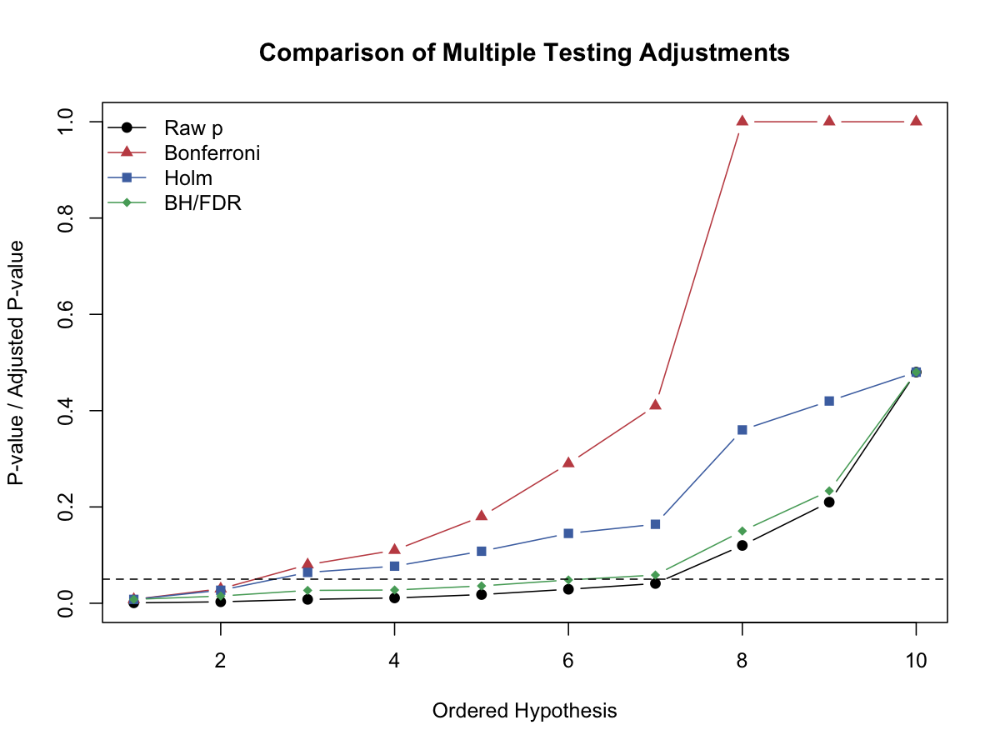

# Bonferroni校正（Bonferroni Correction）

## 1. 方法概览

### 1.1 定义

Bonferroni 校正是控制 FWER 的最经典单步方法，把显著性水平 $\alpha$ 平均分配到每个检验上。

### 1.2 它主要解决什么问题

- 研究问题：在做 $m$ 次检验时，如何控制整体至少一次假阳性的风险。
- 适用任务：严格控制 FWER。
- 常见医学场景：高风险结论、不能容忍任何假阳性时的多重比较。

### 1.3 直觉理解

如果总预算是 $\alpha=0.05$，做 $m$ 次检验时，Bonferroni 就像把这笔“假阳性预算”均分到每一个检验上。

## 2. 数学形式

### 2.1 核心公式

若一共进行 $m$ 次检验，则拒绝规则为：

$$
p_j \le \frac{\alpha}{m}
$$

等价的调整后 p 值写成：

$$
p_j^* = \min(1, mp_j)
$$

### 2.2 参数或统计量含义

- $m$：检验总数。
- $\alpha$：希望控制的 FWER 水平。
- $p_j^*$：Bonferroni 调整后 p 值。

### 2.3 关键假设

- 不要求检验独立。
- 目标是控制 FWER，而不是 FDR。

## 3. 数据形式与输入输出

### 3.1 适合的数据形式

- 自变量类型：不适用。
- 因变量类型：不适用。
- 数据结构：一列原始 p 值即可。
- 是否适合高维数据：能用，但会非常保守。
- 是否适合缺失较多数据：缺失 p 值需先处理。
- 是否适合删失数据：不适用。
- 是否适合重复测量数据：可用于重复测量后衍生出的多重检验结果。

### 3.2 示例表格

以一组有序 p 值为例：

| hypothesis | p_raw | p_bonf |
| --- | --- | --- |
| H1 | 0.0008 | 0.0080 |
| H2 | 0.0030 | 0.0300 |
| H3 | 0.0080 | 0.0800 |
| H4 | 0.0110 | 0.1100 |
| H5 | 0.0180 | 0.1800 |

### 3.3 输入与产出

#### 输入

- 输入数据：一组原始 p 值。
- 关键变量：检验总数 $m$、目标水平 $\alpha$。
- 需要预处理的内容：明确多重检验家族。

#### 产出

- 模型对象/统计结果：校正阈值或调整后 p 值。
- 参数估计：无。
- 预测结果：无。
- 不确定性指标：体现在 FWER 控制目标。

## 4. 适用场景

- 适合：结论代价很高、需要最严格控制假阳性的场景。
- 不适合：高维探索性研究。
- 使用前需要特别检查的点：是否真的需要 FWER 级别的严格控制。

## 5. 实现

### 5.1 Python

常用包：

- `statsmodels`

```python
from statsmodels.stats.multitest import multipletests
reject, p_adj, _, _ = multipletests(pvals, alpha=0.05, method="bonferroni")
```

### 5.2 R

常用包：

- `stats`

```r
p.adjust(pvals, method = "bonferroni")
```

## 6. 结果如何解释

- 核心结果看什么：校正后仍显著的检验有多少。
- 每个主要参数如何解释：若 $p_j^* < 0.05$，表示在 FWER 控制下该结果仍显著。
- 临床或医学意义如何表达：适合用于“宁可漏掉也不愿误报”的场景。
- 常见误读：Bonferroni 不等于“最合理”，它只是“最保守”的经典方法之一。

## 7. 推荐可视化

- 原始 p 值和 Bonferroni 调整后 p 值对比图。
- 显著性阈值对比图。

### 7.1 图像示例

下图中的红色折线展示了 Bonferroni 调整后的 p 值，相比原始 p 值抬升最明显。



## 8. 优势、局限与常见坑

### 优势

- 简单直接。
- 不依赖独立性假设。
- FWER 控制有明确保证。

### 局限

- 往往非常保守。
- 检验数多时几乎很难发现信号。

### 常见坑

- 在探索性高维研究中机械使用。
- 不区分 FWER 和 FDR 的不同目标。

## 9. 与相近方法的区别

- 和 Holm 的区别：Holm 更灵活、通常更有力。
- 和 BH 的区别：BH 控制 FDR，更适合发现型研究。

## 10. 医学研究中的典型应用

- 高风险决策下的严格多重比较。
- 小规模多终点研究中的保守校正。

## 11. 相关方法

- [[多重检验与错误率控制（Multiple Testing and Error Rate Control）]]
- [[Holm程序（Holm Procedure）]]
- [[Benjamini-Hochberg程序（Benjamini-Hochberg Procedure）]]

## 12. 参考资料

- Shaffer JP. Multiple hypothesis testing. *Annu Rev Psychol*. 1995;46:561-584.
- R Core Team. `p.adjust`. R Manual. [https://stat.ethz.ch/R-manual/R-devel/library/stats/html/p.adjust.html](https://stat.ethz.ch/R-manual/R-devel/library/stats/html/p.adjust.html) （访问日期：2026-07-02）
