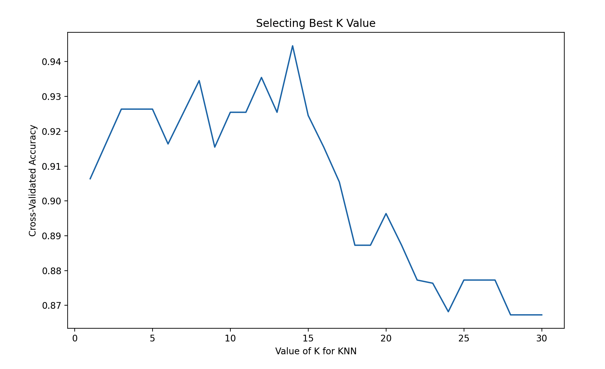

# K近邻算法（K-Nearest Neighbors, KNN）

## 1. 方法概览

### 1.1 定义

K 近邻算法是一类基于实例的非参数方法。它不显式拟合一个全局模型，而是在预测时直接寻找距离目标样本最近的 $K$ 个训练样本，并用这些近邻的标签做多数投票或平均。

### 1.2 它主要解决什么问题

- 研究问题：如何利用“与目标样本最相似的一组历史个体”来完成分类或预测。
- 适用任务：二分类、多分类、连续结局预测、相似病例检索。
- 常见医学场景：基于相似患者进行疾病亚型判别、辅助诊断、连续评分估计。

### 1.3 直觉理解

KNN 的核心想法很直接：如果一个新病人的各项特征和某些既往病人非常像，那么他们的诊断结果或风险水平往往也更接近。

## 2. 数学形式

### 2.1 核心公式

给定目标样本 $x^*$，设 $\mathcal{N}_K(x^*)$ 为与其距离最近的 $K$ 个样本集合。

分类时：

$$
\hat y(x^*) = \operatorname{mode}\{y_i : i \in \mathcal{N}_K(x^*)\}
$$

回归时：

$$
\hat y(x^*) = \frac{1}{K}\sum_{i \in \mathcal{N}_K(x^*)} y_i
$$

常见距离度量为欧氏距离：

$$
d(x, z) = \sqrt{\sum_{j=1}^{p}(x_j - z_j)^2}
$$

### 2.2 参数或统计量含义

- $K$：参与投票或平均的近邻数。
- $d(x, z)$：距离函数，可取欧氏、曼哈顿、闵可夫斯基等。
- `weights`：是否按距离加权，距离越近的邻居影响越大。

### 2.3 关键假设

- 相似输入对应相似输出。
- 特征空间中的距离有实际意义。
- 特征量纲需要可比，通常需要标准化。

## 3. 数据形式与输入输出

### 3.1 适合的数据形式

- 自变量类型：连续变量或数值化后的离散变量。
- 因变量类型：二分类、多分类，也可扩展到连续型。
- 数据结构：宽表数据。
- 是否适合高维数据：高维下容易出现维数灾难。
- 是否适合缺失较多数据：需先处理缺失值。
- 是否适合删失数据：不适合。
- 是否适合重复测量数据：不直接适合。

### 3.2 示例表格

以糖尿病视网膜病变筛查为例：

| Age | HbA1c | DiabetesYears | SBP | Albuminuria | RetinopathyClass |
| --- | --- | --- | --- | --- | --- |
| 68 | 8.2 | 16 | 142 | 1 | severe |
| 45 | 6.5 | 4 | 126 | 0 | none |
| 59 | 7.4 | 10 | 138 | 1 | mild |
| 51 | 6.9 | 7 | 130 | 0 | none |
| 63 | 8.0 | 13 | 146 | 1 | severe |

### 3.3 输入与产出

#### 输入

- 输入数据：带标签的训练样本和待预测样本。
- 关键变量：近邻数 `k`、距离度量、是否距离加权。
- 需要预处理的内容：标准化、异常值检查、训练测试集划分。

#### 产出

- 模型对象/统计结果：近邻搜索规则、最优 `k`、预测标签或数值。
- 参数估计：没有全局回归系数或判别参数。
- 预测结果：类别标签、类别概率或连续值。
- 不确定性指标：交叉验证准确率、F1、AUC、测试集误差。

## 4. 适用场景

- 适合：局部相似性强、样本规模中小、希望保留“相似病例”直觉的任务。
- 不适合：高维稀疏、超大样本、需要明确全局参数解释的场景。
- 使用前需要特别检查的点：特征标准化、距离定义、`k` 的选择、类别不平衡。

## 5. 实现

### 5.1 Python

常用包：

- `scikit-learn`

```python
import pandas as pd
from sklearn.model_selection import train_test_split
from sklearn.pipeline import make_pipeline
from sklearn.preprocessing import StandardScaler
from sklearn.neighbors import KNeighborsClassifier

df = pd.read_csv("retinopathy.csv")
X = df[["Age", "HbA1c", "DiabetesYears", "SBP", "Albuminuria"]]
y = df["RetinopathyClass"]

X_train, X_test, y_train, y_test = train_test_split(
    X, y, test_size=0.2, random_state=42, stratify=y
)

fit = make_pipeline(
    StandardScaler(),
    KNeighborsClassifier(n_neighbors=7, weights="distance")
)
fit.fit(X_train, y_train)
```

### 5.2 R

常用包：

- `FNN`

```r
library(FNN)

pred <- knn(
  train = X_train,
  test = X_test,
  cl = y_train,
  k = 7
)
```

## 6. 结果如何解释

- 核心结果看什么：最优 `k`、测试集表现、邻域是否稳定。
- 每个主要参数如何解释：`k` 越小越灵活但方差更大；`k` 越大越平滑但可能欠拟合。
- 临床或医学意义如何表达：适合解释为“该患者的判别主要参考了若干最相似患者的结果”。
- 常见误读：KNN 不会自动学习全局规律，它只基于局部邻域做判断。

## 7. 推荐可视化

- 不同 `k` 值下的交叉验证性能曲线。
- 降维后的近邻分布图。
- 混淆矩阵或类别召回率图。

### 7.1 图像示例

下图给出 KNN 案例中交叉验证准确率随 `k` 变化的曲线，适合说明近邻数选择对模型偏差和方差平衡的影响。



## 8. 优势、局限与常见坑

### 优势

- 简单直观。
- 非参数，无需显式模型假设。
- 能很好体现“相似病例”思路。

### 局限

- 对特征尺度和噪声敏感。
- 高维下效果下降明显。
- 预测阶段计算成本较高。

### 常见坑

- 不标准化特征。
- 在高维稀疏数据上直接使用欧氏距离。
- 只凭经验选 `k`，不做验证。

## 9. 与相近方法的区别

- 和 K近邻回归的区别：KNN 回归处理连续结局，这里主条目更强调分类与判别。
- 和局部加权回归的区别：局部加权回归会在局部拟合模型，KNN 更多是邻域投票或平均。
- 和朴素贝叶斯的区别：KNN 基于距离与实例相似性，朴素贝叶斯基于概率分解和条件独立假设。

## 10. 医学研究中的典型应用

- 相似患者辅助诊断。
- 小样本疾病分型。
- 相似病例驱动的风险筛查与推荐。

## 11. 相关方法

- [[K近邻回归（K-Nearest Neighbors Regression）]]
- [[局部加权回归（Locally Weighted Regression）]]
- [[朴素贝叶斯（Naive Bayes）]]

## 12. 参考资料

- Hastie T, Tibshirani R, Friedman J. *The Elements of Statistical Learning*. 2nd ed. Springer; 2009.
- scikit-learn Developers. `sklearn.neighbors.KNeighborsClassifier`. scikit-learn API Reference. [https://scikit-learn.org/stable/modules/generated/sklearn.neighbors.KNeighborsClassifier.html](https://scikit-learn.org/stable/modules/generated/sklearn.neighbors.KNeighborsClassifier.html) （访问日期：2026-07-02）
- Beygelzimer A, Kakade S, Langford J. Package `FNN`. CRAN. [https://cran.r-project.org/package=FNN](https://cran.r-project.org/package=FNN) （访问日期：2026-07-02）
